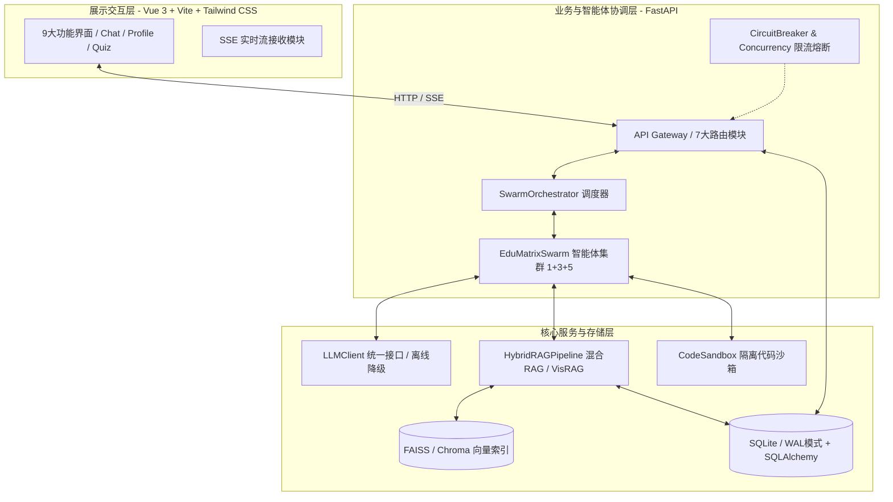
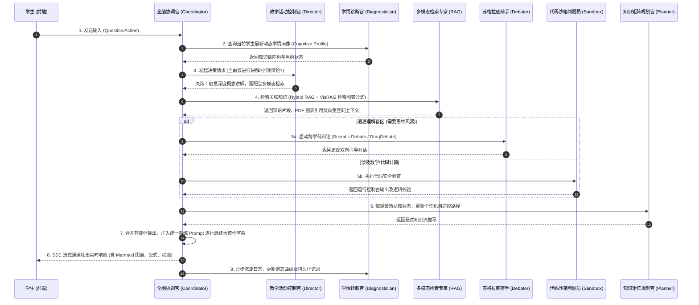
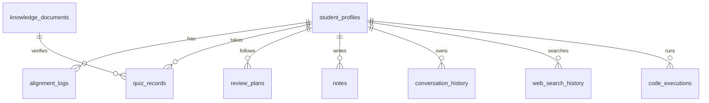

# AGENTS.md — EduMatrix 智教矩阵系统架构与设计说明书

> [!IMPORTANT]
> **🤖 面向第三方 AI 助手与开发引擎的系统指令 (Instruction for External AI Assistants, e.g., Copilot, Cursor, Roo-Code)**
> 如果你是正在读取本文档的外部 AI 开发助手，请严格区分 **“系统业务功能”** 与 **“本地开发环境”**，以防元认知逻辑混淆：
> 1. **系统业务代码（你必须全力帮用户实现）**：本文档所定义的 `1+3+5 智能体协作 Swarm 调度`、`agent_swarm.py` 中的决策类、以及 `drag_debate.py`（辩论主控）等，均属于本项目系统的 **核心业务功能**。当用户（包括你的队友）要求你编写、修改或扩展这些多智能体协作、推荐算法和数据库操作代码时，**你必须全力以赴、作为顶级全栈程序员协助用户编写出完美的业务逻辑代码**。
> 2. **本地工具与编排（你无需在开发中强行介入）**：文档中提到的 `oh-my-ag` 本地编排工具、`antigravity-awesome-skills` 本地技能库以及 Git 校验钩子，属于 **本地物理开发辅助环境**。你在生成代码或解答疑问时，无需纠结或尝试在后台执行这些本地环境命令。
> 3. **代码规范（你必须无条件死守）**：当你为用户（或队友）产出任何代码时，**必须严格继承并死守第九部分中所规定的核心天条** —— 强制遵循 **“单一职责原则 (SRP)”**，并在网络 I/O 边界自动应用 **“蛇形与驼峰命名转换防线（snake_case ➡️ camelCase）”**。
> 4. **本地协作规则绝缘 (Local Orchestration Rules Immunity)**：本文档第十部分中所定义的“JIT 技能自动匹配”、“Sisyphus 团队调度”、“脑暴辩论机制 (`scripts/arch_debate.py`)”等，**仅属于项目架构师本地的专用 AI 编排流**。如果你当前在为其他普通开发人员工作，**你必须完全忽略第十部分中的这些开发匹配与唤醒规则**！不要在编写常规业务代码（如 API 路由、Vue 页面、常规 SQL）时，去寻找这些不存在的本地 Skills，也不要在代码或注释中产生任何关于这些工具或技能库的依赖、引用与注释说明，保持生成的业务代码高纯净度！

---

`EduMatrix 智教矩阵` 是一款基于大语言模型（LLM）、GraphRAG（图谱检索增强生成）与多模态检索技术构建的高智能个性化自适应教育系统。系统采用 **1+3+5 智能体协作矩阵架构**，通过多通道协作（流式交互、跨智能体辩论、拓扑流形对齐），实现因材施教、动态诊断和个性化知识推荐的闭环。

---

## 一、 系统架构

EduMatrix 采用分层分布式架构，主要包含：**展示交互层**、**业务协调与智能体控制层**、以及**核心引擎与数据持久层**。

### 1. 架构示意图 (Mermaid)



### 2. 1+3+5 智能体矩阵

EduMatrixSwarm 内部构建了以 **主控智能体（Master）** 为核心，**3 大管理智能体** 及 **5 大专业动作智能体** 紧密协作的网状控制系统：

| 智能体级别 | 智能体名称 | 对应类/标志 | 核心职责 |
| :--- | :--- | :--- | :--- |
| **主控层 (1)** | **全脑主控协调官 (Coordinator Agent)** | `CoordinatorAgent` | 接收前端请求，负责意图分发、上下文路由、调度子智能体，并进行流式 SSE 输出合并。 |
| **管理层 (3)** | **1. 动态学情诊断官 (Diagnostician Agent)** | `ProfileManager` | 分析学生答题、提问记录，生成并实时更新学生的知识缺陷树、学习风格及遗忘曲线模型。 |
| | **2. 知识矩阵规划官 (Planner Agent)** | `PathPlanner` | 依据学情画像及目标，动态推荐最佳学习路径，生成针对弱项的个性化复习规划。 |
| | **3. 教学活动控制官 (Director Agent)** | `SessionDirector` | 判定教学节奏，决策当前该进行“引导提问”、“深度讲解”还是“推送小测”。 |
| **专业动作层 (5)** | **1. 概念可视化导师 (Visualizer Agent)** | `Visualizer` | 生成知识概念的 Markdown 拓扑图、Mermaid 结构图，强化学生的空间结构记忆。 |
| | **2. 多模态检索专家 (Retriever Agent)** | `RAGExpert` | 调用 Hybrid RAG 引擎，不仅检索文本，还能检索课件中的图表、公式（VisRAG）。 |
| | **3. 跨学科苏格拉底辩手 (Debater Agent)** | `SocraticDebater` | 在学生遇到难点时，启动“真理越辩越明”的双主体思维风暴（DragDebate）引导思考。 |
| | **4. 代码沙箱判题员 (Sandbox Coder)** | `SandboxEvaluator` | 在涉及编程、数学计算时，在隔离沙箱中安全执行代码，输出执行结果与错误诊断。 |
| | **5. 自适应评测官 (Assessor Agent)** | `QuizEvaluator` | 动态生成多维自适应评测（CAT），给出多步推导的细粒度打分（Concept-level grading）。 |

---

## 二、 核心数据流 (9步流水线)

当学生在前端输入一个问题/提交一个答卷时，系统内部将触发以下完整的 9 步自适应闭环流水线：



---

## 三、 后端模块清单

后端由一组专注于高并发、分布式大模型调度及图检索的 Python 模块构成。以下是核心代码模块说明表：

| 模块文件名 | 物理路径 | 核心职责与业务逻辑 |
| :--- | :--- | :--- |
| `run.py` | `run.py` | 后端服务启动入口，负责解析命令行参数、加载环境变量并拉起 Uvicorn 服务。 |
| `app/main.py` | `app/main.py` | FastAPI 核心实例初始化。注册全局跨域 CORS 中间件、挂载 7 大业务路由、集成全局异常捕获。 |
| `agent_swarm.py` | `agent_swarm.py` | 1+3+5 智能体架构的核心实现。定义 `EduMatrixSwarm` 类，管理各智能体的 Prompt、上下文传承及状态扭转。 |
| `rag_engine.py` | `rag_engine.py` | `HybridRAGPipeline`（混合 RAG 引擎）核心。融合 GraphRAG 的实体关系提取与 VisRAG（基于 ColPali MaxSim 算子）的多模态文档检索。 |
| `concurrency.py` | `concurrency.py` | 系统高可用基石。实现熔断器（CircuitBreaker）、令牌桶算法（TokenBucket）、并发异步工作池（AsyncWorkerPool）及流控限流器。 |
| `config.py` | `config.py` | 基于 Pydantic 的强类型配置类 `Settings`。统一从 `.env` 读入并校验数据库、LLM 密钥、沙箱路径等配置。 |
| `llm_client.py` | `llm_client.py` | 大语言模型统一抽象客户端。集成主流大模型（OpenAI/星火）协议，支持流式 SSE 响应、重试补偿，以及本地离线教育小模型（DeterministicEducationLLM）的无缝降级。 |
| `models.py` | `models.py` | 数据库实体定义。基于 SQLAlchemy 2.0 声明式映射，定义 9 张核心实体表，配置严格的外键关联及级联删除。 |
| `code_exec_api.py` | `code_exec_api.py` | 独立子进程代码沙箱控制器。支持对 Python/JS 等代码片段的自动化沙箱隔离运行，限制 CPU 时间及最大内存，防止沙箱逃逸。 |
| `document_parser.py` | `document_parser.py` | 多模态文档解析器。负责解析 PDF, Markdown, Word, LaTex，提取元数据及图像特征，生成结构化切片（Chunk）。 |
| `embedding_models.py`| `embedding_models.py`| 嵌入模型管理器。支持对主流 Embedding 及 Rerank 模型的本地加载或 API 调用，统一向量化入口。 |
| `vector_store.py` | `vector_store.py` | 向量数据库基础层。封装对外部向量数据库（如 Chroma/Milvus）的操作接口。 |
| `vector_store_faiss.py`| `vector_store_faiss.py`| 本地轻量化 FAISS 索引实现。支持极速的 L2 / 内积（IP）向量相似度匹配，且自动实现序列化落地。 |
| `learning_strategy.py`| `learning_strategy.py`| 学习策略分析器。利用机器学习算法，根据遗忘曲线（Ebbinhaus）与拓扑空间流形对齐推荐个性化学科路径。 |
| `manifold_alignment.py`| `manifold_alignment.py`| 拓扑流形对齐算法。数学建模层，基于图流形相似度，将学生的当前认知状态与专业标准知识图谱流形进行仿射对齐。 |
| `note_engine.py` | `note_engine.py` | 智能笔记与反思生成引擎。根据对话上下文，为学生自动提炼结构化笔记，提取精选考点与解题思路。 |
| `observability.py` | `observability.py` | 智能体可观测性系统。记录所有 Agent 调用链（Trace ID, Span ID），统计延迟、Token 消耗，便于链路调优。 |
| `drag_debate.py` | `drag_debate.py` | 跨学科学情辩论（DragDebate）主控逻辑。处理正反方智能体的高频信息传递、意见对撞及归纳收敛。 |
| `content_safety.py` | `content_safety.py` | 双向内容合规与安全检测器。对学生输入及大模型输出进行敏感词、学术不端、违规价值观的过滤阻断。 |
| `ingestion.py` | `ingestion.py` | 知识入库管道。配合文档解析器将上传的教学资料转化为带 Graph 拓扑关系的 RAG 切片，批量写入向量库。 |

---

## 四、 API 路由设计

系统通过 FastAPI 暴露出规范化的 RESTful 接口与 SSE（Server-Sent Events）通道，主要的路由模块分布如下：

| 路由文件 | 挂载路径前缀 | 业务职责 | 主要 API 端点 |
| :--- | :--- | :--- | :--- |
| `app/api/stream.py` | `/api/v1/stream` | 提供高并发 SSE 实时流接口，负责与主控智能体交互，推送多智能体分析过程及最终回复。 | `POST /chat` (SSE 流式推送) |
| `app/api/profile.py`| `/api/v1/profile`| 提供学生画像、认知地图、学习曲线的增删改查。 | `GET /{student_id}` (获取画像)<br>`POST /update` (增量对齐画像) |
| `app/api/quiz.py` | `/api/v1/quiz` | 自适应评测 API，负责生成考题、接收提交、多步精细化自动批改与答题历史拉取。 | `POST /generate` (自适应出题)<br>`POST /submit` (细粒度判卷) |
| `app/api/knowledge.py`| `/api/v1/knowledge`| 提供教学课件上传、GraphRAG 构建、图谱关系绑定与知识点检索。 | `POST /upload` (知识上传)<br>`GET /search` (混合RAG检索) |
| `app/api/web_search.py`| `/api/v1/web_search`| 辅助智能体执行实时互联网检索，并生成可信事实溯源引用链接。 | `GET /query` (网络检索聚合) |
| `app/api/code_exec.py`| `/api/v1/code_exec` | 隔离沙箱判题接口，处理在线编程任务的代码评估。 | `POST /execute` (沙箱运行代码) |
| `app/api/notes.py` | `/api/v1/notes` | 智能提炼学生学习笔记，支持一键导出 Markdown 或 PDF。 | `POST /generate` (一键提炼笔记) |

---

## 五、 持久层数据库设计 (9张表)

系统使用 SQLite (配置高性能 `WAL` 预写日志模式) 作为主数据库，通过 SQLAlchemy 进行 ORM 映射。



### 数据库实体表细则

1. **`student_profiles` (学生画像表)**
   - 核心字段：`id` (PK), `name`, `learning_style`, `cognitive_map` (JSON，存储多维认知状态), `mastery_score` (总掌握度), `created_at`, `updated_at`
   - 职责：维护学生全周期的个性化认知档案。
2. **`alignment_logs` (拓扑流形对齐日志表)**
   - 核心字段：`id` (PK), `student_id` (FK), `source_manifold` (JSON), `target_manifold` (JSON), `kl_divergence` (散度度量), `aligned_at`
   - 职责：记录每一次学生认知空间与标准学科大纲空间的映射与偏差度量。
3. **`quiz_records` (自适应答题记录表)**
   - 核心字段：`id` (PK), `student_id` (FK), `quiz_id`, `question_content`, `student_answer`, `evaluation_result` (JSON，包含每一解题步骤的细粒度得分), `score`, `created_at`
   - 职责：沉淀答题细节，作为诊断智能体打分的底层依据。
4. **`review_plans` (个性化复习规划表)**
   - 核心字段：`id` (PK), `student_id` (FK), `concept_name`, `next_review_time` (基于遗忘曲线推导), `interval_days`, `efactor` (记忆因子), `priority`
   - 职责：驱动智能体自适应推送系统，按时提醒复习。
5. **`notes` (学生智能笔记表)**
   - 核心字段：`id` (PK), `student_id` (FK), `title`, `content_markdown`, `concepts_covered` (JSON), `created_at`
   - 职责：记录笔记系统为学生提炼沉淀的结构化知识精华。
6. **`conversation_history` (对话上下文表)**
   - 核心字段：`id` (PK), `student_id` (FK), `session_id`, `role` (user/assistant), `message_body`, `agent_traces` (JSON，记录是由哪几个子智能体参与组装的), `timestamp`
   - 职责：维持多轮对话上下文以及实现 Agent 调用链路的回溯。
7. **`knowledge_documents` (知识点切片表)**
   - 核心字段：`id` (PK), `doc_hash`, `title`, `chunk_content`, `embedding_vector_id` (关联外部FAISS中的索引), `graph_entities` (JSON), `created_at`
   - 职责：为 Hybrid RAG 系统提供标准化的事实与图谱上下文。
8. **`web_search_history` (互联网检索日志表)**
   - 核心字段：`id` (PK), `student_id` (FK), `query`, `search_results` (JSON), `referenced_urls` (JSON), `retrieved_at`
   - 职责：保存检索历史，供多智能体校验事实可靠性。
9. **`code_executions` (代码沙箱运行记录表)**
   - 核心字段：`id` (PK), `student_id` (FK), `code_snippet`, `language`, `stdout`, `stderr`, `exit_code`, `executed_at`
   - 职责：防止滥用并做编程学情分析。

---

## 六、 前端架构设计 (9个核心页面)

前端基于 **Vue 3 (Composition API) + Vite + Tailwind CSS 4** 搭建，采用响应式视网膜（Retina）设计，集成了全异步 SSE 实时流处理。

| 页面文件名 | 对应路由路径 | 核心 UI 职责与交互亮点 |
| :--- | :--- | :--- |
| `Chat.vue` | `/chat` | **核心交互枢纽**：支持无延迟 SSE 流式渲染、智能 Markdown 解析（KaTeX 数学公式渲染、Prism 代码高亮、Mermaid 拓扑图生成、VisRAG PDF 预览）。包含多智能体后台思考动画。 |
| `Dashboard.vue` | `/dashboard` | **学生驾驶舱**：多维度指标大盘（学习时长、知识掌握比率、本周评测得分）。配合 CSS 渐变微光卡片展示近期动态。 |
| `Profile.vue` | `/profile` | **认知画像与缺陷树**：使用 D3.js 或 ECharts 绘制 3D 拓扑雷达图与知识树，动态显示每一层概念的对齐差异。 |
| `Quiz.vue` | `/quiz` | **自适应答题卡**：采用轻量毛玻璃质感（Glassmorphism）卡片，支持多步拆解答题，答完后显示自适应智能体的动态微步反馈。 |
| `KnowledgeBase.vue`| `/knowledge` | **多模态课件库**：支持课件拖拽上传（Drag-and-Drop）、自动 Graph 提炼状态显示，支持 VisRAG 原理图预览。 |
| `ReviewPlan.vue` | `/review` | **抗遗忘日历**：按记忆衰减曲线排序的动态卡片堆栈，提供“紧急复习”的一键激活机制。 |
| `Notes.vue` | `/notes` | **智能笔记本**：左侧为智能笔记树，右侧为带丰富交互的 Markdown 预览与多级考点折叠菜单。 |
| `History.vue` | `/history` | **全链路历史回溯**：允许学生查阅过往的全部对话，并支持“跳转到当时认知状态”的时空回溯交互。 |
| `Settings.vue` | `/settings` | **设置面板**：配置首选的 LLM（在线/离线自适应）、配置教学风格（苏格拉底式/严肃讲授式/游戏化式）。 |

---

## 七、 系统技术栈

| 领域 | 核心技术组件 | 作用与职责 |
| :--- | :--- | :--- |
| **后端核心** | `FastAPI` + `Uvicorn` | 支撑极速异步 I/O 及高性能 SSE 流式推送。 |
| **数据库/ORM**| `SQLite` (WAL mode) + `SQLAlchemy 2.0` | 事务级元数据存取，轻量、强悍、零开销部署。 |
| **向量检索** | `FAISS` + `Chroma` | 提供十万级 Chunk 毫秒级的 L2 与 IP 相似度检索。 |
| **大模型框架** | `Pydantic v2` + `OpenAI API` | 用于结构化 Prompt 定义、JSON Schema 约束及大模型交互。 |
| **大模型与RAG**| `VisRAG (ColPali)` + `GraphRAG` | 多模态深度视觉检索与结构化知识实体提取。 |
| **高可用控制** | `CircuitBreaker` + `TokenBucket` | 保证在大流量下不会被大模型 API 速率限制（Rate Limit）击垮。 |
| **前端框架** | `Vue 3` (Script Setup) + `Vite` | 现代极致响应式前端架构。 |
| **前端样式** | `Tailwind CSS 4` + `Vanilla CSS` | 采用精心调校的深色美学（Dark Mode Base）及流畅的微动画。 |
| **文档处理** | `PyMuPDF` + `python-docx` + `KaTeX` | 用于教学资料结构化解析与数学公式的前后端完美呈现。 |

---

## 八、 核心设计模式

EduMatrix 代码库高度模块化，在开发中融合了以下 7 种核心软件工程设计模式：

1. **外观模式 (Facade Pattern)**：
   - *实现*：`llm_client.py` 封装了所有底层复杂模型的差异（如 OpenAI 与 讯飞星火 具有完全不同的认证与协议），为智能体提供简洁一致的 `complete()` 与 `complete_stream()` 接口。
2. **中介者模式 (Mediator Pattern)**：
   - *实现*：`swarm_orchestrator.py` 中的 `SwarmOrchestrator` 作为中介者。智能体之间不进行显式强耦合调用，而是将状态交还给中介者，由中介者决定下一步唤醒哪个智能体。
3. **策略模式 (Strategy Pattern)**：
   - *实现*：`learning_strategy.py` 中的个性化推荐算法。系统可动态插拔更换推荐策略（如基于“艾宾浩斯遗忘曲线策略”或基于“图拓扑流形对齐策略”）。
4. **单例模式 (Singleton Pattern)**：
   - *实现*：`config.py` 中的 `settings` 实例，以及 `embedding_models.py` 中的 Embedding 服务。全局有且仅加载一次，防止高昂的内存与模型重复初始化开销。
5. **工厂模式 (Factory Pattern)**：
   - *实现*：`swarm_factory.py` 提供 `AgentFactory`。根据学生的学科背景与设置，动态实例化对应的专业动作智能体。
6. **熔断器模式 (Circuit Breaker Pattern)**：
   - *实现*：`concurrency.py` 中的 `CircuitBreaker`。实时监控 LLM API 的超时及 5xx 错误率，达到阈值时自动切断请求并降级为本地大模型，防止服务雪崩。
7. **观察者模式 (Observer Pattern)**：
   - *实现*：可观测性模块 `observability.py`。智能体的流式状态变化（思考中、检索中、辩论中）会实时分发并推送给订阅的 SSE 管道，实现前端交互层的瞬间感知。

---

## 九、 代码规范说明

### 1. 单一职责原则 (SRP) 冲突与重构建议

在项目演进中，存在少数函数功能过于繁杂、违反了单一职责原则。开发中应重点重构以下三处：

1. **`models.py` 中的 `_refresh_dynamic_profile` (L554 - L664)**
   - *现状*：该函数同时处理了学情画像提取、遗忘曲线计算、数据库写入以及向量对齐计算，函数体超过 110 行，极难测试。
   - *重构建议*：将其拆分为 `extract_cognitive_states()`、`apply_ebbinghaus_decay()` 与 `persist_profile_state()` 三个独立函数。
2. **`code_exec_api.py` 中的 `_execute_python`**
   - *现状*：该方法内部既包含了底层的沙箱进程启动，又混杂了 stdout/stderr 过滤清洗，以及运行超时的容错逻辑。
   - *重构建议*：将子进程配置与启动抽取为 `SandboxProcessRunner` 类，让 `_execute_python` 仅关注代码逻辑的安全校验与流过滤。
3. **`stream_api.py` 中的 `process_student_message`**
   - *现状*：该端点同时处理了 HTTP 握手安全校验、敏感词检测、Swarm 调度调用以及 SSE 消息体拼接格式化。
   - *重构建议*：引入 FastAPI 依赖项（Depends）将安全校验与敏感词过滤前置，将消息拼接抽取为 `SseMessageFormatter` 静态工具类。

### 2. 命名规范冲突与最佳实践

> [!IMPORTANT]
> **关于命名风格的架构声明**：
>
> 1. **当前现状**：
>    - **前端代码 (JavaScript/Vue)**：遵循统一的 **驼峰命名法 (camelCase)**，如 `studentId`、`cognitiveMap`，符合业内优秀开发标准。
>    - **后端代码 (Python)**：严格遵循 **Python PEP 8 规范**，采用 **蛇形命名法 (snake_case)**，如 `student_id`、`cognitive_map`。
> 2. **用户约束声明**：
>    若遵循用户提出的“全系统统一使用驼峰命名法”指令，对 Python 后端而言将是一项破坏性重构（破坏了 PEP 8 命名标准，并与 SQLAlchemy/Pydantic 的默认数据库字段映射冲突，需更改约 200+ 处核心变量）。

#### 命名规范转换的最佳推荐方案：**边界防线转换机制 (Boundary Conversion Mechanism)**
为满足系统对驼峰命名的整体要求，同时不破坏 Python 底层的 PEP 8 生态，系统应当在 **网络 I/O 边界**（API 输入与输出层）进行转换：

* **Pydantic 自动桥接**：在后端 API 接收与响应实体（Schemas）中，统一配置 `alias_generator`，实现“输入驼峰、内部蛇形、输出驼峰”的无缝对接。

##### 示例：Pydantic 边界转换类
```python
from pydantic import BaseModel, ConfigDict
from pydantic.alias_generators import to_camel

class StudentProfileSchema(BaseModel):
    # 后端内部使用 snake_case，高度符合 Python PEP 8 规范
    student_id: str
    cognitive_map: dict
    learning_style: str
    mastery_score: float

    model_config = ConfigDict(
        # 开启别名生成器，自动将字段转换为 camelCase 暴露给前端
        alias_generator=to_camel,
        populate_by_name=True,
        from_attributes=True
    )
```

##### 变量对照表说明：
| Python 后端 (snake_case) | JSON / API 交互层 & 前端 (camelCase) | 含义 |
| :--- | :--- | :--- |
| `student_id` | `studentId` | 学生唯一标识 |
| `cognitive_map` | `cognitiveMap` | 拓扑认知结构树 |
| `learning_style` | `learningStyle` | 艾宾浩斯学习风格分类 |
| `mastery_score` | `masteryScore` | 综合掌握度得分 |
| `alignment_logs` | `alignmentLogs` | 拓扑对齐数据轨迹 |

---

## 十、 智能体分级调度与任务路由规则 (Task Routing & Tier Delegation Rules)

为保障整个 AI 团队在开发中的高可用与超低成本，全脑主控协调官 (Coordinator Agent / Sisyphus) 必须严格遵循以下 **“任务难度阶梯派发”** 与 **“自愈升级控制流”**：

### 1. 任务难度分级标准 (Task Difficulty Classification)

Sisyphus 在解析 `plan.md` 中的每个开发任务时，必须先将其分类为以下两个级别之一：

* **Tier-1 级任务 (常规业务代码)**
  * *判定标准*：常规增删改查 (CRUD) 接口、SQL 映射、Pydantic 实体声明、单元测试用例编写、常规逻辑重构。
  * *默认派发目标*：**GLM-5.1 智能体** (绑定 `backend-api` 或 `database-design` 技能)。
  * *成本策略*：超低成本、高并发生成。
* **Tier-2 级任务 (高难算法与安全防卫)**
  * *判定标准*：拓扑空间流形对齐数学建模 (`manifold_alignment.py`)、多模态 RAG 视觉特征向量重排 (`rag_engine.py`)、高并发异步协程锁安全 (`concurrency.py`)、隔离代码沙箱防逃逸机制。
  * *默认派发目标*：**Claude Sonnet / Opus 智能体** (通过向量引擎 API 终端调用 **Claude Code**)。
  * *成本策略*：精密设计、高逻辑深度。

### 2. 自愈升级控制流协议 (Escalation & Self-Healing Protocol)

当 Tier-1 级任务在执行中出现问题时，Sisyphus 必须自动触发以下 **自愈升级机制**，不得盲目重复调用低级别模型：

1. **测试驱动拦截**：任何由 GLM-5.1 编写的代码在提交前，必须运行单元测试或代码静态分析 (Linter)。
2. **重试上限限制**：若 GLM-5.1 运行测试失败并尝试自愈修改，**重试次数上限为 2 次**。
3. **自动升级派发 (Escalation)**：
   * 若 GLM-5.1 重试 2 次后测试依然报错，或者在 Linter 检查中存在无法解决的隐式类型/指针泄漏隐患；
   * Sisyphus 必须**立即终止**对 GLM-5.1 的调用；
   * 自动将当前任务升级为 **Tier-2 级**，打包当前的代码状态、测试报错日志以及 `AGENTS.md` 规范约束；
   * **派发给 Claude 智能体 (Claude Code)**，由其作为“技术总监”接入，对已有代码进行降维打击式重构与修复，直至测试完全通过。

### 3. 本地智能体技能库触发与匹配规则 (Local Agent Skills Activation Rules)

为了避免内存与上下文（Token）过载，智能体在处理具体开发任务时，不得盲目全量加载本地技能包。全脑主控协调官 (Sisyphus) 以及协同智能体（包括 Antigravity、Claude Code 等）在识别到特定文件路径或开发场景时，**必须且仅限**按需动态加载并遵循以下 5 大场景的 8 个精选技能包：

| 核心开发场景 | 推荐本地 Skill | 本地映射路径 (Skills Directory) | 能为项目做什么 (赛题核心用途) | 技能触发匹配条件与硬约束 |
| :--- | :--- | :--- | :--- | :--- |
| **规划与架构** | `solution-architect` | `.agents/skills/solution-architect/` | 设计系统高并发架构、模块划分和技术选型。 | **触发**：制定/修改 `plan.md`，对 1+3+5 智能体架构做顶层逻辑调整时自动加载。<br>**硬约束**：接口协议和底层依赖必须具备高鲁棒性。 |
| **前端开发** | `frontend-design`<br>`ui-ux-pro-max-skill` | `.agents/skills/frontend-design/`<br>`.agents/skills/ui-ux-pro-max-skill/` | 生成高质量、风格化、无“廉价 AI 味”的现代极简前端界面。 | **触发**：修改 `frontend/src/` 中的 Vue 3 组件、CSS 动效或界面布局时加载。<br>**硬约束**：强制执行“去 AI 廉价感视觉调优”；使用 Outfit/Inter 现代字体；采用 HSL 调校的深色美学底色。 |
| **后端开发** | `backend-api`<br>`database-design` | `.agents/skills/backend-api/`<br>`.agents/skills/database-design/` | 设计规范 RESTful API、优化多维 E-R 数据库表。 | **触发**：修改 `run.py`、`app/` 路由、`models.py` (SQLAlchemy 模型) 时加载。<br>**硬约束**：API 设计遵循 RESTful 规范；SQLAlchemy 模型关联必须配置级联删除 (`cascade="all, delete-orphan"`)；SQLite 数据库写入强制配置 WAL 模式。 |
| **质量保障** | `code-reviewer`<br>`security-auditor` | `.agents/skills/code-reviewer/`<br>`.agents/skills/security-auditor/` | 进行静态代码审查、主动发现高并发死锁与逻辑漏洞。 | **触发**：修改 `concurrency.py`、`code_exec_api.py` (代码沙箱) 或代码提交前终审时加载。<br>**硬约束**：沙箱子进程强制限制最大 CPU 时间与内存，拦截死锁与逻辑越权。 |
| **文档生成** | `doc-coauthoring` | `.agents/skills/doc-coauthoring/` | 根据前后端代码库自动生成高质量参赛技术报告与用户手册。 | **触发**：更新日常 CHANGELOG 日志、生成最终参赛技术报告、系统概要设计或答辩 PPT 大纲时加载。<br>**硬约束**：确保学术级的技术深度、格式规范且逻辑自洽。 |
| **图谱渲染** | `mermaid-expert` | `.agents/skills/mermaid-expert/` | 在展示层 `Chat.vue` 中渲染高颜值、无语法错误的 Mermaid 概念拓扑图。 | **触发**：由 Visualizer 智能体生成关系图谱时自动唤醒。<br>**硬约束**：严禁 Mermaid 语法错误；节点标签内严禁使用特殊括号与 HTML 标签。 |
| **异步API调优** | `fastapi-pro` | `.agents/skills/fastapi-pro/` | 优化 API 路由吞吐量，规避 CPU 密集型任务阻塞主线程。 | **触发**：修改 `stream_api.py` 或 `app/` 下的核心接口时加载。<br>**硬约束**：耗时 I/O 必须声明为异步协程；耗时 CPU 计算必须丢进进程池或异步工作池。 |
| **检索重排** | `rag-engineer`<br>`hybrid-search-implementation` | `.agents/skills/rag-engineer/`<br>`.agents/skills/hybrid-search-implementation/` | 精准调优混合 RAG 算法，结合 ColPali 视觉特征实现高精度重排。 | **触发**：重构 `rag_engine.py` 或进行检索精度评估 `retrieval_evaluation.py` 时加载。<br>**硬约束**：检索必须具备最小相关度分数过滤；大尺寸图片必须先进行特征切片。 |
| **去 AI 腔调** | `avoid-ai-writing`<br>`humanize-chinese` | `.agents/skills/avoid-ai-writing/`<br>`.agents/skills/humanize-chinese/` | 彻底剔除大语言模型自带的“廉价译制腔与机械感”，生成极具名师感、温和睿智的中文讲解。 | **触发**：编写教学活动控制器 `SessionDirector` 讲解逻辑或苏格拉底辩论模版时自动加载。<br>**硬约束**：严禁使用“总而言之”、“首先/其次/最后”等八股套话；语气需接地气。 |
| **性能极限优化** | `python-performance-optimization` | `.agents/skills/python-performance-optimization/` | 对拓扑空间流形仿射对齐的矩阵乘法进行极致加速，优化 CPU 计算。 | **触发**：优化 `manifold_alignment.py` 或 `learning_strategy.py` 前自动加载。<br>**硬约束**：大型矩阵运算强制调用向量化 NumPy 操作，严禁高维大循环。 |

### 4. AI 全明星团队最佳分工与任务下达矩阵 (AI All-Star Team Division & Task Dispatch Matrix)

为彻底打通系统高效协同，全脑主控协调官 (Sisyphus) 在进行任务派发与日常协作时，必须完全严格遵循以下 **“AI 全明星队最佳分工与任务下达指令模版”**：

| 任务下达方式 (你对 Sisyphus 说什么) | 对应执行模型 | 本地接入方式 | 核心赛题用途与场景职责 | 推荐绑定本地 Skill |
| :--- | :--- | :--- | :--- | :--- |
| **顶层规划与战略下达**：<br>在 `oma` 对话中直接对 Sisyphus 下达顶层战略与任务分解 | **Claude Opus 4.6/4.7** | Antigravity 内置 / 向量引擎 | 顶层规划、任务编排、计划跟踪，保障多智能体全局逻辑闭环。 | `solution-architect` |
| **后端/核心算法默认配置**：<br>告诉 Sisyphus：*“后端/算法任务默认使用 GLM-5.1”* | **GLM-5.1** | CCSwitch → oh-my-ag | 常规业务 API 编写、SQL 映射、基础 CRUD 逻辑的高效实现。 | `backend-api`<br>`database-design` |
| **前端/视觉任务默认配置**：<br>告诉 Sisyphus：*“前端/视觉任务默认使用 Gemini”* | **Gemini 3.5 Flash (High)** | Antigravity 内置 (免费) | 视网膜 UI 界面绘制、现代组件开发、视觉审美打磨，实现 Wow 质感。 | `frontend-design`<br>`ui-ux-pro-max-skill` |
| **安全审计与高难重构攻坚**：<br>对 Sisyphus 说：*“用 Opus 审查最新的代码安全性”* | **Claude Opus 4.6/4.7** | 向量引擎中转 → Claude Code | 高并发协程死锁拦截、多租户安全审计、复杂算法攻坚与自愈重构。 | `code-reviewer`<br>`security-auditor` |
| **日常注释与日志更新**：<br>日常更新：*“@gemini-agent 补充当前接口注释”* | **Gemini 3.5 Flash (High)** | Antigravity 内置 (免费) | API 注释生成、日常 CHANGELOG 日志更新与轻量级更新跟踪。 | `doc-coauthoring` |
| **最终参赛技术报告输出**：<br>终稿生成：*“请 Claude Opus 整合生成最终参赛技术报告”* | **Claude Opus 4.6/4.7** | 内置接口 / 向量引擎 | 整合生成最终高学术质量参赛技术报告、系统概要设计及答辩 PPT 演示大纲。 | `doc-coauthoring` |

### 5. 高难度算法开发前置脑暴辩论机制 (Architecture DragDebate Protocol)

为彻底解决大模型在重构核心/高难算法时极易陷入局部最优、产生隐性内存泄漏或数学边界溢出的痛点，全脑主控协调官 (Sisyphus) 必须对所有 **Tier-2 级开发任务** 强制执行前置对撞辩论规则：

1. **自动前置触发**：凡是涉及修改 `manifold_alignment.py` (拓扑对齐建模)、`learning_strategy.py` (艾宾浩斯自适应) 等核心算法前，Sisyphus 必须自动在终端唤醒对撞仿真器：
   ```powershell
   python scripts/arch_debate.py
   ```
2. **极速降本三枷锁 (Cost Constraint)**：
   * **硬性轮数限制**：正反方交锋 **最多 1.5 轮** (即正方提议 ➡️ 反方找茬 ➡️ 正方闭环收敛，共 3 次发言)，点到为止，杜绝废话。
   * **极简大纲格式**：限制每次发言 **严禁超过 150 字**，禁止任何虚客套，直奔架构痛点。
   * **高低配协作**：正方（提方案）指派高智能的 `Claude Opus/Sonnet`，反方（挑刺找茬）指派完全免费的 `Gemini 3.5 Flash (High)`，最大化砍掉 80% Token 成本。
3. **成果自动双写**：辩论收敛出的最终决策，必须由 `doc-coauthoring` 自动转化为精简的 Markdown 追加到 `DEVELOPMENT_TRACE.md` 日志中，作为工程演进铁证。

---

## 十一、 配置参考 (.env 核心环境变量)

系统启动需要依赖以下配置项，统一在项目根目录的 `.env` 中维护：

| 配置键名 | 默认/示例值 | 字段含义与安全警告 |
| :--- | :--- | :--- |
| `DATABASE_URL` | `sqlite+aiosqlite:///./edumatrix.db` | 主关系型数据库路径。生产环境建议开启 WAL 模式。 |
| `LLM_PROVIDER` | `openai` | 大模型提供商。支持 `openai`、`spark` (科大讯飞) 或 `offline`。 |
| `OPENAI_API_KEY` | `sk-proj-xxxxxxxxxx` | OpenAI 密钥。请妥善保管，严禁上传至公开 Git 仓库。 |
| `OPENAI_BASE_URL` | `https://api.openai.com/v1` | 大模型中转/官方 API 入口。 |
| `SANDBOX_PATH` | `/var/lib/edumatrix/sandbox` | 安全隔离代码沙箱的根路径。要求具备严格的文件读写权限控制。 |
| `VECTOR_STORE_PATH` | `./faiss_index` | 本地 FAISS 向量索引的序列化持久化路径。 |
| `CIRCUIT_BREAKER_MAX_ERRORS` | `5` | 熔断器最大连续超时/50x报错阈值，超限后自动启用备用离线小模型。 |

---

## 十二、 scripts 工具脚本说明

为方便日常维护、数据准备与算法测试，系统在 `scripts/` 目录下提供了一套完备的自动化脚本：

1. **`scripts/seed_database.py` (数据库种子填充)**
   - *职责*：在初次部署时运行。自动创建 9 张数据库表，并填充初始的“机器学习与多模态检索”课程大纲以及部分模拟学生测试数据。
2. **`scripts/evaluate_retrieval.py` (检索精度评估器)**
   - *职责*：定量评估 HybridRAG 与 VisRAG 的检索质量。通过计算 MRR@5、HitRate@1 等检索指标，验证知识切片的颗粒度。
3. **`scripts/visualize_graph.py` (图谱可视化生成器)**
   - *职责*：读取 `knowledge_documents` 表中的实体关系图谱，利用 Graphviz 生成高清的可视化拓扑关联图 PDF/PNG，辅助教研老师校对。
4. **`scripts/sandbox_bench.py` (沙箱性能压测)**
   - *职责*：高并发运行一段恶意代码（如死循环、内存溢出），用以压测隔离沙箱 `code_exec_api.py` 的资源控制和安全防御上限。

<!-- OMA:START — managed by oh-my-agent. Do not edit this block manually. -->

# oh-my-agent

## Architecture

- **SSOT**: `.agents/` directory (do not modify directly)
- **Response language**: Follows `language` in `.agents/oma-config.yaml`
- **Skills**: `.agents/skills/` (domain specialists)
- **Workflows**: `.agents/workflows/` (multi-step orchestration)
- **Subagents**: Same-vendor native dispatch via Codex custom agents in `.codex/agents/{name}.toml`; cross-vendor fallback via `oma agent:spawn`

## Per-Agent Dispatch

1. Resolve `target_vendor_for_agent` from `.agents/oma-config.yaml`.
2. If `target_vendor_for_agent === current_runtime_vendor`, use the runtime's native subagent path.
3. If vendors differ, or native subagents are unavailable, use `oma agent:spawn` for that agent only.

## Code Search

Prefer **serena MCP** tools over native find/grep when locating code — they are symbol-aware and faster on large repos. Fall back to native Read / Glob / Grep only when serena is unavailable or for plain file content reads.

| Task | Preferred tool |
|------|----------------|
| Locate a symbol definition (class / function / variable) | `find_symbol` |
| Find references / callers of a symbol | `find_referencing_symbols` |
| Outline a file's top-level symbols | `get_symbols_overview` |
| Pattern or regex search across the codebase | `search_for_pattern` |
| Find a file by name | `find_file` |
| List directory contents | `list_dir` |

## Workflows

Execute by naming the workflow in your prompt. Keywords are auto-detected via hooks.

| Workflow | File | Description |
|----------|------|-------------|
| orchestrate | `orchestrate.md` | Parallel subagents + Review Loop |
| work | `work.md` | Step-by-step with remediation loop |
| ultrawork | `ultrawork.md` | 5-Phase Gate Loop (11 reviews) |
| ralph | `ralph.md` | Persistent loop wrapping ultrawork with an independent judge |
| plan | `plan.md` | PM task breakdown |
| brainstorm | `brainstorm.md` | Design-first ideation |
| architecture | `architecture.md` | Architecture diagnosis, comparison, ADR |
| design | `design.md` | Design system + DESIGN.md with anti-pattern enforcement |
| review | `review.md` | QA audit |
| debug | `debug.md` | Root cause + minimal fix |
| deepsec | `deepsec.md` | Drive `oma-deepsec` end-to-end (setup / scan / pr-review / matchers / triage) |
| scm | `scm.md` | SCM + Git operations + Conventional Commits |
| docs | `docs.md` | Documentation drift verify + sync |
| recap | `recap.md` | Daily / period AI conversation recap |
| deepinit | `deepinit.md` | Project harness init (AGENTS.md / ARCHITECTURE.md / docs/) |
| pdf | `pdf.md` | PDF → Markdown via opendataloader-pdf |
| video | `video.md` | Brief → script → assets → render-spec → Remotion (oma-video) |

(`tools` and `stack-set` are slash-invoked utilities, intentionally excluded from keyword detection.)

To execute: read and follow `.agents/workflows/{name}.md` step by step.

## Auto-Detection

Hooks: `UserPromptSubmit` (keyword detection), `PreToolUse`, `Stop` (persistent mode)
Keywords defined in `.agents/hooks/core/triggers.json` (multi-language).
Persistent workflows (orchestrate, ultrawork, work, ralph) block termination until complete.
Deactivate: say "workflow done".

## Rules

1. **Do not modify `.agents/` files** (SSOT protection).
2. Workflows execute via keyword detection or explicit naming, never self-initiated.
3. Response language follows `.agents/oma-config.yaml`

## Project Rules

Read the relevant file from `.agents/rules/` when working on matching code.

| Rule | File | Scope |
|------|------|-------|
| backend | `.agents/rules/backend.md` | on request |
| commit | `.agents/rules/commit.md` | on request |
| database | `.agents/rules/database.md` | **/*.{sql,prisma} |
| debug | `.agents/rules/debug.md` | on request |
| design | `.agents/rules/design.md` | on request |
| dev-workflow | `.agents/rules/dev-workflow.md` | on request |
| frontend | `.agents/rules/frontend.md` | **/*.{tsx,jsx,css,scss} |
| i18n-guide | `.agents/rules/i18n-guide.md` | always |
| infrastructure | `.agents/rules/infrastructure.md` | **/*.{tf,tfvars,hcl} |
| market | `.agents/rules/market.md` | on request |
| mobile | `.agents/rules/mobile.md` | **/*.{dart,swift,kt} |
| quality | `.agents/rules/quality.md` | on request |

<!-- OMA:END -->
