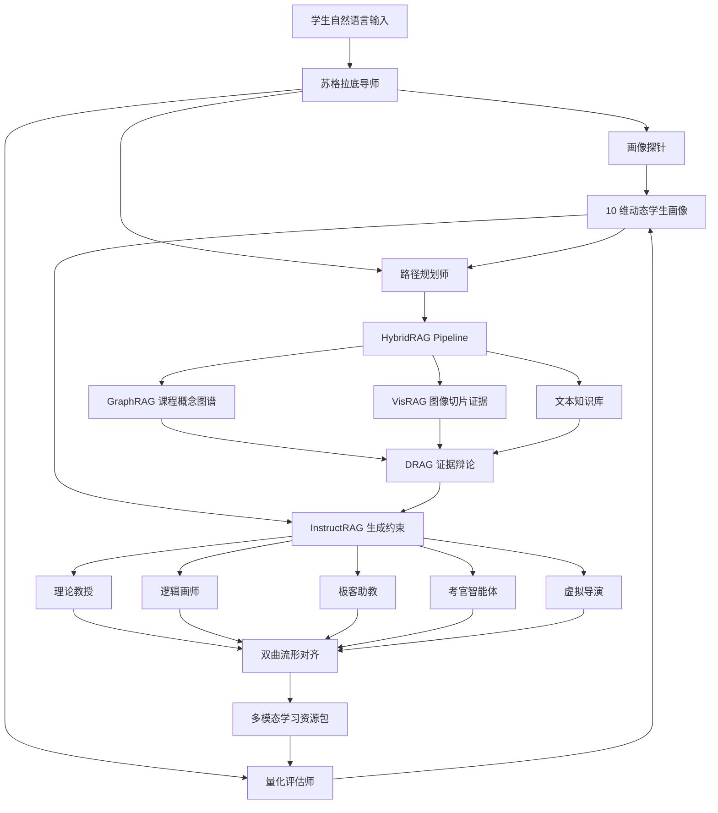
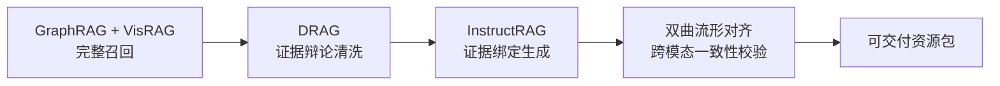

# EduMatrix 智教矩阵

[](https://www.python.org/)
[](#快速开始)
[](#系统架构)
[](#四重防幻觉链路)

EduMatrix 是一个面向教育场景的多智能体个性化学习资源生成系统。它把传统“学生问、模型答”的单轮问答，升级为“学生画像诊断、知识图谱召回、证据辩论清洗、资源并发生成、跨模态一致性校验、随学随新的闭环教学系统”。

项目当前固定赛题场景为 **机器学习导论**，已实现一套可离线运行的 Web Demo 与工程骨架，适合用于教育智能体竞赛原型、RAG/Agent 架构演示、个性化学习画像研究和后续生产化扩展。

> 详细系统报告见 [manual.md](./manual.md)。

## 项目亮点

| 能力 | 说明 |
|---|---|
| 1+3+5 Swarm 智能体网络 | 1 个前台苏格拉底导师、3 个认知治理 Agent、5 个资源生成 Agent |
| GraphRAG + VisRAG | 同时召回课程概念路径、文本证据和图像切片证据，避免知识边界缺失 |
| DRAG 证据辩论 | 正方、反方、法官三角色过滤弱相关、矛盾或污染证据 |
| InstructRAG 约束生成 | 每个生成 Agent 都绑定图谱路径、干净证据和学生画像 |
| 双曲流形对齐 | 检查讲义、代码、导图、视频脚本之间是否逻辑一致 |
| 对话式学生画像 | 通过自然语言和学习反馈构建 10 维动态画像 |
| 不会原因占比 | 自动分析学生因为什么不会，并输出可解释百分比 |
| 学习策略引擎 | 支持检索练习、间隔复习、worked example、提示阶梯和元认知校准 |
| 教师端诊断 | 提供班级画像热力图、误概念排行和干预建议 |
| 离线可运行 | 无 API Key 也能使用 deterministic fallback 跑通完整流程 |

## 教育目标

EduMatrix 的核心不是“生成更多材料”，而是让系统像细心的导师一样理解学生：

- 学生当前会什么、不会什么。
- 学生为什么不会，是前置知识缺口、误概念、负荷过高，还是学习策略问题。
- 学生需要讲义、图示、代码、练习、视频脚本中的哪一种支持。
- 学生是否只是看懂了，还是能独立迁移。
- 学生的画像如何随着每次反馈持续更新。

因此，系统中的每一次生成都不是孤立回答，而是基于学生画像、课程图谱、证据裁决和跨模态校验之后的教学动作。

## 系统架构



## Agent 矩阵

| 层级 | Agent | 职责 |
|---|---|---|
| 交互中枢 | 苏格拉底导师 | 接收学生问题、统一入口、路由到后台 Agent |
| 认知治理 | 画像探针 | 从对话和反馈中更新 10 维学生画像 |
| 认知治理 | 路径规划师 | 基于画像和 GraphRAG 规划最近发展区学习路径 |
| 认知治理 | 量化评估师 | 回收正确率、沙盒错误率、停留时长并触发重规划 |
| 资源工厂 | 理论教授 | 生成证据驱动的专业讲义 |
| 资源工厂 | 逻辑画师 | 生成 Mermaid 思维导图 |
| 资源工厂 | 极客助教 | 生成 Python/PyTorch 代码实操案例 |
| 资源工厂 | 考官智能体 | 生成分层练习题、解析和校准题 |
| 资源工厂 | 虚拟导演 | 生成虚拟人视频脚本和 TTS 分镜 |

## 对话式学生画像

传统画像往往依赖静态表单，学生自己也未必知道“我到底为什么不会”。EduMatrix 改为从自然语言、诊断反馈和学习表现中抽取证据。

### 10 维画像

| 维度 | 作用 |
|---|---|
| 知识基础 | 判断前置概念和目标知识点掌握度 |
| 易错点与误概念 | 识别反复犯错或概念混淆的原因 |
| 理解-熟练-迁移 | 区分看懂、会做、能迁移 |
| 认知加工与负荷 | 判断是否需要拆步骤、图示或条件清单 |
| 学习策略 | 识别是否缺少检索练习、错因复盘、间隔复习 |
| 元认知与自我调节 | 判断自评和真实表现是否一致 |
| 动机目标与意义感 | 把知识连接到专业、考试、项目或职业目标 |
| 情绪信心与韧性 | 识别焦虑、挫败和低信心风险 |
| 互动与表达偏好 | 适配图示、代码、例子、追问或视频脚本 |
| 学习情境与公平支持 | 纳入时间、课程要求、专业背景等现实约束 |

### 不会原因占比

系统会把“不会”拆成 7 类原因，并给出百分比、置信度和证据片段：

| 原因 | 对应教学动作 |
|---|---|
| 前置知识缺口 | 先补 prerequisite，再进入目标知识点 |
| 误概念/易混点 | 用反例辨析和对比表拆开相似概念 |
| 认知负荷过高 | 拆成小步骤，减少一次性信息量 |
| 学习策略不足 | 引入检索练习、错因复盘、间隔复习 |
| 自我判断失准 | 题前自评，题后校准 |
| 情绪与信心阻滞 | 降低首题难度，展示可见进步证据 |
| 讲解方式适配需求 | 切换图示、代码、例子或苏格拉底追问 |

示例输入：

```text
我是计算机专业，期末要考 CNN。池化层看不懂，最大池化和平均池化总混，
题干长会漏条件，复习只会看答案，我以为会了一做就错，希望用图和代码一步步提示。
```

系统会解析出类似结果：

```text
目标知识点: 池化层
背景目标: 计算机专业；期末复习

不会原因占比:
- 讲解方式适配需求: 20.7%
- 前置知识缺口: 15.9%
- 误概念/易混点: 15.9%
- 认知负荷过高: 15.9%
- 学习策略不足: 15.9%
- 自我判断失准: 15.9%
```

这些占比会直接影响后续生成：误概念高则安排最大池化/平均池化反例辨析；策略缺口高则减少直接给答案，改用提示阶梯和检索练习；元认知失准高则加入自评校准题。

## 四重防幻觉链路



1. **GraphRAG + VisRAG**：保证课程前置路径和视觉证据不丢失。
2. **DRAG**：让正方、反方、法官对证据进行裁决，避免污染证据进入生成上下文。
3. **InstructRAG**：把干净证据、知识路径和学生画像注入每个生成 Agent。
4. **双曲流形对齐**：发现“讲义说最大池化，代码却用 AvgPool2d”这类跨模态冲突，并触发回滚。

## 项目结构

```text
edumatrix/
├── agent_swarm.py          # 1+3+5 Agent 编排入口
├── config.py               # 运行配置和环境变量
├── drag_debate.py          # DRAG 三角色证据辩论
├── embedding_models.py     # 本地/通用大模型 embedding 适配层
├── ingestion.py            # 数据集到来前即可验证的文档摄入流水线
├── instruct_rag.py         # 画像与证据约束生成模板
├── learning_strategy.py    # 检索练习、间隔复习、worked example、提示阶梯策略引擎
├── llm_client.py           # 星火 WebSocket 适配器与离线 fallback
├── machine_learning_course_datasets.md # 机器学习导论公开数据集 URL
├── manifold_alignment.py   # 双曲流形对齐和符号冲突检测
├── models.py               # 数据模型、动态学生画像、学习状态占比
├── observability.py        # 本地指标/追踪接口，可替换 OpenTelemetry/Prometheus
├── rag_engine.py           # GraphRAG、VisRAG、文本检索与 HybridRAG
├── retrieval_evaluation.py # 检索 recall@k / MRR 评测骨架
├── swarm_orchestrator.py   # 命令行入口
├── test_edumatrix.py       # 单元测试
├── vector_store.py         # 可替换 Milvus/FAISS/pgvector 的向量索引接口
├── web_demo.py             # 零依赖 Web Demo、学生端和教师端
└── manual.md               # 完整架构报告
```

## 快速开始

### 环境要求

- Python 3.10+
- 无需额外依赖即可运行离线 demo
- 可选：配置科大讯飞星火 API 后启用远程大模型

### 运行默认示例

```bash
python swarm_orchestrator.py
```

### 运行自定义问题

```bash
python swarm_orchestrator.py "我是计算机专业，期末要考机器学习。逻辑回归和混淆矩阵总混，希望用图和例子一步步讲。"
```

### 启动 Web Demo

```bash
python web_demo.py
```

浏览器访问：

```text
http://127.0.0.1:8000
```

Web Demo 包含：

- 学生端：自然语言画像构建、多智能体资源生成、学习策略推荐。
- 教师端：班级画像热力图、误概念排行、干预建议。
- 课程数据区：机器学习导论公开教学数据集 URL。

### 输出完整 JSON

```bash
python swarm_orchestrator.py "我是计算机专业，期末要考机器学习。逻辑回归和混淆矩阵总混，希望用图和例子一步步讲。" --json
```

### 输出运行指标

```bash
python swarm_orchestrator.py "我看不懂池化层，请用图和 PyTorch 代码演示最大池化。" --json --metrics
```

指标快照会包含：

- `retrieval.evidence_count`：召回证据数。
- `retrieval.image_count`：视觉证据数。
- `debate.keep_rate`：DRAG 证据保留率。
- `alignment.rollback_count`：对齐失败回滚次数。
- `learning.estimated_accuracy`：量化评估预测正确率。
- `hybrid_rag.retrieve` / `swarm.process`：关键链路耗时 span。

Web Demo 也提供：

```text
GET /api/health
GET /api/metrics
```


### 运行测试

```bash
python -m unittest discover -s . -p "test_*.py" -v
```

当前测试覆盖：

- GraphRAG/VisRAG 是否召回池化层上下文。
- DRAG 是否保留相关证据。
- 流形对齐是否发现最大池化与平均池化冲突。
- Swarm 是否生成完整五类资源包。
- 对话画像是否能解析专业、目标、薄弱点、不会原因占比和 10 维动态画像。
- 学生反馈是否能更新掌握度、学习策略缺口和元认知状态。
- 文档摄入流水线是否能把未来课程材料切块并写入向量索引。
- 检索评测是否能输出 recall@k 和 MRR。
- 指标系统是否记录检索、DRAG、对齐和 Swarm 运行状态。

## 可选：启用科大讯飞星火

默认情况下，系统使用 `DeterministicEducationLLM`，保证本地和 CI 可稳定运行。若要启用星火大模型，可配置：

```powershell
$env:EDUMATRIX_USE_REMOTE_LLM="1"
$env:SPARK_APP_ID="your_app_id"
$env:SPARK_API_KEY="your_api_key"
$env:SPARK_API_SECRET="your_api_secret"
python swarm_orchestrator.py "我想学习池化层。"
```

## 可选：启用通用大模型 Embedding

默认检索使用本地 deterministic hash embedding，保证离线 demo 和 CI 稳定可复现。生产环境建议接入通用 embedding 大模型或企业统一模型网关，并把向量写入 Milvus、FAISS 或 pgvector。

当前代码支持 OpenAI-compatible `/v1/embeddings` 接口：

```powershell
$env:EDUMATRIX_EMBEDDING_PROVIDER="openai_compatible"
$env:EDUMATRIX_EMBEDDING_ENDPOINT="https://your-gateway.example.com/v1/embeddings"
$env:EDUMATRIX_EMBEDDING_API_KEY="your_embedding_key"
$env:EDUMATRIX_EMBEDDING_MODEL="text-embedding-3-large"
python swarm_orchestrator.py "我想用图和代码理解最大池化。"
```

## 数据集到来后的接入方式

当前即使没有真实数据集，也已经把工业化接口预埋好了：

```python
from ingestion import DocumentIngestionPipeline
from vector_store import InMemoryVectorIndex

index = InMemoryVectorIndex("course-index")
pipeline = DocumentIngestionPipeline(index)
report = pipeline.ingest_file("course_notes.md")
print(report)
```

生产环境替换点：

- `InMemoryVectorIndex` -> Milvus / FAISS / pgvector。
- `HashEmbeddingBackend` -> 通用 embedding 大模型或企业 embedding 网关。
- `DocumentIngestionPipeline.chunk_text()` -> PDF 渲染、版面检测、公式/图表/代码块切片。
- `TelemetrySink` -> OpenTelemetry / Prometheus / 企业指标平台。
- `RetrievalEvalCase` -> 标准课程问答集、教师标注证据集、比赛评测集。

## 示例输出节选

```text
目标知识点: 池化层
学习路径: 卷积核 -> 填充 -> 步长 -> 卷积运算 -> 特征图 -> 池化层

学习状态画像:
- 知识基础: 基础可支撑下一步学习
- 易错点与误概念: 存在高频易混点
- 学习策略: 学习策略需要显式训练
- 元认知与自我调节: 自我判断需要校准

不会原因占比:
- 讲解方式适配需求: 20.7%
- 前置知识缺口: 15.9%
- 误概念/易混点: 15.9%
- 认知负荷过高: 15.9%
- 学习策略不足: 15.9%
- 自我判断失准: 15.9%

DRAG保留证据: TXT_CONV_PRE_01, TXT_POOL_DEF_01, IMG_PATCH_POOL_01
流形对齐: 通过
资源包: 专业讲义、思维导图、代码实操案例、练习题、虚拟人视频脚本
```

## 生产化升级方向

| 层级 | 当前实现 | 生产升级 |
|---|---|---|
| 数据层 | 内存课程图谱和证据库 | Neo4j + Milvus/FAISS/pgvector |
| 文档摄入 | 手工构造图像切片元数据 + 本地 hash embedding | PDF 渲染、版面检测、通用大模型 embedding、多模态 embedding |
| 模型层 | 离线 deterministic fallback | 星火大模型、私有化模型或多模型路由 |
| 服务层 | CLI 同步编排 | FastAPI + Worker + Redis Stream |
| 视频层 | 虚拟人脚本 | TTS、虚拟人合成、教学短视频生成 |
| 观测层 | 单元测试和控制台报告 | 指标面板、画像漂移监控、学习效果评估 |

## 设计边界

EduMatrix 不承诺“绝对零幻觉”。更稳健的工程目标是：

> 通过证据绑定、辩论过滤、生成约束和一致性回滚，把幻觉从不可见的模型内部错误，转化为可审计、可定位、可修复的工程质量问题。

同样，学生画像不是给学生贴标签。每个画像判断都保留证据、置信度和适用范围，并服务于下一步教学支持，而不是永久定义学生能力。

## 参考方向

- GraphRAG: query-focused graph retrieval and summarization
- VisRAG: vision-based retrieval-augmented generation for multimodal documents
- DRAG: debate-augmented retrieval filtering
- InstructRAG: instruction-aware evidence-grounded generation
- Hyperbolic Embedding: hierarchical representation alignment
- Learning Analytics: dynamic learner modeling and knowledge tracing
- Learning Science: retrieval practice, spaced practice, metacognition, formative feedback

## License

当前仓库尚未声明开源许可证。若用于公开发布或团队协作，建议补充 `LICENSE` 文件并明确使用范围。
