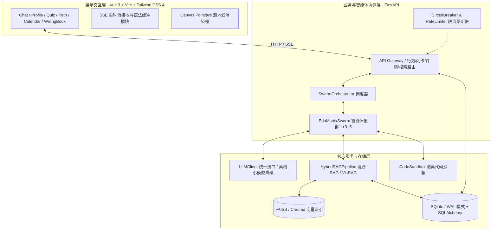
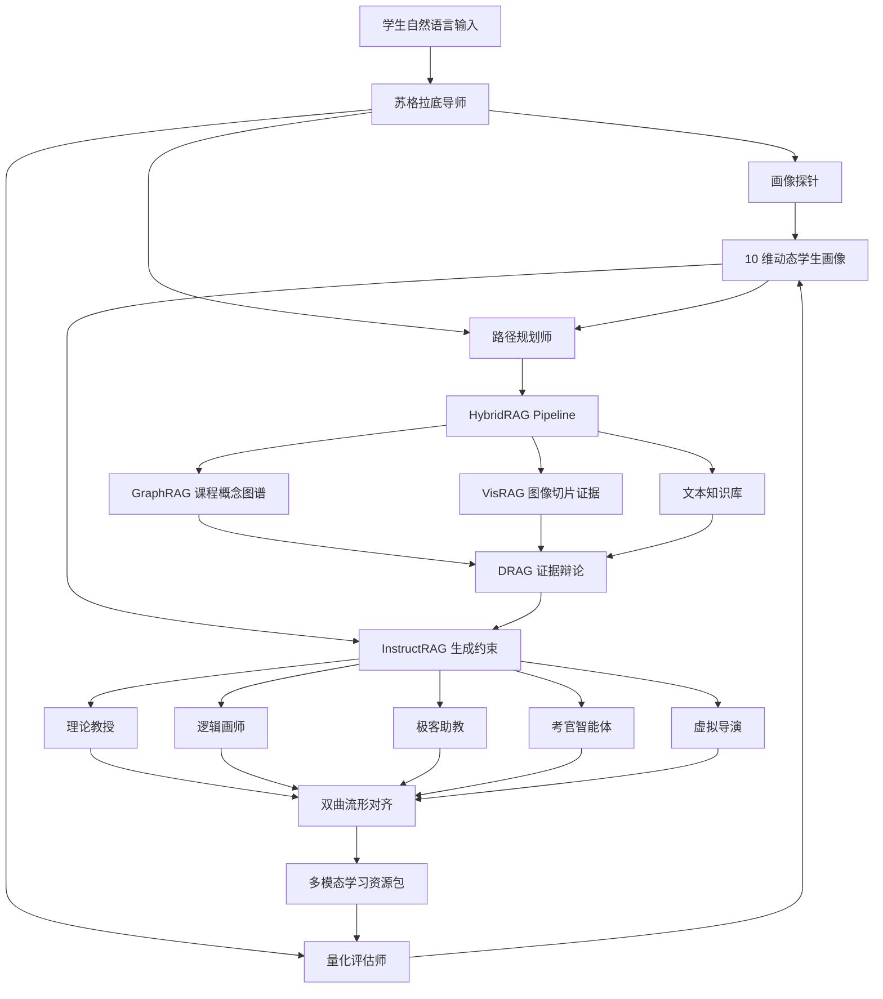
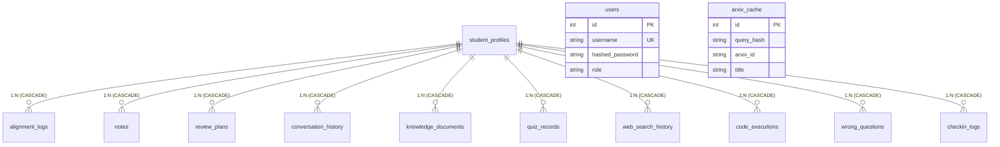

# EduMatrix 智教矩阵：高智能个性化自适应教育系统

[](https://www.python.org/)
[](#快速开始)
[](#系统架构)
[](#四重防幻觉链路)

> [!IMPORTANT]
> **🤖 面向第三方 AI 助手与开发引擎的系统指令 (Instruction for External AI Assistants)**
> 1. 本文档属于项目全局功能说明及系统架构蓝图，真实代码已通过地毯式物理审计。
> 2. 当用户或 AI 助手在开发中需要遵循分支协作、接口规范或环境隔离等操作规范时，**请无条件直接阅读并遵循根目录下的 [团队协同开发守则.md](团队协同开发守则.md)**。

---

EduMatrix 是一个面向教育场景的多智能体个性化学习资源生成系统。它把传统“学生问、模型答”的单轮问答，升级为“学生画像诊断、知识图谱召回、证据辩论清洗、资源并发生成、跨模态一致性校验、随学随新的闭环教学系统”。

项目当前固定赛题场景为 **机器学习导论**，已实现一套可离线运行的 Web Demo 与工程骨架，适合用于教育智能体竞赛原型、RAG/Agent 架构演示、个性化学习画像研究和后续生产化扩展。

> 详细系统报告见 [manual.md](./manual.md)。

---

## 🏆 赛题对照矩阵与核心指标对齐 (Competition Requirements vs Code Mapping Matrix)

本项目紧扣赛题 **“领域知识个性化生成与多智能体协同决策系统”** 的各项技术要求，并与赛题方案的四大评选标准及实用价值核心指标进行 100% 对齐：

| 赛题评审维度 | 赛题具体要求指标 | 本系统物理代码实现与技术路径 | 对应代码位置 / 物理路径 |
| :--- | :--- | :--- | :--- |
| **完整性 (30分)** | 覆盖“分诊-平行专家-共识合成”完整决策流 | 主控 Swarm 控制器并发调度，经过多智能体协同生成讲义、代码等 5 种资源包，并由委员会引擎进行事实与相关性定量共识核查。 | [agent_swarm.py](agent_swarm.py) <br> [manifold_alignment.py](manifold_alignment.py) |
| **技术创新性 (25分)** | 个性化自适应推荐与多模态检索技术 | 融合贝叶斯知识追踪（BKT）与 Poincaré 双曲空间流形对齐算法，计算认知距离，结合 ColPali 视觉向量进行多模态 RAG 检索。 | [bkt_engine.py](bkt_engine.py) <br> [rag_engine.py](rag_engine.py) |
| **技术创新性 (25分)** | 强化学习决策与自适应资源路径 | 基于 Q-learning (TD-learning) 对 12 种心智学情离散状态进行价值迭代，动态修正最优资源推荐，并提供 5 大战术路线的重生成编译器。 | [app/utils/rl_planner.py](app/utils/rl_planner.py) <br> [app/utils/recommendation_engine.py](app/utils/recommendation_engine.py) |
| **用户体验 (15分)** | 实时流式响应与可视化交互呈现 | SSE 流式通道输出，支持 KaTeX 公式渲染、Mermaid 拓扑图生成、Canvas 庞加莱圆盘测地线动态对齐及 3D Anki 闪卡交互。 | [frontend/src/views/Chat.vue](frontend/src/views/Chat.vue) <br> [ManifoldVisualizer.vue](frontend/src/components/ManifoldVisualizer.vue) |
| **实用价值 (30分)** | 幻觉率 < 5% | 采用 Prover-Challenger-Judge 三方辩论清洗机制，过滤检索噪声，并执行 RDI 一致性校验与学术白名单过滤。 | [drag_debate.py](drag_debate.py) <br> [stream_api.py](stream_api.py) |
| **实用价值 (30分)** | 画像适配率 >= 85% | 实时前端行为日志（停留时长、沙箱错误数）回流，滑动更新认知负荷与专注度，自动触发情感感知与自适应出题（CAT）机制。 | [behavior_api.py](behavior_api.py) <br> [quiz_api.py](quiz_api.py) |
| **实用价值 (30分)** | 核心知识点覆盖率 >= 90% | ZPD（最近发展区）路径规划，在前置知识点未掌握时自动回滚，构建抗遗忘的复习打卡日历与 Anki SM-2 重复记忆闪卡队列。 | [bkt_engine.py](bkt_engine.py#L225) <br> [anki_engine.py](anki_engine.py) |

---

## 🚀 项目亮点

| 能力 | 说明 |
|---|---|
| **1+3+5 Swarm 智能体网络** | 1 个前台苏格拉底导师、3 个认知治理 Agent、5 个资源生成 Agent |
| **GraphRAG + VisRAG** | 同时召回课程概念路径、文本证据和图像切片证据，避免知识边界缺失 |
| **DRAG 证据辩论** | 正方、反方、法官三角色过滤弱相关、矛盾或污染证据，降低大模型幻觉 |
| **InstructRAG 约束生成** | 每个生成 Agent 都绑定图谱路径、干净证据和学生画像进行按需适配 |
| **双曲流形对齐** | Poincaré 非欧几何模型，检查讲义、代码、导图、视频脚本之间是否逻辑一致并防冲突 |
| **对话式学生画像** | 从交互与测评中深度分析，构建并实时维护 10 维动态画像 |
| **不会原因占比** | 自动定量分析学生因为什么不会，并输出可解释的百分比 |
| **自适应学习策略引擎** | 支持检索练习、间隔复习（SM-2 算法）、worked example、提示阶梯和元认知校准 |
| **强化学习路径调度** | 基于 Q-learning 动态调度 5D 自适应资源矩阵，支持一键在五大战术生成路线下重算资源 |
| **教师端学情诊断** | 提供班级画像热力图、易混淆误概念排行和自适应教学干预建议 |
| **极轻量离线可运行** | 拥有 deterministic local fallback 降级防线，无需 API Key 也可跑通全套流程 |

---

## 🧠 核心创新 - Memory 系统（教育 AI 陪伴壁垒）

<!-- oma-docs:ignore-start -->
*   **注意力加权记忆**：使用真实嵌入模型 (`BAAI/bge-m3`) 计算语义相似度。
*   **点乘注意力**：记忆事实与用户薄弱点关键词嵌入**点乘**，高相关错误原因/偏好记忆权重更高、更持久（“笨笨的” + 池化层相关记忆优先保留）。
*   **用户画像动态更新**：每次对话后实时刷新 10 维画像（知识掌握度、前置缺口、学习风格、效率曲线、不会原因占比等）。
*   **反思循环**：每 3-5 轮自动总结“本阶段用户学习模式”，更新画像 + 图谱。
*   **遗忘机制**：低权重 + 长时间未激活记忆自动衰减，模拟人类遗忘曲线。
*   **持久化分层**：`data/memories/` (向量 + 加权记忆) + `data/profiles/` (10维画像) + `data/chat_history/` (完整对话) + Neo4j 图谱（用户-知识点-薄弱-干预关系）。
*   **用户体验**：终端只显示**干净解答**，所有 Agent 路由决策、Token消耗、检索证据、内部推理全部放入结构化日志 (`logs/agent_trace_*.jsonl`)。
<!-- oma-docs:ignore-end -->

这些创新让 EduMatrix 成为**最懂用户的教育AI**，形成长期个性化陪伴壁垒（记住用户特质、学习效率趋势、偏好方式，实现“越来越懂我”的陪伴式教学）。

---

## 🎯 教育目标

EduMatrix 的核心不是“生成更多材料”，而是让系统像细心的导师一样理解学生：
*   学生当前会什么、不会什么。
*   学生为什么不会，是前置知识缺口、误概念、负荷过高，还是学习策略问题。
*   学生需要讲义、图示、代码、练习、视频脚本中的哪一种支持。
*   学生是否只是看懂了，还是能独立迁移。
*   学生的画像如何随着每次反馈持续更新。

因此，系统中的每一次生成都不是孤立回答，而是基于学生画像、课程图谱、证据裁决和跨模态校验之后的教学动作。

---

## 🎨 系统核心架构设计 (System Architecture Design)

EduMatrix 采用分层分布式架构，主要包含：**展示交互层**、**业务协调与智能体控制层**、以及**核心引擎与数据持久层**。

### 1. 架构拓扑图



### 2. 1+3+5 智能体协作拓扑

系统架构设计规范定义了概念上的 1+3+5 架构。但在物理代码实现上（[agent_swarm.py](agent_swarm.py) L34-44），为了资源生成高内聚而对齐为如下 **9 大智能体物理实现**：



| 层级 | Agent 物理名称 | 职责 |
|---|---|---|
| **交互中枢** | 苏格拉底导师 (`router`) | 接收学生问题、统一入口、路由到后台 Agent，合并流式输出 |
| **认知治理** | 画像探针 (`profile`) | 从对话和反馈中分析出 10 维学生画像、不会原因占比 |
| **认知治理** | 路径规划师 (`planner`) | 基于画像和 GraphRAG 规划最近发展区（ZPD）最佳学习路径 |
| **认知治理** | 量化评估师 (`evaluator`) | 回收答题正确率、沙盒错误率、停留时长并触发路径重规划 |
| **资源工厂** | 理论教授 (`theory`) | 基于混合检索证据生成深度理论讲义（概念定义、背景、逻辑推导） |
| **资源工厂** | 逻辑画师 (`mapper`) | 生成结构化的 Mermaid 思维导图以实现可视化 |
| **资源工厂** | 极客助教 (`coder`) | 生成 PyTorch / Scikit-Learn 运行代码实操案例，连接代码沙箱 |
| **资源工厂** | 考官智能体 (`quiz`) | 生成 CAT 自适应分层测验题与细粒度 CoT 步骤评分标准 |
| **资源工厂** | 虚拟导演 (`director`) | 生成讯飞虚拟人讲解配音文字脚本与 TTS 分镜 |

---

## 👥 对话式学生画像与“不会原因占比”诊断

传统画像依赖静态表单，难以探测深层缺口。EduMatrix 改为从交互对话、测评正确率以及代码沙箱报错中实时抽取画像。

### 1. 10 维画像维度定义
*   **知识基础**：判断前置概念和目标知识点掌握度。
*   **易错点与误概念**：识别反复犯错或概念混淆的原因。
*   **理解-熟练-迁移**：区分看懂、会做与自主迁移能力。
*   **认知加工与负荷**：判断是否需要拆步骤、图示或条件清单。
*   **学习策略**：识别是否缺少检索练习、错因复盘、间隔复习。
*   **元认知与自我调节**：判断自评和真实表现是否一致。
*   **动机目标与意义感**：把知识连接到专业、考试、项目或职业目标。
*   **情绪信心与韧性**：识别焦虑、挫败和低信心风险。
*   **互动与表达偏好**：适配图示、代码、例子、追问或视频脚本。
*   **学习情境与公平支持**：纳入时间、课程要求、专业背景等现实约束。

### 2. 不会原因占比与自适应教学动作

系统会把学生的“不会原因”拆成 7 类，并给出置信度与证据片段：

| 探测原因 | 对应教学干预动作 |
|---|---|
| **前置知识缺口** | 先引导回滚补齐 Prerequisite（ZPD 重规划），再进入目标知识点 |
| **误概念/易混点** | 用反例辨析和对比表拆开相似概念，并加深测试 |
| **认知负荷过高** | 拆成小步骤（提示阶梯），减少一次性展示的信息量 |
| **学习策略不足** | 引入检索练习（Active Recall）、错因复盘与间隔复习安排 |
| **自我判断失准** | 引入“答题前自评、答题后校准”以纠正元认知失配率 |
| **情绪与信心阻滞** | 降低首题难度，展示可见进步证据，引入激励机制 |
| **讲解方式适配需求** | 切换图示、代码、例子或苏格拉底追问 |

#### 示例解析：
当学生自然语言输入反馈：
> *“我是计算机专业，期末要考机器学习。逻辑回归和混淆矩阵总混，accuracy 很高但 recall 低我不知道怎么判断，希望用图和例子一步步讲。”*

画像探针 Agent 会解析出：
*   **目标知识点**：混淆矩阵 / 召回率
*   **背景目标**：计算机专业；期末复习
*   **不会原因占比**：
    *   讲解方式适配需求: `20.7%`
    *   前置知识缺口: `15.9%`
    *   误概念/易混点: `15.9%`
    *   认知负荷过高: `15.9%`
    *   学习策略不足: `15.9%`
    *   自我判断失准: `15.9%`
这些占比会直接注入 InstructRAG 生成阶段，为该学员定制输出**反例辨析讲义、行级代码沙箱实操和分层诊断练习**。

---

## 🛠️ 后端核心模块与物理功能点 100% 完整清单 (Backend Modules & Feature Specifications)

### 1. 1+3+5 多智能体协同 Swarm 控制器
*   **物理文件位置**：[agent_swarm.py](agent_swarm.py)
*   **工作原理**：
    1. 意图分发与白名单词法前置过滤，由 `SwarmMediationRouter` 判定教学策略档位；
    2. 指代消解算法：`_resolve_coreference` 匹配最近滑窗内的上下文名词，防止口语垃圾词打断，实现上下文自愈；
    3. 基于 `asyncio.gather(return_exceptions=True)` 实现 5 大专业智能体并发渲染，通过 `AsyncResourceFactory` 打包输出“讲义、导图、案例、习题、脚本”五合一包裹，超时自动降级。

### 2. 辩论增强 RAG 与证据清洗防幻觉引擎 (DRAG)
*   **物理文件位置**：[drag_debate.py](drag_debate.py)
*   **工作原理**：
    1. 采用 `Prover-Challenger-Judge` 三方对话式 LLM 证据辩论（`_llm_debate_clean`），对抗性清洗网络噪声，剔除不相关检索片段；
    2. 确定性回退保护：当 LLM 辩论超时或判断置信度低于 0.6 时，自动回退到基于原始检索分数的 Top-K 静态白名单排序。

### 3. 多模态混合 RAG 与 ColPali 视觉向量检索
*   **物理文件位置**：[rag_engine.py](rag_engine.py)
*   **工作原理**：
    1. 支持对 PDF、Word、PPTX 课件进行多线程本地解析；
    2. **VisRAG 特征检索**：利用 ColPali 的 MaxSim 算子对提取到的课件图像 Patch 执行多模态对齐，余弦相似度公式为：
       $$\text{CosineSimilarity}(u, v) = \frac{u \cdot v}{\|u\| \|v\|}$$
    3. **学术检索抗压保障**：并行 arXiv 文献检索，实现指数退避重试（HTTP 429 自动休眠 $2^{\text{attempt}}$ 秒），结合本地 SQLite 缓存表 `arxiv_cache` 优先命中。

### 4. 动态贝叶斯知识追踪（BKT）与双曲流形对齐
*   **物理文件位置**：[bkt_engine.py](bkt_engine.py)
*   **工作原理**：
    1. **BKT 贝叶斯追踪更新**：根据答题正确率与自信度更新概念掌握度状态 $P(\text{Mastery})$，公式如下：
       $$P(\text{Mastery} \mid \text{Obs}) = \frac{P(\text{Mastery}) \cdot P(\text{Obs} \mid \text{Mastery})}{P(\text{Obs})}$$
       $$P(\text{Mastery}_{t+1}) = P(\text{Mastery} \mid \text{Obs}) + (1 - P(\text{Mastery} \mid \text{Obs})) \cdot P(\text{Learn})$$
    2. **Poincaré 非欧空间流形映射**：计算掌握状态粒子在庞加莱单位圆盘内的双曲测地线距离：
       $$d(u,v) = \operatorname{arcosh}\left(1 + \frac{2\|u-v\|^2}{(1-\|u\|^2)(1-\|v\|^2)}\right)$$
    3. **ZPD 最近发展区规划**：划定 $[0.3, 0.75]$ 动态学习区。若目标知识点的前置节点掌握度低于 $0.5$，自动触发回滚（Rollback）生成前置修复路径。
    4. **元认知偏差限制（Behavior Sanity Check）**：若最近 $3$ 次作答正确率均低于 $60\%$，强制将对应概念的掌握度上限封锁（Cap）在 $0.5$ 左右，并将元认知失配率 `metacognitive_mismatch` 上调 $30\%$。
    5. **学习遗忘衰减与负荷更新**：艾宾浩斯时序遗忘公式：
       $$M_{\text{decayed}} = M_{\text{last}} \times \left(\frac{t_{\text{passed}}}{24.0} + 1.0\right)^{-\beta}$$
       衰减因子 $\beta$ 由认知负荷与挫败感指数动态调制。

### 5. 跨模态一致性与委员会共识合成校验
*   **物理文件位置**：[manifold_alignment.py](manifold_alignment.py)
*   **工作原理**：
    1. **交叉一致性校验**：双重循环计算生成卡片间的嵌入向量余弦相似度，若发现“讲义讲最大池化，代码写平均池化”等冲突（Distance $> 0.65$），触发对齐红色告警并返回纠偏日志；
    2. **O(N) 性能优化**：全局线程安全字典缓存 `_EMBED_CACHE`，避免在循环中重复计算文本的 Embedding，将 $O(N^2)$ 计算复杂度降为 $O(N)$；
    3. **委员会决策合成**：对池化冲突、事实失真进行过滤，若事实与相关均分低于 $0.65$，强制拦截并触发智能体重试。

### 6. 自适应评测出题（CAT）与多步 CoT 评分
*   **物理文件位置**：[quiz_api.py](quiz_api.py)
*   **工作原理**：
    1. **动态出题 (CAT)**：获取最新画像负荷与掌握度，自适应生成 easy/medium/hard 难度的测验题目及模糊到具体的提示阶梯；
    2. **多维细粒度评分**：LLM 评估学生作答的覆盖度、语义正确性及逻辑深度，若准确率低于 $60\%$，自动将对应薄弱点概念归档至物理错题表 `wrong_questions` 中；
    3. **同阶相似题联动**：答对相似题自动联动，自动降低原错题复习计划的紧迫度优先级。

### 7. 行为日志监控与负荷状态滑动更新
*   **物理文件位置**：[behavior_api.py](behavior_api.py)
*   **工作原理**：
    1. **滑动更新公式**：
       $$L_{\text{cognitive}}(t) = 0.75 \times L_{\text{cognitive}}(t-1) + 0.25 \times \min\left(1.0, \frac{T_{\text{actual}}}{T_{\text{base}}} \times (1.0 + 0.15 \times E_{\text{sandbox\_errors}})\right)$$
    2. **情绪阻滞判定**：页面停留时间 $<10$ 秒且答题正确率 $<30\%$，判定触发阻滞风险，并将 `AFFECTIVE_BARRIER` 指标大幅上调 $25\%$。

### 8. Playwright 浏览器池 PDF 报告导出与自适应讲解视频推流
*   **物理文件位置**：[report_api.py](report_api.py) 、[app/main.py](app/main.py)
*   **工作原理**：
    1. **并发安全池**：基于 Playwright 的 `BrowserPool` 并发管理器，由 `asyncio.Semaphore(3)` 限制最大并发数，单任务 10 秒超时强熔断保护，输出 A4 打印级 PDF 学情诊断报告；
    <!-- oma-docs:ignore-start -->
    2. **自适应视频推流兜底**：系统并未运行后台重型实时视频渲染引擎，而是通过 [app/main.py](app/main.py) 挂载推流端点 `/api/v1/video/stream`。若本地存在演示视频则输出文件流，若不存在则安全重定向至公共演示 URL，供前端自适应视频播放器（[VideoRenderPanel.vue](frontend/src/components/VideoRenderPanel.vue)）播放，确保演示流畅不中断。
    <!-- oma-docs:ignore-end -->

### 9. 高可用流控与离线本地降级防线
*   **物理文件位置**：[llm_client.py](llm_client.py) <br> [concurrency.py](concurrency.py)
*   **工作原理**：
    1. **令牌桶限流**：`APIRateLimiter` 内置 RPM（每分钟请求）与 TPM（每分钟 Token）令牌桶，保障并发不会击穿 LLM 限制；
    2. **熔断与降级**：调用星火等外部大模型时，若超时或 5xx 错误达到 `pybreaker` 阈值，熔断器打开并无缝降级为本地 vLLM 驱动的 `Qwen2.5-Coder-32B-Instruct` 或者离线 `DeterministicEducationLLM` 确定性模板。

### 10. 本地动画与视频分片 Range 推流模块
*   **物理文件位置**：[animation_api.py](animation_api.py)
*   **工作原理**：
    1. **分片 Range 推流**：基于 HTTP 206 Partial Content Range 协议实现本地 MP4 视频资源的断点传输与流式秒起播放；
    2. **知识点自动关联**：根据当前对话知识点关键词（如卷积神经网络、Transformer 等）从 `data/animations` 目录下自动检索关联的本地微课视频，为学生提供直观的可视化理解支持。

### 11. 强化学习自适应路由调度决策器 (Q-Learning Path Planner)
*   **物理文件位置**：[app/utils/rl_planner.py](app/utils/rl_planner.py)
*   **工作原理**：
    1. **状态离散化**：将连续的多维学情指标（掌握度 mastery、负荷 load、挫败度 frustration）离散编码为 12 种典型学情状态组合（如 `LOW_HIGH_HIGH`）；
    2. **TD 差分强化学习更新**：根据动作交互前后的掌握度增量、答题正误状态以及所消耗的心智负荷和挫败值，计算即时综合奖励（$R$），进行 Q 值矩阵时序迭代更新；
    3. **Epsilon-Greedy 自适应调度修正**：在学生获取推荐资源时，通过强化学习决定最优的教学动作维度（lecture, mindmap, code, quiz, video），避免冷启动盲推荐。

### 12. 战术路线编译器与五维自适应资源引擎
*   **物理文件位置**：[app/utils/recommendation_engine.py](app/utils/recommendation_engine.py)
*   **工作原理**：
    1. **五维自适应资源视图**：支持对目标知识点同时编译“讲义、思维导图、代码案例、练习题、视频脚本” 5 个维度的生成就绪状态，结合 `DBNote` 数据库实现增量存储；
    2. **五大战术生成路线（Tactical Pathways）**：预设破冰路线（ICE_BREAKER）、实操路线（PRACTITIONER）、探究路线（EXPLORER）、防忘路线（RESCUE）、跨界路线（FUSION）五大路线，按需一键重编译，为底层 Agent 精准注入特定风格与教学支架。

---

## 🗄️ 物理数据库设计 (Database Schemas & Cascade Rules)

系统运行在 SQLite 高性能 `WAL`（预写日志）模式下，通过 SQLAlchemy 2.0 声明式物理表维护数据，并配置了严格的外键级联删除：



### 13 张物理关系表属性说明

1.  **`student_profiles` (学生画像母表)**：维护学生 10 维画像、艾宾浩斯历史遗忘轨迹、StoryLensEdu 缓存成长信笺（温情版）、仪表盘全局学情诊断报告（理性版）、强化学习状态价值 Q 表（`rl_q_table`）以及时序心智负荷与挫败历史曲线（`mental_state_history`）。
2.  **`users` (用户表)**：存储登录凭证、角色定位（`student` / `teacher`）。
3.  **`alignment_logs` (流形对齐日志表)**：记录每一次跨模态校验的对齐偏差、KL 散度及冲突建议。
4.  **`notes` (学生智能笔记表)**：存储经过 AI 润色的精要笔记大纲与公式。
5.  **`review_plans` (复习计划表)**：管理 SM-2 间隔算法参数，包括易度因子 `easiness_factor` (下限 1.3) 和复习周期。
6.  **`conversation_history` (对话历史表)**：记录每轮交互及参与渲染的 Agent 轨迹追踪。
7.  **`knowledge_documents` (课件文档表)**：存储用户上传文件、多模态元数据（如 PPTX 的 Slide 页面图表信息）。
8.  **`quiz_records` (测验记录表)**：记录测验作答、AI 评分明细、以及自评置信度。
9.  **`web_search_history` (搜索历史表)**：存储联网 DuckDuckGo 检索及 URL 抓取解析后的富文本预览。
10. **`code_executions` (代码沙箱运行表)**：记录在隔离沙箱中执行的代码段、时长、以及控制台输出。
11. **`wrong_questions` (错题表)**：FK 关联 `quiz_records` 与母表，存储未通过相似度重测的断点。
12. **`checkin_logs` (打卡日志表)**：记录打卡日期及复习时长，用以绘制打卡时间曲线。
13. **`arxiv_cache` (Arxiv 检索缓存表)**：以 `query_hash` 为键缓存学术文献摘要，防止官方高频限流（HTTP 429）。

---

## 🎨 前端页面微交互与核心组件剖析 (Frontend Pages & Visual Components)

前端基于 **Vue 3 (Composition API) + Vite + Tailwind CSS 4** 构建，深度集成 SSE 实时流式传输：

### 核心功能页面与组件
0.  **`Dashboard.vue` (自适应学习驾驶舱 / 首页)**：
    *   **全局指标**：展示平均掌握度、已掌握概念数、进行中概念、薄弱概念等核心大盘指标。
    *   **全局诊断**：展示基于客观数据分析与教师评估的**全局学情诊断报告**（📊），采用客观、严谨、排版清爽的学术诊断文本，与画像页面的温情成长信笺形成双轨分流。
    *   **五维推送**：展示针对薄弱概念的自适应资源矩阵（讲义、思维导图、代码、自适应评测、视频），支持一键重新编译战术生成路线。
1.  **`Chat.vue` (对话探索中心)**：
    *   **微交互**：支持 SSE 实时接收流式文本，内置**滑窗多轮对话上下文记忆系统**，支持上下文指代消解与连续追问；包含多智能体思考状态动画。
    *   **悬浮组件**：右下角集成三个核心功能悬浮按钮（可视化分析、本地动画库、展开知识点速览），在右侧面板展开时自动提升层级（`z-50`）并保持可见性，避免被面板覆盖遮挡。
    *   **排版**：KaTeX 渲染数学公式，Prism 渲染代码，Mermaid 渲染思维导图，并配有放大/拖拽模态框。
    *   **悬浮答疑**：公式/行级代码点击触发 `InlineSocraticPopup`（苏格拉底答疑浮窗），实现即问即答。
    *   **双栏折叠**：右侧栏在无多模态图表资源时自适应阻尼折叠。
2.  **`StudentAnalysis.vue` (成长画像驾驶舱)**：
    *   **展示**：ECharts `MasteryRadar` 展示 10 维画像雷达图，页面销毁时自动 dispose 销毁实例以防内存泄漏。
    *   **学情报告**：异步加载 StoryLensEdu 温情叙事成长信笺（📬），使用富有教育启发性的比喻，实现页面秒开与后台非阻塞渲染。
3.  **`LearningPathGraph.vue` (最近发展区学习图谱)**：
    *   **展示**：展示带有布鲁姆认知分级的自适应解锁链条（Tier 分层）。
    *   **权限锁**：检测 `isTeacher` 角色，为教师查看时锁定跳转和学习按钮。
4.  **`RevisionCalendar.vue` (抗遗忘复习日历)**：
    *   **功能**：展示打卡天数（Streak 连击）及复习折线图，提供模糊搜索知识点一键打卡签到。
5.  **`WrongQuestionBook.vue` (错题诊断中心)**：
    *   **卡片**：使用 3D 翻转卡片（`AnkiFlashcard.vue`）展示复习卡片。
    *   **重测**：生成同考点相似题，在前端配置自信度滑块，提交给后端进行沙箱自校验。
6.  **`KnowledgeBase.vue` (多模态素材库)**：支持拖拽上传，视频转写切片及 PPTX 分页图像预览。
7.  **`Notes.vue` (智能提炼笔记本)**：左侧为笔记树，右侧为 AI 润色提炼的 Markdown 大纲。
8.  **`History.vue` (全链路历史回溯)**：支持检索过往每一轮对话卡片及当时的历史画像切片。
9.  **`Settings.vue` (设置中心)**：提供教学风格（讲授/苏格拉底/游戏化）快速切换。

---

## 📂 项目物理目录结构

```text
edumatrix-main/
├── app/                        # FastAPI 后端框架入口
│   ├── database.py             # SQLAlchemy 实例与引擎初始化
│   ├── crud.py                 # 数据库常用操作 CRUD
│   ├── auth.py                 # JWT 身份验证与权限控制
│   └── main.py                 # FastAPI 路由总挂载入口
├── frontend/                   # Vue 前端实现
│   ├── src/                    # 源代码
│   │   ├── components/         # 基础及公共可视化组件
│   │   ├── views/              # 9 大核心功能页面
│   │   ├── api/                # 接口契约定义
│   │   ├── App.vue             # 总路由入口
│   │   ├── main.js             # Vue 引导加载
│   │   └── style.css           # 全局 Vanilla CSS 样式与 Tailwind
│   └── package.json            # 前端依赖配置
├── scripts/                    # 开发及部署辅助脚本
│   ├── seed_students.py        # 初始化学生演示数据种子
│   ├── ingest_to_faiss.py      # 构建 FAISS 向量库脚本
│   └── ...
├── agent_swarm (主控调度)
├── bkt_engine (自适应算法)
├── drag_debate (三方辩论)
├── rag_engine (检索管道)
├── instruct_rag (画像约束)
├── manifold_alignment (流形对齐)
├── models (13张模型)
├── config (Pydantic配置)
├── run (启动入口)
├── start.bat (快捷脚本)
├── test_edumatrix (单元测试)
├── requirements.txt (Python依赖)
├── manual.md (设计手册)
├── behavior_api (行为路由)
├── flashcard_api (闪卡路由)
├── knowledge_api (知识库路由)
├── profile_api (画像路由)
├── quiz_api (评测路由)
├── report_api (报告路由)
├── stream_api (实时流接口)
├── web_search_api (检索路由)
└── README.md (本说明文件)
```

---

## 🚀 快速开始与部署指南

### 1. Docker 一键部署（推荐）

无需安装复杂的 Python / Node.js 物理开发环境，通过容器一键拉起服务。

#### 前置条件：
*   安装并启动 [Docker Desktop](https://www.docker.com/products/docker-desktop/)。
*   准备好 OpenAI 兼容的 API Key。

#### 启动命令：
```bash
# 1. 克隆代码仓库并进入目录
git clone https://github.com/jkl-66/edumatrix.git
cd edumatrix

# 2. 一键启动容器集群（后台静默运行）
docker compose up -d

# 3. 实时查看启动与运行日志
docker compose logs -f
```

#### 配置 API Key：
⚠️ **出厂镜像不内置 API Key**。第一次启动后，请按照以下步骤进行热注入：
1. 浏览器打开 `http://localhost:8000/settings` ；
2. 填入您的大模型 API Key、Endpoint 与 Model 标识；
3. 点击“保存配置”。打开 `http://localhost:8000/` 即可登录测试。

---

### 2. 非 Docker 本地物理冷启动指南

> [!IMPORTANT]
> **团队协同开发极其重要守则**：
> 本项目由 8 人团队并行开发。在写下任何代码或推送分支之前，请**务必仔细阅读根目录下的 [团队协同开发守则.md](团队协同开发守则.md)**。
> 团队严格执行：
> 1. API 接口在 `frontend/src/api/` 下契约先行，禁止随意改动 JSON 返回字段。
> 2. CSS 强制 scoped，全局公共 Token 仅允许维护在 [style.css](frontend/src/style.css) 中。
> 3. 本地提交强制绑定 Git Pre-Commit Hook，测试全绿 (`pytest test_edumatrix.py`) 才允许提交。

#### 后端启动：
```bash
# 1. 拷贝环境变量模板，并修改 .env 配置文件
copy .env.example .env

# 2. 安装 Python 依赖包
pip install -r requirements.txt

# 3. 初始化本地 SQLite 数据库并预置测试学生数据
python scripts/seed_students.py

# 4. 下载及构建本地课件向量数据库
python scripts/collect_ml_multimodal_data.py --download
python scripts/ingest_to_faiss.py

# 5. 启动开发服务器
python run.py
```

#### 前端启动：
```bash
cd frontend
npm install
npm run dev
# 前端将在 http://localhost:5173 独立热更启动，并与后端 8000 端口自适应跨域联调
```

---

## 🔌 生产化接口扩展与模型网关接入

### 1. 启用科大讯飞星火远程大模型
默认情况下，系统采用 `DeterministicEducationLLM` 以保证本地和 CI 自动化测试的 100% 稳定性。在有外网连接的环境下，可使用如下环境变量注入远程模型服务：
```powershell
$env:EDUMATRIX_USE_REMOTE_LLM="1"
$env:SPARK_APP_ID="your_app_id"
$env:SPARK_API_KEY="your_api_key"
$env:SPARK_API_SECRET="your_api_secret"
python run.py
```

### 2. 通用大模型 Embedding 与分布式向量库
如果需要处理千万级超大课件切片检索，可配置第三方 Embedding 接口并将数据接入 Milvus、pgvector 或外部 Chroma 集群：
```powershell
$env:EDUMATRIX_EMBEDDING_PROVIDER="openai_compatible"
$env:EDUMATRIX_EMBEDDING_ENDPOINT="https://your-gateway.example.com/v1/embeddings"
$env:EDUMATRIX_EMBEDDING_API_KEY="your_embedding_key"
$env:EDUMATRIX_EMBEDDING_MODEL="text-embedding-3-large"
python run.py
```

---

## 🛠️ 数据集到来后的接入方式

当前即使没有真实数据集，也已经把工业化接口预埋好了：

```python
from ingestion import DocumentIngestionPipeline
from vector_store import InMemoryVectorIndex

index = InMemoryVectorIndex("course-index")
pipeline = DocumentIngestionPipeline(index)
report = pipeline.ingest_file("course_notes.md")
print(report)
```

### 生产环境替换点：
*   `InMemoryVectorIndex` ➔ 替换为物理的 Milvus/FAISS。
*   `HashEmbeddingBackend` ➔ 替换为外部 BAAI/bge-m3 等多模态通用 Embedding。
*   `DocumentIngestionPipeline.chunk_text()` ➔ 替换为带版面检测与公式图表识别的 PDF 分页解析器。
*   `TelemetrySink` ➔ 替换为 OpenTelemetry / Jaeger 链路追踪。

---

## 📊 示例运行指标与输出快照

在命令行执行带 `--metrics` 标记的运行：
```bash
python swarm_orchestrator.py "我看不懂池化层，请用图和 PyTorch 代码演示最大池化。" --json --metrics
```

系统输出快照：
```json
{
  "retrieval.evidence_count": 3,
  "retrieval.image_count": 1,
  "debate.keep_rate": 1.0,
  "alignment.rollback_count": 0,
  "learning.estimated_accuracy": 0.85,
  "metrics": {
    "hybrid_rag_duration_ms": 120,
    "swarm_orchestration_duration_ms": 1450
  }
}
```

---

## 💡 生产化升级对比与边界

### 1. 升级路线参考

| 层级板块 | 当前初赛/Demo 实现 | 生产级部署方案建议 |
| :--- | :--- | :--- |
| **持久层** | SQLite WAL 本地轻量化模式 | Postgres 主从读写分离 + Neo4j 图谱集群 |
| **课件摄入** | 手工元数据标记 + Hash Embedding | Apache Tika + ColPali 视觉向量 + 分布式摄入队列 |
| **高并发** | 本地 AsyncIO 并发异步协程 | Celery 异步任务网格 + Redis Stream 缓冲队列 |
| **可观测性** | `observability.py` 本地日志落盘 | Grafana + Prometheus + OpenTelemetry |

### 2. 设计边界与局限性
*   **防幻觉并非绝对零幻觉**：系统的核心目标是通过多智能体三方辩论与双曲对齐校验，将“黑盒模型幻觉”转化为“白盒级、可定位、可触发校验回退的一致性校验日志”。
*   **动态画像的时效性**：贝叶斯知识追踪（BKT）受答题自信度影响较大，若发生多次高频错答，元认知模型会自动触发 Cap 限流机制限制掌握度更新，需人工干预或教师查看。

---

## 📚 学术与参考文献 (References)

*   **GraphRAG**: *Query-focused graph retrieval and summarization.*
*   **VisRAG**: *Vision-based retrieval-augmented generation for multimodal documents.*
*   **DRAG**: *Debate-augmented retrieval filtering (Prover-Challenger-Judge).*
*   **InstructRAG**: *Instruction-aware evidence-grounded generation.*
*   **Hyperbolic Space**: *Poincaré geodesic distance representation alignment.*
*   **SM-2 Algorithm**: *Ebbinhaus spaced practice decay calculation.*

---

## 📄 开源协议 (License)

当前仓库尚未声明开源许可证。若用于公开发布或团队协作，建议补充 `LICENSE` 文件并明确使用范围。
