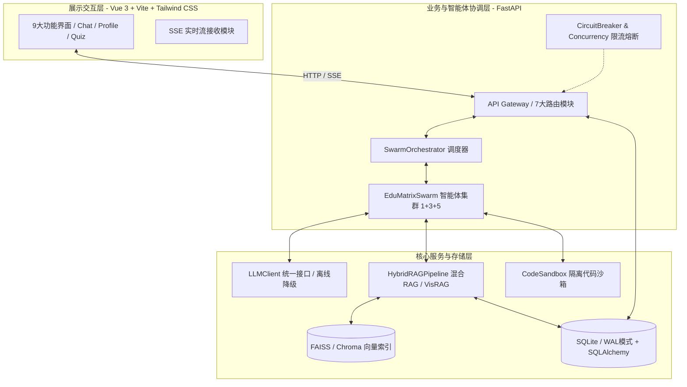
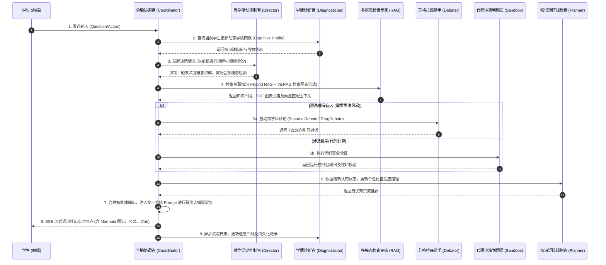
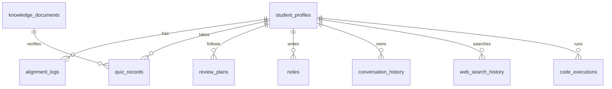

# EduMatrix 智教矩阵系统架构与设计说明书 (docs/architecture.md)

`EduMatrix 智教矩阵` 是一款基于大语言模型（LLM）、GraphRAG（图谱检索增强生成）与多模态检索技术构建的高智能个性化自适应教育系统。系统采用 **1+3+5 智能体协作矩阵架构**，通过多通道协作（流式交互、跨智能体辩论、拓扑流形对齐），实现因材施教、动态诊断和个性化知识推荐的闭环。

---

## 一、 系统架构

EduMatrix 采用分层分布式架构，主要包含：**展示交互层**、**业务协调与智能体控制层**、以及**核心引擎与数据持久层**。

### 1. 架构示意图 (Mermaid)



### 2. 1+3+5 智能体矩阵

EduMatrixSwarm 内部构建了以 **主控智能体（Master）** 为核心，**3 大管理智能体** 及 **5 大专业动作智能体** 紧密协作 of 网状控制系统：

| 智能体级别 | 智能体名称 | 对应类/标志 | 核心职责 |
| :--- | :--- | :--- | :--- |
| **主控层 (1)** | **全脑主控协调官 (Coordinator Agent)** | `CoordinatorAgent` | 接收前端请求，负责意图分发、上下文路由、调度子智能体，并进行流式 SSE 输出合并。 |
| **管理层 (3)** | **1. 动态学情诊断官 (Diagnostician Agent)** | `ProfileManager` | 分析学生答题、提问记录，生成并实时更新学生的知识缺陷树、学习风格及遗忘曲线模型。 |
| | **2. 知识矩阵规划官 (Planner Agent)** | `PathPlanner` | 依据学情画像及目标，动态推荐最佳学习路径，生成针对弱项的个性化复习规划。 |
| | **3. 教学活动控制官 (Director Agent)** | `SessionDirector` | 判定教学节奏，决策当前该进行“引导提问”、“深度讲解”还是“推送小测”。 |
| **专业动作层 (5)** | **1. 概念可视化导师 (Visualizer Agent)** | `Visualizer` | 生成知识概念的 Markdown 拓扑图、Mermaid 结构图，强化学生的空间结构记忆。 |
| | **2. 多模态检索专家 (Retriever Agent)** | `RAGExpert` | 调用 Hybrid RAG 引擎，不仅检索文本，还能检索课件中的图表、公式（VisRAG）。 |
| | **3. 跨学科苏格拉底辩手 (Debater Agent)** | `SocraticDebater` | 在学生遇到难点时，启动“真理越辩越明”的双主体思维风暴（DragDebate）引导思考。 |
| | **4. 代码沙箱判题员 (Sandbox Coder)** | `SandboxEvaluator` | 在涉及编程、数学计算时，在隔离沙箱中安全执行代码，输出执行结果与错误诊断。 |
| | **5. 自适应评测官 (Assessor Agent)** | `QuizEvaluator` | 动态生成多维自适应评测（CAT），给出多步推导的细粒度打分（Concept-level grading）。 |

---

## 二、 核心数据流 (9步流水线)

当学生在前端输入一个问题/提交一个答卷时，系统内部将触发以下完整的 9 步自适应闭环流水线：



---

## 三、 后端模块清单

后端由一组专注于高并发、分布式大模型调度及图检索的 Python 模块构成。以下是核心代码模块说明表：

| 模块文件名 | 物理路径 | 核心职责与业务逻辑 |
| :--- | :--- | :--- |
| `run.py` | `run.py` | 后端服务启动入口，负责解析命令行参数、加载环境变量并拉起 Uvicorn 服务。 |
| `app/main.py` | `app/main.py` | FastAPI 核心实例初始化。注册全局跨域 CORS 中间件、挂载 7 大业务路由、集成全局异常捕获。 |
| `agent_swarm.py` | `agent_swarm.py` | 1+3+5 智能体架构的核心实现。定义 `EduMatrixSwarm` 类，管理各智能体的 Prompt、上下文传承及状态扭转。 |
| `rag_engine.py` | `rag_engine.py` | `HybridRAGPipeline`（混合 RAG 引擎）核心。融合 GraphRAG 的实体关系提取与 VisRAG（基于 ColPali MaxSim 算子）的多模态文档检索。 |
| `concurrency.py` | `concurrency.py` | 系统高可用基石。实现熔断器（CircuitBreaker）、令牌桶算法（TokenBucket）、并发异步工作池（AsyncWorkerPool）及流控限流器。 |
| `config.py` | `config.py` | 基于 Pydantic 的强类型配置类 `Settings`。统一从 `.env` 读入并校验数据库、LLM 密钥、沙箱路径等配置。 |
| `llm_client.py` | `llm_client.py` | 大语言模型统一抽象客户端。集成主流大模型（OpenAI/星火）协议，支持流式 SSE 响应、重试补偿，以及本地离线教育小模型（DeterministicEducationLLM）的无缝降级。 |
| `models.py` | `models.py` | 数据库实体定义。基于 SQLAlchemy 2.0 声明式映射，定义 9 张核心实体表，配置严格的外键关联及级联删除。 |
| `code_exec_api.py` | `code_exec_api.py` | 独立子进程代码沙箱控制器。支持对 Python/JS 等代码片段的自动化沙箱隔离运行，限制 CPU 时间及最大内存，防止沙箱逃逸。 |
| `document_parser.py` | `document_parser.py` | 多模态文档解析器。负责解析 PDF, Markdown, Word, LaTex，提取元数据及图像特征，生成结构化切片（Chunk）。 |
| `embedding_models.py`| `embedding_models.py`| 嵌入模型管理器。支持对主流 Embedding 及 Rerank 模型的本地加载或 API 调用，统一向量化入口。 |
| `vector_store.py` | `vector_store.py` | 向量数据库基础层。封装对外部向量数据库（如 Chroma/Milvus）的操作接口。 |
| `vector_store_faiss.py`| `vector_store_faiss.py`| 本地轻量化 FAISS 索引实现。支持极速的 L2 / 内积（IP）向量相似度匹配，且自动实现序列化落地。 |
| `learning_strategy.py`| `learning_strategy.py`| 学习策略分析器。利用机器学习算法，根据遗忘曲线（Ebbinhaus）与拓扑空间流形对齐推荐个性化学科路径。 |
| `manifold_alignment.py`| `manifold_alignment.py`| 拓扑流形对齐算法。数学建模层，基于图流形相似度，将学生的当前认知状态与专业标准知识图谱流形进行仿射对齐。 |
| `note_engine.py` | `note_engine.py` | 智能笔记与反思生成引擎。根据对话上下文，为学生自动提炼结构化笔记，提取精选考点与解题思路。 |
| `observability.py` | `observability.py` | 智能体可观测性系统。记录所有 Agent 调用链（Trace ID, Span ID），统计延迟、Token 消耗，便于链路调优。 |
| `drag_debate.py` | `drag_debate.py` | 跨学科学情辩论（DragDebate）主控逻辑。处理正反方智能体的高频信息传递、意见对撞及归纳收敛。 |
| `content_safety.py` | `content_safety.py` | 双向内容合规与安全检测器。对学生输入及大模型输出进行敏感词、学术不端、违规价值观的过滤阻断。 |
| `ingestion.py` | `ingestion.py` | 知识入库管道。配合文档解析器将上传的教学资料转化为带 Graph 拓扑关系的 RAG 切片，批量写入向量库。 |

---

## 四、 API 路由设计

系统通过 FastAPI 暴露出规范化的 RESTful 接口与 SSE（Server-Sent Events）通道，主要的路由模块分布如下：

| 路由文件 | 挂载路径前缀 | 业务职责 | 主要 API 端点 |
| :--- | :--- | :--- | :--- |
| `app/api/stream.py` | `/api/v1/stream` | 提供高并发 SSE 实时流接口，负责与主控智能体交互，推送多智能体分析过程及最终回复。 | `POST /chat` (SSE 流式推送) |
| `app/api/profile.py`| `/api/v1/profile`| 提供学生画像、认知地图、学习曲线的增删改查。 | `GET /{student_id}` (获取画像)<br>`POST /update` (增量对齐画像) |
| `app/api/quiz.py` | `/api/v1/quiz` | 自适应评测 API，负责生成考题、接收提交、多步精细化自动批改与答题历史拉取。 | `POST /generate` (自适应出题)<br>`POST /submit` (细粒度判卷) |
| `app/api/knowledge.py`| `/api/v1/knowledge`| 提供教学课件上传、GraphRAG 构建、图谱关系绑定与知识点检索。 | `POST /upload` (知识上传)<br>`GET /search` (混合RAG检索) |
| `app/api/web_search.py`| `/api/v1/web_search`| 辅助智能体执行实时互联网检索，并生成可信事实溯源引用链接。 | `GET /query` (网络检索聚合) |
| `app/api/code_exec.py`| `/api/v1/code_exec` | 隔离沙箱判题接口，处理在线编程任务的代码评估。 | `POST /execute` (沙箱运行代码) |
| `app/api/notes.py` | `/api/v1/notes` | 智能提炼学生学习笔记，支持一键导出 Markdown 或 PDF。 | `POST /generate` (一键提炼笔记) |

---

## 五、 持久层数据库设计 (9张表)

系统使用 SQLite (配置高性能 `WAL` 预写日志模式) 作为主数据库，通过 SQLAlchemy 进行 ORM 映射。



### 数据库实体表细则

1. **`student_profiles` (学生画像表)**
   - 核心字段：`id` (PK), `name`, `learning_style`, `cognitive_map` (JSON，存储多维认知状态), `mastery_score` (总掌握度), `created_at`, `updated_at`
   - 职责：维护学生全周期的个性化认知档案。
2. **`alignment_logs` (拓扑流形对齐日志表)**
   - 核心字段：`id` (PK), `student_id` (FK), `source_manifold` (JSON), `target_manifold` (JSON), `kl_divergence` (散度度量), `aligned_at`
   - 职责：记录每一次学生认知空间与标准学科大纲空间的映射与偏差度量。
3. **`quiz_records` (自适应答题记录表)**
   - 核心字段：`id` (PK), `student_id` (FK), `quiz_id`, `question_content`, `student_answer`, `evaluation_result` (JSON，包含每一解题步骤 of 细粒度得分), `score`, `created_at`
   - 职责：沉淀答题细节，作为诊断智能体打分的底层依据。
4. **`review_plans` (个性化复习规划表)**
   - 核心字段：`id` (PK), `student_id` (FK), `concept_name`, `next_review_time` (基于遗忘曲线推导), `interval_days`, `efactor` (记忆因子), `priority`
   - 职责：驱动智能体自适应推送系统，按时提醒复习。
5. **`notes` (学生智能笔记表)**
   - 核心字段：`id` (PK), `student_id` (FK), `title`, `content_markdown`, `concepts_covered` (JSON), `created_at`
   - 职责：记录笔记系统为学生提炼沉淀的结构化知识精华。
6. **`conversation_history` (对话上下文表)**
   - 核心字段：`id` (PK), `student_id` (FK), `session_id`, `role` (user/assistant), `message_body`, `agent_traces` (JSON，记录是由哪几个子智能体参与组装的), `timestamp`
   - 职责：维持多轮对话上下文以及实现 Agent 调用链路的回溯。
7. **`knowledge_documents` (知识点切片表)**
   - 核心字段：`id` (PK), `doc_hash`, `title`, `chunk_content`, `embedding_vector_id` (关联外部FAISS中的索引), `graph_entities` (JSON), `created_at`
   - 职责：为 Hybrid RAG 系统提供标准化的事实与图谱上下文。
8. **`web_search_history` (互联网检索日志表)**
   - 核心字段：`id` (PK), `student_id` (FK), `query`, `search_results` (JSON), `referenced_urls` (JSON), `retrieved_at`
   - 职责：保存检索历史，供多智能体校验事实可靠性。
9. **`code_executions` (代码沙箱运行记录表)**
   - 核心字段：`id` (PK), `student_id` (FK), `code_snippet`, `language`, `stdout`, `stderr`, `exit_code`, `executed_at`
   - 职责：防止滥用并做编程学情分析。

---

## 六、 前端架构设计 (9个核心页面)

前端基于 **Vue 3 (Composition API) + Vite + Tailwind CSS 4** 搭建，采用响应式视网膜（Retina）设计，集成了全异步 SSE 实时流处理。

| 页面文件名 | 对应路由路径 | 核心 UI 职责与交互亮点 |
| :--- | :--- | :--- |
| `Chat.vue` | `/chat` | **核心交互枢纽**：支持无延迟 SSE 流式渲染、智能 Markdown 解析（KaTeX 数学公式渲染、Prism 代码高亮、Mermaid 拓扑图生成、VisRAG PDF 预览）。包含多智能体后台思考动画。 |
| `Dashboard.vue` | `/dashboard` | **学生驾驶舱**：多维度指标大盘（学习时长、知识掌握比率、本周评测得分）。配合 CSS 渐变微光卡片展示近期动态。 |
| `Profile.vue` | `/profile` | **认知画像与缺陷树**：使用 D3.js 或 ECharts 绘制 3D 拓扑雷达图与知识树，动态显示每一层概念的对齐差异。 |
| `Quiz.vue` | `/quiz` | **自适应答题卡**：采用轻量毛玻璃质感（Glassmorphism）卡片，支持多步拆解答题，答完后显示自适应智能体的动态微步反馈。 |
| `KnowledgeBase.vue`| `/knowledge` | **多模态课件库**：支持课件拖拽上传（Drag-and-Drop）、自动 Graph 提炼状态显示，支持 VisRAG 原理图预览。 |
| `ReviewPlan.vue` | `/review` | **抗遗忘日历**：按记忆衰减曲线排序的动态卡片堆栈，提供“紧急复习”的一键激活机制。 |
| `Notes.vue` | `/notes` | **智能笔记本**：左侧为智能笔记树，右侧为带丰富交互的 Markdown 预览与多级考点折叠菜单。 |
| `History.vue` | `/history` | **全链路历史回溯**：允许学生查阅过往的全部对话，并支持“跳转到当时认知状态”的时空回溯交互。 |
| `Settings.vue` | `/settings` | **设置面板**：配置首选的 LLM（在线/离线自适应）、配置教学风格（苏格拉底式/严肃讲授式/游戏化式）。 |

---

## 七、 系统技术栈

| 领域 | 核心技术组件 | 作用与职责 |
| :--- | :--- | :--- |
| **后端核心** | `FastAPI` + `Uvicorn` | 支撑极速异步 I/O 及高性能 SSE 流式推送。 |
| **数据库/ORM**| `SQLite` (WAL mode) + `SQLAlchemy 2.0` | 事务级元数据存取，轻量、强悍、零开销部署。 |
| **向量检索** | `FAISS` + `Chroma` | 提供十万级 Chunk 毫秒级的 L2 与 IP 相似度检索。 |
| **大模型框架** | `Pydantic v2` + `OpenAI API` | 用于结构化 Prompt 定义、JSON Schema 约束及大模型交互。 |
| **大模型与RAG**| `VisRAG (ColPali)` + `GraphRAG` | 多模态深度视觉检索与结构化知识实体提取。 |
| **高可用控制** | `CircuitBreaker` + `TokenBucket` | 保证在大流量下不会被大模型 API 速率限制（Rate Limit）击垮。 |
| **前端框架** | `Vue 3` (Script Setup) + `Vite` | 现代极致响应式前端架构。 |
| **前端样式** | `Tailwind CSS 4` + `Vanilla CSS` | 采用精心调校的深色美学（Dark Mode Base）及流畅的微动画。 |
| **文档处理** | `PyMuPDF` + `python-docx` + `KaTeX` | 用于教学资料结构化解析与数学公式的前后端完美呈现。 |

---

## 八、 核心设计模式

EduMatrix 代码库高度模块化，在开发中融合了以下 7 种核心软件工程设计模式：

1. **外观模式 (Facade Pattern)**：
   - *实现*：`llm_client.py` 封装了所有底层复杂模型的差异（如 OpenAI 与 讯飞星火 具有完全不同的认证与协议），为智能体提供简洁一致的 `complete()` 与 `complete_stream()` 接口。
2. **中介者模式 (Mediator Pattern)**：
   - *实现*：`swarm_orchestrator.py` 中的 `SwarmOrchestrator` 作为中介者。智能体之间不进行显式强耦合调用，而是将状态交还给中介者，由中介者决定下一步唤醒哪个智能体。
3. **策略模式 (Strategy Pattern)**：
   - *实现*：`learning_strategy.py` 中的个性化推荐算法。系统可动态插拔更换推荐策略（如基于“艾宾浩斯遗忘曲线策略”或基于“图拓扑流形对齐策略”）。
4. **单例模式 (Singleton Pattern)**：
   - *实现*：`config.py` 中的 `settings` 实例，以及 `embedding_models.py` 中的 Embedding 服务。全局有且仅加载一次，防止高昂的内存与模型重复初始化开销。
5. **工厂模式 (Factory Pattern)**：
   - *实现*：`swarm_factory.py` 提供 `AgentFactory`。根据学生的学科背景与设置，动态实例化对应的专业动作智能体。
6. **熔断器模式 (Circuit Breaker Pattern)**：
   - *实现*：`concurrency.py` 中的 `CircuitBreaker`。实时监控 LLM API 的超时及 5xx 错误率，达到阈值时自动切断请求并降级为本地大模型，防止服务雪崩。
7. **观察者模式 (Observer Pattern)**：
   - *实现*：可观测性模块 `observability.py`。智能体的流式状态变化（思考中、检索中、辩论中）会实时分发并推送给订阅的 SSE 管道，实现前端交互层的瞬间感知。

---

## 九、 代码规范说明

### 1. 单一职责原则 (SRP) 冲突与重构建议

在项目演进中，存在少数函数功能过于繁杂、违反了单一职责原则。开发中应重点重构以下三处：

1. **`models.py` 中的 `_refresh_dynamic_profile` (L554 - L664)**
   - *现状*：该函数同时处理了学情画像提取、遗忘曲线计算、数据库写入以及向量对齐计算，函数体超过 110 行，极难测试。
   - *重构建议*：将其拆分为 `extract_cognitive_states()`、`apply_ebbinghaus_decay()` 与 `persist_profile_state()` 三个独立函数。
2. **`code_exec_api.py` 中的 `_execute_python`**
   - *现状*：该方法内部既包含了底层的沙箱进程启动，又混杂了 stdout/stderr 过滤清洗，以及运行超时的容错逻辑。
   - *重构建议*：将子进程配置与启动抽取为 `SandboxProcessRunner` 类，让 `_execute_python` 仅关注代码逻辑的安全校验与流过滤。
3. **`stream_api.py` 中的 `process_student_message`**
   - *现状*：该端点同时处理了 HTTP 握手安全校验、敏感词检测、Swarm 调度调用以及 SSE 消息体拼接格式化。
   - *重构建议*：引入 FastAPI 依赖项（Depends）将安全校验与敏感词过滤前置，将消息拼接抽取为 `SseMessageFormatter` 静态工具类。

### 2. 命名规范冲突与最佳实践

> [!IMPORTANT]
> **关于命名风格的架构声明**：
>
> 1. **当前现状**：
>    - **前端代码 (JavaScript/Vue)**：遵循统一的 **驼峰命名法 (camelCase)**，如 `studentId`、`cognitiveMap`，符合业内优秀开发标准。
>    - **后端代码 (Python)**：严格遵循 **Python PEP 8 规范**，采用 **蛇形命名法 (snake_case)**，如 `student_id`、`cognitive_map`。
> 2. **用户约束声明**：
>    若遵循用户提出的“全系统统一使用驼峰命名法”指令，对 Python 后端而言将是一项破坏性重构（破坏了 PEP 8 命名标准，并与 SQLAlchemy/Pydantic 的默认数据库字段映射冲突，需更改约 200+ 处核心变量）。

#### 命名规范转换的最佳推荐方案：**边界防线转换机制 (Boundary Conversion Mechanism)**
为满足系统对驼峰命名的整体要求，同时不破坏 Python 底层的 PEP 8 生态，系统应当在 **网络 I/O 边界**（API 输入与输出层）进行转换：

* **Pydantic 自动桥接**：在后端 API 接收与响应实体（Schemas）中，统一配置 `alias_generator`，实现“输入驼峰、内部蛇形、输出驼峰”的无缝对接。

##### 示例：Pydantic 边界转换类
```python
from pydantic import BaseModel, ConfigDict
from pydantic.alias_generators import to_camel

class StudentProfileSchema(BaseModel):
    # 后端内部使用 snake_case，高度符合 Python PEP 8 规范
    student_id: str
    cognitive_map: dict
    learning_style: str
    mastery_score: float

    model_config = ConfigDict(
        # 开启别名生成器，自动将字段转换为 camelCase 暴露给前端
        alias_generator=to_camel,
        populate_by_name=True,
        from_attributes=True
    )
```

##### 变量对照表说明：
| Python 后端 (snake_case) | JSON / API 交互层 & 前端 (camelCase) | 含义 |
| :--- | :--- | :--- |
| `student_id` | `studentId` | 学生唯一标识 |
| `cognitive_map` | `cognitiveMap` | 拓扑认知结构树 |
| `learning_style` | `learningStyle` | 艾宾浩斯学习风格分类 |
| `mastery_score` | `masteryScore` | 综合掌握度得分 |
| `alignment_logs` | `alignmentLogs` | 拓扑对齐数据轨迹 |

---

## oh-my-agent

## Rules

- **Zero Code Implementation**: As the coordinator, you MUST NOT write, edit, or refactor backend, frontend, or database code yourself.
- **Zero Source Reading**: As the coordinator, do NOT run Read or Grep on codebase source files. Only read plan.md to identify task requirements, and CLAUDE.md / oma-config.yaml for configs.
- **Mandatory /compact**: After triggering a subagent, you MUST end your response by prompting the user: *"Please run /compact now to clear context tokens."*
- **Strict Division of Labor & Standard Spawning (分工与指派发令铁律)**: 必须严格按照团队分工工作。常规后端开发必须指派给 GLM-5.1 算力通道，发令方式必须使用标准的编排指令：`oma agent:spawn backend-engineer scratch/your_prompt_file.txt your_session_id`。严禁直接在命令行裸跑 `codex exec` 或使用管道重定向的方式绕过 `oma` 框架，这会导致环境变量和 Hook 配置失效而报错。
- **Metarule of Rules (写规则的规则)**: 你每写一个或修改一个需要读取的文件（包括但不限于 `WORKSPACE_STATE.md`, `CLAUDE.md`, `AGENTS.md`, `manual.md`, `plan.md`），必须把上述“严格分工与标准指派发令”的规则强制写入该文件的底部，此条写规则的规则亦作为底层的绝对铁律执行。
