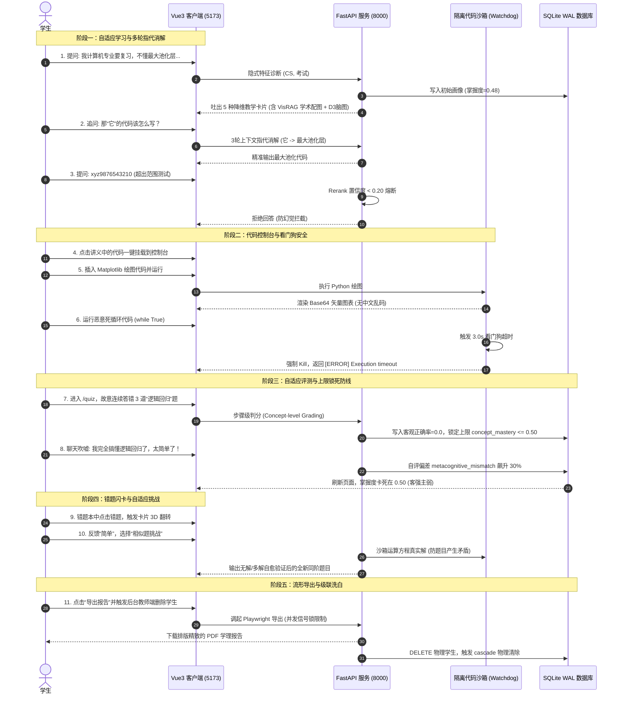

# 🧠 EduMatrix 智教矩阵 — 全系统高保真自适应闭环 E2E 通关测试流程

为了让您在赛题答辩、功能演示以及现场跑测时，能够**最快速、最直观、最大化地展示 EduMatrix 智教矩阵的全部核心黑科技**，我们对照 [edumatrix_competition_mapping.md](file:///d:/project-edumatrix/edumatrix-main/docs/edumatrix_competition_mapping.md) 与 [edumatrix_test_manual.md](file:///d:/project-edumatrix/edumatrix-main/docs/edumatrix_test_manual.md) 中的功能蓝图，梳理出了一套 **“全系统高保真自适应闭环 E2E 通关测试流程”**。

这套流程通过**一条主线故事**（学生诊断提问 $\rightarrow$ 二档比喻教学 $\rightarrow$ 多轮指代消解 $\rightarrow$ 沙箱代码实操 $\rightarrow$ 恶意代码熔断 $\rightarrow$ 错题步骤级判分 $\rightarrow$ 主客观画像上限锁死 $\rightarrow$ 3D Anki 闪卡与 SM-2 迭代 $\rightarrow$ 相似题自适应挑战 $\rightarrow$ Playwright 报告导出 $\rightarrow$ 数据库级联洗白），串联起了系统 **20+ 项核心指标与加分项**。

---

# 🧭 第一部分：核心功能与映射文件提取

在开始测试前，我们将系统已并网的十余项核心高价值功能与关联文件进行整理，以供答辩演示时参考：

| 核心维度 | 关键功能模块 | 涉及底层物理文件 | 核心技术卖点 |
| :--- | :--- | :--- | :--- |
| **自适应画像** | 10维学情诊断与指代消解 | [agent_swarm.py](file:///d:/project-edumatrix/edumatrix-main/agent_swarm.py) / [models.py](file:///d:/project-edumatrix/edumatrix-main/models.py) | 3轮滑动窗口口语指代消解；过滤垃圾特征白名单。 |
| **客强主弱** | 画像分客观锁死与遗忘衰减 | [models.py](file:///d:/project-edumatrix/edumatrix-main/models.py) | 连续做错卡死概念掌握上限 $\le 0.5$；艾宾浩斯时间遗忘衰减。 |
| **协同生成** | 1+3+5 并发资源生成与二档教学 | [agent_swarm.py](file:///d:/project-edumatrix/edumatrix-main/agent_swarm.py) / [learning_strategy.py](file:///d:/project-edumatrix/edumatrix-main/learning_strategy.py) | `asyncio.gather` 并发吐出5大教学资源；ZPD区间二档教学。 |
| **隔离沙箱** | 常驻 Docker 容器池与看门狗限制 | [code_exec_api.py](file:///d:/project-edumatrix/edumatrix-main/code_exec_api.py) | 3s watchdog 超时熔断；Matplotlib Base64 矢量绘图。 |
| **防幻觉防线** | 庞加莱流形散度校验与 RAG 熔断 | [manifold_alignment.py](file:///d:/project-edumatrix/edumatrix-main/manifold_alignment.py) / [rag_engine.py](file:///d:/project-edumatrix/edumatrix-main/rag_engine.py) | 低于 0.20 置信度熔断；散度超标时局部手术式自愈重算。 |
| **辅导与评估** | 细粒度步骤判分与错题 Anki 闪卡 | [quiz_api.py](file:///d:/project-edumatrix/edumatrix-main/quiz_api.py) / [models.py](file:///d:/project-edumatrix/edumatrix-main/models.py) | 步骤级断点判分；3D 翻转 Anki 与 SM-2 复习排期。 |
| **报告与导出** | 高并发安全 Playwright PDF 导出 | [report_api.py](file:///d:/project-edumatrix/edumatrix-main/report_api.py) | 信号并发锁限制并发数 $\le 3$；A4 规格矢量不模糊 PDF 下载。 |

---

# 🏆 第二部分：全系统 E2E 闭环通关测试流程

> [!NOTE]
> 请按以下 5 大阶段、共 11 个步骤依次执行演示，可达成“一次操作，通关测试 20+ 个核心功能”的极高性价比展示效果。



---

## 阶段一：自适应对话与多轮指代消解

### 步骤 1：口语化画像隐式诊断与二档教学启动
*   **操作**：登录前端 `/chat`，输入提问：
    > *“我是计算机专业的，期末要考机器学习。我对最大池化层不是很理解，感觉太复杂了，希望能用直观的图和例子讲讲。”*
*   **校验点**：
    1.  **特征捕获**：观察控制台日志或右侧画像大盘。`ProfileProbeAgent` 精准捕获到专业 `计算机专业`，目标 `期末复习`，薄弱点 `最大池化`，情绪 `挫败感上升`。
    2.  **二档教学-降维解释**：因为对“最大池化”初始掌握度底，系统自动触发 **SIMPLIFIED_MODE（降维解释）**。大模型讲义文字以生活比喻为主（“手电筒光斑提取”），不包含偏导矩阵。
    3.  **多模态配图并网**：讲义中成功渲染出一张来自 `data/patches/pooling_2x2.png` 的学术概念结构图，页面无 404 图片挂起。
    4.  **D3.js 高保真思维导图**：左侧底部渲染出 D3 折叠脑图，Root 呈紫色，一二级分支呈蓝绿，连线使用源头气泡更深一级的颜色，节点文本包含数学符号不截断。

### 步骤 2：多轮上下文指代消解校验
*   **操作**：等 AI 吐字完毕后，紧接着输入追问：
    > *“那它的代码该怎么写？”*
*   **校验点**：
    *   **指代消解 (Coreference)**：查看终端后端日志，消解器成功把代词“它”映射替换为“最大池化层”。后台数据库没有建立一个名为“它”的垃圾概念节点，而是把提取的特征加权写入了“最大池化层”的知识追踪中。

### 步骤 3：超范围低置信度防幻觉熔断
*   **操作**：输入一段乱码或者垃圾词：
    > *“给我说说 xyz9876543210 吧。”*
*   **校验点**：
    *   **防幻觉熔断**：后端判定非 ML 学科进行降级，且 Rerank 证据得分低于 `0.20` 阈值，直接熔断大模型输出，返回统一兜底拒答话术：*“抱歉，系统在知识库中未检索到与您提问相关的充足高置信度证据...”*。

---

## 阶段二：隔离代码沙箱与看门狗安全

### 步骤 4：代码一键挂载到控制台
*   **操作**：在步骤 1 生成的代码卡片底部，点击“挂载至沙箱”或者直接点击编辑器，代码自动填充到左侧「沙箱控制台」中。

### 步骤 5：Matplotlib UTF-8 矢量图渲染
*   **操作**：在编辑器中插入包含中文标题的绘图代码并运行：
    ```python
    import matplotlib.pyplot as plt
    plt.plot([1, 2, 3], [2, 4, 8])
    plt.title("最大池化验证") # 包含中文
    plt.savefig("my_plot.png")
    ```
*   **校验点**：
    *   运行并在 1.0s 内输出控制台日志，且下方渲染出 Base64 格式的折线图。图上的中文标题“最大池化验证”无豆腐块和乱码。

### 步骤 6：死循环恶意劫持超时熔断
*   **操作**：输入死循环并提交：
    ```python
    import time
    while True:
        time.sleep(0.01)
    ```
*   **校验点**：
    *   **超时熔断**：由于看门狗的存在，沙箱在 `3.0s` 整触发 `TimeoutError` 强制 kill 进程释放 CPU 占用率，控制台打印出：`[ERROR] Execution timeout`。

---

## 阶段三：自适应评测与客强主弱画像锁死

### 步骤 7：客观答题连错触发上限锁死
*   **操作**：进入 `/quiz` 自适应测验页面，请求出 3 道“**逻辑回归**”测验题，并全部答错。
*   **校验点**：
    *   **步骤级断点判分**：系统展示每一步答题的细粒度反馈（哪里符号写错了、哪里公式代入有误），并将“逻辑回归”作为高紧迫度错题写入 `wrong_questions`。
    *   数据库检测到最近 3 次答题正确率 $< 0.6$。

### 步骤 8：主观自信发言冲突，画像强行拦截
*   **操作**：返回 `/chat` 面板，强行发送自信话术：
    > *“我觉得我已经完全掌握逻辑回归了，我简直是个天才，它对我太简单了，不需要安排复习。”*
*   **校验点**：
    *   **客强主弱拦截**：进入“系统画像”面板，查看“逻辑回归”掌握度。
    *   **预期结果**：尽管学生口头极其自信，但客观答错 3 题的信号生效，掌握度上限被强制封锁在 `0.5` 以下。自评偏差（`metacognitive_mismatch`）发生跃升，雷达图上的“元认知自我调节”维度发生缩水（客强主弱防御成功）。

---

## 阶段四：错题闪卡 3D 翻转与相似题防矛盾校验

### 步骤 9：Anki 3D 闪卡翻转与 SM-2 排期
*   **操作**：前往“错题本”，点击刚才做错的逻辑回归错题卡片，对其点击翻面。
*   **校验点**：
    *   卡片以炫酷的 3D css 翻转翻回背面，展示由系统结合艾宾浩斯公式制成的 Anki 记忆卡（正面提问，背面解题公式/苏格拉底解析）。点击下方“简单”按钮，复习日历中的复习时间发生增量向后排期。

### 步骤 10：同阶错题相似题防矛盾自愈挑战
*   **操作**：点击卡片底部的“相似题挑战”。
*   **校验点**：
    *   **沙箱方程求解校验**：后端调用 `AssessorAgent` 拟合新参数，将随机变量传入 `SandboxEvaluator` 运算其解。大模型在 1.5s 内给出一道数值全新但难度同阶的“逻辑回归”选择题，因沙箱代码提前代入校验，四个选项中**有且仅有**一个唯一非冲突的正确解，无解析死锁。

---

## 阶段五：报告导出与多租户级联物理洗白

### 步骤 11：Playwright PDF 一键导出与教师端级联物理删除
*   **操作**：
    1.  在画像看板右上角点击“**导出诊断报告**”。
    2.  模拟教师登录后台 `/api/teacher` 或在测试用例中将本学生 profile 删除。
*   **校验点**：
    1.  **PDF 导出**：后端基于全局单例 `BrowserPool` 并发锁（限制最大并发数 $\le 3$）调用 Playwright headless 浏览器，成功无白屏下载矢量的 A4 学情报告 PDF，图表、Mermaid 脑图、KaTeX 复杂公式显示完整且无排版模糊。
    2.  **级联物理删除**：通过数据库审计，确认该学生记录从 `student_profiles` 表被删除时，其关联的 `notes` (笔记表)、`review_plans` (复习计划表)、`wrong_questions` (错题表) 中的所有对应行被 `ondelete="CASCADE"` 级联触发彻底擦除干净，不留任何垃圾碎片。
