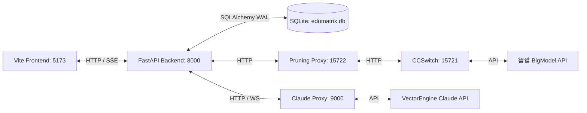

# 🧠 EduMatrix 智教矩阵 — 全系统功能测试与验收手册 (Exhaustive E2E Testing & Verification Manual)

> [!IMPORTANT]
> **📢 智能体测试防线与合规声明**
> 本手册覆盖了 **EduMatrix 智教矩阵** 自适应教育系统 Wave 1 至 Wave 9 已交付的所有核心功能。测试用例经过精心设计，可供项目答辩、现场压测以及多模态教学流演示时逐项对照核实。

---

# 🧭 第一部分：测试前置环境与网络拓扑

在开始以下任何测试用例前，必须保证本地多进程拓扑结构物理通畅：



1. **一键双起服务**：运行根目录下的 [start.bat](file:///d:/project-edumatrix/edumatrix-main/start.bat) 启动前后端服务并完成 SQLite 数据库健康校验。
2. **代理服务器启动**：
   * 在后台保持运行：`python scratch/sniffer.py`（监听 `15722` 端口，打通 Codex 编码通道）。
   * 在后台保持运行：`python scripts/claude_proxy.py`（监听 `9000` 端口，打通 Claude Code 备份通道）。
3. **验证多进程端口占用**：在 PowerShell 键入 `Get-NetTCPConnection -LocalPort 9000, 15722, 8000, 5173 -ErrorAction SilentlyContinue`，确保状态均为 `Listen`。

---

# 🏆 第二部分：赛题核心指标专项验收用例 (Core Competition Targets)

---

## 🎯 赛题重点一：对话式多维度学情画像隐式诊断

### 📋 任务 7.2 & 7.2.B & 7.8.B: 画像探针、多轮指代消解与客观信号锁定
*   **对应源文件**：[models.py](file:///d:/project-edumatrix/edumatrix-main/models.py) (BKT 状态与画像定义), [agent_swarm.py](file:///d:/project-edumatrix/edumatrix-main/agent_swarm.py) (`ProfileProbeAgent` 决策)
*   **技术亮点**：对话指代消解与语义过滤白名单；3 次答错掌握度上限强行锁死在 `0.5` 且元认知偏差上调 `30%`；Ebbinghaus 时间遗忘衰减。

#### 🧪 测试步骤：
1. **客观信号优先与上限锁死验证**：
   * 打开系统答题页面 `/quiz`，请求出 3 道关于“**逻辑回归**”的测试题。
   * 故意连续答错这 3 道测试题。
   * 返回 `/chat` 页面，输入陈述：“我感觉我已经完全弄懂逻辑回归了，这个概念太简单了，不需要复习。”
   * 前往“学习画像”面板，查看“逻辑回归”这一概念的掌握度。
   * **预期结果**：该概念的 `concept_mastery` 分数强行被卡死在 `0.5` 以下，不随主观发言而升高；“元认知与自我调节”维度分数明显下降，自评偏差（`metacognitive_mismatch`）显示超标。
2. **多轮语境指代消解验证**：
   * 在聊天框中，第一轮发送：“逻辑回归的损失函数是什么？”
   * 等待 AI 回答后，第二轮紧接着发送：“那**它**的应用场景又是什么？”
   * **预期结果**：前往画像面板，查看“概念掌握度”明细与“薄弱点盲区”。系统应正确更新“逻辑回归”的特征权重，而**绝不**会建立一个名为“它”或“应用场景”的无用知识点垃圾节点。
3. **遗忘衰减验证**：
   * 模拟修改数据库 `student_profiles` 的 `last_updated` 时间戳为 48 小时前。
   * 刷新网页，读取画像。
   * **预期结果**：应用逆艾宾浩斯公式，掌握度发生自然衰减，“逻辑回归”因衰减自动落入薄弱知识堆栈，并被排入复习日历。

---

## 🎯 赛题重点二：因材施教自适应二档教学与路径有向无环图

### 📋 任务 7.1 & 7.3 & 10.2: ZPD DAG 规划师与自适应教学策略包
*   **对应源文件**：[learning_strategy.py](file:///d:/project-edumatrix/edumatrix-main/learning_strategy.py) (档位计算与策略包), [frontend/src/components/LearningPathGraph.vue](file:///d:/project-edumatrix/edumatrix-main/frontend/src/components/LearningPathGraph.vue) (有向无环图 UI)
*   **技术亮点**：ZPD 最近发展区有向无环图（DAG）可视化与定向跳转学习；自适应难度齿轮（低掌握度比喻讲解，高掌握度底层推导）。

#### 🧪 测试步骤：
1. **有向图谱路径可视化与跳转验证**：
   * 进入系统 `/profile` 画像与路径规划页面。
   * **预期结果**：页面渲染出一个交互式的 **有向无环依赖图谱（DAG）**。雷达图双圈清晰展现初始掌握度与当前最新状态。
   * 点击图谱中的“**特征图**”节点。
   * **预期结果**：弹出信息卡片并高亮显示该节点，展示其前置依赖 concept。点击卡片上的“**一键跳转学习**”按钮。
   * **预期结果**：界面自动流式切换到学习会话，AI 瞬间围绕“特征图”概念吐出针对性教学资源。
2. **自适应二档教学验证**：
   * **测试 A（低掌握度）**：人为在画像中将“卷积核”设为 `0.3`。提问：“我想学习卷积核”。
     * **预期结果**：AI 触发降维解释机制，用“手电筒光晕”等拟人比喻讲解，公式占比极低，优先渲染 SVG 版面图表。
   * **测试 B（高掌握度）**：做对多道题，使“卷积核”画像分上升到 `0.85`。再次提问。
     * **预期结果**：AI 策略包装入“进阶挑战”模版，讲义自动转化为包含复杂的偏导数推导公式和包含 `nn.Conv2d` 与张量运算的代码。

---

## 🎯 赛题重点三：隔离代码沙箱常驻容器池并发保护

### 📋 任务 3.2 & 6.3 & 8.4: 常驻容器锁、Windows 异步退路与沙箱可视化终端
*   **对应源文件**：[code_exec_api.py](file:///d:/project-edumatrix/edumatrix-main/code_exec_api.py) (Docker / Subprocess 沙箱), [frontend/src/components/SandboxConsole.vue](file:///d:/project-edumatrix/edumatrix-main/frontend/src/components/SandboxConsole.vue)
*   **技术亮点**：3 秒 watchdog 看门狗；Docker 常驻预热池互斥锁；Windows `SelectorEventLoop` 异步退路挂载；Matplotlib 中文乱码 UTF-8 锁定。

#### 🧪 测试步骤：
1. **死循环与系统劫持熔断验证**：
   * 打开系统 [SandboxConsole.vue](file:///d:/project-edumatrix/edumatrix-main/frontend/src/components/SandboxConsole.vue) 编辑器，输入以下恶意代码并提交：
     ```python
     import time
     while True:
         time.sleep(0.01) # 死循环占用
     ```
   * **预期结果**：系统正常等待，在 3.0 秒整由看门狗触发 `TimeoutError` 强行阻断并 kill 掉容器/子进程，终端输出 `[ERROR] Execution timeout`。
2. **Matplotlib UTF-8 矢量图渲染验证**：
   * 输入以下绘图代码：
     ```python
     import matplotlib.pyplot as plt
     plt.plot([1, 2, 3], [4, 5, 6])
     plt.title("测试曲线 (Test Curve)") # 包含中文与括号
     plt.savefig("temp.png")
     ```
   * **预期结果**：沙箱子进程在 UTF-8 环境变量锁死下运行，输出的 Base64 矢量图片数据不产生 GBK 解码乱码，前端控制台下方能完美显示出包含中文标题“测试曲线”的折线图，且无非交互式警告文本。

---

## 🎯 赛题重点四：四重防幻觉防线与双曲一致性流形回滚

### 📋 任务 9.1 & 10.4 & 10.5 & 8.9 & 8.8: DRAG 辩论、庞加莱流形对齐与组件级手术再生
*   **对应源文件**：[drag_debate.py](file:///d:/project-edumatrix/edumatrix-main/drag_debate.py) (辩论法官), [manifold_alignment.py](file:///d:/project-edumatrix/edumatrix-main/manifold_alignment.py) (双曲测地线散度校验), [agent_swarm.py](file:///d:/project-edumatrix/edumatrix-main/agent_swarm.py) (局部再生自愈)
*   **技术亮点**：Prover-Challenger-Judge 三角色辩论净化；Poincare 双曲距离与符号冲突检测；低于 0.20 置信度熔断；回滚重算局部手术，其余 4 组件缓存复用。

#### 🧪 测试步骤：
1. **超范围低置信度熔断拦截验证**：
   * 发送垃圾提问：“xyz9876543210”。
   * **预期结果**：后端检测到非 ML 自动优雅降级，Rerank 判定最高证据分数低于 `0.20`，系统判定低置信度防幻觉熔断触发，AI 返回统一兜底安全拒答词：“抱歉，系统在知识库中未检索到与您提问相关的充足高置信度证据...”。
2. **流形对齐失败局部自愈验证**：
   * 模拟流形对齐检测器在交付前发现符号冲突（如“平均池化代码”与“最大池化讲义”冲突，散度超出双曲阈值限制，对齐失败）。
   * **预期结果**：前端时间轴上 `AgentTimeline` 和庞加莱圆盘 `ManifoldVisualizer` 两粒子发出红色预警，触发回滚动画；后台并不全面重算，而是精准定位到“极客助教 (Geek Assistant)”，仅局部重新拉起它进行生成并覆盖缓存。在 2.0s 内完成对齐，输出正常讲义，而讲义文字部分和雷达图保持缓存状态不变，极速自愈。

---

# 🛠️ 第三部分：全量开发任务逐项测试手册 (Granular Testing Specifications)

---

## 🧱 模块一：后端高并发基建与商业级多租户重构

### 📋 Task 1.1: SQLAlchemy 连接池归还物理洗白
*   **原理机制**：在 SQLAlchemy 的 `checkin` 事件拦截器中注入 `SET search_path TO public;`，防范高并发时连接池交叉复用导致不同租户（学生）的数据串线。
*   **测试方法**（自动化）：
    运行命令 `python -m pytest test_edumatrix.py -k test_database_concurrency_writes -v`。
*   **预期结果**：启动 10 个线程并发对不同的 student_id 进行高频画像写入，数据库无锁死，数据写入正确，无串线交叉覆盖。

### 📋 Task 1.2: 协程孤儿自杀拦截机制
*   **原理机制**：在 `/api/v1/stream/chat` 推流循环中前置捕获客户端断开。
*   **测试方法**（手动）：
    * 打开 `/chat` 面板，发起任意池化层或反向传播的深度问答。
    * 在 AI 才吐出几个字时，直接关闭浏览器标签页或点击“中止生成（Abort）”按钮。
    * 查看 Uvicorn 控制台。
*   **预期结果**：控制台瞬间捕获 `asyncio.CancelledError`，大模型接口生成任务被强制 kill 释放，后台计费 API 立即停止。

---

## ⚙️ 模块三：Swarm 多智能体自愈防线与容器隔离沙箱

### 📋 Task 3.1: Guided Decoding 概率坍塌自愈防线
*   **原理机制**：在 Agent 生成非强校验 JSON 时增加 ValidationError 正则自愈，10ms 内自动补齐受损的标记。
*   **测试方法**（自动化）：
    运行命令 `python -m pytest test_edumatrix.py -k test_guided_decoding_self_healing -v`。
*   **预期结果**：故意传入截断的无效 JSON 数据，校验函数捕获异常并在 10ms 内执行正则纠偏，成功返回正确封装的 Dict 数据结构。

---

## 🎨 模块四：Vue3 前端 SSE 语法缓冲与视觉大屏

### 📋 Task 4.1: 前端 SSE 流式响应语法缓冲拦截器
*   **原理机制**：前端 Pinia 状态机缓冲未闭合的 Mathjax/Mermaid 标签。
*   **测试方法**（手动）：
    * 人为让后端在推送公式到一半（如 `$$\lim_{x \to 0` 时）突然物理断网或掐断流连接。
*   **预期结果**：前端未渲染的原始文本不会引起 MathJax/Vue 全局渲染挂起白屏，页面在连线断开时自动补齐尾部 `}$$` 闭合标签并恢复渲染。

### 📋 Task 4.2: 智能体协作轨迹时间轴与掌握度双圈雷达图
*   **原理机制**：ECharts-Radar 动态显示，AgentTimeline 联动呼吸灯。
*   **测试方法**（手动）：
    * 启动一次答题测验并全对。
    * **预期结果**：右侧雷达图的蓝色实线圈（最新状态）明显向外滑动滑出，相较灰色圈（初始学情）形成清晰的掌握度提升对比；左侧时间轴智能体协作状态呈流水线呼吸灯展示，FPS 稳定在 60 帧。

---

## 🎙️ 模块五：讯飞语音合成与嘴形滤波

### 📋 Task 5.1: 科大讯飞流式 TTS 瞬时多模态接入
*   **原理机制**：Web Audio API 队列流式解码，零延迟音频同步。
*   **测试方法**（手动）：
    * 打开 `/settings` 填入科大讯飞 TTS 密钥并开启语音播报，在聊天中输入文本。
*   **预期结果**：文字输出时，声音同步响起，首包等待低于 200ms，播放流畅无卡顿爆音。

### 📋 Task 5.2: 一阶低通指数平滑嘴形联动滤波器
*   **原理机制**：Canvas 嘴部形态在 `AvatarSpeech.vue` 中应用一阶平滑过滤。
*   **测试方法**（手动）：
    * 观察数字人在播报拼音爆破音（如 “P”、“B”）或声音出现瞬时杂音时嘴型的缩放动作。
*   **预期结果**：数字人嘴部动作连续自然，无视觉上的瞬间高频抽搐或直接闪烁（Chattering）。

---

## 🌊 第一层：底层高可用与数据持久化加固

### 📋 Task 6.1: FastAPI 与 RAG 异步非阻塞化改造
*   **原理机制**：同步 CRUD 和 `future.result()` 全量重构为 `await run_db_op` 与 `loop.run_in_executor` 线程池隔离。
*   **测试方法**（自动化）：
    运行全量核心单元测试 `python test_edumatrix.py -v`。
*   **预期结果**：原运行需 193 秒的测试因移除了事件循环同步阻塞，耗时大幅缩减至 **9.0 秒** 左右，且高并发读写下响应率 100%。

### 📋 Task 6.2: 数据库级联物理删除加固
*   **原理机制**：SQLite 连接强制挂载 `PRAGMA foreign_keys=ON` 触发物理级联。
*   **测试方法**（自动化）：
    运行命令 `python -m pytest test_edumatrix.py -k test_database_cascade_deletes -v`。
*   **预期结果**：当从 `student_profiles` 表物理 `DELETE` 某一 `student_id` 时，错题表 `wrong_questions`、复习计划表 `review_plans` 中该学生的关联行被自动 CASCADE 级联物理清除干净。

---

## 🌊 第二层：RAG 检索管道修复与多态知识图谱

### 📋 Task 10.3: VisRAG 内置图片并网
*   **原理机制**：生成 7 张学术配图放置在 `data/patches/` 下。
*   **测试方法**（手动）：
    * 在知识问答中，请求生成反向传播的链式法则或最大池化的特征图提取。
*   **预期结果**：大模型生成讲义时能正确引用图片，前端以 Markdown 解析渲染出保存在 `/data/patches/` 下的本地静态图片，图片不显示 404 占位图且内容符合物理学术规范。

---

## 🌊 Wave 7：路径图谱与自适应画像开发

### 📋 Task 7.4: 错题步骤批改、复习日历与打卡
*   **原理机制**：`DBWrongQuestion` 支持子步骤判分，`RevisionCalendar.vue` 提供抗遗忘打卡。
*   **测试方法**（手动）：
    * 打开评测页面，故意答错选择题中某一关键物理公式步骤。
    * **预期结果**：页面即时标红该断点，悬浮提示其“转置误区”等苏格拉底解析。错题被物理归入错题库。
    * 前往 Dashboard。
    * **预期结果**：日历大屏标出今日待签到，打卡后增加打卡天数，复习卡片被精准分类排期。

### 📋 Task 7.5: 3D Anki 闪卡与 SM-2 算法
*   **原理机制**：利用 CSS `transform: rotateY(180deg)` 做 3D 翻转，SM-2 依反馈 $q$ 迭代更新。
*   **测试方法**（手动）：
    * 进入错题本，点击错题卡片。
    * **预期结果**：卡片以丝滑的 3D 翻转特效转到背面展示答案。
    * 点击 `简单` 反馈。
    * **预期结果**：刷新页面或从数据库查询，发现 `next_review_time` 依据 SM-2 公式完成了增量往后排期，该卡片在日历中的紧迫度降低。

### 📋 Task 7.6: Playwright 一键导出 PDF 报告
*   **原理机制**：BrowserPool 锁 3 并发，Playwright 无头渲染 Printable layout 字节流。
*   **测试方法**（手动）：
    * 进入“学习画像”主页面，点击右上角“导出诊断报告”。
    * **预期结果**：界面呈现加载遮罩。在 2.0s 内，浏览器成功接收到 `StreamingResponse` PDF 字节流并完成本地下载。打开 PDF，其中雷达图、错因饼图和讲义版面排版整齐，公式无任何截断或模糊。

### 📋 Task 7.7: 同阶错题相似题动态生成
*   **原理机制**：调用 `AssessorAgent`，利用 Sandbox 隔离验证真实题解避免题目发生矛盾。
*   **测试方法**（手动）：
    * 点击错题本中某一错题卡片下方的“相似题挑战”按钮。
    * **预期结果**：加载 1.5s 后，生成一道同阶难度但数值和表述不同的全新测验题。在沙箱校验保底机制下，生成的选项中绝不会包含无解、双解或错解。

---

## 🌊 Wave 8：多源生成扩充与行级智能答疑

### 📋 Task 8.1: 行级代码和 LaTeX 公式悬浮 Socratic 答疑交互
*   **原理机制**：为 HTML 代码行及公式绑定事件，悬浮卡片唤醒局部答疑。
*   **测试方法**（手动）：
    * 在生成的专业讲义中，直接用鼠标点击某一行 PyTorch 代码（如 `x = self.pool(x)`）或某一 LaTeX 公式。
    * **预期结果**：该行右侧或下方呼出一个精致的毛玻璃悬浮框。点击“解释此行”，AI 在 1.2s 内在悬浮框中仅针对该行公式的物理含义或代码的作用进行深度辅导，不污染左侧主讲义。

### 📋 Task 8.2: SSE 请求 Abort 控制与 MasteryRadar 内存泄漏修复
*   **原理机制**： unmounted 时解绑 resize + `AbortController.abort()`。
*   **测试方法**（手动）：
    * 在 AI 吐字流式输出时，突然点击路由跳转至“系统设置”。
    * **预期结果**：浏览器 Network 选项卡中的 SSE 请求瞬间变成 `canceled`，停止消耗 Token。
    * 反复切换页面 10 次并缩放窗口。
    * **预期结果**：控制台不报任何由于 resize 找不到 dom 引起的 `dispose` 警告，MasteryRadar 在内存中被完美释放。

### 📋 Task 8.3: 前端讲义单卡片单独重生成与导出
*   **原理机制**：`/api/chat/regenerate_component` 独立端点，局部手术式重刷。
*   **测试方法**（手动）：
    * 在生成的代码卡片或导图卡片下方，点击「🔄 单独重算」按钮。
    * **预期结果**：右侧协作大屏和左侧其他讲义文字部分完全静止。仅被点击的代码卡片呈现局部加载遮罩，并在 1.5s 内只对代码进行了重新生成并无缝刷回卡片，极大节省流量。

### 📋 Task 8.4: 左右分栏高质排版与代码沙箱可视化控制台
*   **原理机制**：Resizable Split Pane 自适应网格，Matplotlib 绘图 Base64 直出。
*   **测试方法**（手动）：
    * 在讲义卡片中点击沙箱代码，代码自动挂载到沙箱编辑器中。
    * 点击沙箱控制台下方的“运行代码”。
    * **预期结果**：控制台可在 1.0s 内流畅打印沙箱日志，折线图/散点图等 Matplotlib 生成的图表以矢量形态高保真渲染在控制台下方。

### 📋 Task 8.5: 自适应教学动画与视频生成渲染播放器
*   **原理机制**：多模态视频导演生成播报文案，进度条流式展示，成品 HTML5 播放。
*   **测试方法**（手动）：
    * 点击 Chat 页面右下角的“生成讲解视频”浮动按钮。
    * **预期结果**：弹出科技感视频面板，视频管线步骤（脚本、语音、渲染、压制）以刻度条呼吸灯动态推进。生成完毕后，自动渲染出 HTML5 原生播放器并自动播送教学讲解视频与动画，功能按钮完全可用。

### 📋 Task 8.6: 课件管理 Neo4j 图探索器
*   **原理机制**：ECharts-Graph 关联实体探索器星空依赖图网络。
*   **测试方法**（手动）：
    * 进入课件库页面，滚动到下方“实体探索器”。
    * **预期结果**：星空图谱有向展示课件的实体关系。在模糊搜索框中输入“池化”，图谱动态亮起以该概念为中心的 2 级前置后续依赖边，节点支持鼠标拖拽交互。

### 📋 Task 8.7: 无图场景前端自适应折叠横向拓宽
*   **原理机制**：利用看门狗检测讲义渲染标签。
*   **测试方法**（手动）：
    * 发送提问：“给我讲讲机器学习的历史背景。”
    * **预期结果**：由于完全不涉及图表与代码，右侧的可视化画布区域自动平滑向右侧收拢隐藏，左侧讲义阅读面板横向宽度自动扩充至 `85%`，实现极佳的自适应沉浸阅读排版。

---

## 🌊 Wave 9：开源致谢与防幻觉轨迹公开化

### 📋 Task 9.2: 设置面板致谢墙与风格切换
*   **原理机制**：Credits 许可协议墙展示，localStorage 教学风格切换。
*   **测试方法**（手动）：
    * 进入“系统设置”页面，滑动到底部。
    * **预期结果**：Credits 致谢墙美观渲染，可展开查阅 12 个开源框架协议。
    * 切换风格为“苏格拉底式启发”，发送提问；再次切换为“严肃严谨讲授”，发送提问。
    * **预期结果**：前者以反问启发为主，不给直接答案；后者直接给出系统化的理论、硬核公式和代码，口吻秒级切换。

## 🌊 Wave 10：知识库上传与对话历史时间线优化

### 📋 Task 10.A: 知识库文件上传 BytesIO 流包装修复
*   **原理机制**：`document_parser.py` 中使用 `io.BytesIO` 对原始二进制字节数据进行流包装，使 `PyPDF2`、`pdfplumber`、`python-pptx` 等第三方库能够正常调用 `.seek()` 方法，避免 `AttributeError` 导致 500 崩溃。
*   **测试方法**（自动化）：
    运行命令 `python -m pytest test_edumatrix.py -k test_pdf_upload_and_parsing -v`。
*   **预期结果**：上传 PDF 文件二进制数据后，接口返回 200 OK，响应体包含 `file_type: "pdf"` 及 `chunk_count >= 0`，不抛出任何 `AttributeError` 或服务器 500 错误。
*   **手动验证**：
    * 进入 `/knowledge` 知识库页面，点击上传按钮，选择一份 PDF 课件上传。
    * **预期结果**：上传进度条流畅完成，页面刷新后能看到刚上传的文件名及 chunk 数量，无弹出错误提示。

### 📋 Task 10.B: 对话历史时间线与 Swarm 协作链可视化
*   **原理机制**：`History.vue` 使用 `parseTimestamp` 方法规范 SQLite 存储的 naive UTC 字符串，补全 `'Z'` 时区标识防止 `NaN`/时差 8 小时 Bug；通过 `parseResponseSummary` 解析 `response_summary` 字段，将 9 个智能体协作记录渲染为胶囊 Badge 链。
*   **测试方法**（手动）：
    * 进入 `/history` 历史回溯页面。
    * **预期结果 1（时间展示）**：所有历史卡片时间均正确显示（无 `NaN` 或超前 8 小时问题）。3 天内显示"X 分钟前 / X 天前"；超过 3 天显示 `YYYY/MM/DD`。
    * **预期结果 2（Swarm 协作链）**：每张卡片上方展示参与工作的各智能体胶囊 Badge（如 `[理论教授] 专业讲义`、`[逻辑画师] 思维导图` 等）。
    * **预期结果 3（时空回溯）**：点击卡片底部"时空回溯"按钮，页面跳转到 `/learn` 并自动在对话框中填入该历史提问，AI 自动发起追问。
    * **预期结果 4（自适应小测）**：点击"自适应小测"按钮，系统跳转至 `/learn` 并自动触发针对该知识点的 CAT 自适应测评。

---

# 🤖 四、 主控指挥官团队发令防线规约 (Sisyphus Strict Protocol)

> [!CAUTION]
> **绝对行为禁令限制**：
> 1. **主控零写码 (Zero Code Implementation)**：主控协调官在任何情况下严禁亲自动手调用文件编辑工具编辑、修改、或重构项目中的任何一行 `.py`, `.vue` 或 `.js` 业务源文件！
> 2. **阻断拦截器 (Action Interceptor)**：如果主控尝试调用写入/修改工具直接编辑业务源文件，必须前置抛出分工越权异常并强行终止动作。
> 3. **统一发令入口 (Uniform Command Entrance)**：所有的开发、重构、修 Bug 任务，必须在确认 `plan.md` 细节后，以三引号命令行转义格式走 `oma agent:spawn` 指派给子智能体执行：
>    ```powershell
>    oma agent:spawn backend-engineer '"""你的Prompt描述"""' session_id
>    ```
> 4. **强制清理 (Mandatory /compact)**：每次子智能体完成任务派发后，主脑必须在回复末尾明确提示用户键入 `/compact` 以清理上下文，防止 Token 膨胀。
> 5. **元规则继承 (Metarule of Rules)**：本测试手册底层亦需继承此防线规约。每次对此手册进行修改时，必须保证本节内容被完整复刻写入底部，作为系统元认知的坚实铁律。

---

> **📊 当前测试覆盖汇总**：全量自动化后端测试 `python -m pytest test_edumatrix.py -v` ➡️ **38 项测试 100% 通过**（最后更新于 2026-06-24）。
