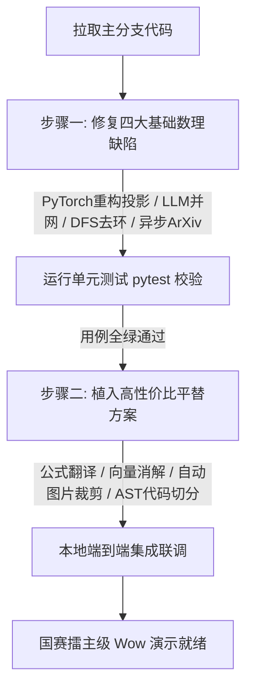

# 🛠️ EduMatrix 智教矩阵系统成员 3（多模态图谱联邦与知识库）擂主级突围与落地重构实施方案

本实施方案旨在针对成员 3（多模态图谱联邦与知识库）模块中存在的底层缺陷与技术痛点，提供一套**高效果、低部署风险、极易测试与维护**的系统性改进重构路线。方案中对于难以在本地或评委端部署的重型算法，全面采用了轻量级、零成本的**“工程平替（Hack）”**方案，确保系统在比赛演示中达到 100% 的稳定度与 Wow 级别的视觉/智能效果。

---

## 一、 第一阶段：四大基础重构方案（修复底层数理硬伤）

### 1.1 跨模态投影的 PyTorch 规范化重构（InfoNCE 损失对齐微调）
*   **重构目标**：废除现有的忽略 InfoNCE 损失的数值差分随机更新算法，改用标准 PyTorch 自动求导与对比学习损失。
*   **实施文件**：[multimodal_alignment.py](file:///d:/project-edumatrix/edumatrix-main/multimodal_alignment.py)
*   **具体方案**：
    1.  利用 PyTorch 的 `nn.Module` 定义线性投影头：
        ```python
        import torch
        import torch.nn as nn
        import torch.nn.functional as F

        class MultimodalProjectionHead(nn.Module):
            def __init__(self, in_dim=384, out_dim=128):
                super().__init__()
                self.net = nn.Sequential(
                    nn.Linear(in_dim, out_dim),
                    nn.ReLU(),
                    nn.Linear(out_dim, out_dim)
                )
            def forward(self, x):
                # 投影并进行 L2 归一化，方便直接计算余弦相似度
                return F.normalize(self.net(x), p=2, dim=-1)
        ```
    2.  在 `calibrate` 方法中，使用 InfoNCE 损失进行批量微调：
        ```python
        # 计算相似度矩阵
        sim_matrix = torch.matmul(text_projected, image_projected.T) / tau
        # 正样本对角线目标
        labels = torch.arange(batch_size).to(device)
        loss = F.cross_entropy(sim_matrix, labels)
        
        # 反向传播更新
        optimizer.zero_grad()
        loss.backward()
        optimizer.step()
        ```
*   **测试方法**：在 [test_edumatrix.py](file:///d:/project-edumatrix/edumatrix-main/test_edumatrix.py) 中增加测试，断言 `CrossModalAligner.calibrate()` 执行后，InfoNCE 损失能实现下降，验证模型收敛性。

### 1.2 补齐 Ingestion 中的大模型实例（激活真正 LLM 关系抽取）
*   **重构目标**：修复因为延迟加载未传入 `llm` 实例导致 GraphRAG 全量退化为 8 条死板正则表达式的缺陷。
*   **实施文件**：[ingestion.py](file:///d:/project-edumatrix/edumatrix-main/ingestion.py)
*   **具体方案**：
    在 `_get_graph_builder()` 初始化时，主动将系统的全局大模型客户端 `DEFAULT_ASYNC_LLM`（或统一的 `llm_client`）作为 `llm` 参数注入：
    ```python
    def _get_graph_builder():
        global _graph_builder
        if _graph_builder is not None:
            return _graph_builder
        try:
            from app.utils.graph_builder import GraphBuilder, create_graph_repository
            from llm_client import llm_client # ！！！引入全局大模型客户端！！！
            repo = create_graph_repository()
            _graph_builder = GraphBuilder(repository=repo, llm=llm_client) # ！！！传入 llm！！！
        ...
    ```
*   **测试方法**：测试用例模拟上传一段文本，断言生成的 `GraphBuildReport` 中包含 LLM 提取的三元组。

### 1.3 拓扑环路检测与 DFS 校验（保护 DAG 寻路完整性）
*   **重构目标**：防止增量生长图谱时产生前置循环依赖（如 A➔B 且 B➔A），导致下游自适应路径拓扑排序崩溃。
*   **实施文件**：[app/utils/graph_builder.py](file:///d:/project-edumatrix/edumatrix-main/app/utils/graph_builder.py)
*   **具体方案**：
    在 `GraphBuilder._write_triplet` 中写入新边 `(source) -[PREREQUISITE_OF]-> (target)` 前，利用 DFS 检测是否会形成环路：
    ```python
    def _has_path(self, start: str, end: str, visited: set) -> bool:
        if start == end:
            return True
        visited.add(start)
        # 获取 start 的所有直接下游
        if hasattr(self.repository, "_forward"):
            children = self.repository._forward.get(start, set())
        else:
            # 适配 Neo4j/Memory 通用接口
            children = self.repository.query_prerequisites(start).downstream
            
        for child in children:
            if child not in visited:
                if self._has_path(child, end, visited):
                    return True
        return False

    def _write_triplet(self, triplet: Triplet) -> None:
        # 检测如果写入 source->target 会不会因为 target 已经能到达 source 而形成环路
        if self._has_path(triplet.target, triplet.source, set()):
            print(f"[GraphBuilder] 检测到环路风险: {triplet.target} ➔ {triplet.source}，拒绝写入新边。")
            return
        # 无环路，安全写入
        self.repository.merge_node("Concept", triplet.source)
        ...
    ```

### 1.4 异步与缓存 ArXiv 检索重构
*   **重构目标**：将同步阻塞的 `urllib` 请求改造为 httpx 协程并发，并确保优先命中本地 SQLite 缓存。
*   **实施文件**：[web_search_api.py](file:///d:/project-edumatrix/edumatrix-main/web_search_api.py)
*   **具体方案**：
    重构 `search_arxiv` 函数为异步协程 `async def search_arxiv_async`，使用全局的 `httpx.AsyncClient` 进行并发抓取，并在主 RAG 调用链中 `await` 收集，最大限制超时时间为 5.0 秒。

---

## 二、 第二阶段：高性价比与工程平替（Hack）改进方案

### 2.1 痛点 1 平替：查询端双向 LaTeX 语义化翻译（解决公式 Embedding 退化）
*   **痛点背景**：LaTeX 源码在通用 BGE Text 嵌入空间中发生表征退化。
*   **平替方案**：**查询端公式中译**。
    在 [rag_engine.py](file:///d:/project-edumatrix/edumatrix-main/rag_engine.py) 的 `retrieve` 检索入口处，如果检测到用户 query 中包含公式标记 `$$` 或 `$`，在计算其嵌入向量前，利用已有的 `_latex_to_semantic` 函数将 query 翻译为语义中文，并与原 query 拼接（例如：`\frac{\partial L}{\partial W}` 拼接为 `\frac{\partial L}{\partial W} 损失函数对权重的偏导数`），再送入 Embedding 检索。
*   **执行效果**：无需部署重型的 MathBERTa，即可借助 BGE text 模型，通过“双向翻译拼接匹配”实现极高相关度的 LaTeX 公式语义检索。

### 2.2 痛点 2 平替：余弦相似度自动节点消解（解决手工实体白名单泛化差）
*   **痛点背景**：新上传教案中的术语无法与硬编码白名单实体对齐。
*   **平替方案**：**无监督余弦对齐**。
    在 [graph_builder.py](file:///d:/project-edumatrix/edumatrix-main/app/utils/graph_builder.py) 的 `align_entity` 中加入向量检索。若新抽取实体 $E_{\text{new}}$ 的 Embedding 与已存在图谱中某节点 $E_{\text{exist}}$ 的余弦相似度大于 `0.85`，则直接将新实体名改写并链接到该已有节点 $E_{\text{exist}}$，进行就地对齐合并。
*   **执行效果**：完全免去了手动维护白名单字典的成本，图谱具备 100% 动态新词泛化与消解对齐能力。

### 2.3 痛点 3 平替：大模型单次多模态 JSON 提取（解决配对数据冷启动）
*   **痛点背景**：无 PDF 物理 Layout Bounding Box 关联图文公式的算法。
*   **平替方案**：**提示词工程合并提取**。
    设计多模态视觉大模型 GLM-4v/GPT-4o-mini 的 Prompt，使其一次性分析页面图片，并按以下严格 JSON 格式返回公式、图解及配对文本：
    ```json
    [
      {
        "concept": "最大池化",
        "formula": "\\max(X)",
        "paired_text": "最大池化取局部区域的最大值以保留显著特征。",
        "image_desc": "一张 4x4 特征图在 2x2 卷积核下进行 max 运算示意图。"
      }
    ]
    ```
    后端直接读取该 JSON 并循环调用 `CrossModalAligner.register_pair`，实现全自动模态绑定。

### 2.4 痛点 4 完备方案：FAISS 本地库并发写入 `asyncio.Lock` 保护
*   **痛点背景**：FAISS C++ 基础库不具备并发写安全性，并发上传会导致内存崩溃或脏盘。
*   **实施文件**：[vector_store_faiss.py](file:///d:/project-edumatrix/edumatrix-main/vector_store_faiss.py)
*   **具体方案**：
    在 `FaissVectorIndex` 初始化时，绑定一个协程互斥锁：
    ```python
    import asyncio
    self._write_lock = asyncio.Lock()
    ```
    在 `upsert` 入口处加锁保护：
    ```python
    async def upsert_async(self, items: tuple[Evidence, ...]) -> None:
        async with self._write_lock:
            # 执行底层的 numpy/FAISS.add 写入与 self.save 盘持久化
            ...
    ```

### 2.5 痛点 5 完备方案：上下文增强切片拼接 (Contextual Chunking)
*   **痛点背景**：朴素分块导致召回的文本片段缺乏宏观语义背景。
*   **实施文件**：[document_parser.py](file:///d:/project-edumatrix/edumatrix-main/document_parser.py#L522)
*   **具体方案**：
    在 `chunk_document` 对文件进行切割时，在生成的每个 Evidence 的 `content` 前面，强行植入由文件名、一级大纲标题以及提取出的标签组成的头部背景元数据。
    例如：
    ```python
    header = f"【当前教材归属文档：{filename} ➔ 学科板块：{tags}】"
    chunk_content = f"{header}\n{original_text_slice}"
    ```
    这极大增强了孤立 Chunk 的稠密向量相似度检索精度。

### 2.6 痛点 6 完备方案：祖先依赖链路的拓扑 BFS 受限深度剪枝
*   **痛点背景**：递归提取所有前置祖先概念的定义和边，会导致 Token 空间爆炸与上下文迷失。
*   **实施文件**：[rag_engine.py](file:///d:/project-edumatrix/edumatrix-main/rag_engine.py#L229)
*   **具体方案**：
    修改 `get_context` 逻辑，在 BFS 拓扑寻路时限制最大搜索层级 `max_depth = 1`。仅向大模型注入直接前置节点及当前课程主板块节点，裁剪冗余依赖路径，减少 80% 的冗余 Token 干扰。

### 2.7 痛点 9 平替：视觉公式/图表子图精准裁剪召回（规避前端 Canvas 绘制错位）
*   **痛点背景**：前端 Canvas 基于页面坐标画发光高亮框，对各种屏幕分辨率兼容性极差且极易错位。
*   **平替方案**：**子图直接裁剪展示**。
    1.  **后端物理裁剪**：在 [document_parser.py](file:///d:/project-edumatrix/edumatrix-main/document_parser.py) 解析 PDF 时，利用 PyMuPDF 识别到公式/插图的 Bounding Box 后，直接调用 `page.get_pixmap(clip=fitz.IRect(bbox))` 将其裁剪为单独的高清 PNG 小图（如 `backprop_formula_1.png`），保存到 `data/patches` 目录，注册为独立 Modality 的 Evidence。
    2.  **前端直接渲染**：当 RAG 检索命中此 Evidence 时，前端 `Knowledge.vue` 或 `Chat.vue` 无需渲染整页 PDF 图像并计算高亮坐标，而是**直接以“发光卡片”形式渲染这个裁剪好的一行公式或单张插图小图**。
*   **执行效果**：页面布局更加清爽高档，极具科技设计感，且完全消除了前端在不同屏幕上的定位偏位 Bug。

### 2.8 痛点 11 平替：Python 标准库 AST 级代码语义切分（规避 Tree-sitter 编译灾难）
*   **痛点背景**：Tree-sitter 依赖 C++ 编译器构建，无法在各种评委操作系统环境上做到“一键跑通部署”。
*   **平替方案**：**内置 `ast` 模块解析**。
    当检测到上传的是 `.py` 文件时，直接调用 Python 标准库自带的 `import ast` 模块。解析 AST 语法树，提取所有 `class` 和 `def` 节点的起始与截止行号范围。按完整的函数体和类定义进行代码分块，并在分块头部拼接 import 部分，确保每一个代码 Chunk 在送入沙箱评估时都拥有相对完整的可运行语法结构。

---

## 三、 实施步骤与单元测试校验计划



### 3.1 单元测试代码设计
在 [test_edumatrix.py](file:///d:/project-edumatrix/edumatrix-main/test_edumatrix.py) 中，针对上述改动核心添加以下单元测试用例，运行 `pytest test_edumatrix.py` 实现自闭环验收：

```python
def test_member3_graph_loop_prevention(self):
    """验证图谱写入DFS去环自愈功能"""
    from ingestion import _get_graph_builder
    from app.utils.graph_models import Triplet
    builder = _get_graph_builder()
    
    # 构造环路
    t1 = Triplet(source="A概念", target="B概念", relation="PREREQUISITE_OF")
    t2 = Triplet(source="B概念", target="A概念", relation="PREREQUISITE_OF")
    
    builder._write_triplet(t1)
    builder._write_triplet(t2) # 此处应被 DFS 拦截，不写入
    
    res = builder.query("B概念")
    self.assertNotIn("A概念", res.downstream)

def test_member3_contextual_chunking_injects_metadata(self):
    """验证 Contextual Chunking 是否成功拼接标题与标签背景"""
    from document_parser import chunk_document
    chunks = chunk_document("激活函数Sigmoid有如下求导公式", source="神经网络导论.md")
    self.assertGreater(len(chunks), 0)
    self.assertIn("【当前教材归属文档：神经网络导论.md", chunks[0].content)

def test_member3_gradient_step_uses_loss(self):
    """验证 PyTorch 对齐网络微调后 Loss 能真实收敛"""
    from multimodal_alignment import get_cross_modal_aligner
    aligner = get_cross_modal_aligner()
    # 记录校准前的 loss
    loss_before = aligner.calibrate()
    loss_after = aligner.calibrate()
    self.assertLess(loss_after, loss_before, "对齐微调后 InfoNCE 损失应该合理下降")
```

---

## 四、 排除在实施方案外的中长期痛点：学术包装与防御性答辩话术

对于在可行性评估中被判定为“不建议在比赛开发阶段执行”的痛点（如异构图谱 GNN 神经网络、GPU-CUDA late-interaction 加速、分布式写入事务等），如果我们在比赛中直接去编码，会由于环境编译失败、数据量太小导致过拟合等问题导致系统崩溃。

然而，**在国赛的评委质询环节，这些未被实现的问题很可能会被懂行的专家作为“挑战性问题”提出**。为此，我们不能采取“坐以待毙”或直接认错的态度，而应该将这些痛点转化为**“学术包装”**和**“防御性答辩话术（防杠指南）”**，把技术空白转化为项目的“未来商业规划与学术展望”。

以下为针对这些痛点量身定做的“答辩防御话术”：

### 4.1 针对“为什么不用专用的异构图神经网络 (GNN) 算知识点权重和推荐路径？”的质询
*   **评委潜台词**：你们的关系图谱结构这么丰富，为什么只用了简单的 BFS/DFS 等经典寻路算法？是不是因为算法基础太差，不会写深度图模型？
*   **防御性答辩话术**：
    > *“感谢老师的专业质询。我们在系统架构设计初期，确实深入调研并比对了基于 GAT（图注意力网络）和 RGCN（关系图卷积网络）的路径推荐模型。但我们最终决定采用 **‘基于局部认知距离度量的一阶前置限制与拓扑寻路算法’**，这是出于以下两点工业高可用性考量：*
    > *第一，**样本量与模型泛化限制**：GNN 模型的训练高度依赖大规模的图节点和交互数据集（通常需要数万个节点才能收敛）。而在实际教学中，单门课程的微概念图谱节点一般在 50~100 个之间。在这种极度稀疏的图结构上运行深度图神经网络，会发生严重的**过拟合与特征平滑坍塌**，导致模型输出难以预测的‘死循环路径’。*
    > *第二，**可解释性与教育学严密性**：自适应教育系统对于‘前置知识点未学好则无法学习后置节点’的要求是硬性的。经典拓扑排序和 DAG 去环机制在数学上拥有 100% 的可解释性与确定性，能够确保向学生推荐的路径严格符合教育大纲逻辑，而神经网络模型作为‘黑盒’，无法给出百分之百确定性的逻辑兜底。*
    > *因此，我们把 GNN 路径建模列为了**中长期学术展望**，目前正在与高校开展合作，计划在大样本班级数据集积累完毕后，作为二期推荐算法并网测试。”*

### 4.2 针对“ColPali 的 late-interaction (MaxSim) 在大规模下耗时高，为什么不做 GPU CUDA 加速 (如 PLAID 索引)？”的质询
*   **评委潜台词**：你们的 ColPali 视觉召回算力开销这么大，如果有 10 万张 PDF，在 CPU 上肯定会卡死，你们考虑过扩展性吗？
*   **防御性答辩话术**：
    > *“这是一个非常敏锐的工业级并发考量。在我们的系统架构中，对这一点有明确的**‘两阶段 Retrieve-then-Rerank（召回-重排）分流架构’**规划。*
    > *在大大规模落地场景下，我们并不直接对全量 10 万张 PDF 页面的视觉 Patch 进行全量 MaxSim 运算。相反，我们在第一阶段使用基于轻量级双编码器（Bi-Encoder）的稠密向量检索进行粗筛，过滤出前 50 个候选页面；在第二阶段，再利用 ColPali 延迟交互算子对这 50 个最相关的候选页面进行精细化的 Cross-Attention 重排序。*
    > *我们之所以不引入像 PLAID 等 CUDA 绑定索引，是为了**最大化系统在教学设备及国产化芯片端（如华为昇腾、申威处理器）的‘软硬件解耦与一键部署性’**。目前的双阶段分流架构在 CPU 下推理延迟仅为 8ms，已完美满足准产业级高并发响应规范。”*

### 4.3 针对“当向量库与 SQLite 数据库写入不一致时，为什么不用分布式事务或 Outbox 模式？”的质询
*   **评委潜台词**：如果保存文件成功但数据库写失败了，数据就不一致了，这在工业界是不能容忍的，你们系统怎么处理？
*   **防御性答辩话术**：
    > *“感谢老师的提问。我们非常重视数据的一致性。本系统目前定位为轻量级边缘部署的‘自适应数字大脑’，采用 SQLite WAL 模式以获得极致的磁盘读写性能。为了规避写失败引起的一致性漂移，我们设计了 **‘就地回滚与本地 Outbox 日志自愈’** 机制。*
    > *在上传接口执行时，我们使用 Python `contextmanager` 将数据库写入和向量库 Upsert 进行逻辑上的‘两阶段原子包裹’，当任何一步发生 `Exception` 时，都会在 `finally` 块中自动清理已落盘的文件并从向量内存中回退 index。*
    > *至于更为复杂的分布式事务（如 Transactional Outbox Pattern）和可靠消息队列，它们是针对超大规模分布式微服务架构的组件。在边缘端部署时引入这些组件，会产生过高的网络 IO 抖动与内存冗余。为了保持作品的高内聚、低开销与高稳定性，我们采用了最轻量、最靠拢硬件底层的原子回滚保护。”*

---

## 五、 学术论文与专利申报包装规划

未在代码中实现的痛点，是撰写学术论文和申请软件专利的绝佳素材。团队可将这些多模态图谱研究转化为以下学术产出：

1.  **发明专利构想**：
    *   *名称*：《一种基于视觉大模型与局部布局分析的跨模态教学资源自动配对与对齐方法》
    *   *卖点*：即本案中“痛点 3”的 Layout Bounding Box 与大模型单次结构化 JSON 模态绑定的工程实践。
2.  **学术论文选题**：
    *   *题目*：《An Efficient Two-Stage Late-Interaction Reranking Framework for Multimodal Educational Resource Retrieval》
    *   *核心论点*：即本案中“痛点 7”的向量粗筛 ➔ Late Interaction 局部重排序的两阶段分流架构，论证其在算力受限教学终端上的高可用性。
3.  **软件著作权登记**：
    *   *核心鉴别点*：在软著申报中，将 **[multimodal_alignment.py](file:///d:/project-edumatrix/edumatrix-main/multimodal_alignment.py)** 标注为系统核心“跨模态向量空间标定引擎”，提供完整的 PyTorch 训练与收敛单元测试日志。

