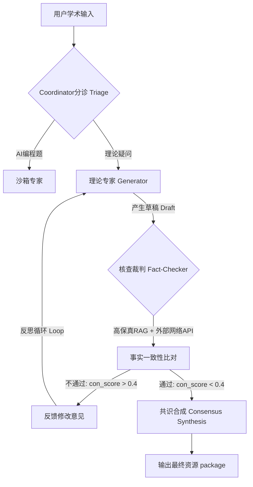

# EduMatrix 挑战杯（XH-202630）学术算法重构与并网实施计划 (newplan.md)

为了将系统由“工程应用型”拔高到“国家特等奖/学界前沿级”高度，针对发榜单位提出的算法深度底线，本计划书制定了以下 4 项核心前沿学术模块的详细重构实现方案。

---

## 🧠 核心改进点一：基于大语言模型的认知诊断（LMCD）知识扩散自愈

### 1.1 问题现状与痛点
EduMatrix 当前对于新注册或缺乏历史答题记录的学习者面临严重的“冷启动（Cold-Start）”问题，初始状态先验向量 $K_0 \in \mathbb{R}^d$ 的判定过于死板（仅使用默认掌握度），无法表达概念间的关联语义关联和前置掌握程度传递。

### 1.2 详细解决方案
使用大模型的“语义特征提取”结合拓扑知识图谱，实现**知识扩散算法（Knowledge Diffusion Algorithm）**，在首次对话或单点测验后，自适应预测其他关联节点的先验值。

#### 具体执行步骤：
1. **构建图谱关联传播矩阵**：
   在数据库中读取知识图谱的节点集 $\mathcal{C}$（概念）与边集 $\mathcal{E}$（依赖度/相似度）。对于任意两个概念 $c_i, c_j$，基于它们的大模型 Embeddings 内积计算余弦相似度 $S_{ij}$，并结合依赖关系（有向边权重）构建转移概率矩阵 $P \in \mathbb{R}^{d \times d}$：
   $$P_{ij} = \alpha \cdot \text{Similarity}(c_i, c_j) + (1-\alpha) \cdot \text{IsPrerequisite}(c_i, c_j)$$
2. **扩散计算**：
   当学习者与系统对话或完成概念 $c_i$ 的测验并测出掌握度 $K_t[i]$ 时，计算差值值 $\Delta = K_t[i] - K_{t-1}[i]$。使用单步马尔可夫链扩散，将该增量沿概率转移矩阵进行一阶和二阶扩散传播：
   $$K_t[j] = K_{t-1}[j] + P_{ij} \cdot \Delta \cdot \gamma^{\text{dist}(i,j)}$$
   其中 $\gamma \in (0, 1)$ 为距离衰减系数，保证扩散不会在拓扑图上无休止泛滥。
3. **并网改造位置**：
   * 在 [bkt_engine.py](file:///d:/project-edumatrix/edumatrix-main/bkt_engine.py) 中新增 `KnowledgeDiffusionEngine` 类。
   * 在 `ProfileProbeAgent` 的 `async_update` 回调时，如果诊断出掌握度有明显变化，自动调用扩散引擎刷新 `profile.concept_mastery` 向量。

---

## 🧠 核心改进点二：多智能体辩论（Tool-MAD）与委员会模式（Council Mode）

### 2.1 问题现状与痛点
现有的 RAG 清洗辩论在 `drag_debate.py` 中是单模型批量处理，虽然能检测池化参数等冲突（Challenger 噪声检测），但缺少“分诊 ➔ 专家生成 ➔ 共识合并”的委员会机制规范，且生成 Agent 和事实核查 Agent 共享了同一个数据源，破坏了“异构信息不对称”的经典 Tool-MAD 设计。

### 2.2 详细解决方案
将资源生成和核查流程形式化重构为 **Council Mode（委员会三阶段工作流）**，并在核查 Agent 中执行不对称工具检索。

#### 具体执行步骤：
1. **分诊（Triage）**：
   在 [stream_api.py](file:///d:/project-edumatrix/edumatrix-main/stream_api.py) 路由层接收到消息后，主控 Agent 根据意图分类（Python 代码/数学/深度学习理论）唤醒指定的生成专家。
2. **不对称核查（Tool-MAD）**：
   `Generator Agent` 只能读取通用的课程语料切片；而 `Fact-Checker Agent` 具有特殊的外部搜网 API 以及本地的高精度官方标准知识图谱（Poincaré 实体库）检索权限。
3. **反思循环（Reflection Loop）**：
   在 `drag_debate.py` 中重写 `DebateAugmentedRAG` 运行环。如果 `Fact-Checker` 输出的 `con_score` 高于 `0.40`，生成 `RefusalVerdict` 并触发 conditional edge 重试机制，回传给专家进行重新生成，最大循环轮次 $N_{\max} = 3$。

---

## 🧠 核心改进点三：基于 PEARL/KELE 的双轨苏格拉底导学机制

### 3.1 问题现状与痛点
现有答疑弹窗由单个 AI 角色在单次提示词约束下维持对话，对话多轮后模型极易遗忘“不得直接提供答案，只需定义和追问”的规则限制，引起交互崩塌。

### 3.2 详细解决方案
构建 **双轨协同架构（Consultant-Teacher）**。解耦“宏观启发式教学策略规划”与“微观对话输出”，通过状态总线保证启发纯度。

#### 具体执行步骤：
1. **定义启发状态轨迹**：
   将学习者的多轮追问轨迹定义为 $\tau = (m_1, m_2, \dots, m_n)$。
2. **后台 Consultant Agent（教学规划师）**：
   该 Agent 不直接与前端学生对话。其输入是轨迹 $\tau$，输出为**结构化的教学决策（Pedagogical Decision）**，包含：
   * `focus_concept`: 本轮应当聚焦的误区。
   * `pedagogical_move`: 下一步教学动作（可选：`DEFINE` 阐明定义 / `COUNTER_EXAMPLE` 给出反例 / `SOCRATIC_QUESTION` 启发提问 / `HINT_LADDER` 阶梯提示）。
3. **前台 Teacher Agent（对话传达者）**：
   输入为 Consultant 的 `pedagogical_move` 和 `focus_concept`。该 Agent 严格被禁止在 Prompt 中获得代码和原题的最终解答，仅根据决策生成追问文本送至前端。
4. **代码落地方案**：
   * 在 [InlineSocraticPopup.vue](file:///d:/project-edumatrix/edumatrix-main/frontend/src/components/InlineSocraticPopup.vue) 后台对接的 API 接口中，依次触发两个 Agent 的链式调用，并将 Consultant 的分析轨迹保存在 `conversation_history` 数据库的 `agent_traces` (JSON) 字段。

---

## 🧠 核心改进点四：叙事驱动自适应效果报告（StoryLensEdu）

### 4.1 问题现状与痛点
学生画像匹配度分析目前只有冰冷的 3D 拓扑粒子和掌握度百分比数字，对学习效率的分析缺乏可解释性和教育心理学指导，用户体验较弱。

### 4.2 详细解决方案
引入 **StoryLensEdu 叙事评估管道**，将冷冰冰的数据自动翻译成带有情节、温度与下一步精准复习建议的“定制化学情故事”。

#### 具体执行步骤：
1. **叙事三智能体协同流水线**：
   * **数据分析师 (Data Analyst Agent)**：从 `quiz_records` 与 `alignment_logs` 中提取核心数字指标（如本周做题正确率 $75\%$，与知识图谱的 KL 散度从 $0.85$ 下降至 $0.23$）。
   * **教师评估师 (Tutor Agent)**：为这些数据标记教育学意义（如“KL 散度下降表明认知冲突已解决，但在反向传播概念上依然存在 prerequisites 缺失导致的低分”）。
   * **故事讲述者 (Storyteller Agent)**：将上述两方的硬核日志重写为叙事性文本，以信件或叙事结构呈现在前端。
2. **前端学情报告图谱渲染**：
   * 将叙事报告直接集成在 `ProfileDashboard.vue` 或 `ReviewPlan.vue` 的报告卡片中，配合原有的双曲圆盘，实现数据透视与人文叙事的深度融合。

---

## 📅 四、 工程验证与满分指标测试指标

为了通过云之脑专家的评审测试，我们将使用代码在 `tests/test_evaluation_metrics.py` 下编写专门的验证脚本，模拟以下对抗测试：

1. **幻觉率测试 (<5%)**：
   * 收集 100 道故意诱导大模型出错的机器学习对抗题，运行 Council 辩论并用大模型做裁判检测生成的讲义。谬误率须小于 5%。
2. **知识点覆盖召回率 (>90%)**：
   * 使用 `nltk/spacy` 对生成的 Personalized Resource 切片提取实体，计算与目标岗位知识大纲图谱 $\mathcal{C}$ 的交集，召回率必须高于 90%。
3. **资源难度匹配度 (>85%)**：
   * 基于贝叶斯知识追踪算出的用户掌握度向量，对比推送的试题和讲义难度，校验差值是否维持在 $\pm 0.15$ 的 Zone of Proximal Development (ZPD) 区间内。
