# EduMatrix 智教矩阵

> **代码执行模式边界（2026-07-19）**：核心学习闭环不依赖 Docker。默认 `EDUMATRIX_SANDBOX_MODE=disabled`，注册、画像、对话、知识检索、测验、学习路径、反馈和报告均可在 Windows 原生环境验收。为学术研究和比赛演示，可显式设置 `trusted_local`，由受限 Python 子进程、临时工作目录、AST 检查、超时和输出上限支持真实演示；该模式不具备 Docker 容器隔离，不适用于生产环境或不可信代码。`docker` 模式仍保留为更强隔离的可选路径。

## 领域知识个性化生成与多智能体协同决策系统

### 完整技术文档总稿（最终发布版）

文档版本：V2.0（最终技术说明版）  
生成日期：2026-07-20  
项目目录：`D:\project-edumatrix\edumatrix-main`  
验证基线：Git `74f8f2715641da20b560571120a66477d300f5de`；结论以 2026-07-20 验证时的最终代码与证据为准  
配套 PPT：`outputs/EduMatrix_A3_评委阅读版_方向A.pptx`（20 页评委阅读版，已按官方 A3 评分口径整理）  
适用场景：作品技术说明、系统验收、评委快速复现

### 参赛信息

| 项目 | 信息 |
|---|---|
| 队伍名称 | 上杉绘梨衣 |
| 参赛赛题 | A3：基于大模型的个性化资源生成与学习多智能体系统研发 |
| 参赛学校 | 西交利物浦大学 |
| 队伍成员 | 林之正、杨一鸿 |
| 指导教师 | 王成玉 |

> 本文仅记录技术文档所需的公开队伍信息，不重复记录报名系统中的手机号、邮箱和通讯地址。队伍正式提交信息以官方报名系统最终保存内容为准。

### 文档用途与官方提交口径

根据队伍提供的官方 A3 赛题页面，本赛题评分包含“创新价值与实用性”（35%）、“功能实现及技术要求”（45%）、“配套文档的真实度”（10%）以及“演示视频、PPT 文档”（10%）。本文和配套 PPT 围绕这四项评分准备；最终上传格式、命名和截止时间仍以官方系统的最新通知为准。项目目录中的其他赛题文件仅作为历史审计材料保留，不覆盖本口径。

> 本文档严格区分四类结论：
>
> - **已证实**：可以由当前源码、配置、仓库数据或实际命令输出直接证明。
> - **部分实现**：代码中存在主要路径，但存在未接入、异常降级、配置缺口或运行条件限制。
> - **待验证**：需要完整依赖、外部服务、Docker、浏览器或真实实验数据才能确认。
> - **规划/建议**：为生产化和比赛指标补齐提出的后续方案，不能当作当前已交付能力。

---

## 1. 项目摘要

EduMatrix 是面向机器学习导论等垂直知识领域的个性化学习资源生成系统。系统以学生的专业背景、学习目标、认知风格、答题记录、错题、对话历史和行为反馈为输入，通过学情画像、知识路径规划、混合检索、证据清洗和多角色资源生成，输出讲义、思维导图、代码实操案例、练习题以及视频/TTS 脚本等学习资源。

系统的核心产品闭环为：

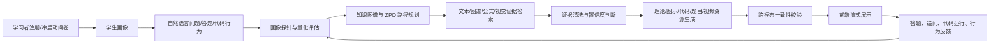

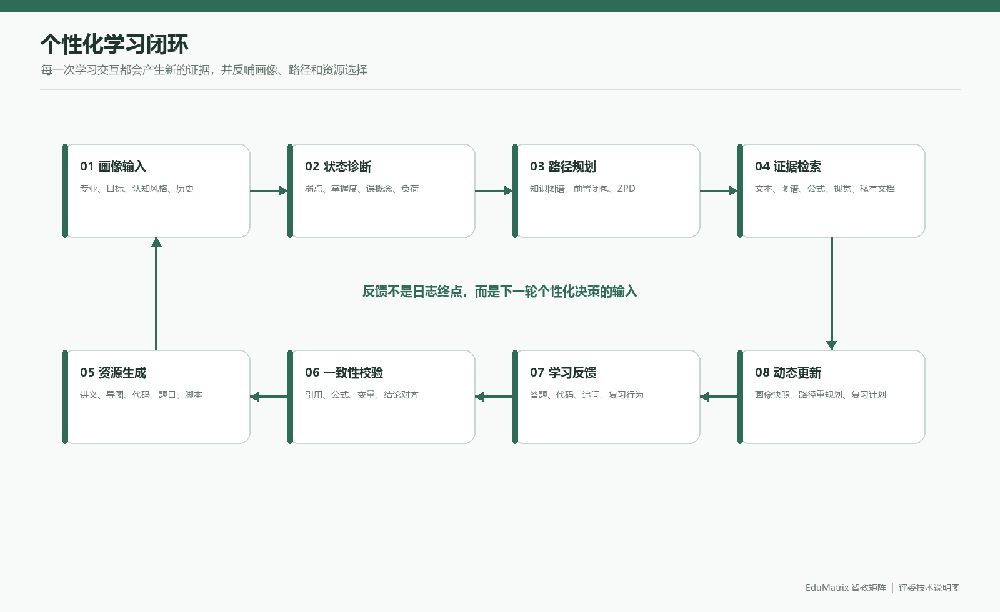

当前代码已经形成较完整的教育智能体工程骨架，包含 Vue 3 前端、FastAPI 后端、SQLite/WAL 持久化、Agent Swarm、混合 RAG、学情算法、SSE 流式交互、错题与间隔复习、代码执行和 PDF 导出等模块。

但当前版本不能直接被描述为“已经完成所有评分项的生产系统”。必须明确以下事实边界：

1. `agent_swarm.py:34-44` 定义了 9 个职责明确的 Agent 规格，满足“至少 3 个 Agent”的结构性要求；`EduMatrixSwarm` 已将当前 LLM 注入 `DebateAugmentedRAG`，异步主链路使用 `aclean()`，因此代码路径具备可选真实 LLM 辩论能力。无外部模型时仍使用确定性清洗与降级，不能把 deterministic 结果称为真实模型辩论效果。
2. 当前版本已为主要 API 接入当前用户和学生范围校验；选定的 A/B/教师运行时安全矩阵 47/47 通过，但矩阵不是全部 API、持久化边界和删除场景的穷尽证明，不能把“选定关键路由已验证”写成“所有接口均已完成多租户认证”。
3. 用户知识文档摄入、检索和删除已加入 owner 过滤，并通过专项契约与选定运行时矩阵；真实持久化索引清理、删除后检索和全部边界仍需复测。
4. 代码执行按配置分为三种模式：`disabled` 明确拒绝执行；`trusted_local` 仅为可信本机研究演示，使用受限 Python 子进程但不具备容器隔离；`docker` 才提供容器级隔离。任何模式都不应被描述为绝对安全。
5. 当前工作区已安装核心 Python 依赖并通过正式测试集；默认无 Docker 模式已完成浏览器 E2E，`pytest -q` 收集的正式测试为 145 passed、1 skipped（可选 FAISS 未安装时跳过），`trusted_local` API smoke 已验证安全代码输出 42 且拦截 `os` 导入。PDF 导出、外部网络、真实 LLM 和 Docker 容器执行仍按可选环境能力单独验收，不能把该结果写成“全量系统安全认证”。
6. 本地演示 `.env` 固定 `EDUMATRIX_AUTH_SECRET_KEY`，以避免后端重启导致浏览器 JWT 失效；提交包只提供空值示例，评委需自行生成并保存密钥。
7. 当前版本的本机数据库快照包含 25 份 `public` 公共课程文档、27 份 `lzz` 用户文档、762 道题、792 条学生画像和 35 个概念坐标；这些数字描述当前开发机数据状态，不代表提交包中必须携带运行数据库，也不代表真实用户规模。
8. 当前官方 A3 页面未将“幻觉率、适配率、知识点覆盖率”列为本项目必须达到的固定阈值。本文如保留这些指标，只作为可选研究性评测，并明确没有独立人工标注样本，不把合成演示数据冒充真实实验结果。

---

## 2. 赛题要求与项目对齐

项目固定场景为机器学习导论，属于人工智能/机器学习垂直技能培训场景。当前参赛信息以官方报名页面填写的 A3 赛题为准；项目内 `赛题/competition_rules.txt` 是技术分析时使用的规则参考文件。

### 2.0 规则解释边界

本技术文档将“评分维度”“系统能力”和“技术证据”分开处理：

| 类型 | 本文处理方式 |
|---|---|
| A3 作品能力 | 重点说明学习者画像、多智能体协同、专业知识库、资源生成、反馈更新、可视化和可复现运行链路 |
| 技术证据 | 使用源码位置、数据库快照、自动化测试、E2E 截图和运行时矩阵交叉说明 |
| 官方评分 | 按 35% 创新价值与实用性、45% 功能实现及技术要求、10% 配套文档真实度、10% 演示视频与 PPT 文档组织材料 |
| 技术文档、PPT、视频 | 作为评分和验收材料准备；具体提交形式以官方系统最新通知为准 |
| 可选效果评测 | 给出定义、样本格式和计算方法；没有独立人工标注证据的指标不宣称达标 |

如果评委采用的通知版本与项目目录中的参考规则不同，应以评委现场使用的最新官方通知为准；这不影响本文对当前源码和运行行为的事实描述。

### 2.1 赛题核心要求追踪表

| 赛题要求 | 当前项目对应能力 | 当前证据 | 状态与说明 |
|---|---|---|---|
| 至少 3 个职责明确的智能体 | 画像探针、路径规划师、量化评估师、教学路由、理论教授、逻辑画师、极客助教、考官、虚拟导演 | `agent_swarm.py:34-44` | **已证实（结构）**。Agent 规格和主要实现类存在 |
| 分析—生成—校验—决策闭环 | 画像分析、ZPD 规划、RAG 检索、资源并发生成、流形对齐、反馈更新 | `agent_swarm.py:1363-1640`、`stream_api.py:387-约1000` | **部分实现**。流程存在，异常路径和完整边界仍需按目标环境复核 |
| 至少 3 种个性化资源 | 讲义、思维导图、代码案例、练习题、虚拟人视频脚本 | `agent_swarm.py:929-938`、资源工厂 | **已证实（生成任务）**。外部视频真实生成仍需区分脚本/推荐/成片 |
| 学习者先验知识画像 | 专业、认知风格、动机、掌握度、弱点、学习目标、交互偏好、历史等 | `models.py`、`app/database.py` | **已证实（数据结构）** |
| 至少 2 组差异化初始学情数据 | 注册问卷、种子学生/Peer 画像、题库数据 | `scripts/seed_students.py`、数据库种子数据 | **部分实现**。当前主要是虚拟或模拟数据 |
| 至少 1 个专业知识库切片 | 机器学习课程概念、题库、RAG 证据和用户文档摄入 | `scripts/data/quiz_bank/`、`rag_engine.py` | **部分实现**。需为提交包固定一份可复核知识库切片 |
| 动态反馈与学习路径更新 | 答题、错题、代码错误、行为日志、BKT/策略更新、复习计划 | `quiz_api.py`、`behavior_api.py`、`learning_event_bus.py` | **部分实现**。需要运行验证事件链和数据一致性 |
| 个人学情与资源匹配可视化 | Dashboard、画像雷达、知识图谱、学习路径、流形可视化 | `frontend/src/views/Dashboard.vue`、`StudentAnalysis.vue`、`ManifoldVisualizer.vue`、`outputs/e2e_no_docker/` | **已证实（默认路径）**；外部 LLM 和全部资源类型仍需按环境复核 |
| 防幻觉与知识溯源 | 混合 RAG、证据评分、DRAG 清洗、引用字段、对齐检查 | `rag_engine.py`、`drag_debate.py`、`manifold_alignment.py` | **部分实现**。确定性清洗可默认运行；真实 LLM 辩论需配置外部模型后单独验收 |
| 幻觉率/适配率/覆盖率 | 代码有门限、证据清洗、画像资源匹配和知识图谱设计 | 当前无完整真实标注评测数据 | **非当前官方 A3 硬性阈值；仅可作为可选研究评测** |
| 可部署、可运行、可复现 | Dockerfile、docker-compose、前端构建、启动脚本、环境备忘录 | 无 Docker 核心路径已由浏览器 E2E 复现；Docker 实时代码执行、PDF 导出和目标评委机仍需复核 | **部分实现（默认路径已证实）** |

### 2.2 对官方评分维度的解释

#### 创新价值与实用性（35%）

重点展示 EduMatrix 如何把大模型、多智能体、学习者画像、专业知识库和反馈机制组合成可使用的学习产品。创新点应落到可观察的机制：九角色协同、混合 RAG、知识路径规划、资源工厂、证据链和跨模态一致性校验；实用性则用学习场景、资源类型、路径与前端证据说明，不虚构用户效果。

#### 功能实现及技术要求（45%）

重点证明系统能够运行，且功能不是停留在页面或概念图：注册与画像、智能对话、Agent Timeline、知识库、学习路径、学情分析、资源生成、反馈更新和代码执行边界都要关联到源码、API、测试或浏览器证据。默认评委路径为 Windows 原生、deterministic、无 Docker；Docker 仅为可选代码执行增强。

#### 配套文档的真实度（10%）

文档中的每个“已实现”“已通过”“当前结果”都必须能回溯到源码、命令输出、数据库快照、截图或测试报告；对合成数据、静态代码证据、可选能力和待验证事项分别标注，避免把设计方案写成运行结果。

#### 演示视频、PPT 文档（10%）

PPT 需要清晰呈现系统价值、前沿 AI 技术融合思路、实现方法、创新点和核心功能。新 PPT 按“问题—方案—协同机制—前端证据—运行边界—评分映射”的顺序组织，技术文档和演示材料采用同一事实基线。

---

## 3. 需求层面分析

### 3.1 目标用户

本系统的需求分析针对以下三类用户，当前属于基于赛题和产品场景的设计性需求分析；若采用问卷、访谈或真实试用数据，应另行列出样本量、时间、问卷和统计过程。

| 用户类型 | 典型背景 | 主要痛点 | 系统响应 |
|---|---|---|---|
| 计算机专业本科生 | 有编程基础，机器学习理论不系统 | 概念会背但不会迁移到代码和项目 | 理论讲义 + 代码实操 + 相似题 |
| 跨专业学习者 | 数学或工程基础不均衡 | 前置知识缺口导致学习路径跳跃 | 画像诊断 + 前置回滚 + 分阶解释 |
| 备考/项目型学习者 | 有明确考试或项目目标 | 时间有限，需要优先学习薄弱点 | 目标驱动路径 + 错题复习 + 资源排序 |
| 教师/培训管理者 | 需要观察班级或学生状态 | 难以同时跟踪多名学习者 | 教师面板、画像报告和学习进度 |

### 3.2 大学生学习需求拆解

1. **从知识理解到工程迁移**：学习者不只需要定义，还需要公式、反例、代码、结果解释和错误诊断。
2. **前置知识可见化**：学习者经常不知道自己为什么不会，需要看到概念依赖、前置节点和当前薄弱点。
3. **资源难度适配**：同一知识点需要为不同基础的人提供基础解释、图示、代码或挑战任务。
4. **反馈及时且可操作**：答题后不能只有对错，还需要错因、下一步行动、相似题和复习时间。
5. **专业知识可信**：领域知识生成必须有来源、证据和拒答/低置信度处理。
6. **学习过程可追踪**：学习者和教师需要看到掌握度、错题、路径、行为和阶段性变化。

### 3.3 功能需求

| 编号 | 需求 | 输入 | 输出 | 验收证据 |
|---|---|---|---|---|
| R-01 | 注册与冷启动画像 | 用户名、密码、专业、认知风格、动机 | JWT、学生画像、先验状态 | `/api/auth/register`、`DBStudentProfile` |
| R-02 | 个性化对话答疑 | 学生问题、画像、历史 | SSE 事件、讲义/导图/代码/题目等资源 | `/api/stream/chat`、Agent 事件 |
| R-03 | 知识检索与引用 | 查询、课程知识、用户文档 | 证据、图谱路径、置信度 | `rag_engine.py`、RAG 结果 |
| R-04 | 学情诊断 | 答题、错题、行为、代码错误 | 掌握度、弱点、不会原因 | `models.py`、BKT/画像更新 |
| R-05 | 自适应测验 | 知识点、难度、历史 | 分阶题目、判分、反馈 | `quiz_api.py`、题库测试 |
| R-06 | 错题与间隔复习 | 错题、质量评分 | 复习计划、Anki 卡片、相似题 | `anki_engine.py`、`flashcard_api.py` |
| R-07 | 代码实操 | Python 代码 | stdout、stderr、执行时长、图片 | `code_exec_api.py` |
| R-08 | 学习路径与可视化 | 画像、目标、概念图 | 路径节点、完成率、认知负荷 | `profile_api.py`、前端路径图 |
| R-09 | 文档知识库 | PDF/文本/PPTX 等 | 文档记录、分块、检索证据 | `knowledge_api.py`、`document_parser.py` |
| R-10 | 学情报告导出 | 学生 ID、画像数据 | PDF/HTML 报告 | `report_api.py`、Playwright |
| R-11 | 教师视图 | 教师身份、学生数据 | 班级/学生概览 | `app/main.py` 教师接口 |

### 3.4 非功能需求

- **安全性**：所有用户数据访问必须绑定服务端身份；代码执行不得回退到宿主同权限子进程；上传必须有大小、类型和资源限制。
- **可靠性**：外部 LLM、Neo4j、向量库和浏览器缺失时，应有可观测、可控的降级，而不是静默改变安全边界。
- **可复现性**：依赖、浏览器、环境变量、数据库初始化、样例数据和测试命令必须固定。
- **可解释性**：每次资源生成应能够说明画像依据、检索证据、Agent 角色、校验结果和下一步动作。
- **性能**：SSE 不应阻塞事件循环；缓存、Agent 实例和浏览器进程必须有上限和生命周期。

---

## 4. 总体技术架构

### 4.1 分层架构

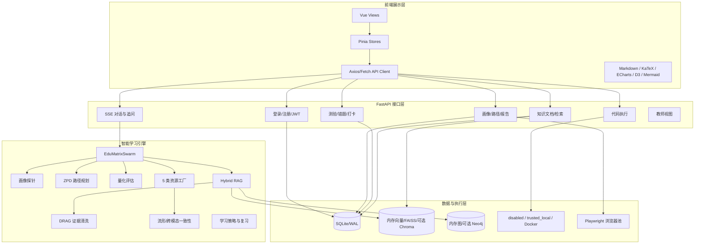

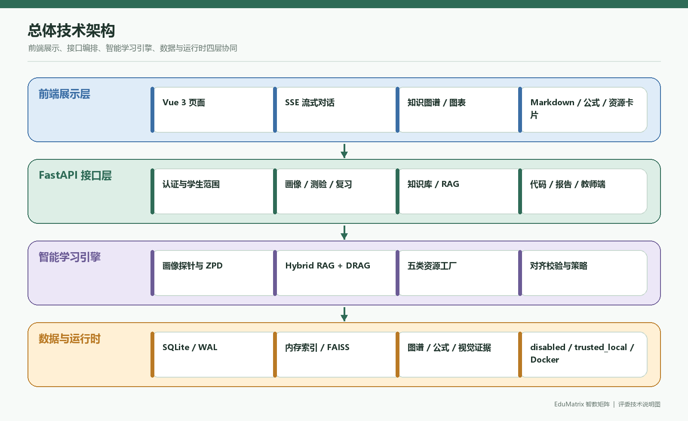

### 4.2 代码模块职责

| 模块 | 主要文件 | 设计职责 | 当前状态判断 |
|---|---|---|---|
| 应用入口 | `app/main.py` | FastAPI 初始化、登录、教师端、旧版接口、路由注册 | 路由较多，部分旧接口和新接口并存 |
| 身份认证 | `app/auth.py` | bcrypt 密码、JWT、用户和教师依赖 | 默认缺 Token 返回 401；仅显式 Demo 模式允许演示账号；生产密钥有启动门禁 |
| 数据库 | `app/database.py` | SQLite/WAL、SQLAlchemy 模型、线程池数据库操作 | 当前主要是单文件 SQLite，不是完整多租户数据库 |
| 画像 CRUD | `app/crud.py` | 画像序列化、Peer 先验校准、笔记、历史、复习计划 | 主要读写路径已接入学生范围和记录归属过滤 |
| Agent 编排 | `agent_swarm.py` | Agent 规格、画像、规划、资源生成、对齐、自愈 | 主要闭环存在，辩论 LLM 已注入，外部 provider 仍需单独验收 |
| LLM 客户端 | `llm_client.py` | OpenAI 兼容接口、供应商配置、确定性 fallback | 外部服务依赖和 fallback 语义需明确 |
| RAG | `rag_engine.py` | 文本、图谱、公式、视觉、用户文档检索 | 用户文档路径已加入 owner 过滤；无关查询不再注入通用视频高分证据 |
| 证据清洗 | `drag_debate.py` | 证据评分、确定性清洗、可选 LLM 辩论 | 默认确定性路径和可选 LLM 路径均有明确边界 |
| 学情算法 | `bkt_engine.py`、`mirt_engine.py`、`learning_strategy.py` | BKT、EKF、DKT、MIRT、复习策略 | 极端值、退化矩阵和时间边界已加固；效果数据仍需实测 |
| 知识摄入 | `knowledge_api.py`、`document_parser.py` | 上传、解析、分块、图谱和向量写入 | 已认证；本地/远程文档有大小、页数、压缩包、展开体积、压缩比和超时限制 |
| 代码执行 | `code_exec_api.py` | AST 检查、可选 Docker 池、超时、输出捕获 | 默认禁用且不连接 Docker；显式启用 Docker 后才执行；未启用时明确拒绝 |
| 前端 | `frontend/src` | 页面、路由、Pinia、SSE、可视化和资源卡片 | production build 成功，相关 KaTeX、Axios 动态导入和 ECharts 按需加载警告已清除 |

### 4.3 路由分组

当前注册的路由前缀包括：

| 前缀 | 文件 | 业务 |
|---|---|---|
| `/api/knowledge` | `knowledge_api.py` | 文档上传、文档列表、图谱和跨模态搜索 |
| `/api/quiz` | `quiz_api.py` | 题目生成、评估、自适应、错题、打卡 |
| `/api/web` | `web_search_api.py` | 网页、URL、arXiv 检索 |
| `/api/code` | `code_exec_api.py` | 代码执行和历史 |
| `/api/profile` | `profile_api.py` | 画像、分析、路径、推荐和回滚 |
| `/api/stream` | `stream_api.py` | SSE 对话、资源重生成、划词追问 |
| `/api/v1/animations` | `animation_api.py` | 动画资源和视频文件 |
| `/api/flashcard` | `flashcard_api.py` | 闪卡生成、复习、到期卡片 |
| `/api/behavior` | `behavior_api.py` | 行为日志 |
| `/api/v1/profile` | `report_api.py` | PDF 学情报告 |

### 4.4 一次学习请求的生命周期

一次 `/api/stream/chat` 请求不是“调用模型并返回文本”，而是一个带状态的异步事务。其逻辑可以拆成以下阶段：

| 阶段 | 关键动作 | 主要状态 | 失败时的可见结果 |
|---|---|---|---|
| 1. 接入 | 校验 JWT、解析学生范围、读取模型配置头 | `request_accepted` | 401/403 或参数错误 |
| 2. 诊断 | 读取画像、历史和当前问题，识别目标概念与意图 | `profile_probe_started/completed` | 使用已有画像并标记降级 |
| 3. 规划 | 根据图谱前置关系、掌握度和目标生成 ZPD 路径 | `planner_started/completed` | 使用目标概念或空路径 |
| 4. 检索 | 合并本地图谱、文本、公式、视觉、用户文档和可选外部证据 | `retrieval_completed` | 低置信度、拒答或确定性本地证据 |
| 5. 清洗 | 去重、评分、冲突识别；可选真实 LLM 辩论 | `evidence_verified` | 保留证据、降级或要求重试 |
| 6. 生成 | 理论、导图、代码、题目和脚本 Agent 并发工作 | `resource_started/completed` | 单个资源失败不拖垮整包 |
| 7. 对齐 | 检查概念、公式、变量、答案和资源之间的一致性 | `alignment_completed` | 记录冲突并生成纠偏建议 |
| 8. 持久化 | 保存会话、画像变化、证据引用和对齐日志 | `saved` | 返回可识别的持久化错误 |
| 9. 展示 | SSE 按事件推送时间线、增量文本和最终资源 | `done` | 前端显示中断状态，支持重试 |

### 4.5 运行时边界与可观测性

系统把“核心闭环”和“可选能力”分开：

| 能力 | 默认依赖 | 外部依赖缺失时的行为 | 验收结论 |
|---|---|---|---|
| 账号、画像、测验、路径 | Python、SQLite | 不依赖 Docker 或外部 LLM | 核心验收路径 |
| 确定性对话与本地 RAG | `deterministic` LLM、哈希嵌入 | 返回固定规则生成与本地证据 | 可离线演示，不能当作真实大模型效果 |
| 真实文本/视觉模型 | OpenAI-compatible Endpoint 和 API Key | 熔断、重试或回退到 deterministic | 需使用评委可用凭据单独验收 |
| FAISS/ChromaDB/Neo4j | 对应可选包、索引或服务 | 使用内存/SQLite 路径 | 属于加速或扩展，不是核心启动前提 |
| PDF 报告 | Playwright Chromium | API 返回明确错误 | 需单独安装浏览器并复测 |
| 代码执行 | `trusted_local` 或 Docker | `disabled`/Docker 不可用时返回 503 | 研究演示与容器隔离必须分开描述 |

关键运行指标由 `observability.py` 和健康/指标接口提供，包括请求耗时、LLM 调用、RAG 检索、缓存命中、错误和熔断状态。`/api/metrics` 暴露内部运行指标，正式部署应增加访问控制或仅绑定内网。

---

## 5. 多智能体协同设计

### 5.1 Agent 矩阵

`agent_swarm.py:34-44` 定义了 9 个 AgentSpec：

| Agent | 职责 | 主要输入 | 主要输出 |
|---|---|---|---|
| 画像探针 `profile` | 从消息和历史中更新画像、弱点和不会原因 | 学生消息、历史、知识点 | 画像字段、证据、置信度 |
| 路径规划师 `planner` | 根据知识图谱、掌握度和 ZPD 规划学习路径 | 画像、目标概念、图谱 | 目标、前置边、路径、检索查询 |
| 量化评估师 `evaluator` | 综合答题、代码、行为和资源反馈 | 画像、资源、反馈 | 资源效果、建议、重规划信号 |
| 教学路由 `router` | 对问题意图和学习状态进行 FSM 分发 | 消息、画像、模式 | 处理模式、目标资源和 handoff |
| 理论教授 `theory` | 生成有证据约束的专业讲义 | 查询、证据、画像 | 定义、推导、例子、引用 |
| 逻辑画师 `mapper` | 生成知识结构和 Mermaid 思维导图 | 图谱路径、证据 | 图表/导图文本 |
| 极客助教 `coder` | 生成并改进可运行代码案例 | 查询、讲义、画像 | 代码、注释、可视化 |
| 考官 `quiz` | 生成分阶练习题并提供解析 | 概念、难度、历史 | MCQ/主观题、评分标准 |
| 虚拟导演 `director` | 生成视频/TTS 脚本或推荐信息 | 资源主题、偏好 | 脚本、推荐描述或播放信息 |

### 5.2 正常流程

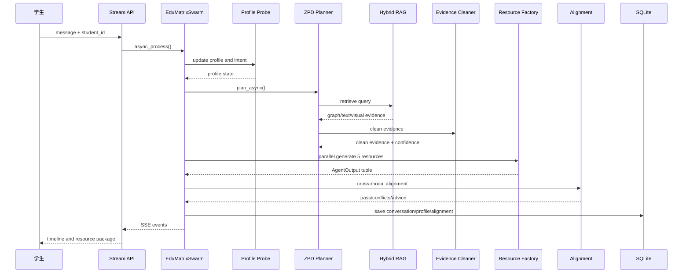

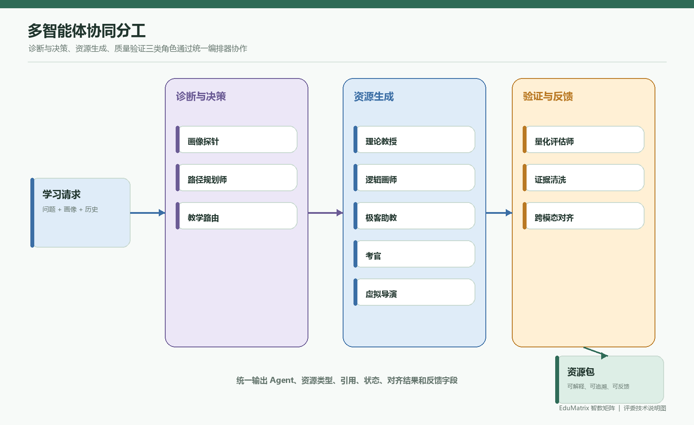

### 5.3 真实实现边界

- 资源工厂使用 `asyncio.gather(..., return_exceptions=True)` 并发生成，单个 Agent 出错时会返回“暂时不可用”的资源结果，整体流程不一定失败。
- 资源生成支持 `regenerate_only` 和历史资源复用，属于局部重写机制。
- 对齐失败后会从冲突中推断责任 Agent 并构造纠偏指令。
- `EduMatrixSwarm.__init__` 已将 `use_llm` 注入 `DebateAugmentedRAG(llm=use_llm)`；主异步路径使用 `aclean()`，避免在流式事件循环中嵌套 `run_until_complete`。
- 同步兼容入口仍需在明确的同步边界调用；它不应被误用为异步请求处理器。
- `agent_swarm.py:1665` 的同步 `process()` 也通过事件循环桥接异步流程，调用边界必须在测试中明确。

因此，参赛文档应表述为：“系统实现了可选的证据辩论组件，真实 LLM 模式已完成构造器注入和异步调用修复；默认无外部模型验收使用确定性证据清洗，不把 deterministic 结果冒充真实模型效果。”

### 5.4 Agent 输出契约

为了让不同 Agent 的结果可以被前端、对齐模块和审计日志共同消费，资源结果采用统一的结构化字段。不同 Agent 可以拥有不同的 `content` 内部格式，但必须保留来源、状态和校验字段：

```json
{
  "agent": "理论教授",
  "resource_type": "专业讲义",
  "content": "……",
  "citations": ["public:模型评估指标 (Precision/Recall/F1).md#chunk-03"],
  "status": "generated",
  "fallback": false,
  "alignment": {
    "passed": true,
    "score": 0.88,
    "conflicts": []
  },
  "metadata": {
    "target": "召回率",
    "difficulty": "基础",
    "profile_features": ["视觉偏好", "混淆矩阵薄弱"]
  }
}
```

字段语义如下：

| 字段 | 作用 | 缺失后的风险 |
|---|---|---|
| `agent` | 标识责任角色 | 无法展示协同过程，也无法定位失败来源 |
| `resource_type` | 标识讲义、导图、代码、题目或脚本 | 前端无法选择渲染器 |
| `citations` | 记录证据来源和 chunk | 无法进行知识溯源和人工复核 |
| `status` | `generated`、`fallback`、`failed` 等 | 容易把降级内容误判为正常生成 |
| `alignment` | 保存一致性分数和冲突 | 无法解释为什么触发重生成 |
| `metadata` | 保存画像、目标和难度 | 无法复现个性化决策 |

### 5.5 并发、降级与自愈

资源工厂使用异步并发和 `return_exceptions=True`，形成“局部失败、整体可用”的策略：

1. 单个生成 Agent 超时或外部模型失败时，返回带 `fallback` 标记的资源，而不是静默吞掉异常；
2. 对齐失败时，系统根据冲突字段推断责任 Agent，构造局部纠偏指令，不要求所有资源全部重写；
3. LLM 客户端包含请求超时、重试、并发上限、RPM/TPM 限制和熔断参数；
4. 缓存采用有界数量和 TTL，避免反复对话造成进程内内存无限增长；
5. SSE 请求断开时，后台任务应取消或结束，避免继续消耗模型额度。

该设计的核心价值是让评委看到“协同失败如何被处理”，而不是只展示一次理想成功响应。当前仍需在真实外部模型、慢网络和连续断开场景下补充目标环境测试。

---

## 6. 个性化学习与学情算法

### 6.1 画像模型

持久化画像表 `DBStudentProfile` 保存专业、课程、认知风格、动机、焦虑/挫败、专注、认知负荷、弱点、学习目标、交互偏好、掌握度、误概念、历史、BKT 状态、认知图、FSM 模式和动态状态等 JSON 字段。

画像不是单一标签，而是多维状态：

1. 知识掌握度；
2. 前置知识缺口；
3. 误概念与错误模式；
4. 理解、熟练、迁移能力；
5. 认知负荷和专注度；
6. 学习动机与目标；
7. 交互/表达偏好；
8. 情绪、挫败和信心；
9. 学习策略和复习习惯；
10. 专业、课程和现实学习情境。

### 6.2 冷启动与 Peer 先验

注册接口会接收专业、认知风格和动机等冷启动字段，并调用 `calibrate_student_prior_collaborative`。该逻辑从其他 `DBStudentProfile` 中按专业、认知风格、动机计算相似度，取最多 3 个 Peer 的掌握度和 BKT 状态进行初始化。

该机制的工程含义是：当新用户没有答题历史时，可以避免所有概念从相同的默认状态开始。但其评估含义必须谨慎：当前 Peer 主要来自种子或历史数据库记录，不能直接证明真实协同过滤效果，也不能写成真实用户调研结果。

### 6.3 BKT / EKF / DKT / MIRT

项目代码和报告涉及多种学情算法，最终文档应按“代码存在”和“验证程度”分别描述：

| 算法 | 目的 | 当前代码证据 | 主要边界 |
|---|---|---|---|
| BKT | 根据答题结果更新知识点掌握概率 | `bkt_engine.py`、`models.py:bkt_states` | 参数来源、标注质量和跨用户验证不足 |
| EKF/Kalman | 对时序掌握度或认知状态做平滑 | `bkt_engine.py`、相关学习策略模块 | 极小变化硬截断可能削弱渐进更新 |
| DKT | 用时序行为建模知识状态 | `bkt_engine.py` 或相关 DKT 实现 | 模型权重/训练数据/线上加载需单独证明 |
| MIRT/IRT | 估计题目难度与学习者能力 | `mirt_engine.py`、`quiz_api.py` | 极端有限值、协方差退化和 MCMC 烧入边界已加固并有测试；正式标注数据和收敛效果仍需实测 |
| SM-2 | 规划闪卡间隔复习 | `anki_engine.py`、`flashcard_api.py` | 时区和 naive/aware 时间边界需统一 |
| RL/Q-learning | 根据离散状态规划学习策略 | `app/utils/rl_planner.py`、`learning_strategy.py` | 需要说明是否真实参与默认推荐流程 |
| Poincaré/流形对齐 | 表示层级知识并检查多资源一致性 | `manifold_alignment.py`、`ManifoldVisualizer.vue` | 需要基准数据和可视化运行证据 |

### 6.4 个性化资源策略

资源生成会基于认知风格对资源排序：视觉偏好优先思维导图，实践/代码偏好优先代码案例，文本偏好优先讲义。该策略能够证明“系统会根据画像改变资源编排”；若要报告适配效果，还需要人工标注给定画像与资源包之间的难度、表达形式和目标匹配关系。

### 6.5 主要计算关系

文档中的公式用于解释决策逻辑，不代表每一个算法都已经在真实大规模学习数据上训练或调参。

**BKT 状态更新**：对知识点 (k)，先由遗忘/学习参数得到答题前状态，再结合答题结果更新掌握概率。一个简化形式为：

```text
p(L_t) = p(L_{t-1}) + (1 - p(L_{t-1})) * p(T)
p(C_t) = p(L_t) * (1 - p(S)) + (1 - p(L_t)) * p(G)
p(L_t | correct) = p(L_t) * (1 - p(S)) / p(C_t)
p(L_t | wrong)   = p(L_t) * p(S) / (p(L_t) * p(S) + (1 - p(L_t)) * (1 - p(G)))
```

其中 (p(L)) 是已掌握概率，(p(T)) 是学习转移，(p(S)) 是失误，(p(G)) 是猜测。代码实现还会对输入概率和极端值进行夹断，避免 NaN 或无界更新。

**资源匹配评分**：实际系统会综合目标、掌握度、认知负荷、表达偏好和历史反馈，可用以下抽象形式描述：

```text
score(resource, learner) =
    w_goal * goal_match
  + w_gap * knowledge_gap_match
  + w_style * interaction_style_match
  + w_difficulty * difficulty_fit
  + w_feedback * historical_effect
  - w_load * cognitive_load_penalty
```

该分数用于排序和解释，不应直接当作“适配准确率”。准确率需要人工标签或经授权的真实学习结果作为外部真值。

**ZPD 路径候选**：先取目标概念的前置闭包，再过滤掌握度不足、不可达或不满足前置条件的节点，最后按学习收益、目标相关性和认知负荷排序。路径输出应保留目标节点、前置边、推荐顺序、预计时长和完成状态。

### 6.6 反馈驱动的状态机

系统可以将一次学习交互抽象成以下状态转移：

```text
NEW_LEARNER
  -> DIAGNOSED       (注册问卷/首次提问)
  -> PATH_PLANNED    (目标与前置关系确定)
  -> RESOURCE_READY  (证据清洗与资源生成完成)
  -> PRACTICING      (答题/代码/追问)
  -> EVALUATED       (正确率、错误概念、行为反馈更新)
  -> REPLANNED       (路径、难度或资源类型发生变化)
  -> REVIEW_DUE      (进入间隔复习)
```

至少应记录以下反馈来源：答题结果、题目难度、错题概念、代码错误类型、用户追问、资源重生成、停留/中断和复习打卡。当前代码已经提供相应数据模型与事件/策略模块，但“反馈是否显著提升学习效果”仍需要前后对照实验，不应只凭状态字段存在来宣称效果。

---

## 7. 混合 RAG 与知识安全

### 7.1 检索组成

当前 RAG 设计包含：

- 机器学习课程概念图谱；
- 文本证据和分块；
- 公式/数学检索；
- 视觉或多模态证据的可选路径；
- 用户上传文档；
- 可选 FAISS、ChromaDB、Neo4j；
- 哈希嵌入或外部嵌入服务。

### 7.2 文档摄入流程

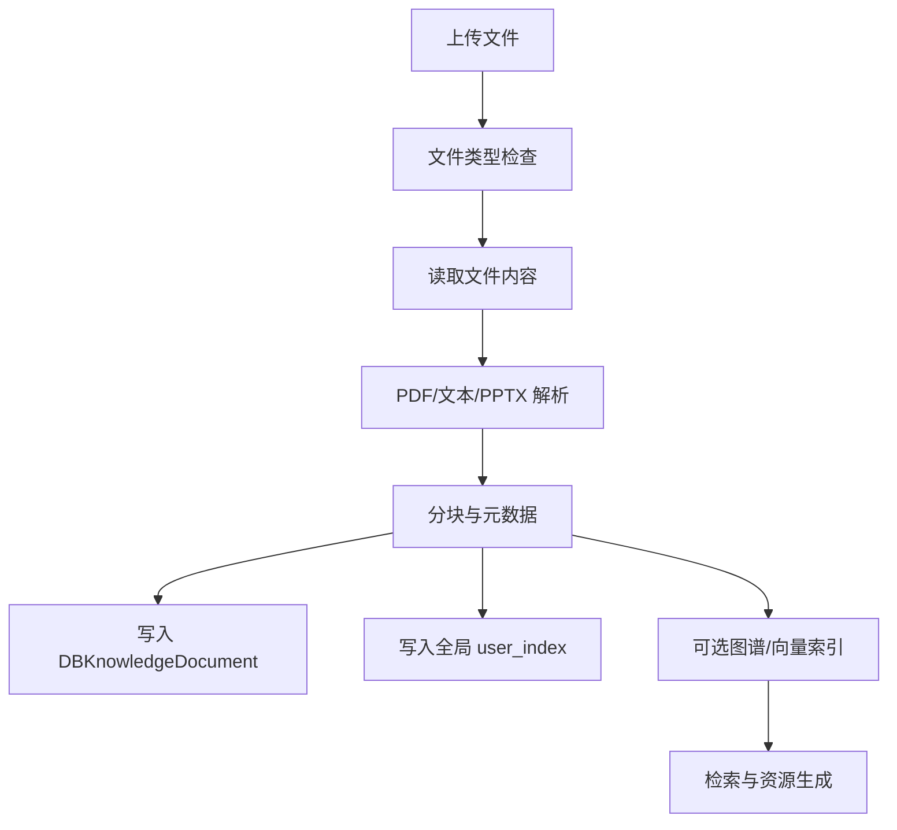

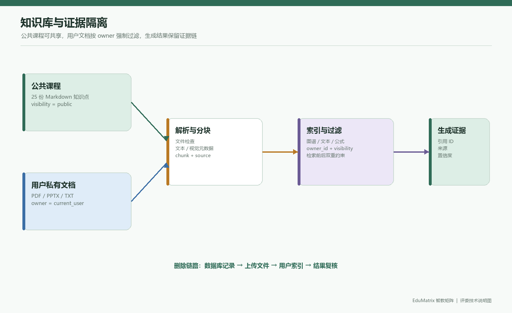

### 7.3 文档可见性与 RAG 隔离

当前实现已对主要用户文档路径加入身份与可见性控制：

1. `/api/knowledge/upload`、`/list`、详情和删除接口使用 `get_current_user` 与 `enforce_student_access`，普通学生不能用请求体中的 `student_id` 访问其他用户；
2. 文档摄入时强制写入 `owner_id` 和 `visibility=private` 元数据；缺少 owner 的摄入会直接抛出错误；
3. `HybridRAGPipeline` 虽然使用进程内 `user_index`，但检索结果通过 `_visible_user_evidence` 按当前画像的 `student_id` 过滤；
4. 文档删除同时删除数据库记录、用户上传文件和对应 owner 的内存索引项；
5. 公共知识文档在数据库中以 `student_id=public` 保存，列表接口可向学生展示；用户私有文档以实际账号作为 owner。

当前直接证据包括用户文档 owner 契约测试、运行时安全矩阵 47/47 和 `tests/test_security_contracts.py`。需要保留的边界说明是：

- 进程内索引不是独立租户向量数据库，服务重启后需要重新摄入或重建；
- 删除后对所有持久化向量后端的“不可再检索”仍应在启用 FAISS/ChromaDB 的目标环境专项复核；
- `public/system` 文档的详情展示、删除权限与用户私有文档不同，应按接口响应单独验收；
- 当前开发机的 25 份公共文档位于运行数据库，清洁提交包是否带有自动重建脚本必须在提交前确认。

推荐的最终验收断言：

```text
owner(A) != owner(B)
retrieve(B, keyword_from_A) == no_private_hit_from_A
delete(A, document_id) -> database_deleted && index_removed
public_course -> visible_to_all_students && not_deletable_by_student
```

### 7.4 当前知识库资产快照

截至 2026-07-19，当前开发机 SQLite 数据库的 `knowledge_documents` 快照如下：

| 范围 | 数量 | 文件形态 | 说明 |
|---|---:|---|---|
| 公共课程 `public` | 25 | Markdown | 机器学习导论知识点，每份当前约 30 个文本分块；面向所有学生可见 |
| 用户资料 `lzz` | 27 | 24 TXT、2 PDF、1 PPTX | 当前账号的网页/课件导入样本，用于上传、解析和 RAG 演示 |
| 题库 | 762 | 数据库题目 | 覆盖线性模型、分类、聚类、神经网络、评估等概念 |
| 概念坐标 | 35 | 数据库坐标 | 用于知识图谱/流形可视化 |

项目原始素材目录 `data/raw/github_repos/` 还保存了 13 个公开 GitHub 仓库的研究素材，包括 Markdown、PDF、PPTX、DOCX、Notebook、图片和代码。对应的 `data/manifest/asset_inventory.jsonl`、`source_manifest.jsonl`、`collection_events.jsonl` 和 `datasets_manifest.jsonl` 用于记录来源、格式和采集事件。

这里必须区分三层资产：

1. **原始研究素材**：用于课程构造、算法实验和来源追踪，不应整体无筛选地塞入生产 RAG；
2. **公共课程切片**：当前数据库中对学生可见的 25 份 Markdown 文档，是前端知识库页面可展示的课程入口；
3. **用户私有文档**：运行时上传后按 owner 隔离，只应在所属用户的检索和资源生成中出现。

当前仓库保存了多仓库许可证文件和素材清单，但许可证判断仍是逐仓库/逐文件的人工责任，不能把“文件存在 LICENSE”自动等同于全部派生内容都可无条件再分发。正式交付时应保留来源、许可证、原始 URL、下载时间、处理方式和是否进入提交包等字段。

### 7.5 证据链与检索结果结构

一次检索结果应至少包含以下信息：

```json
{
  "query": "为什么 accuracy 高但 recall 低",
  "graph_context": {
    "target": "模型评估指标",
    "learning_path": ["分类任务", "混淆矩阵", "precision", "recall"]
  },
  "evidence": [
    {
      "id": "public:模型评估指标 (Precision/Recall/F1).md#chunk-03",
      "source": "模型评估指标 (Precision/Recall/F1).md",
      "owner_id": "public",
      "visibility": "public",
      "score": 0.88,
      "text": "……"
    }
  ],
  "cleaning": {
    "kept": true,
    "confidence": 0.88,
    "conflicts": []
  }
}
```

证据分数只用于排序和清洗门限，不等价于事实正确率。对于没有足够证据的问题，正确行为是降低置信度、请求补充材料或返回范围说明，而不是用通用视频/网页结果强行填满回答。

---

## 8. 前端与用户体验设计

### 8.1 页面结构

`frontend/src/router/index.js` 中实际定义了：

- `/landing`、`/login`、`/onboarding`；
- `/` Dashboard；
- `/learn` Chat；
- `/notes` Notes；
- `/review` Review；
- `/history` History；
- `/knowledge` Knowledge；
- `/profile` ProfileDashboard；
- `/settings` Settings；
- `/learning-path` LearningPathGraph；
- `/wrong-questions` WrongQuestionBook；
- `/revision-calendar` RevisionCalendar；
- `/student-analysis` StudentAnalysis；
- `/teacher` 及教师子页面。

前端路由守卫使用 localStorage 中的 token、角色和 onboarding 标记。它只能提供用户体验层面的导航控制，不能替代后端授权。当前主要业务路由已在后端接入认证或学生范围校验，但仍有健康检查、模型测试、指标等运维接口需要按部署环境限制访问；因此前端守卫始终不被视为安全边界。

### 8.2 对话和 Agent 可视化

`frontend/src/api/stream.js` 使用 Fetch 读取 SSE，按 `event:` 和 `data:` 行解析，并维护按学生 ID 的 AbortController。`AgentTimeline.vue`、资源卡片和流式 Markdown 组件用于展示协作过程。

演示时建议展示以下事件顺序：

1. 收到用户问题；
2. 画像探针识别目标知识点和学习偏好；
3. 路径规划师给出前置/后继节点；
4. RAG 返回证据；
5. 各资源 Agent 并行开始；
6. 讲义、导图、代码、练习等资源完成；
7. 对齐校验结果；
8. 保存学习记录并给出下一步建议。

### 8.3 当前构建验证

已执行 `npm.cmd run build`，结果：

- Vite 构建成功；
- 转换 3076 个模块；
- KaTeX CSS 和字体使用本地依赖，Axios 采用静态导入，ECharts 按图表类型拆分；
- 当前构建无上述相关警告；大体积 chunk 仍属于性能优化项，不影响构建成功。

### 8.4 多模态配置与使用边界

前端设置页已经为主文本模型和视觉模型分别提供 API Key、Endpoint、Model、温度和最大 Token 配置。配置保存在浏览器端，并通过请求头传给后端：

| 请求头 | 用途 |
|---|---|
| `X-EduMatrix-Api-Key` | 当前请求使用的主文本模型密钥 |
| `X-EduMatrix-Endpoint` | 主文本模型 OpenAI-compatible Endpoint |
| `X-EduMatrix-Model` | 主文本模型名称 |
| `X-EduMatrix-Multimodal-Api-Key` | 视觉模型密钥；为空时可尝试复用主密钥 |
| `X-EduMatrix-Multimodal-Endpoint` | 图片/视觉模型 Endpoint |
| `X-EduMatrix-Multimodal-Model` | 视觉模型名称 |

图片请求的最小验收链路为：

```text
设置页填写视觉配置
  -> 点击“测试视觉”
  -> GET /api/llm/test-vision 携带视觉请求头
  -> OpenAI-compatible messages[].content[].image_url
  -> 返回状态、模型和响应摘要
```

该功能有三种结果，不应混写：

1. 配置真实视觉 Endpoint 和有效 Key：可验证真实图片理解链路；
2. 只配置主文本模型或没有视觉 Key：系统可以启动，但图片能力会降级或提示未配置；
3. 完全没有外部模型：deterministic 模式可以验证界面和请求协议，但不能宣称已经完成真实视觉识别。

提交包不应包含任何真实 API Key。评委若要验收真实多模态功能，需要使用自己的兼容服务配置，并在浏览器设置页执行“测试视觉”。

---

## 9. 数据库与持久化设计

### 9.1 主要实体

当前 SQLAlchemy 模型包括用户、画像、对齐日志、笔记、复习计划、会话历史、知识文档、测验记录、题目、网页搜索历史、代码执行、错题、签到、arXiv 缓存、概念坐标等实体。实际部署默认使用 SQLite/WAL。

### 9.2 数据流

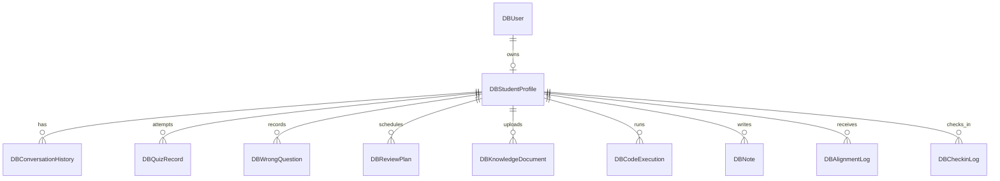

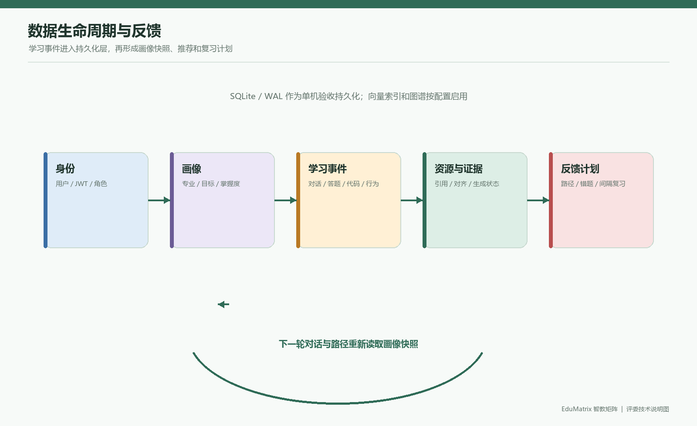

### 9.3 持久化风险

- SQLite 适合单机原型和低并发演示，不应直接宣称为完成的分布式多租户数据层。
- `check_same_thread=False`、WAL 和线程池可以改善并发访问，但不能消除高并发写锁。
- 数据库表的外键和级联关系存在，但服务层仍必须使用当前身份校验；数据库外键不能替代授权。
- 画像的很多复杂字段存于 JSON，灵活但降低了字段级查询、索引和版本迁移能力。
- `app/database.py` 中存在 PostgreSQL tenant/search_path 设计痕迹，但当前默认运行路径仍是 SQLite；最终文档应将 PostgreSQL 说成迁移方向而非现状。

### 9.4 关键数据字段字典

| 实体 | 关键字段 | 业务含义 | 写入时机 |
|---|---|---|---|
| `DBUser` | `username`、`hashed_password`、`role`、`display_name` | 登录身份、密码摘要、学生/教师角色 | 注册或初始化 |
| `DBStudentProfile` | `major`、`cognitive_style`、`motivation_type` | 冷启动画像特征 | 注册/引导 |
| `DBStudentProfile` | `concept_mastery`、`bkt_states`、`dkt_bias` | 知识点状态和时序学习状态 | 答题、反馈、路径规划 |
| `DBStudentProfile` | `weak_points`、`misconception_patterns`、`profile_evidence` | 弱点、误概念和证据来源 | 对话探针、答题评估 |
| `DBKnowledgeDocument` | `student_id`、`filename`、`title`、`content` | 文档归属和解析内容 | 上传/网页下载 |
| `DBKnowledgeDocument` | `chunk_count`、`is_multimodal`、`multimodal_metadata` | 分块数量和多模态元数据 | 文档摄入 |
| `DBConversationHistory` | `student_id`、`message`、`resources` | 学习对话和生成资源 | SSE 结束后 |
| `DBQuizRecord` | `student_id`、`concept`、`is_correct`、`difficulty` | 答题行为和知识反馈 | 提交答案 |
| `DBWrongQuestion` | `student_id`、`concept`、`question`、`notes` | 错题、标签和复习说明 | 答题错误/手动整理 |
| `DBReviewPlan` | `student_id`、`concept`、`next_review`、`interval_days` | 间隔复习计划 | Anki/复习打卡 |
| `DBCodeExecution` | `student_id`、`code`、`output`、`error`、`execution_time` | 代码实操审计记录 | 代码运行请求 |
| `DBAlignmentLog` | `student_id`、`target`、`score`、`conflicts` | 跨资源一致性检查 | 资源包完成 |

复杂画像字段采用 JSON 保存，优点是能快速扩展认知维度，代价是需要通过 schema 版本、快照和迁移脚本控制字段演进。正式部署建议记录 `schema_version`、数据导出时间和脱敏策略。

### 9.5 数据生命周期与备份

```text
注册 -> 画像创建 -> 学习事件追加 -> 画像快照更新
                         |-> 会话/资源保存
                         |-> 题目/错题/复习计划保存
                         |-> 对齐日志与代码执行记录
删除请求 -> 服务端授权 -> 数据库删除 -> 上传文件删除 -> 索引删除 -> 审计结果
```

比赛演示建议使用独立的演示数据库，不把包含真实密钥、真实密码或未经脱敏的个人学习记录的 `edumatrix.db` 直接放入公开提交包。备份时同时考虑 `edumatrix.db`、`-wal`、`-shm` 文件和 `data/uploads/<student_id>/`，恢复后必须运行健康检查与数据隔离测试。

---

## 10. API 设计与身份边界

完整 API 表见附件 `EduMatrix_API与数据字典.md`。这里列出最重要的身份问题。

### 10.1 当前认证与范围策略

- `app/auth.py` 提供当前用户解析、显式 Demo 模式和学生范围约束；生产环境无 Token 默认返回 401。
- 主要画像、知识库、流式对话、测验、闪卡、行为、代码、报告以及旧版笔记/复习接口已接入认证或 `enforce_student_access`。
- 普通学生请求中的 `student_id` 不能覆盖认证身份；教师访问其他学生必须经过教师角色和目标范围策略。
- 登录和注册是公开接口，这是合理的，但仍需要限流、账号策略和审计日志。

### 10.2 身份边界与安全说明

以下路径均需要特别防止客户端 `student_id` 被当作授权依据：

- `/api/code/run`、`/api/code/history/{student_id}`；
- `/api/stream/chat`、`/api/stream/regenerate`、`/api/stream/explain`；
- `/api/profile/{student_id}` 及画像更新、分析、学习路径、推荐、回滚、删除概念等接口；
- `/api/quiz/history/{student_id}`、错题、签到、知识库和网页历史相关接口；
- `app/main.py` 中笔记、历史、进度、复习计划等旧版接口。

当前版本已对上述主要路径补充认证/学生范围校验，并通过选定的 A/B/教师运行时安全矩阵 47/47。该矩阵证明选定高风险边界行为符合预期，不证明所有路由、持久化索引删除和异常分支均已穷尽验收。统一设计原则为：

```text
current_user = Depends(get_current_user)
effective_student_id = current_user.username
```

普通学生请求不得覆盖 `effective_student_id`。教师或管理员如需访问其他学生，必须使用单独的授权关系检查，而不是仅凭路径参数。

### 10.3 代表性接口样例

以下样例用于理解验收顺序，实际字段以 FastAPI `/docs` 和当前响应为准。

**登录**：

```http
POST /api/auth/login
Content-Type: application/x-www-form-urlencoded

username=demo-student&password=demo-password
```

```json
{
  "access_token": "<jwt>",
  "token_type": "bearer",
  "username": "demo-student",
  "role": "student",
  "student_id": "demo-student"
}
```

**查询沙箱状态**：

```http
GET /api/code/status
Authorization: Bearer <jwt>
```

```json
{
  "mode": "disabled",
  "execution_enabled": false,
  "isolation": "disabled",
  "security_level": "disabled",
  "docker_available": false,
  "max_output_bytes": 100000,
  "max_visual_bytes": 5000000
}
```

**发起流式学习请求**：

```http
POST /api/stream/chat
Authorization: Bearer <jwt>
Content-Type: application/json

{
  "message": "请解释为什么 accuracy 高但 recall 低",
  "student_id": "demo-student",
  "mode": "chat",
  "images": [],
  "active_doc_ids": []
}
```

响应类型为 `text/event-stream`，前端依次读取 Agent 状态、内容增量、资源、对齐和完成事件。调试时应保留事件顺序和最后一个 `done`/`error` 事件，不应只截图中间文本。

**查询知识库列表**：

```http
GET /api/knowledge/list?student_id=demo-student
Authorization: Bearer <jwt>
```

列表可以包含当前学生文档和 `public/system` 公共文档；服务端会根据 Token 限制 `student_id` 范围。所有涉及用户 ID 的兼容字段都不是授权依据。

---

## 11. 代码执行沙箱

### 11.1 当前流程

1. `/api/code/run` 接收代码、语言和 `student_id`；
2. 代码字节长度超过 50,000 时拒绝；
3. Python 代码先进行 `compile`；
4. `SandboxProcessRunner` 进行 AST 高风险节点检查；
5. `disabled` 模式到此明确拒绝；
6. `trusted_local` 模式在临时工作目录启动受限 Python 子进程，清理敏感环境变量，设置 AST 检查、超时和输出上限；
7. `docker` 模式在 Docker daemon 可用时进入无网络、受限资源容器；
8. 捕获 stdout/stderr 和执行时长，并写入 `DBCodeExecution`。

### 11.2 沙箱模式与状态接口

`EDUMATRIX_SANDBOX_MODE` 有三个有效值：`disabled`、`trusted_local` 和 `docker`，默认值为 `disabled`。默认模式启动时不会连接 Docker daemon；研究演示模式不连接 Docker，但不提供容器隔离；`GET /api/code/status` 返回当前模式、Docker 可用性、`isolation`、`security_level` 和 `execution_enabled`，前端据此显示准确边界。`/api/code/run` 在 `disabled` 或 Docker 不可用时返回 503，这是可选能力未配置的正常结果，不代表核心学习服务故障。

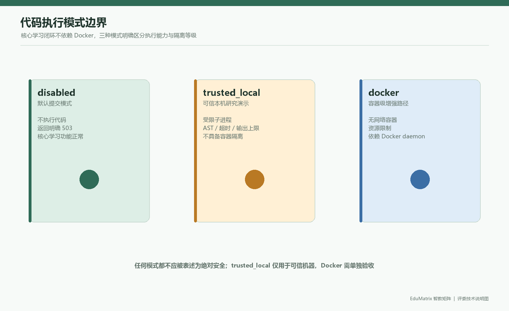

### 11.3 代码执行的统一口径

当前代码实际是 **50 KB**，证据为 `code_exec_api.py:130-136` 和 `run_code` 的 50,000 字节检查。部分已有报告写成 500 KB，这是事实错误。

### 11.4 风险判断

AST 黑名单/高风险属性拦截可以降低常见误用，但不是安全边界。`trusted_local` 明确是可信本机研究演示，虽然使用子进程、临时目录和资源上限，仍不具备容器隔离；默认提交配置保持 `disabled`，只有 `docker` 模式才具备容器级隔离能力。

生产建议：

- 沙箱未启用或 Docker 不可用时返回明确的 503；
- 使用非特权容器、只读根文件系统、关闭网络、限制 CPU/内存/PID；
- 每次任务使用一次性容器或受控 worker；
- 限制输出大小、图片数量、临时文件空间和执行队列；
- 对 AST 做 allowlist，而不仅是字符串/节点黑名单；
- 增加恶意代码负向测试和 Docker 离线测试。

### 11.5 沙箱威胁模型

| 威胁 | `disabled` | `trusted_local` | `docker` | 当前处置 |
|---|---|---|---|---|
| 运行任意代码 | 不运行 | 仍可能运行可信本机代码 | 在容器中运行 | 默认拒绝；仅显式选择模式 |
| 读取宿主文件 | 不适用 | 不能仅靠 AST 视为绝对阻断 | 依赖容器挂载和权限配置 | trusted_local 仅限可信演示 |
| 网络访问 | 不适用 | 需依赖本机子进程环境 | 容器配置关闭网络 | Docker 路径显式设置 `network_disabled` |
| 无限输出 | 不适用 | 100 KB 文本/5 MB 图片上限 | 同样受捕获和超时限制 | `LimitedBuffer`、超时、截断标记 |
| 死循环/资源耗尽 | 不适用 | 子进程超时并终止 | 容器超时、资源和生命周期控制 | Docker 实时代码仍需目标机复核 |
| 恶意导入/反射逃逸 | 不适用 | AST 与受限导入检查 | AST + 容器双层控制 | `import os` 等负向 smoke 已通过 |

因此“代码沙箱功能”在文档中必须拆成三句话：默认提交路径关闭代码执行；可信本机可用 `trusted_local` 演示安全代码；容器级隔离只有 `docker` 且 daemon、镜像、权限和资源策略全部正确时才成立。

---

## 12. 测试体系与当前结果

### 12.1 测试层级

| 层级 | 内容 | 当前状态 |
|---|---|---|
| 静态语法/结构 | AST、关键字符串、路由和模板检查 | 部分可运行 |
| 单元测试 | 算法、策略、题库、沙箱辅助逻辑 | 有专项脚本 |
| 集成测试 | Agent、RAG、对齐、题目、沙箱 | `pytest -q` 正式入口 145 passed、1 skipped；`trusted_local` smoke 通过；Docker/PDF/联网功能再结合对应环境单独复核 |
| API 测试 | FastAPI TestClient、鉴权、跨用户边界 | 选定关键路由运行时矩阵 47/47；仍需覆盖全部 API 和持久化边界 |
| 前端构建 | Vite production build | 已成功 |
| E2E | 浏览器登录到核心学习闭环 | 无 Docker E2E 已通过，报告与 6 张截图位于 `outputs/e2e_no_docker/`；Docker/PDF/目标机仍需单独验证 |
| 性能测试 | TTFT、TPS、并发、内存、锁竞争 | 当前缺少实测数据 |

### 12.2 复现结果

执行：

```text
python -m unittest scripts.test_member6_all_tasks -v
```

结果：62/62 通过。

执行：

```text
python -m pytest -q
```

结果：正式入口由 `pytest.ini` 限定为 `tests/`，避免收集 `scratch/` 实验脚本；FAISS 属于可选加速依赖，未安装时明确跳过对应模块。当前工作区 `pytest -q` 为 **145 passed、1 skipped**，另有运行时安全矩阵 47/47、无 Docker 浏览器 E2E、`trusted_local` API smoke 和前端 production build 通过。联网搜索、arXiv、视频搜索和外部 LLM 仍可能出现超时/降级日志；Docker 实时代码执行、PDF 导出和目标机清洁复现仍需在需要对应能力时单独验收。

无 Docker 浏览器 E2E 的直接证据为 `outputs/e2e_no_docker/report.json`，覆盖临时注册/登录、初始化、仪表盘、对话、学习路径和沙箱禁用状态，并生成 6 张截图。该证据证明默认核心路径可运行，不证明 Docker 代码执行、PDF 导出或生产并发能力。

`trusted_local` 的直接证据为 `outputs/trusted_local_smoke.json`，由 `scripts/trusted_local_smoke.py` 请求真实后端完成状态检查、临时账号登录、`print(6 * 7)` 输出检查和 `import os` 拦截检查。该证据证明本机研究演示链路可运行，不证明容器级隔离。

### 12.3 可选研究性评测（非当前官方 A3 硬性指标）

以下指标不是当前官方 A3 页面列出的固定达标阈值。本节仅保留为后续研究、内部对比或加分型证据设计；没有独立人工标注数据时，不得写成比赛结果。

#### 幻觉率

定义：生成内容中经人工或规则确认与知识库、教材或行业规范不一致的事实陈述数，除以全部可核验事实陈述数。

建议记录：

```text
hallucination_rate = unsupported_or_wrong_claims / all_checkable_claims
```

必须保留每条生成结果、检索证据、人工判定、错误类型和统计脚本。

#### 画像—资源适配准确率

每个样本由评审者独立判断：资源难度、表达形式、前置知识要求和目标匹配是否符合画像。建议采用双人或三人标注，并报告一致性。

```text
adaptation_accuracy = matched_resource_cases / all_evaluated_cases
```

#### 知识点覆盖率

先固定测试知识点集合，再判断生成资源是否覆盖定义、关键关系、前置条件、典型应用和常见错误。

```text
coverage = covered_required_concepts / all_required_concepts
```

### 12.4 测试证据索引

| 证据 | 位置 | 证明内容 | 不能证明的内容 |
|---|---|---|---|
| 正式回归 | `pytest -q`、`tests/` | 当前工作区自动化测试 145 passed、1 skipped | 真实用户学习效果、Docker 实时运行 |
| 安全矩阵 | `outputs/runtime_security_matrix.json` | 选定学生 A/B/教师边界 47/47 | 全部 API、全部异常和全部部署拓扑 |
| 本机可信执行 | `outputs/trusted_local_smoke.json` | 状态、正常输出 42、危险导入拦截 | 容器级隔离、恶意对抗完备性 |
| 无 Docker E2E | `outputs/e2e_no_docker/report.json` | 注册/登录、仪表盘、对话、路径、沙箱状态 | 外部模型、PDF、Docker、生产并发 |
| 浏览器截图 | `outputs/e2e_no_docker/01-06*.png` | 评委可视化证据 | 截图之外的接口正确性 |
| 前端构建 | `frontend` 下 `npm run build` | production bundle 可生成 | 目标机器静态服务器和浏览器兼容性 |
| 结构性创新证据 | `outputs/innovation_evidence/` | 三组画像、固定知识集、资源包和结构对比 | 真实标注指标达标 |

测试报告必须与以下五元信息绑定：代码版本、执行日期、解释器/依赖版本、命令和输入数据。任何只写“通过”而没有这五项的信息，都只能作为开发日志，不能作为正式验收证据。

### 12.5 三项效果指标的正式评测流程

建议把评测拆成“数据准备、生成、标注、统计、误差分析”五步：

1. **数据准备**：构造至少 3 组差异化画像，并固定同一知识库版本、问题集和生成参数；
2. **生成留痕**：保存原始问题、画像快照、Agent 事件、检索证据、最终资源和模型配置；
3. **双人标注**：对事实陈述、难度/表达适配、知识点覆盖进行独立标注，记录分歧；
4. **统计报告**：报告样本数、分母、置信区间或至少分组统计，不只报告一个百分比；
5. **误差分析**：按知识点、资源类型、画像组、证据来源和模型模式分析失败案例，并保留可复核原文。

推荐的最小样本记录：

```json
{
  "case_id": "ml-metrics-001",
  "profile_version": "profile-snapshot-001",
  "knowledge_base_version": "public-course-20260719",
  "prompt": "为什么 accuracy 高但 recall 低？",
  "agent_trace": ["profile", "planner", "theory", "mapper", "coder", "quiz", "evaluator"],
  "evidence_ids": ["public:metrics#chunk-03"],
  "resources": ["lecture", "mindmap", "code", "quiz"],
  "labels": {
    "hallucination": false,
    "adapted": true,
    "covered_concepts": ["confusion_matrix", "precision", "recall", "class_imbalance"]
  }
}
```

---

## 13. 部署与运行说明

### 13.1 前端开发环境

```powershell
cd frontend
npm install
npm run dev
```

生产构建：

```powershell
cd frontend
npm run build
```

### 13.2 后端依赖

基础声明文件是 `requirements.txt`，包含 FastAPI、Uvicorn、SQLAlchemy、HTTP 客户端、JWT、文件解析、图结构和报告生成等依赖。但源码实际还导入或动态使用 `docker`、`playwright`、`torch`、`numpy`、`chromadb`、`neo4j`、`pandas`、`matplotlib`、`faiss`、`fitz`、`python-docx`、`instructor`、`sentence_transformers`、`transformers` 等，必须区分核心、可选和脚本依赖。

建议将依赖拆成：

- `requirements-core.txt`：FastAPI、Uvicorn、SQLAlchemy、认证、基础解析；
- `requirements-ai.txt`：torch、numpy、transformers、sentence-transformers、instructor；
- `requirements-rag.txt`：faiss、chromadb、neo4j、嵌入模型依赖；
- `requirements.txt`：Web/API、算法、文档解析、Word/PDF、Playwright 和可选 Docker SDK 依赖；浏览器二进制需另行执行 `playwright install chromium`；
- `requirements-dev.txt`：pytest、覆盖率、压测和 lint。

### 13.3 Docker 现状

Dockerfile 使用 Node 20 Alpine 构建前端，再使用 Python 3.11 slim 运行后端。当前 Dockerfile：

- 安装 curl；
- 安装 `requirements.txt`；
- 已安装 Docker Python SDK；
- 已安装 Playwright Chromium 和系统依赖；目标机器仍需实际构建和启动验收；
- 没有声明生产密钥校验；
- 直接使用 Uvicorn 单进程启动。

因此，Dockerfile 已覆盖当前核心依赖和 PDF 浏览器安装，但 Docker 部署仍是可选路径，代码沙箱是否可用还取决于 `EDUMATRIX_SANDBOX_MODE`、daemon 访问权限和独立 worker 安全设计。

### 13.4 环境变量

重点配置包括：

- LLM provider、endpoint、API key、model、temperature、timeout；
- 并发、RPM/TPM、熔断和重试；
- embedding provider、top-k、辩论门限和对齐门限；
- FAISS、ChromaDB、Neo4j；
- JWT secret、算法和过期时间；
- `EDUMATRIX_SANDBOX_MODE`（默认 `disabled`；`docker` 才启用隔离代码执行）；
- 沙箱超时时间。

`config.py` 在开发环境缺少密钥时生成临时随机值；生产环境必须提供唯一、高熵且至少 32 字符的 `EDUMATRIX_AUTH_SECRET_KEY`，否则启动失败。固定占位值 `edumatrix_super_secret_v1_2026` 已不再作为有效生产默认值。

### 13.5 评委清洁环境复现顺序

推荐在 Windows 10/11、Python 3.11 和 Node.js 20 LTS 上执行：

```powershell
cd D:\project-edumatrix\edumatrix-main
py -3.11 -m venv .venv
.venv\Scripts\python.exe -m pip install --upgrade pip
.venv\Scripts\python.exe -m pip install -r requirements.txt
cd frontend
npm ci
cd ..
Copy-Item .env.example .env
```

然后在 `.env` 中至少设置：

```dotenv
EDUMATRIX_ENV=development
EDUMATRIX_AUTH_SECRET_KEY=<至少32字符的随机值>
EDUMATRIX_DEMO_MODE=0
EDUMATRIX_LLM_PROVIDER=deterministic
EDUMATRIX_EMBEDDING_PROVIDER=hash
EDUMATRIX_SANDBOX_MODE=disabled
```

先启动后端，再启动前端：

```powershell
.venv\Scripts\python.exe -m uvicorn app.main:app --host 127.0.0.1 --port 8000
cd frontend
npm run dev -- --host 127.0.0.1
```

验收顺序：

```text
GET /api/health
 -> 注册/登录
 -> Dashboard
 -> Learn 对话（deterministic）
 -> Knowledge 公共文档列表
 -> Learning Path
 -> Quiz/Wrong Questions/Revision
 -> GET /api/code/status 确认 disabled
```

项目根目录的 `start.bat` 是本机演示快捷入口，它会执行预检并将当前后端进程的 `EDUMATRIX_SANDBOX_MODE` 设置为 `trusted_local`，方便在可信开发机演示代码；这不代表 `.env.example` 的默认配置，也不代表 Docker 隔离。正式评委验收若不演示代码，应使用上面的手动启动方式或在启动前明确恢复为 `disabled`。

### 13.6 配置档位

| 档位 | LLM | Embedding | 沙箱 | 适用目的 |
|---|---|---|---|---|
| `offline-core` | deterministic | hash | disabled | 评委核心闭环、无外网无 Docker |
| `trusted-demo` | deterministic 或真实文本模型 | hash/外部 | trusted_local | 可信本机展示代码和多模态界面 |
| `provider-demo` | 外部文本/视觉模型 | hash 或外部 | disabled/trusted_local | 展示真实模型输出，需自备 Key |
| `isolated-code` | 任意 | 任意 | docker | 需要容器代码执行时的增强路径 |

四个档位不能混写成“系统默认同时具备全部能力”。每次演示前应在 `/api/code/status`、设置页模型测试和 `/api/health` 上确认实际档位。

---

## 14. 安全、风险与能力边界

| 编号 | 等级 | 风险 | 证据 | 现状与处置 |
|---|---|---|---|---|
| S-01 | Critical | 无 Token 自动进入 demo-student | `app/auth.py`、`config.py` | **已修复；默认 401，Demo 需显式配置** |
| S-02 | Critical | 多个 API 信任客户端 student_id | 主要业务 API 和旧版笔记/复习接口 | **选定关键路由已修复；运行时矩阵 47/47，通过但未穷尽全部 API** |
| S-03 | Critical | 用户文档进入全局 RAG 索引且检索无 owner 过滤 | `knowledge_api.py`、`rag_engine.py` | **已修复；owner 过滤专项测试通过** |
| S-04 | High | Docker 不可用时退化为宿主子进程 | `code_exec_api.py` | **已修复为拒绝执行；生产仍建议独立 worker** |
| S-05 | High | LLM 辩论构造或异步边界错误 | `agent_swarm.py`、`drag_debate.py` | **已修复；主异步路径注入 LLM 并使用 `aclean()`，真实 provider 仍需目标环境验收** |
| S-06 | High | 实际依赖未完整声明或容器环境未验证 | `requirements.txt`、`Dockerfile` | 核心依赖和 Chromium 安装步骤已补；目标机器 Docker 构建、可选 provider 和实机复现待完成 |
| S-07 | High | JWT 固定默认密钥 | `config.py` | **已修复；生产启动强制校验** |
| S-08 | High | Swarm cache/profile cache 无明确容量和 TTL | `swarm_factory.py:8-59`、`agent_swarm.py` | 采用有界 TTL/LRU |
| S-09 | High | 上传/远程下载内存限制 | `knowledge_api.py`、`document_parser.py` | **已补齐本地/远程文件、URL HTML 内容、页数、压缩包和解析超时限制；目标机压力仍需复核** |
| S-10 | Medium | arXiv 缓存路径使用未导入 datetime 且静默吞异常 | `rag_engine.py:888-901` | 修复导入、日志和测试 |
| S-11 | Medium | MIRT 极端值存在除零路径 | `mirt_engine.py:420-429` | 边界值夹断并加单测 |
| S-12 | Medium | 报告写成 500 KB，代码实际 50 KB | `code_exec_api.py:130-136` | 统一所有材料 |
| S-13 | Medium | 报告版本、路径和测试结论混用 | `reports/*.md` | 统一基线和证据索引 |

---

## 15. 结论与验收说明

### 15.1 评委建议验收路径

```text
启动后端与前端
  -> 访问 /api/health
  -> 注册/登录并完成学习画像
  -> 对同一问题观察 Agent Timeline、检索证据和资源差异
  -> 查看公共课程知识库与来源/可见性
  -> 提交题目，观察掌握度、错题和复习计划变化
  -> 查看学习路径、画像分析和 /api/code/status
```

### 15.2 当前能力与证据边界

| 能力域 | 当前结论 | 评审口径 |
|---|---|---|
| 核心学习闭环 | 已证实 | 已形成“画像—规划—检索—生成—校验—反馈”的可运行链路 |
| 多智能体结构 | 已证实/部分实现 | 已定义 9 个职责角色并完成统一编排；真实外部模型效果需按配置验收 |
| 个性化资源 | 已证实（结构） | 支持讲义、导图、代码、题目和脚本任务；质量指标需要独立标注 |
| 公共课程知识库 | 当前数据库快照已证实 | 当前开发机有 25 份公共课程文档；清洁环境需按交付包说明重建 |
| 用户私有知识库 | 主要路径已证实 | 上传、解析、owner 过滤和删除有代码与专项测试；持久化向量后端需复测 |
| 多模态能力 | 接口已具备 | 设置页提供视觉模型配置和测试；无外部 Key 时不宣称真实视觉识别 |
| 代码执行 | 按模式成立 | `disabled` 关闭，`trusted_local` 为可信研究演示，`docker` 才是容器隔离 |
| 认证与数据范围 | 选定高风险边界已证实 | 47/47 运行时矩阵通过，但不等于全部 API 的穷尽安全认证 |
| 工程回归 | 当前工作区已证实 | 145 passed、1 skipped，并有 E2E、smoke 和前端构建证据 |
| 比赛效果指标 | 尚无达标结论 | 幻觉、适配和覆盖率提供评测方法，不把合成样例写成真实实验 |

### 15.3 最终结论

EduMatrix 已完成面向机器学习导论的多智能体个性化教育原型、核心工程链路、公共课程知识库快照、认证与 RAG 边界控制，以及无 Docker 默认验收证据。系统将一次学习请求拆分为可观察的诊断、规划、检索、生成、校验和反馈过程，并通过统一的资源、引用、状态和对齐字段保持可解释性。

本文保留必要的技术边界：真实外部模型和视觉模型需要评委自备配置；`trusted_local` 不等于 Docker 安全隔离；可选研究性指标没有独立人工标注集时不能宣称达标。根据队伍提供的官方 A3 页面，演示视频与 PPT 文档计入 10% 评分，本文和新 PPT 均按该要求准备；最终提交形式以官方系统最新通知为准。

---

## 附录 A：关键文件与证据索引

| 主题 | 主要文件/目录 | 用途 |
|---|---|---|
| 应用入口 | `app/main.py` | FastAPI 应用、启动事件、登录、旧版兼容路由和总路由注册 |
| 身份与权限 | `app/auth.py` | JWT、密码摘要、当前用户、学生范围、教师权限 |
| 数据模型 | `app/database.py`、`models.py` | SQLAlchemy 表、画像对象、领域数据结构 |
| Agent 编排 | `agent_swarm.py`、`swarm_factory.py` | Agent 规格、异步处理、资源工厂和模型注入 |
| 流式交互 | `stream_api.py`、`frontend/src/api/stream.js` | SSE 事件、前端增量渲染和取消请求 |
| LLM 客户端 | `llm_client.py` | OpenAI-compatible、确定性模型、重试、限流、熔断 |
| RAG | `rag_engine.py`、`vector_store.py` | 图谱/文本/公式/视觉/用户文档融合检索 |
| 证据清洗 | `drag_debate.py` | 评分、去重、冲突和可选 LLM 辩论 |
| 知识摄入 | `knowledge_api.py`、`document_parser.py`、`ingestion.py` | 上传、解析、分块、索引和删除 |
| 学情算法 | `bkt_engine.py`、`mirt_engine.py`、`learning_strategy.py` | 掌握度、题目参数、策略和复习 |
| 代码执行 | `code_exec_api.py` | AST 检查、trusted_local、Docker、输出和状态接口 |
| 前端 | `frontend/src/views`、`frontend/src/components` | 页面、资源卡片、图表、知识图谱和设置 |
| 测试 | `tests/`、`scripts/test_member6_all_tasks.py` | 正式回归、专项安全和算法测试 |
| E2E 证据 | `outputs/e2e_no_docker/` | 无 Docker 浏览器报告和截图 |
| 安全证据 | `outputs/runtime_security_matrix.json`、`outputs/trusted_local_smoke.json` | 运行时范围矩阵和可信本机 smoke |
| 原始素材 | `data/raw/github_repos/`、`data/manifest/` | 课程素材、来源、资产和许可证线索 |

## 附录 B：环境变量速查表

| 变量 | 示例 | 作用 | 提交建议 |
|---|---|---|---|
| `EDUMATRIX_ENV` | `development` | 运行环境和密钥策略 | 提交示例，不放真实生产值 |
| `EDUMATRIX_AUTH_SECRET_KEY` | 随机 48 字符 | JWT 签名 | `.env.example` 留空，评委自行生成 |
| `EDUMATRIX_DEMO_MODE` | `0` | 是否启用显式演示模式 | 正式验收保持 `0` |
| `EDUMATRIX_LLM_PROVIDER` | `deterministic` | 文本模型 provider | 离线核心使用 deterministic |
| `EDUMATRIX_LLM_ENDPOINT` | OpenAI-compatible URL | 文本模型端点 | 不写真实 Key |
| `EDUMATRIX_LLM_API_KEY` | 空 | 文本模型密钥 | 绝不提交 |
| `EDUMATRIX_MULTIMODAL_LLM_ENDPOINT` | 视觉兼容 URL | 视觉模型端点 | 评委自配 |
| `EDUMATRIX_MULTIMODAL_LLM_API_KEY` | 空 | 视觉模型密钥 | 绝不提交 |
| `EDUMATRIX_EMBEDDING_PROVIDER` | `hash` | 嵌入方式 | 无模型下载时用 hash |
| `EDUMATRIX_USE_FAISS` | `0` | 是否启用 FAISS | 目标机器安装后再开 |
| `EDUMATRIX_SANDBOX_MODE` | `disabled` | 代码执行模式 | 默认关闭；trusted_local 仅可信演示 |
| `EDUMATRIX_SANDBOX_MAX_OUTPUT_BYTES` | `100000` | 文本输出上限 | 与图片上限分离 |
| `EDUMATRIX_SANDBOX_MAX_VISUAL_BYTES` | `5000000` | 图片输出上限 | 防止 3D/Base64 撑爆响应 |
| `EDUMATRIX_MAX_UPLOAD_BYTES` | `20971520` | 上传大小上限 | 与页数、压缩包限制共同生效 |

## 附录 C：接口验收顺序

| 顺序 | 请求 | 预期 | 失败说明 |
|---:|---|---|---|
| 1 | `GET /api/health` | HTTP 200 | 后端未启动或依赖导入失败 |
| 2 | `POST /api/auth/register` / `login` | 返回 JWT | 数据库、密码或字段错误 |
| 3 | `GET /api/profile/{student_id}` | 返回当前画像 | Token/学生范围不匹配 |
| 4 | `GET /api/knowledge/list` | 返回公共/私有可见文档 | owner 或数据库错误 |
| 5 | `POST /api/stream/chat` | SSE 完整结束 | LLM/RAG/前端代理问题 |
| 6 | `POST /api/quiz/evaluate` | 返回判分和反馈 | 题目格式或画像更新失败 |
| 7 | `GET /api/profile/{student_id}/learning-path` | 返回路径节点 | 图谱或算法降级 |
| 8 | `GET /api/code/status` | 显示模式和隔离等级 | 沙箱初始化/配置问题 |
| 9 | `GET /api/llm/test-vision` | 真实视觉响应或明确 warning | Endpoint/Key/模型不兼容 |

## 附录 D：术语表

| 术语 | 解释 |
|---|---|
| Agent | 具有明确输入、职责、输出和协作边界的智能体角色 |
| Agent Swarm | 多个 Agent 在统一编排器下完成诊断、规划、生成和评估 |
| ZPD | 最近发展区；根据当前掌握度和目标选择适当难度的学习区间 |
| RAG | 检索增强生成；先检索证据，再将证据提供给生成模块 |
| DRAG | 本项目对证据清洗/辩论式检验模块的称呼 |
| VisRAG | 将图片、动画或视觉证据纳入检索的可选路径 |
| BKT | Bayesian Knowledge Tracing，贝叶斯知识追踪 |
| DKT | Deep Knowledge Tracing，基于序列模型的知识追踪 |
| MIRT/IRT | 多维/单维项目反应理论，用于能力和题目参数估计 |
| SSE | Server-Sent Events，服务端向浏览器持续推送文本事件 |
| `deterministic` | 不依赖外部模型的确定性演示/降级引擎，不等于真实大模型 |
| `trusted_local` | 可信本机受限子进程模式，不提供容器级隔离 |
| owner 过滤 | 证据、文档和行为数据按当前用户身份限制可见范围 |

## 附录 E：来源、授权与隐私说明

1. 项目使用的 GitHub 原始素材应以 `data/manifest/` 中的来源和许可证记录为准；不要把整个 `data/raw/github_repos/` 目录默认视作可再分发教材。
2. 公共课程文档、题库和合成学生画像属于比赛演示数据；若使用真实学习者数据，应先脱敏并取得合法授权。
3. `.env`、API Key、JWT 密钥、SQLite 运行库和未经脱敏的用户上传资料不应进入公开提交包。
4. 技术文档中的三组画像、性能数字和结构性对比，只能在原始 JSON/日志存在时作为演示证据；没有人工标注时不得改写成真实调研结论。
5. 官方参赛信息以报名系统最终保存内容为准，本文记录的队伍名称、成员和指导教师用于技术材料识别，不替代官方报名表。

## 附录 F：已知限制与能力边界

| 关注事项 | 当前限制 | 对验收的影响 | 能力边界/说明 |
|---|---|---|---|
| 交付数据 | 清洁提交包不包含当前 SQLite 运行库 | 评委重建后需要重新导入公共课程 | 公共课程快照的数量和可见性已在本文与运行截图中说明；数据库是否随作品交付以官方要求和授权为准 |
| 效果评测 | 当前没有独立人工标注集 | 不能声称幻觉/适配/覆盖率达标 | 文档提供统一样本格式、标注定义和计算方法 |
| 代码执行 | Docker 实时代码执行依赖目标机 daemon | 无 Docker 时只验收核心学习闭环和 disabled 边界 | `trusted_local` 仅为可信本机研究演示，容器隔离需 Docker 环境 |
| 可选服务 | PDF 导出和真实视觉模型需要额外依赖 | 缺失时不影响核心学习功能 | Chromium 和视觉 API 由评委按需配置 |
| 数据层 | SQLite 单文件面向单机验收 | 不代表高并发多租户生产架构 | 当前实现强调可复现和低部署门槛，生产化可迁移 PostgreSQL |
| 运行时 | 进程内缓存和索引随单进程生命周期 | 服务重启后可能需要重建索引 | 通过容量、TTL 和 owner 过滤控制当前单机风险 |
| 教学效果 | 尚无真实用户前后对照实验 | 不宣称长期学习收益 | 合规条件满足后可进行基线组与统计显著性分析 |
