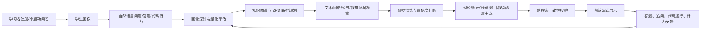
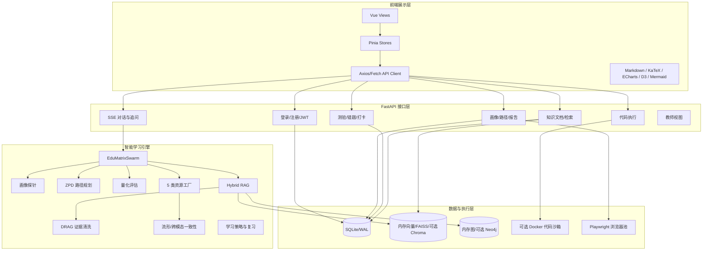
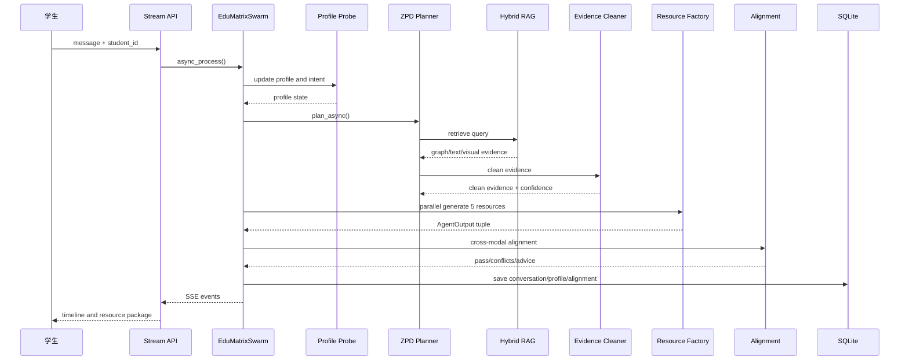
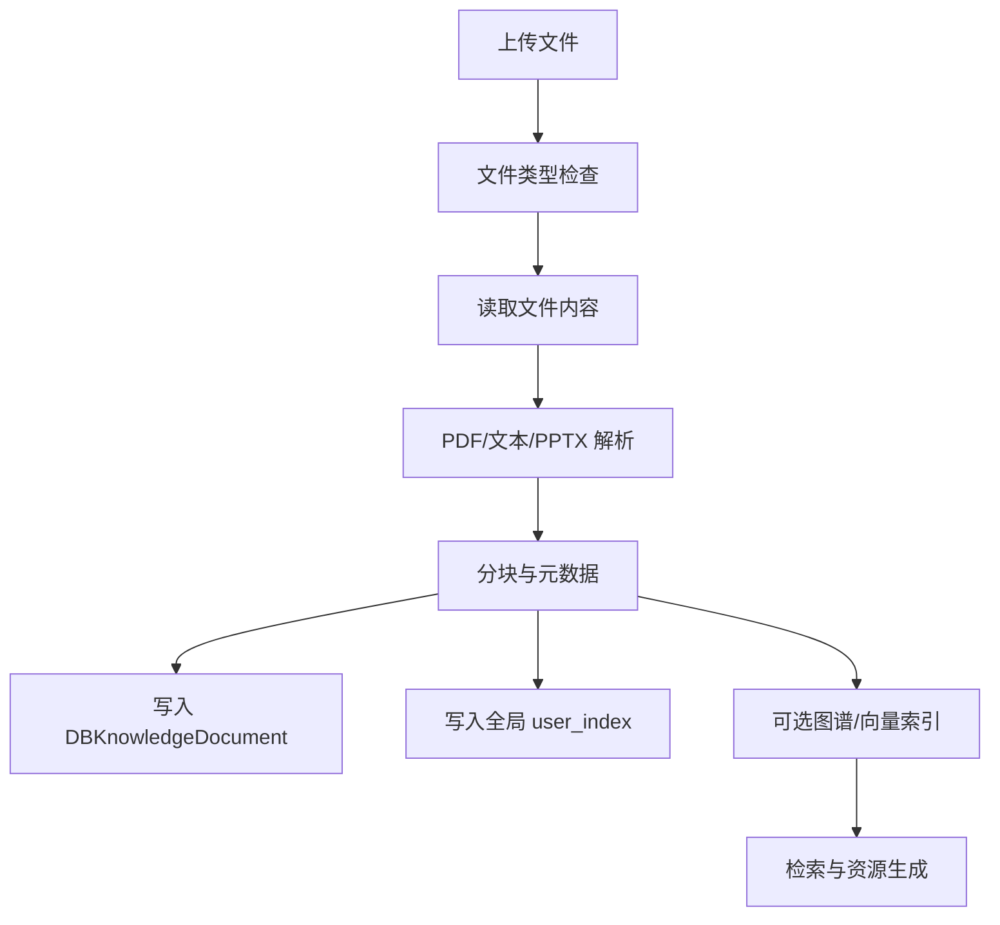
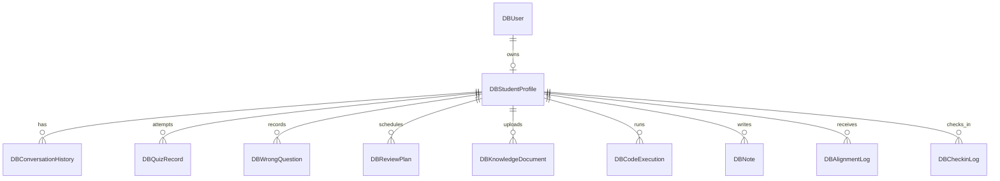

# EduMatrix 智教矩阵

## 领域知识个性化生成与多智能体协同决策系统

### 完整技术文档总稿（事实校验版）

文档版本：V1.0（基于代码基线 `2952dc1b17d793e5d76f54e1764348ebe50e4d5e`）  
生成日期：2026-07-19  
项目目录：`D:\project-edumatrix\edumatrix-main`  
适用场景：比赛材料、技术评审、部署交接、答辩准备

> 本文档严格区分四类结论：
>
> - **已证实**：可以由当前源码、配置、仓库数据或实际命令输出直接证明。
> - **部分实现**：代码中存在主要路径，但存在未接入、异常降级、配置缺口或运行条件限制。
> - **待验证**：需要完整依赖、外部服务、Docker、浏览器或真实实验数据才能确认。
> - **规划/建议**：为生产化和比赛指标补齐提出的后续方案，不能当作当前已交付能力。

---

## 1. 项目摘要

EduMatrix 是面向机器学习导论等垂直知识领域的个性化学习资源生成系统。系统以学生的专业背景、学习目标、认知风格、答题记录、错题、对话历史和行为反馈为输入，通过学情画像、知识路径规划、混合检索、证据清洗和多角色资源生成，输出讲义、思维导图、代码实操案例、练习题以及视频/TTS 脚本等学习资源。

系统的核心产品闭环为：



当前代码已经形成较完整的教育智能体工程骨架，包含 Vue 3 前端、FastAPI 后端、SQLite/WAL 持久化、Agent Swarm、混合 RAG、学情算法、SSE 流式交互、错题与间隔复习、代码执行和 PDF 导出等模块。

但当前版本不能直接被描述为“已经达到比赛全部量化指标的生产系统”。必须明确以下事实边界：

1. `agent_swarm.py:34-44` 定义了 9 个职责明确的 Agent 规格，满足“至少 3 个 Agent”的结构性要求；但 `agent_swarm.py:1323` 创建 `DebateAugmentedRAG()` 时没有把 LLM 注入辩论引擎，因此 Prover-Challenger-Judge 的真实 LLM 辩论路径不是当前默认主流程。
2. 本轮已为主要 API 接入当前用户和学生范围校验；选定的 A/B/教师运行时安全矩阵 47/47 通过，但矩阵不是全部 API、持久化边界和删除场景的穷尽证明，不能把“选定关键路由已修复”写成“所有接口均已完成多租户认证”。
3. 用户知识文档摄入、检索和删除已加入 owner 过滤，并通过专项契约与选定运行时矩阵；真实持久化索引清理、删除后检索和全部边界仍需复测。
4. Docker 不可用时，代码执行会明确拒绝，不再回退宿主 Python 子进程；生产环境仍建议拆分独立 sandbox worker。
5. 当前工作区已安装核心 Python 依赖并通过专项测试；默认无 Docker 模式已完成浏览器 E2E 和主要回归，代码执行、PDF 导出、外部网络和真实 LLM 仍按可选环境能力单独验收，不能把专项测试写成“全量系统安全认证”。
6. 当前软件杯 A3 赛题重点是基于大模型的个性化资源生成与学习多智能体系统。旧挑战杯材料中的“幻觉率 <5%、适配率 ≥85%、知识点覆盖率 ≥90%”不应当作本赛题硬性门槛；本项目仍将三项指标作为可选的效果评测设计，并明确标注尚无真实标注集结论。

---

## 2. 赛题要求与项目对齐

赛题文件：`赛题/competition_rules.txt`。项目固定场景为机器学习导论，属于人工智能/机器学习垂直技能培训场景。

### 2.1 赛题核心要求追踪表

| 赛题要求 | 当前项目对应能力 | 当前证据 | 状态与说明 |
|---|---|---|---|
| 至少 3 个职责明确的智能体 | 画像探针、路径规划师、量化评估师、教学路由、理论教授、逻辑画师、极客助教、考官、虚拟导演 | `agent_swarm.py:34-44` | **已证实（结构）**。Agent 规格和主要实现类存在 |
| 分析—生成—校验—决策闭环 | 画像分析、ZPD 规划、RAG 检索、资源并发生成、流形对齐、反馈更新 | `agent_swarm.py:1363-1640`、`stream_api.py:387-约1000` | **部分实现**。流程存在，但异常路径和鉴权需整改 |
| 至少 3 种个性化资源 | 讲义、思维导图、代码案例、练习题、虚拟人视频脚本 | `agent_swarm.py:929-938`、资源工厂 | **已证实（生成任务）**。外部视频真实生成仍需区分脚本/推荐/成片 |
| 学习者先验知识画像 | 专业、认知风格、动机、掌握度、弱点、学习目标、交互偏好、历史等 | `models.py`、`app/database.py` | **已证实（数据结构）** |
| 至少 2 组差异化初始学情数据 | 注册问卷、种子学生/Peer 画像、题库数据 | `scripts/seed_students.py`、数据库种子数据 | **部分实现**。当前主要是虚拟或模拟数据 |
| 至少 1 个专业知识库切片 | 机器学习课程概念、题库、RAG 证据和用户文档摄入 | `scripts/data/quiz_bank/`、`rag_engine.py` | **部分实现**。需为提交包固定一份可复核知识库切片 |
| 动态反馈与学习路径更新 | 答题、错题、代码错误、行为日志、BKT/策略更新、复习计划 | `quiz_api.py`、`behavior_api.py`、`learning_event_bus.py` | **部分实现**。需要运行验证事件链和数据一致性 |
| 个人学情与资源匹配可视化 | Dashboard、画像雷达、知识图谱、学习路径、流形可视化 | `frontend/src/views/Dashboard.vue`、`StudentAnalysis.vue`、`ManifoldVisualizer.vue`、`outputs/e2e_no_docker/` | **已证实（默认路径）**；外部 LLM 和全部资源类型仍需按环境复核 |
| 防幻觉与知识溯源 | 混合 RAG、证据评分、DRAG 清洗、引用字段、对齐检查 | `rag_engine.py`、`drag_debate.py`、`manifold_alignment.py` | **部分实现**。默认辩论链路未接入 LLM |
| 幻觉率/适配率/覆盖率 | 代码有门限、证据清洗、画像资源匹配和知识图谱设计 | 当前无完整真实标注评测数据 | **可选评测项，不得冒充本赛题硬性达标结论** |
| 可部署、可运行、可复现 | Dockerfile、docker-compose、前端构建、启动脚本、环境备忘录 | 无 Docker 核心路径已由浏览器 E2E 复现；Docker 实时代码执行、PDF 导出和目标评委机仍需复核 | **部分实现（默认路径已证实）** |

### 2.2 对比赛评分维度的解释

#### 作品完整性（30 分）

项目具备从画像到资源生成的主要代码模块，结构上覆盖比赛要求。但“完整性”不仅要求代码文件存在，还要求评委能够从差异化画像输入开始，看到 Agent 协同过程、生成资源、反馈更新和再次决策。当前需要补充：

- 两到三组固定输入输出样例；
- Agent 时间线或事件流截图；
- 资源生成前后的画像变化；
- 答题/代码行为如何触发路径或资源变化的证据；
- 后端依赖和可选 Docker 环境下的可复现代码演示。

#### 技术创新性（25 分）

项目的可写创新包括：多 Agent 资源工厂、混合 RAG、证据清洗、Poincaré/流形对齐、BKT/DKT/滤波、行为反馈和个性化资源排序。但必须区分：

- 算法或类在源码中存在；
- 算法参与默认主流程；
- 算法在真实数据集上取得了统计效果。

例如，`DebateAugmentedRAG` 类存在并包含 LLM 分支，但 `EduMatrixSwarm` 的构造器没有传入 `llm`，所以不能把默认运行结果表述为“真实三模型辩论已经完成”。

#### 用户体验（15 分）

前端包含登录、引导、学习对话、知识库、错题、复习、学习路径、画像分析、教师端、设置等页面，并且实现 SSE 流式接收、Markdown/公式/图表/可视化组件。需要通过实际浏览器截图证明：

- 页面能够正常加载；
- SSE 事件能够完整结束；
- Agent Timeline 与资源卡片能够展示；
- 公式和 Mermaid 不会因为构建警告而失效；
- 代码沙箱、知识上传和 PDF 导出在目标环境中可用。

#### 实用价值（30 分）

赛题给出的三项量化指标必须使用独立测试集。当前文档只能描述评测方案，不能伪造结果。建议至少构造：

- 3 组不同背景学习者画像；
- 1 个固定机器学习知识库切片；
- 50 组以上知识点—资源生成—人工判定样本；
- 统一的幻觉、适配、覆盖率标注表；
- 生成结果、证据引用、人工判定和计算脚本的完整链路。

---

## 3. 需求层面分析

### 3.1 目标用户

本系统的需求分析针对以下三类用户，当前属于基于赛题和产品场景的设计性需求分析；如果团队拥有问卷、访谈或真实试用数据，应在提交材料中另行列出样本量、时间、问卷和统计过程。

| 用户类型 | 典型背景 | 主要痛点 | 系统响应 |
|---|---|---|---|
| 计算机专业本科生 | 有编程基础，机器学习理论不系统 | 概念会背但不会迁移到代码和项目 | 理论讲义 + 代码实操 + 相似题 |
| 跨专业学习者 | 数学或工程基础不均衡 | 前置知识缺口导致学习路径跳跃 | 画像诊断 + 前置回滚 + 分阶解释 |
| 备考/项目型学习者 | 有明确考试或项目目标 | 时间有限，需要优先学习薄弱点 | 目标驱动路径 + 错题复习 + 资源排序 |
| 教师/培训管理者 | 需要观察班级或学生状态 | 难以同时跟踪多名学习者 | 教师面板、画像报告和学习进度 |

### 3.2 大学生学习需求拆解

1. **从知识理解到工程迁移**：学习者不只需要定义，还需要公式、反例、代码、结果解释和错误诊断。
2. **前置知识可见化**：学习者经常不知道自己为什么不会，需要看到概念依赖、前置节点和当前薄弱点。
3. **资源难度适配**：同一知识点需要为不同基础的人提供基础解释、图示、代码或挑战任务。
4. **反馈及时且可操作**：答题后不能只有对错，还需要错因、下一步行动、相似题和复习时间。
5. **专业知识可信**：领域知识生成必须有来源、证据和拒答/低置信度处理。
6. **学习过程可追踪**：学习者和教师需要看到掌握度、错题、路径、行为和阶段性变化。

### 3.3 功能需求

| 编号 | 需求 | 输入 | 输出 | 验收证据 |
|---|---|---|---|---|
| R-01 | 注册与冷启动画像 | 用户名、密码、专业、认知风格、动机 | JWT、学生画像、先验状态 | `/api/auth/register`、`DBStudentProfile` |
| R-02 | 个性化对话答疑 | 学生问题、画像、历史 | SSE 事件、讲义/导图/代码/题目等资源 | `/api/stream/chat`、Agent 事件 |
| R-03 | 知识检索与引用 | 查询、课程知识、用户文档 | 证据、图谱路径、置信度 | `rag_engine.py`、RAG 结果 |
| R-04 | 学情诊断 | 答题、错题、行为、代码错误 | 掌握度、弱点、不会原因 | `models.py`、BKT/画像更新 |
| R-05 | 自适应测验 | 知识点、难度、历史 | 分阶题目、判分、反馈 | `quiz_api.py`、题库测试 |
| R-06 | 错题与间隔复习 | 错题、质量评分 | 复习计划、Anki 卡片、相似题 | `anki_engine.py`、`flashcard_api.py` |
| R-07 | 代码实操 | Python 代码 | stdout、stderr、执行时长、图片 | `code_exec_api.py` |
| R-08 | 学习路径与可视化 | 画像、目标、概念图 | 路径节点、完成率、认知负荷 | `profile_api.py`、前端路径图 |
| R-09 | 文档知识库 | PDF/文本/PPTX 等 | 文档记录、分块、检索证据 | `knowledge_api.py`、`document_parser.py` |
| R-10 | 学情报告导出 | 学生 ID、画像数据 | PDF/HTML 报告 | `report_api.py`、Playwright |
| R-11 | 教师视图 | 教师身份、学生数据 | 班级/学生概览 | `app/main.py` 教师接口 |

### 3.4 非功能需求

- **安全性**：所有用户数据访问必须绑定服务端身份；代码执行不得回退到宿主同权限子进程；上传必须有大小、类型和资源限制。
- **可靠性**：外部 LLM、Neo4j、向量库和浏览器缺失时，应有可观测、可控的降级，而不是静默改变安全边界。
- **可复现性**：依赖、浏览器、环境变量、数据库初始化、样例数据和测试命令必须固定。
- **可解释性**：每次资源生成应能够说明画像依据、检索证据、Agent 角色、校验结果和下一步动作。
- **性能**：SSE 不应阻塞事件循环；缓存、Agent 实例和浏览器进程必须有上限和生命周期。

---

## 4. 总体技术架构

### 4.1 分层架构



### 4.2 代码模块职责

| 模块 | 主要文件 | 设计职责 | 当前审计结论 |
|---|---|---|---|
| 应用入口 | `app/main.py` | FastAPI 初始化、登录、教师端、旧版接口、路由注册 | 路由较多，部分旧接口和新接口并存 |
| 身份认证 | `app/auth.py` | bcrypt 密码、JWT、用户和教师依赖 | 默认缺 Token 返回 401；仅显式 Demo 模式允许演示账号；生产密钥有启动门禁 |
| 数据库 | `app/database.py` | SQLite/WAL、SQLAlchemy 模型、线程池数据库操作 | 当前主要是单文件 SQLite，不是完整多租户数据库 |
| 画像 CRUD | `app/crud.py` | 画像序列化、Peer 先验校准、笔记、历史、复习计划 | 主要读写路径已接入学生范围和记录归属过滤 |
| Agent 编排 | `agent_swarm.py` | Agent 规格、画像、规划、资源生成、对齐、自愈 | 主要闭环存在，辩论 LLM 注入存在缺口 |
| LLM 客户端 | `llm_client.py` | OpenAI 兼容接口、供应商配置、确定性 fallback | 外部服务依赖和 fallback 语义需明确 |
| RAG | `rag_engine.py` | 文本、图谱、公式、视觉、用户文档检索 | 用户文档路径已加入 owner 过滤；arXiv 缓存异常仍需治理 |
| 证据清洗 | `drag_debate.py` | 证据评分、确定性清洗、可选 LLM 辩论 | 默认构造未注入 LLM |
| 学情算法 | `bkt_engine.py`、`mirt_engine.py`、`learning_strategy.py` | BKT、EKF、DKT、MIRT、复习策略 | 有边界数值和环境依赖风险 |
| 知识摄入 | `knowledge_api.py`、`document_parser.py` | 上传、解析、分块、图谱和向量写入 | 已认证；本地上传和远程文件下载有大小上限，URL HTML 摄入仍待限流 |
| 代码执行 | `code_exec_api.py` | AST 检查、可选 Docker 池、超时、输出捕获 | 默认禁用且不连接 Docker；显式启用 Docker 后才执行；未启用时明确拒绝 |
| 前端 | `frontend/src` | 页面、路由、Pinia、SSE、可视化和资源卡片 | 构建可成功，但存在分包和 KaTeX 警告 |

### 4.3 路由分组

当前注册的路由前缀包括：

| 前缀 | 文件 | 业务 |
|---|---|---|
| `/api/knowledge` | `knowledge_api.py` | 文档上传、文档列表、图谱和跨模态搜索 |
| `/api/quiz` | `quiz_api.py` | 题目生成、评估、自适应、错题、打卡 |
| `/api/web` | `web_search_api.py` | 网页、URL、arXiv 检索 |
| `/api/code` | `code_exec_api.py` | 代码执行和历史 |
| `/api/profile` | `profile_api.py` | 画像、分析、路径、推荐和回滚 |
| `/api/stream` | `stream_api.py` | SSE 对话、资源重生成、划词追问 |
| `/api/v1/animations` | `animation_api.py` | 动画资源和视频文件 |
| `/api/flashcard` | `flashcard_api.py` | 闪卡生成、复习、到期卡片 |
| `/api/behavior` | `behavior_api.py` | 行为日志 |
| `/api/v1/profile` | `report_api.py` | PDF 学情报告 |

---

## 5. 多智能体协同设计

### 5.1 Agent 矩阵

`agent_swarm.py:34-44` 定义了 9 个 AgentSpec：

| Agent | 职责 | 主要输入 | 主要输出 |
|---|---|---|---|
| 画像探针 `profile` | 从消息和历史中更新画像、弱点和不会原因 | 学生消息、历史、知识点 | 画像字段、证据、置信度 |
| 路径规划师 `planner` | 根据知识图谱、掌握度和 ZPD 规划学习路径 | 画像、目标概念、图谱 | 目标、前置边、路径、检索查询 |
| 量化评估师 `evaluator` | 综合答题、代码、行为和资源反馈 | 画像、资源、反馈 | 资源效果、建议、重规划信号 |
| 教学路由 `router` | 对问题意图和学习状态进行 FSM 分发 | 消息、画像、模式 | 处理模式、目标资源和 handoff |
| 理论教授 `theory` | 生成有证据约束的专业讲义 | 查询、证据、画像 | 定义、推导、例子、引用 |
| 逻辑画师 `mapper` | 生成知识结构和 Mermaid 思维导图 | 图谱路径、证据 | 图表/导图文本 |
| 极客助教 `coder` | 生成并改进可运行代码案例 | 查询、讲义、画像 | 代码、注释、可视化 |
| 考官 `quiz` | 生成分阶练习题并提供解析 | 概念、难度、历史 | MCQ/主观题、评分标准 |
| 虚拟导演 `director` | 生成视频/TTS 脚本或推荐信息 | 资源主题、偏好 | 脚本、推荐描述或播放信息 |

### 5.2 正常流程



### 5.3 真实实现边界

- 资源工厂使用 `asyncio.gather(..., return_exceptions=True)` 并发生成，单个 Agent 出错时会返回“暂时不可用”的资源结果，整体流程不一定失败。
- 资源生成支持 `regenerate_only` 和历史资源复用，属于局部重写机制。
- 对齐失败后会从冲突中推断责任 Agent 并构造纠偏指令。
- `EduMatrixSwarm.__init__` 中 `self.debate = DebateAugmentedRAG()` 没有传入 `use_llm`，导致 `drag_debate.py:38-41` 的 LLM 分支默认不会执行。
- `drag_debate.py:171-181` 使用 `run_until_complete` 获取异步 LLM 结果；如果该路径在已经运行的事件循环中被触发，会产生 `RuntimeError` 风险。
- `agent_swarm.py:1665` 的同步 `process()` 也通过事件循环桥接异步流程，调用边界必须在测试中明确。

因此，参赛文档应表述为：“系统实现了可选的证据辩论组件，并在默认无外部模型配置时提供确定性证据清洗；真实 LLM 辩论路径需要完成构造器注入和异步调用修复后再作为默认演示能力。”

---

## 6. 个性化学习与学情算法

### 6.1 画像模型

持久化画像表 `DBStudentProfile` 保存专业、课程、认知风格、动机、焦虑/挫败、专注、认知负荷、弱点、学习目标、交互偏好、掌握度、误概念、历史、BKT 状态、认知图、FSM 模式和动态状态等 JSON 字段。

画像不是单一标签，而是多维状态：

1. 知识掌握度；
2. 前置知识缺口；
3. 误概念与错误模式；
4. 理解、熟练、迁移能力；
5. 认知负荷和专注度；
6. 学习动机与目标；
7. 交互/表达偏好；
8. 情绪、挫败和信心；
9. 学习策略和复习习惯；
10. 专业、课程和现实学习情境。

### 6.2 冷启动与 Peer 先验

注册接口会接收专业、认知风格和动机等冷启动字段，并调用 `calibrate_student_prior_collaborative`。该逻辑从其他 `DBStudentProfile` 中按专业、认知风格、动机计算相似度，取最多 3 个 Peer 的掌握度和 BKT 状态进行初始化。

该机制的工程含义是：当新用户没有答题历史时，可以避免所有概念从相同的默认状态开始。但其评估含义必须谨慎：当前 Peer 主要来自种子或历史数据库记录，不能直接证明真实协同过滤效果，也不能写成真实用户调研结果。

### 6.3 BKT / EKF / DKT / MIRT

项目代码和报告涉及多种学情算法，最终文档应按“代码存在”和“验证程度”分别描述：

| 算法 | 目的 | 当前代码证据 | 主要边界 |
|---|---|---|---|
| BKT | 根据答题结果更新知识点掌握概率 | `bkt_engine.py`、`models.py:bkt_states` | 参数来源、标注质量和跨用户验证不足 |
| EKF/Kalman | 对时序掌握度或认知状态做平滑 | `bkt_engine.py`、相关学习策略模块 | 极小变化硬截断可能削弱渐进更新 |
| DKT | 用时序行为建模知识状态 | `bkt_engine.py` 或相关 DKT 实现 | 模型权重/训练数据/线上加载需单独证明 |
| MIRT/IRT | 估计题目难度与学习者能力 | `mirt_engine.py`、`quiz_api.py` | 极端 `z` 值存在除零路径；MCMC 收敛需实测 |
| SM-2 | 规划闪卡间隔复习 | `anki_engine.py`、`flashcard_api.py` | 时区和 naive/aware 时间边界需统一 |
| RL/Q-learning | 根据离散状态规划学习策略 | `app/utils/rl_planner.py`、`learning_strategy.py` | 需要说明是否真实参与默认推荐流程 |
| Poincaré/流形对齐 | 表示层级知识并检查多资源一致性 | `manifold_alignment.py`、`ManifoldVisualizer.vue` | 需要基准数据和可视化运行证据 |

### 6.4 个性化资源策略

资源生成会基于认知风格对资源排序：视觉偏好优先思维导图，实践/代码偏好优先代码案例，文本偏好优先讲义。该策略能够证明“系统会根据画像改变资源编排”，但要证明“适配准确率 ≥85%”，还需要人工标注：给定画像和资源包，资源难度、表达形式和目标是否匹配。

---

## 7. 混合 RAG 与知识安全

### 7.1 检索组成

当前 RAG 设计包含：

- 机器学习课程概念图谱；
- 文本证据和分块；
- 公式/数学检索；
- 视觉或多模态证据的可选路径；
- 用户上传文档；
- 可选 FAISS、ChromaDB、Neo4j；
- 哈希嵌入或外部嵌入服务。

### 7.2 文档摄入流程



### 7.3 关键安全问题

`knowledge_api.py:39-129` 通过客户端字段和表单字段确定 `student_id`，然后保存文档；`rag_engine.py:390-406` 使用全局 `user_index`；`rag_engine.py:490-491` 检索该索引时没有强制 `owner_id/student_id` 过滤。这样会产生以下风险：

- 学生 A 上传的私有课件可能被学生 B 的检索召回；
- Agent 生成的提示词可能包含其他用户文档片段；
- 删除数据库文档不一定同步清除所有索引副本；
- 通过修改 `student_id` 可以访问其他用户的文档列表或文档详情。

整改设计：

1. 从 JWT `sub` 服务端生成 `owner_id`，不信任请求体中的用户 ID；
2. 所有证据元数据强制写入 `owner_id` 和 `visibility`；
3. 检索 API 在服务端强制拼接 owner 过滤；
4. 公共课程知识和用户私有知识使用不同 collection/index；
5. 文档删除采用数据库和向量索引双阶段确认；
6. 为跨租户检索增加负向测试：A 文档关键词不能出现在 B 的结果中。

---

## 8. 前端与用户体验设计

### 8.1 页面结构

`frontend/src/router/index.js` 中实际定义了：

- `/landing`、`/login`、`/onboarding`；
- `/` Dashboard；
- `/learn` Chat；
- `/notes` Notes；
- `/review` Review；
- `/history` History；
- `/knowledge` Knowledge；
- `/profile` ProfileDashboard；
- `/settings` Settings；
- `/learning-path` LearningPathGraph；
- `/wrong-questions` WrongQuestionBook；
- `/revision-calendar` RevisionCalendar；
- `/student-analysis` StudentAnalysis；
- `/teacher` 及教师子页面。

前端路由守卫使用 localStorage 中的 token、角色和 onboarding 标记。它只能提供用户体验层面的导航控制，不能替代后端授权。当前后端多个 API 没有对应认证依赖，因此前后端安全边界不一致。

### 8.2 对话和 Agent 可视化

`frontend/src/api/stream.js` 使用 Fetch 读取 SSE，按 `event:` 和 `data:` 行解析，并维护按学生 ID 的 AbortController。`AgentTimeline.vue`、资源卡片和流式 Markdown 组件用于展示协作过程。

演示时建议展示以下事件顺序：

1. 收到用户问题；
2. 画像探针识别目标知识点和学习偏好；
3. 路径规划师给出前置/后继节点；
4. RAG 返回证据；
5. 各资源 Agent 并行开始；
6. 讲义、导图、代码、练习等资源完成；
7. 对齐校验结果；
8. 保存学习记录并给出下一步建议。

### 8.3 当前构建验证

已执行 `npm.cmd run build`，结果：

- Vite 构建成功；
- 转换 3033 个模块；
- 主 JS 压缩后约 1.91 MB；
- `katex/katex.min.css` 在构建时不存在，运行时仍可能请求该路径；
- Axios 动态导入因同时被静态导入，未形成独立 chunk；
- 存在大于 500 KB 的 chunk 警告。

---

## 9. 数据库与持久化设计

### 9.1 主要实体

当前 SQLAlchemy 模型包括用户、画像、对齐日志、笔记、复习计划、会话历史、知识文档、测验记录、题目、网页搜索历史、代码执行、错题、签到、arXiv 缓存、概念坐标等实体。实际部署默认使用 SQLite/WAL。

### 9.2 数据流



### 9.3 持久化风险

- SQLite 适合单机原型和低并发演示，不应直接宣称为完成的分布式多租户数据层。
- `check_same_thread=False`、WAL 和线程池可以改善并发访问，但不能消除高并发写锁。
- 数据库表的外键和级联关系存在，但服务层仍必须使用当前身份校验；数据库外键不能替代授权。
- 画像的很多复杂字段存于 JSON，灵活但降低了字段级查询、索引和版本迁移能力。
- `app/database.py` 中存在 PostgreSQL tenant/search_path 设计痕迹，但当前默认运行路径仍是 SQLite；最终文档应将 PostgreSQL 说成迁移方向而非现状。

---

## 10. API 设计与身份边界

完整 API 表见附件 `EduMatrix_API与数据字典.md`。这里列出最重要的身份问题。

### 10.1 当前认证与范围策略

- `app/auth.py` 提供当前用户解析、显式 Demo 模式和学生范围约束；生产环境无 Token 默认返回 401。
- 主要画像、知识库、流式对话、测验、闪卡、行为、代码、报告以及旧版笔记/复习接口已接入认证或 `enforce_student_access`。
- 普通学生请求中的 `student_id` 不能覆盖认证身份；教师访问其他学生必须经过教师角色和目标范围策略。
- 登录和注册是公开接口，这是合理的，但仍需要限流、账号策略和审计日志。

### 10.2 首轮审计发现与整改边界

首轮审计曾发现以下路径存在客户端 `student_id` 信任风险：

- `/api/code/run`、`/api/code/history/{student_id}`；
- `/api/stream/chat`、`/api/stream/regenerate`、`/api/stream/explain`；
- `/api/profile/{student_id}` 及画像更新、分析、学习路径、推荐、回滚、删除概念等接口；
- `/api/quiz/history/{student_id}`、错题、签到、知识库和网页历史相关接口；
- `app/main.py` 中笔记、历史、进度、复习计划等旧版接口。

本轮已对上述主要路径补充认证/学生范围校验，并通过选定的 A/B/教师运行时安全矩阵 47/47。该矩阵证明选定高风险边界行为符合预期，不证明所有路由、持久化索引删除和异常分支均已穷尽验收。统一设计原则为：

```text
current_user = Depends(get_current_user)
effective_student_id = current_user.username
```

普通学生请求不得覆盖 `effective_student_id`。教师或管理员如需访问其他学生，必须使用单独的授权关系检查，而不是仅凭路径参数。

---

## 11. 代码执行沙箱

### 11.1 当前流程

1. `/api/code/run` 接收代码、语言和 `student_id`；
2. 代码字节长度超过 50,000 时拒绝；
3. Python 代码先进行 `compile`；
4. `SandboxProcessRunner` 进行 AST 高风险节点检查；
5. 仅当 `EDUMATRIX_SANDBOX_MODE=docker` 且 Docker daemon 可用时进入容器；
6. 沙箱未启用或容器创建失败时明确拒绝，不调用宿主 Python 子进程；
7. 捕获 stdout/stderr 和执行时长；
8. 写入 `DBCodeExecution`。

### 11.2 沙箱模式与状态接口

`EDUMATRIX_SANDBOX_MODE` 只有两个有效值：`disabled` 和 `docker`，默认值为 `disabled`。默认模式启动时不会连接 Docker daemon；`GET /api/code/status` 返回当前模式、Docker 可用性和 `execution_enabled`，前端据此禁用代码运行按钮并显示明确原因。`/api/code/run` 在沙箱未启用时返回 503，这是可选能力未配置的正常结果，不代表核心学习服务故障。

### 11.3 必须纠正的文档表述

当前代码实际是 **50 KB**，证据为 `code_exec_api.py:130-136` 和 `run_code` 的 50,000 字节检查。部分已有报告写成 500 KB，这是事实错误。

### 11.4 风险判断

AST 黑名单/高风险属性拦截可以降低常见误用，但不是安全边界。当前实现永不把学生代码交给宿主 Python 子进程执行；默认 `disabled` 只提供静态安全检查和明确的未启用状态，只有显式 Docker 模式才具备实时执行能力。

生产建议：

- 沙箱未启用或 Docker 不可用时返回明确的 503；
- 使用非特权容器、只读根文件系统、关闭网络、限制 CPU/内存/PID；
- 每次任务使用一次性容器或受控 worker；
- 限制输出大小、图片数量、临时文件空间和执行队列；
- 对 AST 做 allowlist，而不仅是字符串/节点黑名单；
- 增加恶意代码负向测试和 Docker 离线测试。

---

## 12. 测试体系与当前结果

### 12.1 测试层级

| 层级 | 内容 | 当前状态 |
|---|---|---|
| 静态语法/结构 | AST、关键字符串、路由和模板检查 | 部分可运行 |
| 单元测试 | 算法、策略、题库、沙箱辅助逻辑 | 有专项脚本 |
| 集成测试 | Agent、RAG、对齐、题目、沙箱 | `test_edumatrix.py` 可运行；核心结果可在无 Docker 模式复核，代码执行/PDF/联网功能再结合对应环境单独复核 |
| API 测试 | FastAPI TestClient、鉴权、跨用户边界 | 选定关键路由运行时矩阵 47/47；仍需覆盖全部 API 和持久化边界 |
| 前端构建 | Vite production build | 已成功 |
| E2E | 浏览器登录到核心学习闭环 | 无 Docker E2E 已通过，报告与 6 张截图位于 `outputs/e2e_no_docker/`；Docker/PDF/目标机仍需单独验证 |
| 性能测试 | TTFT、TPS、并发、内存、锁竞争 | 当前缺少实测数据 |

### 12.2 复现结果

执行：

```text
python -m unittest scripts.test_member6_all_tasks -v
```

结果：62/62 通过。

执行：

```text
python -m unittest test_edumatrix -v
```

结果：此前基线为 22 个 failure、20 个 error；本轮补齐认证测试主体、核心依赖、FAISS 可选导入和沙箱离线测试契约后，按 4 组执行的完整集成回归为 80/80 通过；另有成员专项 62/62、运行时安全矩阵 47/47 和无 Docker 浏览器 E2E 通过。联网搜索、arXiv、视频搜索和外部 LLM 出现超时/降级日志，但对应测试仍通过；Docker 实时代码执行、PDF 导出和目标机清洁复现仍需在需要对应能力时单独验收。

无 Docker 浏览器 E2E 的直接证据为 `outputs/e2e_no_docker/report.json`，覆盖临时注册/登录、初始化、仪表盘、对话、学习路径和沙箱禁用状态，并生成 6 张截图。该证据证明默认核心路径可运行，不证明 Docker 代码执行、PDF 导出或生产并发能力。

### 12.3 需要补充的比赛评测

#### 幻觉率

定义：生成内容中经人工或规则确认与知识库、教材或行业规范不一致的事实陈述数，除以全部可核验事实陈述数。

建议记录：

```text
hallucination_rate = unsupported_or_wrong_claims / all_checkable_claims
```

必须保留每条生成结果、检索证据、人工判定、错误类型和统计脚本。

#### 画像—资源适配准确率

每个样本由评审者独立判断：资源难度、表达形式、前置知识要求和目标匹配是否符合画像。建议采用双人或三人标注，并报告一致性。

```text
adaptation_accuracy = matched_resource_cases / all_evaluated_cases
```

#### 知识点覆盖率

先固定测试知识点集合，再判断生成资源是否覆盖定义、关键关系、前置条件、典型应用和常见错误。

```text
coverage = covered_required_concepts / all_required_concepts
```

---

## 13. 部署与运行说明

### 13.1 前端开发环境

```powershell
cd frontend
npm install
npm run dev
```

生产构建：

```powershell
cd frontend
npm run build
```

### 13.2 后端依赖

基础声明文件是 `requirements.txt`，包含 FastAPI、Uvicorn、SQLAlchemy、HTTP 客户端、JWT、文件解析、图结构和报告生成等依赖。但源码实际还导入或动态使用 `docker`、`playwright`、`torch`、`numpy`、`chromadb`、`neo4j`、`pandas`、`matplotlib`、`faiss`、`fitz`、`python-docx`、`instructor`、`sentence_transformers`、`transformers` 等，必须区分核心、可选和脚本依赖。

建议将依赖拆成：

- `requirements-core.txt`：FastAPI、Uvicorn、SQLAlchemy、认证、基础解析；
- `requirements-ai.txt`：torch、numpy、transformers、sentence-transformers、instructor；
- `requirements-rag.txt`：faiss、chromadb、neo4j、嵌入模型依赖；
- `requirements-docs.txt`：playwright、浏览器、PDF/PPTX/Word 解析；
- `requirements-dev.txt`：pytest、覆盖率、压测和 lint。

### 13.3 Docker 现状

Dockerfile 使用 Node 20 Alpine 构建前端，再使用 Python 3.11 slim 运行后端。当前 Dockerfile：

- 安装 curl；
- 安装 `requirements.txt`；
- 已安装 Docker Python SDK；
- 已安装 Playwright Chromium 和系统依赖；目标机器仍需实际构建和启动验收；
- 没有声明生产密钥校验；
- 直接使用 Uvicorn 单进程启动。

因此，Dockerfile 已覆盖当前核心依赖和 PDF 浏览器安装，但 Docker 部署仍是可选路径，代码沙箱是否可用还取决于 `EDUMATRIX_SANDBOX_MODE`、daemon 访问权限和独立 worker 安全设计。

### 13.4 环境变量

重点配置包括：

- LLM provider、endpoint、API key、model、temperature、timeout；
- 并发、RPM/TPM、熔断和重试；
- embedding provider、top-k、辩论门限和对齐门限；
- FAISS、ChromaDB、Neo4j；
- JWT secret、算法和过期时间；
- `EDUMATRIX_SANDBOX_MODE`（默认 `disabled`；`docker` 才启用隔离代码执行）；
- 沙箱超时时间。

`config.py` 在开发环境缺少密钥时生成临时随机值；生产环境必须提供唯一、高熵且至少 32 字符的 `EDUMATRIX_AUTH_SECRET_KEY`，否则启动失败。固定占位值 `edumatrix_super_secret_v1_2026` 已不再作为有效生产默认值。

---

## 14. 安全、风险与整改优先级

| 编号 | 等级 | 风险 | 证据 | 整改优先级 |
|---|---|---|---|---|
| S-01 | Critical | 无 Token 自动进入 demo-student | `app/auth.py`、`config.py` | **已修复；默认 401，Demo 需显式配置** |
| S-02 | Critical | 多个 API 信任客户端 student_id | 主要业务 API 和旧版笔记/复习接口 | **选定关键路由已修复；运行时矩阵 47/47，通过但未穷尽全部 API** |
| S-03 | Critical | 用户文档进入全局 RAG 索引且检索无 owner 过滤 | `knowledge_api.py`、`rag_engine.py` | **已修复；owner 过滤专项测试通过** |
| S-04 | High | Docker 不可用时退化为宿主子进程 | `code_exec_api.py` | **已修复为拒绝执行；生产仍建议独立 worker** |
| S-05 | High | LLM 辩论构造未注入模型，异步调用可能阻塞 | `agent_swarm.py:1323`、`drag_debate.py:171-181` | 修复后再宣传真实辩论 |
| S-06 | High | 实际依赖未完整声明或容器环境未验证 | `requirements.txt`、`Dockerfile` | 核心依赖和 Chromium 安装步骤已补；目标机器 Docker 构建、可选 provider 和实机复现待完成 |
| S-07 | High | JWT 固定默认密钥 | `config.py` | **已修复；生产启动强制校验** |
| S-08 | High | Swarm cache/profile cache 无明确容量和 TTL | `swarm_factory.py:8-59`、`agent_swarm.py` | 采用有界 TTL/LRU |
| S-09 | High | 上传/远程下载内存限制 | `knowledge_api.py` | **本地上传和远程文件下载已限流；URL HTML 摄入待补** |
| S-10 | Medium | arXiv 缓存路径使用未导入 datetime 且静默吞异常 | `rag_engine.py:888-901` | 修复导入、日志和测试 |
| S-11 | Medium | MIRT 极端值存在除零路径 | `mirt_engine.py:420-429` | 边界值夹断并加单测 |
| S-12 | Medium | 报告写成 500 KB，代码实际 50 KB | `code_exec_api.py:130-136` | 统一所有材料 |
| S-13 | Medium | 报告版本、路径和测试结论混用 | `reports/*.md` | 统一基线和证据索引 |

---

## 15. 比赛演示方案

### 15.1 七分钟演示节奏

| 时间 | 演示内容 | 评委关注点 | 证据 |
|---|---|---|---|
| 0:00-0:25 | 项目定位和赛题痛点 | 为什么需要个性化与多 Agent | 需求分析、架构图 |
| 0:25-1:10 | 展示三组学习者画像 | 差异化输入是否改变决策 | 固定样例 JSON |
| 1:10-2:20 | 发送同一知识问题 | Agent 画像和路径是否不同 | SSE Timeline |
| 2:20-3:35 | 展示 RAG 证据和资源生成 | 是否有知识来源和引用 | 证据面板、引用 |
| 3:35-4:50 | 展示讲义、导图和代码案例 | 是否形成多资源交付 | 前端资源卡片 |
| 4:50-5:35 | 运行代码沙箱/安全拦截 | 是否能实操、是否安全 | 正常代码与拦截样例 |
| 5:35-6:25 | 答题、错题和复习计划 | 是否形成反馈闭环 | 掌握度和复习计划 |
| 6:25-7:00 | 对比画像、指标边界和总结 | 是否真实、可验证 | 测试表和风险清单 |

### 15.2 三组建议固定画像

以下是演示用的虚拟画像，不应称作真实用户调研：

1. **视觉型计算机本科生**：有 Python 基础，逻辑回归和混淆矩阵概念混淆，希望使用图示和实例。
2. **跨专业工程学生**：数学基础不均衡，对梯度和矩阵运算不熟，需要前置回滚和分步推导。
3. **项目型学习者**：目标是在不均衡数据项目中完成模型评估，偏好代码和快速挑战题。

同一个主题“精确率与召回率”应产生不同的：

- 前置解释深度；
- 导图与讲义比例；
- 代码案例复杂度；
- 练习题难度；
- 推荐的后续学习路径。

### 15.3 当前生成的评审证据

- `outputs/e2e_no_docker/report.json`：无 Docker 浏览器 E2E，覆盖注册、初始化、仪表盘、对话、学习路径和沙箱禁用状态；
- `outputs/runtime_security_matrix.json`：A/B/教师运行时授权矩阵，47/47 通过；
- `outputs/innovation_evidence/`：三组合成画像、固定知识集、5 类资源包、RAG 证据和结构性对比结果；
- `outputs/EduMatrix_软件杯答辩PPT_待补团队信息.pptx`：12 页演示材料；
- `outputs/EduMatrix_完整技术文档_可提交版.docx`：本总稿的 Word 交付版。

所有证据都区分“项目实测”“代码静态证据”和“合成演示数据”，不把合成数据写成真实用户实验。

---

## 16. 交付前检查清单

### 文档

- [x] 主文档包含需求层面和技术开发层面；
- [x] 主要核心结论带源码、测试或运行证据；
- [x] 没有把模拟画像写成真实调研；
- [x] 没有把规划功能写成已实现；
- [x] 版本号、路径、行号和测试结果已按当前工作区统一；
- [x] Mermaid 图表、流程图和架构图已纳入文档；
- [x] 附件与主文档已通过路径和证据目录关联。

### 软件

- [x] 当前虚拟环境可以安装并导入后端；清洁机器安装仍需目标环境复核；
- [x] 无 Docker 默认启动、健康检查和核心闭环通过；
- [ ] Docker 可选构建、启动、健康检查通过（仅代码沙箱/PDF 需要时）；
- [x] Playwright Chromium 已安装并用于 E2E；
- [ ] 外部 LLM 缺失时 fallback 行为符合安全预期；
- [ ] Docker 不可用时不会使用宿主高权限执行代码；
- [ ] 所有数据 API 使用服务端当前用户；
- [ ] 用户私有 RAG 有 owner 过滤；
- [ ] 默认 JWT 密钥被拒绝；
- [x] 50 KB 沙箱限制在文档、代码和测试中统一。

### 比赛证据

- [x] 3 组不同背景合成画像；
- [x] 固定垂直知识库证据集；
- [x] 每组画像包含输入、Agent 状态和最终资源 JSON；
- [ ] 至少 50 组以上效果评测样本；当前完成的是结构性演示证据；
- [ ] 幻觉、适配、覆盖率的正式效果指标；当前仅完成评测脚本/边界说明；
- [ ] 演示视频不超过 7 分钟；
- [ ] 源码、部署、测试数据、文档和 PPT 可统一打包。

---

## 17. 结论

EduMatrix 当前已经具备较完整的教育智能体原型基础：Agent 角色、个性化画像、知识检索、资源生成、学习反馈、前端可视化和多种算法模块均有源码支撑，适合继续打磨为比赛展示系统。

当前剩余工作不是继续堆叠新的算法名词，而是完成以下四件事：

1. 继续完成缓存生命周期、独立 sandbox worker、URL HTML 摄入限流和异步资源清理等生产化风险；
2. 由团队在目标评委机器完成一次干净环境复现，并按需要决定是否安装 Docker 演示实时代码；
3. 如比赛需要效果指标，再收集合规标注数据，避免用结构性演示结果替代真实实验；
4. 补团队信息、官方格式和正式视频，完成最终提交包。

当前最稳妥的参赛表述是：“EduMatrix 已完成面向机器学习导论的多智能体个性化教育原型、核心工程链路和无 Docker 默认验收证据；实时代码沙箱、正式效果实验和最终提交格式作为可选/后续验收项明确标注。”
