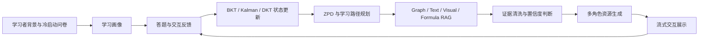
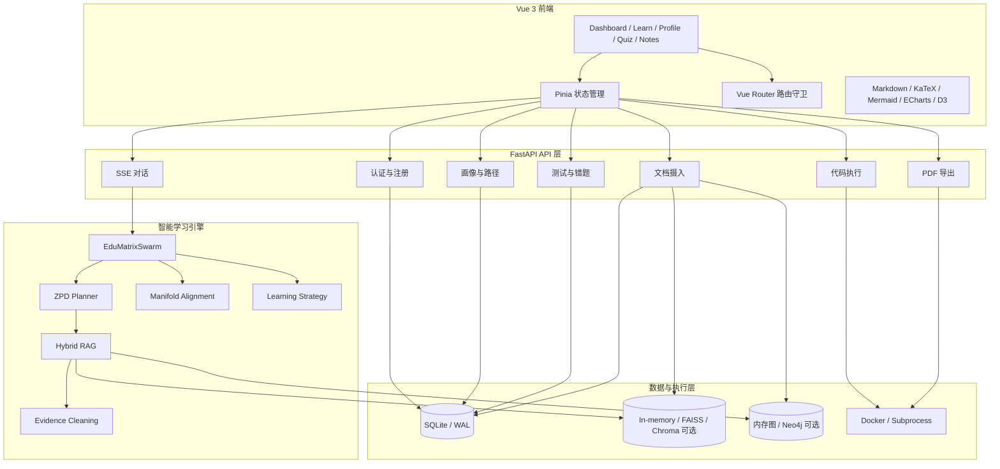
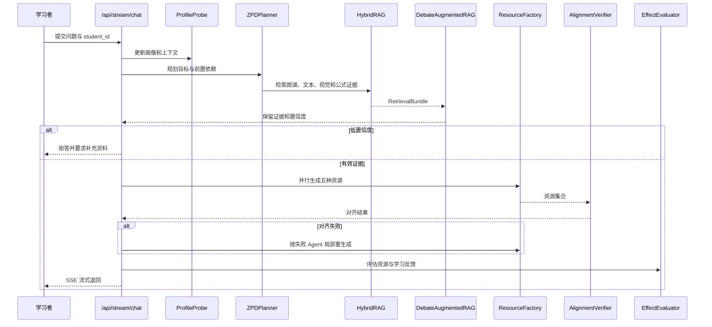

# EduMatrix 智教矩阵
## 领域知识个性化生成与多智能体协同决策系统技术文档

> 文档性质：当前代码基线下的事实校正版技术文档草稿
>
> 当前源码基线：`2952dc1b17d793e5d76f54e1764348ebe50e4d5e`
>
> 生成日期：2026-07-18
>
> 说明：凡标注“已实现”的内容均应以当前源码和可复现测试为依据；“部分实现”“待验证”“规划能力”不得在答辩中表述为已交付功能。

> **历史版本声明**：本文是 2026-07-18 的事实校正稿，保留用于审计过程追溯，不是本轮 2026-07-19 整改后的最终交付文档。有关无 Docker E2E、47/47 运行时安全矩阵、成员专项测试和提交包的最新状态，请以 `EduMatrix_完整技术文档总稿.md` 及配套说明书为准。

---

## 1. 项目概述

EduMatrix 是面向机器学习与人工智能课程学习场景的个性化学习资源生成系统。系统将学习者的专业背景、学习偏好、答题结果、错误类型和交互反馈转化为学习画像，再通过知识图谱、混合检索、学情追踪和多角色资源生成，为学习者提供讲义、思维导图、代码实践和分层练习等资源。

系统当前的核心价值不在于单独调用大语言模型，而在于把以下环节组织成一条学习闭环：



当前工程事实：系统确实实现了 9 个物理 Agent 角色定义，其中 5 个角色负责资源生成；但默认 Swarm 实例没有把 LLM 注入 `DebateAugmentedRAG`，因此大模型 Prover-Challenger-Judge 辩论不是当前默认主流程的可证实能力。

---

## 2. 赛题要求与项目对齐

比赛题目为 XH-202630《领域知识个性化生成与多智能体协同决策系统研究》。比赛要求包括：

| 赛题要求 | 项目对齐能力 | 当前证据状态 |
|---|---|---|
| 至少 3 个职责明确的 Agent | 画像探针、路径规划、效果评估、教学路由、讲义、导图、代码、练习、视频推荐等角色 | 代码已定义，见 `agent_swarm.py:34-44` |
| 至少 3 种个性化资源 | 专业讲义、思维导图、代码实践案例、练习题、视频推荐 | 5 个资源生成任务在 `agent_swarm.py:929-938` |
| 学习者先验知识画像 | 专业、认知风格、动机、概念掌握度、学习历史等 | `models.py` 的 `StudentProfile` 与注册冷启动逻辑 |
| 领域专业知识库 | 内置机器学习知识图谱、文本证据、视觉证据和用户上传材料 | `rag_engine.py`、`knowledge_api.py` |
| 分析-生成-校验-决策闭环 | 学情分析、RAG 检索、资源并行生成、流形对齐、自愈重生成 | 主流程见 `agent_swarm.py:1429-1604` |
| 可视化画像和学习路径 | 雷达图、概念路径、学习日历、教师大盘 | 前端路由和 Vue 页面已存在 |
| 至少 2 组差异化初始数据 | 12 名虚拟种子学生和模拟 Peer 画像 | 可作为仿真数据，不能称为真实用户调研 |
| 数据合规 | 需要对用户画像、对话记录和上传文档做权限隔离 | 当前存在全局 RAG 索引和 API IDOR，尚未达标 |
| 实用性指标 | 幻觉率、画像-资源适配率、知识点覆盖率 | 当前没有真实测量结果，必须补充实验数据 |

比赛要求的“幻觉率 <5%、适配准确率 >=85%、知识点覆盖率 >=90%”是评审目标，不是当前代码自动产生的结果。除非补充带标注数据集、测量公式、实验过程和原始结果，否则文档不得宣称已达到这些指标。

---

## 3. 需求层分析

### 3.1 目标用户

主要目标用户是学习机器学习、数据科学和人工智能课程的大学生，尤其是以下三类学习者：

1. 理论理解较好但代码实践不足的学习者。
2. 能够完成基础题目但容易混淆相邻概念的学习者。
3. 面对大量课程资料，不知道学习顺序和复习重点的学习者。

教师用户用于查看班级层面的学习画像、薄弱概念分布和复习计划。当前实现中，学生和教师角色通过数据库用户表的 `role` 字段区分，前端通过路由守卫控制页面访问。

### 3.2 主要学习痛点

| 用户痛点 | 传统系统问题 | EduMatrix 的应对方式 |
|---|---|---|
| 资源多但学习顺序不清晰 | 只提供静态目录或搜索结果 | 结合知识依赖图和掌握度生成 ZPD 路径 |
| 公式能看懂但不会推导 | 只能重新查看同一段文字 | 支持公式选中后的苏格拉底式追问 |
| 理论会做但代码不会写 | 理论和实践资源分离 | 生成代码实践案例并提供执行控制台 |
| 做题后不知道错因 | 只记录对错，不记录错误原因 | 记录错因、元认知偏差和复习计划 |
| 学习内容难度不匹配 | 同一套内容推送给所有人 | 根据画像、掌握度和学习风格注入资源生成指令 |
| 大模型回答可能出现专业错误 | 直接输出模型结果 | 通过知识证据、规则清洗、对齐校验和低置信度拒答降低风险 |

当前材料没有真实外部大学生访谈、问卷回收或满意度统计。现有 12 名种子学生和 Peer 画像是系统仿真数据，适合用于演示和回归测试，不适合写成真实用户研究结论。

### 3.3 需求到系统功能追踪

| 需求编号 | 需求描述 | 页面 | API/服务 | 当前状态 |
|---|---|---|---|---|
| R-01 | 新用户完成学习背景和偏好输入 | `/onboarding` | `/api/auth/register` | 已实现，但冷启动样本为模拟数据 |
| R-02 | 生成学习者画像 | `/profile`、`/student-analysis` | `/api/profile/{student_id}` | 代码存在，权限隔离不足 |
| R-03 | 根据掌握度规划学习路径 | `/learning-path`、Dashboard | `/api/profile/{student_id}/goal-recommendations` | BKT/ZPD 路径代码存在 |
| R-04 | 通过对话获得个性化资源 | `/learn` | `/api/stream/chat` | SSE 和 Swarm 代码存在 |
| R-05 | 生成讲义、导图、代码和练习 | `/learn` | `AsyncResourceFactory.generate_all` | 5 个资源任务存在 |
| R-06 | 对证据和资源进行校验 | `/learn` | `DebateAugmentedRAG`、`ManifoldAlignmentVerifier` | 规则校验可证实；LLM 辩论未默认接入 |
| R-07 | 代码运行和错误反馈 | `/learn` | `/api/code/run` | 存在 Docker/进程两条路径，安全边界不足 |
| R-08 | 错题复习和间隔复习 | `/wrong-questions`、`/revision-calendar` | `/api/quiz`、`/api/flashcard` | 代码和测试用例存在 |
| R-09 | 教师查看班级画像 | `/teacher` | `/api/teacher` | 存在教师依赖，但其他 API 权限需补齐 |
| R-10 | 导出学习诊断报告 | `/notes` | `/api/v1/profile/export` | Playwright 实现存在，干净镜像依赖未完成 |

---

## 4. 系统总体架构

### 4.1 分层架构



### 4.2 后端模块

| 模块 | 主要文件 | 职责 |
|---|---|---|
| API 入口 | `app/main.py` | FastAPI 初始化、路由注册、登录注册、健康检查、直接问答接口 |
| 认证 | `app/auth.py` | bcrypt 密码校验、JWT 签发和用户解析 |
| 数据库 | `app/database.py` | SQLite URL、WAL、SQLAlchemy 表模型、线程会话和迁移 |
| CRUD | `app/crud.py` | 画像、笔记、对话、复习计划和匿名数据迁移 |
| Swarm | `agent_swarm.py` | 画像探针、路径规划、资源工厂、对齐和自愈流程 |
| LLM | `llm_client.py` | 外部 OpenAI 兼容接口、星火、确定性本地 fallback |
| RAG | `rag_engine.py` | 图谱、视觉、文本、用户文档和公式检索合并 |
| 证据辩论 | `drag_debate.py` | 确定性证据打分和可选 LLM 辩论 |
| 学情算法 | `bkt_engine.py`、`mirt_engine.py` | BKT、Kalman、EKF、DKT、MIRT 和复习路径 |
| 文档摄入 | `knowledge_api.py`、`document_parser.py` | 上传、解析、分块、图谱和向量索引 |
| 代码执行 | `code_exec_api.py` | AST 检查、Docker 容器池、进程 fallback、输出捕获 |
| 报告导出 | `report_api.py` | Playwright 浏览器池、HTML 排版和 PDF 流式响应 |

### 4.3 持久化模型

当前 `app/database.py` 定义 15 个 SQLAlchemy 实体：

`DBStudentProfile`、`DBUser`、`DBAlignmentLog`、`DBNote`、`DBReviewPlan`、`DBConversationHistory`、`DBKnowledgeDocument`、`DBQuizRecord`、`DBQuizItem`、`DBWebSearchHistory`、`DBCodeExecution`、`DBWrongQuestion`、`DBCheckinLog`、`DBArxivCache`、`DBConceptCoordinate`。

数据库实际是单文件 SQLite：

- `app/database.py:51-56` 根据测试标志选择 `edumatrix_test.db` 或 `edumatrix.db`。
- `app/database.py:60-72` 设置 `check_same_thread=False`、30 秒锁等待、WAL 和外键约束。
- PostgreSQL `search_path` 逻辑存在，但当前应用没有切换到 PostgreSQL，SQLite 也不提供真正的 Schema 隔离。

因此最终文档应将当前部署描述为“单实例 SQLite/WAL 原型”，而不是已经完成的分布式多租户数据库系统。

---

## 5. AI 与智能体设计

### 5.1 Agent 矩阵

`agent_swarm.py:34-44` 定义以下物理角色：

| 层级 | Agent | 责任 |
|---|---|---|
| 交互中枢 | router | 意图判断、模式路由和交互控制 |
| 认知治理 | profile | 从消息和反馈更新学习画像 |
| 认知治理 | planner | 结合知识图谱和画像规划 ZPD 路径 |
| 认知治理 | evaluator | 评估资源与学习状态，触发重规划 |
| 资源工厂 | theory | 生成专业讲义 |
| 资源工厂 | mapper | 生成 Mermaid 思维导图 |
| 资源工厂 | coder | 生成可运行代码实践 |
| 资源工厂 | quiz | 生成分层练习题 |
| 资源工厂 | director | 生成视频推荐或视频讲解相关资源 |

5 个资源 Agent 在 `AsyncResourceFactory.jobs` 中定义，并通过 `asyncio.gather(..., return_exceptions=True)` 并行执行。发生单个角色失败时，系统返回该角色的失败占位内容，其他角色仍可返回，这提高了流程的部分可用性，但也要求前端明确显示“资源生成失败”，不能把占位文本当成真实资源。

### 5.2 主流程



### 5.3 当前真实的防幻觉能力

可以确认的能力：

- RAG 检索结果有分数和证据结构。
- 低置信度路径在 `agent_swarm.py:1457-1500` 直接生成拒答资源。
- `ManifoldAlignmentVerifier` 会对资源做跨模态一致性检查。
- 冲突结果可以触发局部 Agent 重生成。
- 本地确定性 LLM 可以在无外部 API 时完成演示级输出。

不能直接宣称的能力：

- 默认生产路径中的大模型三方辩论。`agent_swarm.py:1323` 没有将 LLM 传入 `DebateAugmentedRAG`。
- 真实模型效果的幻觉率 <5%。当前没有标注集和实验结果。
- “100% 保证讲义、代码和导图符号一致”。对齐模块存在，但需要测试数据和失败率统计。

### 5.4 个性化算法

#### BKT 与 Kalman

`bkt_engine.py:97-130` 根据答题正确性更新掌握度，再使用一维 Kalman 滤波平滑结果。`bkt_engine.py:253-380` 使用局部知识子图进行状态传播，包含目标概念、前置概念和后继概念。

#### ZPD 路径

`bkt_engine.py:404-483` 将掌握度划分为 `below_zpd`、`in_zpd` 和 `above_zpd`，并在前置概念薄弱时回滚到前置概念。

#### DKT

`bkt_engine.py:1202-1388` 定义 `DktService` 和 RNN 推理/增量更新。在线更新主要修改学生专属 `dkt_bias`；后台无 profile 的兼容队列路径不会将更新写回持久层，需在最终文档中说明实际启用路径。

#### Poincare 对齐

系统使用双曲空间距离和概念坐标投影做知识层级可视化。该能力应作为“知识依赖可视化与对齐校验”描述，不应仅用复杂数学名词替代实际效果指标。

---

## 6. 核心业务流程

### 6.1 注册与冷启动

1. 前端在 `/onboarding` 收集专业、认知风格、动机和目标。
2. `/api/auth/register` 创建 `DBUser` 和 `DBStudentProfile`。
3. `calibrate_student_prior_collaborative` 尝试从模拟 Peer 画像中计算先验。
4. 有 `x-anon-student-id` 时迁移匿名笔记、错题、打卡和历史数据。
5. 生成 JWT 返回前端并保存到 localStorage。

注意：前端路由守卫只是用户体验层保护，不是后端安全边界。后端必须从 JWT 服务端解析用户身份，不能信任前端传入的 `student_id`。

### 6.2 学习对话

1. `/learn` 页面提交消息。
2. `/api/stream/chat` 解析消息、模式、图片和文档约束。
3. Swarm 更新画像、判断学术意图、规划知识路径和检索证据。
4. 资源工厂并行生成讲义、导图、代码、练习和视频相关资源。
5. 对齐校验失败时，基于冲突信息重生成指定角色。
6. 后端通过 SSE 返回进度、Agent 状态、资源内容和最终指标。

当前代码中该接口接受请求体里的 `student_id`，且路由没有认证依赖，是正式部署前必须修复的安全问题。

### 6.3 知识库上传

支持 Markdown、TXT、PDF、DOCX、JSON、Python、PPTX、视频等扩展名。上传流程包括：

1. 读取文件内容。
2. 解析文本和可选视觉内容。
3. 分块并提取标签。
4. 构建知识图谱边。
5. 写入 `DBKnowledgeDocument`。
6. 写入用户文件目录和全局 RAG 用户索引。
7. 后台生成文档导读。

当前缺陷：一次性 `await file.read()`、无文件大小/页数/时长限制、无认证、用户索引全局共享。该流程不能在文档中描述为已完成的多租户知识库。

### 6.4 代码沙箱

代码执行步骤：

1. 检查代码大小，当前限制为 50,000 字节。
2. 使用 AST 检查敏感函数、系统属性和双下划线访问。
3. Docker 可用时从容器池取容器，设置无网络、512 MB 内存和 1 CPU。
4. Docker 不可用时使用宿主 Python 子进程。
5. 以 `CONFIG.sandbox_timeout` 控制超时，默认 10 秒。
6. 分离标准输出和错误，并提取 Matplotlib 图片。

当前安全结论：AST 检查是输入过滤，不是隔离。对于比赛演示可以作为本地实验功能；对于公开部署，Docker 不可用时应拒绝执行，而不是回退到宿主进程。

### 6.5 错题与间隔复习

答题结果写入 `DBQuizRecord`，错题进入 `DBWrongQuestion`，自评和实际得分用于元认知偏差更新，复习计划写入 `DBReviewPlan`。Anki 风格卡片使用复习间隔进行到期判断。

MIRT 计算在 `mirt_engine.py:420-429` 存在指数极端值导致的除零路径；应在比赛前增加边界测试并修复。

---

## 7. 前端体验与交互

前端使用 Vue 3、Vite、Pinia、Vue Router、Tailwind、ECharts、D3 和 KaTeX。主要页面包括：

| 路由 | 页面目标 |
|---|---|
| `/landing` | 系统介绍和入口 |
| `/login` | 登录和注册 |
| `/onboarding` | 冷启动画像输入 |
| `/` | 学习仪表盘 |
| `/learn` | 多 Agent 流式学习对话 |
| `/profile` | 学习画像 |
| `/student-analysis` | 学习状态分析 |
| `/learning-path` | 知识路径图 |
| `/wrong-questions` | 错题和相似题 |
| `/review` | 自适应练习 |
| `/revision-calendar` | 间隔复习日历 |
| `/knowledge` | 知识文档上传和管理 |
| `/notes` | 学习笔记和 PDF 导出 |
| `/history` | 历史会话与画像快照 |
| `/settings` | LLM 和教学风格设置 |
| `/teacher` | 教师班级大盘 |

前端生产构建已成功，但存在以下交付级优化项：

- 主 JS 压缩包约 1.91 MB，应按页面拆分和懒加载。
- KaTeX CSS 在构建时未找到，应使用明确依赖路径并在部署产物中验证。
- 动态导入 Axios 无法形成独立 chunk，应统一导入策略。
- 需要补充真实运行截图，尤其是 Onboarding、Swarm Timeline、画像雷达、知识路径、代码运行和教师大盘。

---

## 8. 测试与质量

### 8.1 当前测试资产

- 根目录 `test_edumatrix.py` 声明约 80 个 `unittest` 测试方法。
- `scripts/test_member6_all_tasks.py` 声明 62 个测试方法。
- `tests/` 下有 13 个 Python 测试文件，静态声明方法数量较多。
- 测试覆盖方向包括 RAG、Swarm、BKT、路径规划、流式处理、沙箱、数据库并发、PDF、文档摄入和前端静态资源存在性。

### 8.2 已执行验证

| 验证项 | 结果 | 解释 |
|---|---|---|
| 前端生产构建 | 通过 | `npm.cmd run build` 成功 |
| pytest 收集 | 未执行 | 当前环境未安装 pytest |
| Member6 unittest | 51 通过 / 11 错误 | 错误均涉及当前环境缺少 FastAPI、SQLAlchemy 等依赖 |
| 后端启动 | 未验证 | 当前环境缺少 requirements 中的核心包 |
| Docker 沙箱 | 未验证 | 当前环境没有 Docker CLI，且镜像依赖未完整声明 |
| 外部 LLM | 未验证 | 需要受控 API 配置，不应把默认 fallback 当成外部模型结果 |

### 8.3 建议的正式测试矩阵

| 类别 | 最低测试内容 |
|---|---|
| 单元测试 | BKT 边界、MIRT 极端值、路径规划、评分 JSON、时间区间 |
| Swarm 测试 | 5 Agent 并行、单 Agent 失败、对齐失败重试、LLM Debate 异步路径 |
| RAG 测试 | 文档 owner 隔离、召回率、公式轨道、低置信度拒答、缓存命中 |
| 安全测试 | 无 Token、伪造 JWT、IDOR、上传大小、代码逃逸、Prompt Injection |
| 数据测试 | SQLite 写锁、匿名迁移、级联删除、用户文档删除和索引同步 |
| 接口测试 | 所有 API 的认证、参数校验、分页、错误码和限流 |
| E2E 测试 | 注册、冷启动、提问、生成资源、答题、错题、复习、导出 PDF |
| 性能测试 | SSE 首字延迟、5 Agent 总延迟、代码执行并发、PDF 并发、上传解析 |

---

## 9. 部署与运维

### 9.1 当前启动方式

本地后端：

```powershell
python run.py
```

前端开发：

```powershell
cd frontend
npm run dev
```

Docker 设计使用 Node 20 构建前端，Python 3.11 运行后端，端口 8000，挂载 `/app/data`。

### 9.2 当前部署缺口

1. `requirements.txt` 没有完整覆盖 `docker`、`playwright`、`torch`、`numpy` 等实际能力依赖。
2. `Dockerfile` 没有安装 Playwright 浏览器。
3. `docker-compose.yml` 写入了固定的外部 LLM endpoint，部署文档应说明其网络、隐私和可用性风险。
4. SQLite/WAL 适合单实例原型，不适合宣称已完成多节点高并发事务。
5. 默认 JWT 密钥不安全。
6. 没有看到完整的生产监控、告警、备份恢复和数据库迁移发布流程。
7. Docker 不可用时的代码执行回退会破坏安全边界。

### 9.3 建议的可复现验收流程

1. 创建全新 Python 3.11 虚拟环境。
2. 安装锁定后的生产依赖和测试依赖。
3. 复制 `.env.example`，明确设置随机 JWT 密钥。
4. 运行数据库初始化和种子数据脚本。
5. 启动后端，验证 `/api/health`。
6. 用三个隔离账号分别执行注册、对话、知识上传和错题流程。
7. 证明账号 A 无法读取账号 B 的画像和知识证据。
8. 在 Docker 可用和不可用两种环境分别验证代码执行策略。
9. 运行测试并保存原始日志、版本、依赖清单和机器配置。
10. 生成比赛提交包前清除 `.env`、数据库敏感数据和缓存。

---

## 10. 安全、隐私与合规

### 10.1 必须在比赛前修复

| 风险 | 证据 | 优先级 |
|---|---|---|
| 无 Token 自动进入 demo 用户 | `app/auth.py:45-54` | Critical |
| 路由未统一认证 | `code_exec_api.py:539`、`stream_api.py:386`、`knowledge_api.py:38` 等 | Critical |
| 客户端 student_id 未绑定 JWT | `stream_api.py:403-408`、`app/main.py:587-604` | Critical |
| 全局用户 RAG 索引 | `rag_engine.py:390-406`、`490-491` | Critical |
| 宿主进程代码执行回退 | `code_exec_api.py:260-284` | High |
| 上传无大小限制 | `knowledge_api.py:67-76` | High |
| 固定 JWT 默认密钥 | `config.py:68-71` | High |
| API 输入直接控制模型端点 | `swarm_factory.py:11-59`、`llm_client.py:117-121` | High/待设计确认 |

### 10.2 文档写法

最终参赛文档应采用以下严谨表述：

> 系统在原型阶段采用 SQLite/WAL 和本地向量索引，提供学生画像与知识文档的逻辑字段隔离。生产化部署需要进一步完成 JWT 与资源 owner 的强绑定、用户级 RAG 索引隔离、上传限额和容器执行策略收敛。

不要写成“系统已完成多租户隔离”或“代码沙箱绝对防逃逸”。

---

## 11. 创新点与证据边界

### 11.1 可以保留的创新点

1. **学习画像驱动的多资源生成**：不是只返回一段回答，而是根据画像和知识路径并行生成多个学习资源。
2. **知识依赖与掌握度结合**：将概念 DAG、BKT/Kalman 掌握度和 ZPD 路径结合。
3. **生成资源的一致性校验**：使用资源对齐检查和局部重生成减少不同资源之间的概念冲突。
4. **公式、图谱、文本和用户文档的混合检索**：针对机器学习学习材料提供多种证据通道。
5. **代码实践闭环**：把讲义中的代码示例连接到执行、输出捕获和错误反馈。
6. **交互式局部追问**：前端支持选中文本/公式/代码后发起局部苏格拉底式解释。

### 11.2 必须降级表述的创新点

- “多模型辩论防幻觉”：当前默认 `DebateAugmentedRAG` 没有注入 LLM，应写成“支持可选 LLM 辩论，当前默认使用确定性证据清洗”。
- “视频自动生成”：当前主要是视频脚本、推荐、TTS/嘴形联动，不应写成自动生成 MP4。
- “真实学习提升率”：当前没有真实用户实验，不应写提升百分比。
- “GNN 学情预测”：材料和源码中未确认存在真实图卷积模型，应写成 Graph-EKF/知识图谱路径能力。

---

## 12. 比赛演示建议

建议使用 8 至 10 分钟完成以下闭环：

1. 展示两名背景不同的预置虚拟学生，明确说明是仿真数据。
2. 完成一次冷启动问卷，展示掌握度和学习风格不同。
3. 在 `/learn` 输入同一机器学习概念，展示两名学生的资源难度、讲解形式或路径差异。
4. 展示 Agent Timeline：画像、规划、检索、资源生成、对齐和输出。
5. 展示讲义、Mermaid 导图、代码案例和练习题四种资源。
6. 在代码控制台运行一段安全示例，展示 stdout/图像输出；不要现场演示宿主机 fallback。
7. 故意答错一道题，展示 BKT/画像变化和错题入库。
8. 打开错题本和复习日历，展示 SM-2 复习计划。
9. 进入教师大盘，展示班级画像和薄弱点统计。
10. 以低置信度问题触发拒答，说明知识证据不足时系统不会强行生成。

演示中应避免：现场配置真实 Token、展示真实个人数据、宣称真实用户实验、展示未安装的 Docker/Playwright 能力，以及使用报告中的 500KB 沙箱说法。

---

## 13. 最终提交材料清单

```text
submission/
├─ 作品设计实现方案.docx
├─ 系统技术说明书.pdf
├─ 测试说明书.pdf
├─ 部署说明书.md
├─ 10分钟系统演示视频.mp4
├─ source/
├─ test-data/
│  ├─ domain-knowledge-slices/
│  ├─ learner-profile-group-a.json
│  ├─ learner-profile-group-b.json
│  ├─ learner-profile-group-c.json
│  ├─ agent-traces/
│  └─ expected-resources/
├─ screenshots/
├─ test-results/
├─ requirements-lock.txt
└─ README-评审复现.md
```

测试数据至少包含：

- 一个明确的机器学习领域知识库切片；
- 三组不同背景的学习者输入画像；
- 每组的 Agent 中间状态；
- 最终生成资源；
- 知识点覆盖、资源适配和事实错误的标注结果；
- 可复核的原始日志和运行环境。

---

## 14. 结论

EduMatrix 已经具备较完整的原型功能面：前端页面、FastAPI 路由、学习画像、RAG、Swarm 资源生成、学情算法、错题复习和报告导出均有代码资产，前端生产构建也已通过。

当前最影响比赛可信度的不是功能数量，而是三个事实边界：

1. 默认大模型辩论链路和确定性 fallback 必须区分。
2. 仿真学生数据、测试结果和真实用户研究必须区分。
3. 后端资源权限、全局 RAG 索引和代码沙箱回退必须在公开演示前收敛。

在修复 Critical/High 风险并重新生成统一版本的测试数据后，项目可以形成一套可信的“需求分析-技术实现-测试验证-部署说明-演示证据”完整材料；在此之前，不建议直接使用已有报告中的“100% 已实现”“全量通过”“多租户隔离”和“真实用户效果”等表述。
