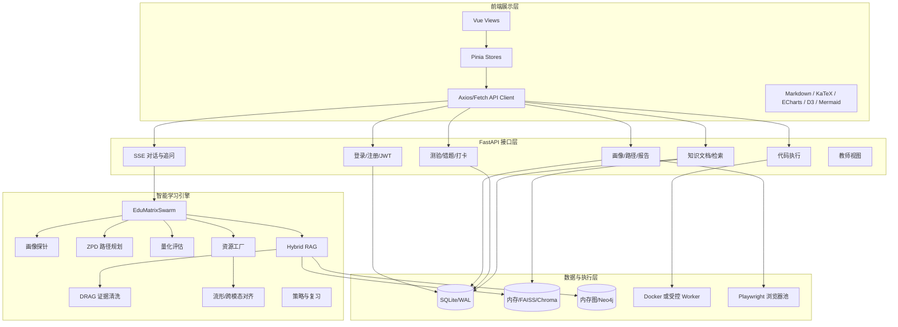
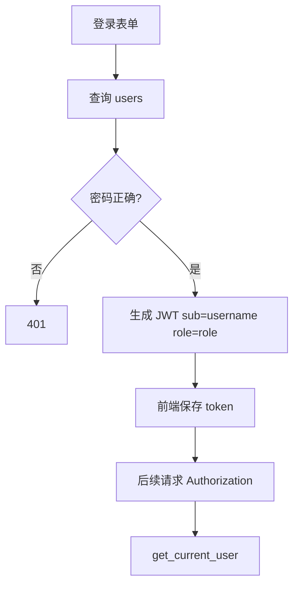

# EduMatrix 系统设计与实现方案

验证基线：Git `74f8f2715641da20b560571120a66477d300f5de`；结论以 2026-07-20 验证时的最终代码与证据为准。  
用途：技术实现说明、架构评审和评委复现支撑

## 1. 设计目标

EduMatrix 不把学习请求直接交给单一模型，而是将一次学习交互拆成可观察、可校验、可反馈的业务过程：

```text
学习者状态识别
  -> 学习目标和知识前置关系分析
  -> 专业证据召回
  -> 证据清洗和置信度判断
  -> 多角色资源并发生成
  -> 资源一致性检查
  -> 前端呈现与交互
  -> 答题/代码/行为反馈
  -> 画像与学习路径更新
```

## 2. 设计原则

1. **画像驱动**：资源类型、难度和解释方式由画像、历史和目标共同决定。
2. **证据约束**：生成 Agent 接收检索结果和图谱上下文，不应只依赖自由生成。
3. **角色分工**：诊断、规划、生成和评估职责分离，便于观测和替换。
4. **反馈闭环**：答题、错题、代码错误和停留行为都成为后续决策输入。
5. **降级可解释**：外部服务失败时明确显示 deterministic fallback、拒答或重试状态。
6. **安全优先**：认证、数据隔离和代码执行安全优先于演示便利性。

## 3. 总体架构



## 4. 模块设计与实现

### 4.1 应用入口和路由注册

`app/main.py` 负责 FastAPI 实例化、CORS、请求追踪、数据库初始化、认证入口、教师端、旧版接口和业务路由注册。当前注册的路由模块包括 knowledge、quiz、web、code、profile、stream、animation、flashcard、behavior 和 report。

启动时执行 `init_db()`，随后创建默认 Swarm。默认模型配置来自环境变量；请求头可以创建带用户模型配置的 Swarm。

### 4.2 认证模块

`app/auth.py` 使用 bcrypt 验证密码、JWT 保存 `sub` 和 `role`。目标流程如下：



当前实现已经把认证行为拆成两个明确模式：

- demo 模式：显式 `EDUMATRIX_DEMO_MODE=1`，只用于测试账号和非敏感数据；
- 默认/production 模式：没有 Token 直接返回 401，禁止隐式创建用户。

### 4.3 画像探针

画像探针以自然语言、历史和已知概念为输入，更新掌握度、弱点、不会原因、认知风格和交互偏好。代码还包含口语指代消解和滑动上下文窗口。

画像证据应保存为：

```json
{
  "field": "weak_points",
  "new_value": ["混淆矩阵"],
  "source": "quiz_feedback",
  "confidence": 0.82,
  "timestamp": "2026-07-19T00:00:00Z"
}
```

当前数据库有 `profile_evidence` 字段；主要画像、对话、答题和推荐路径已写入或消费画像状态，完整证据链仍应以专项日志和目标环境复测为准。

### 4.4 ZPD 路径规划

路径规划输入目标概念、掌握度、知识图谱前置关系和认知负荷，输出目标节点、路径节点、完成率、预计时长和负荷指数。

```text
候选节点 = 目标节点的前置闭包 + 当前薄弱节点
过滤 = 未掌握、可达、满足先修条件
评分 = 掌握度缺口 + 目标相关性 + 认知负荷 + 复习紧迫度
排序 = 选择下一步最有价值节点
```

验证重点不是函数“返回了路径”，而是同一目标在不同画像下是否产生差异化节点和难度。

### 4.5 混合 RAG

检索层可以组合：概念图谱、文本分块、公式/数学表达式、视觉证据、用户上传文件、FAISS/ChromaDB/Neo4j 和哈希或外部嵌入。

推荐的标准返回结构：

```json
{
  "query": "精确率与召回率",
  "graph_context": {
    "target": "模型评估指标",
    "learning_path": ["分类", "混淆矩阵", "精确率", "召回率"]
  },
  "evidence": [
    {
      "source": "course_ml_metrics.md",
      "chunk_id": "chunk-001",
      "text": "...",
      "score": 0.88,
      "owner_id": "public"
    }
  ],
  "low_confidence": false
}
```

当前 `user_index` 是进程内共享对象，但摄入时强制写入 `owner_id`/`visibility`，检索通过 `_visible_user_evidence` 按当前学生过滤，删除时按 owner 清理。启用 FAISS/ChromaDB 等持久化索引后仍需复测删除和重启重建边界。

### 4.6 证据清洗和辩论

`drag_debate.py` 设计了确定性评分和可选 LLM 分支：

- 删除来源不可信或分数过低的证据；
- 识别冲突、重复和低相关证据；
- 满足条件时请求 LLM 进行证据辩论；
- 返回 clean evidence、分数、轨迹和是否通过。

`EduMatrixSwarm` 已将 `use_llm` 注入辩论引擎，当前主异步路径使用：

```python
self.debate = DebateAugmentedRAG(llm=use_llm)
```

并通过异步 `aclean()` 避免在已运行事件循环中嵌套 `run_until_complete`。默认 deterministic 模式仍不等于真实外部模型辩论效果。

### 4.7 资源工厂

当前资源任务至少包含讲义、思维导图、代码实操、练习题和视频/TTS 脚本。资源工厂使用 `asyncio.gather(..., return_exceptions=True)` 并发生成，单个 Agent 失败时返回“暂时不可用”的资源结果，整体流程不一定失败。

资源结果建议统一为：

```json
{
  "agent": "极客助教",
  "resource_type": "代码实操案例",
  "content": "...",
  "citations": ["course_ml_metrics.md#chunk-001"],
  "status": "generated",
  "fallback": false,
  "alignment": {"passed": true, "conflicts": []}
}
```

### 4.8 跨模态对齐

对齐模块检查讲义、导图、代码、题目和视频脚本中的概念、公式、变量与结论是否一致。失败后可从冲突中推断责任 Agent，并只重写失败资源。

固定回归样本示例：最大池化输出尺寸公式。应同时检查讲义公式、代码参数、导图节点和题目答案，确认公式和变量一致。

## 5. 个性化学习算法

### BKT

维护知识点掌握概率，根据答题正确性、猜测、失误、学习和遗忘参数更新。文档应记录默认参数、按知识点独立与否、Peer 先验来源及更新写回路径。

### IRT/MIRT

代码中存在 IRT beta 更新和 MIRT 计算。极端参数必须保护：

```python
z = max(min(z, 40.0), -40.0)
denominator = max(denominator, 1e-8)
```

正常值测试不能替代极端值、空历史、全对、全错和极端难度测试。

### 间隔复习

`anki_engine.py` 和 `flashcard_api.py` 保存概念、间隔、下次复习时间、易度因子、质量和复习次数。数据库建议统一 UTC，接口明确用户时区，统一使用 `zoneinfo`。

### 策略/RL

学习策略根据答题、偏差、负荷和复习紧迫度选择降维解释、复习、挑战或代码练习。存在 Q-table 或 RL 模块时，必须明确它是线上默认路径还是离线实验模块。

## 6. 工程实现要求

### 异步边界

FastAPI 事件循环内不得调用 `run_until_complete`、同步网络请求或大规模 CPU 运算。CPU 任务进线程/进程池，网络请求使用 async client，客户端断开时取消后台任务。

### 缓存

`swarm_factory._swarm_cache`、`profile_store` 和 RAG 索引必须有最大项数、TTL、淘汰策略、清理指标和用户删除钩子。

### 可观测性

每个请求带 trace ID，每个 Agent 记录开始、结束、错误、耗时和缓存命中；日志不得记录 API key、密码、完整私有文档和未脱敏学生信息。

## 7. 实现验收标准

1. 三组画像能够产生不同的路径、资源顺序或难度。
2. 资源至少包含三种类型，并附引用或明确 fallback 标记。
3. LLM 不可用时明确显示 deterministic 模式。
4. 不同用户的画像、代码历史、知识文档和 RAG 证据完全隔离。
5. `disabled` 模式拒绝代码执行；`trusted_local` 只允许可信本机研究演示并明确无容器隔离；`docker` 模式才提供容器级隔离。
6. 全量测试能在干净环境运行，失败用例有原因和修复记录。
7. 生产密钥没有固定默认值。
8. 依赖和浏览器安装步骤可在新机器复现。

