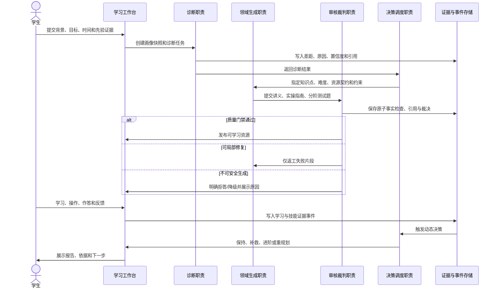
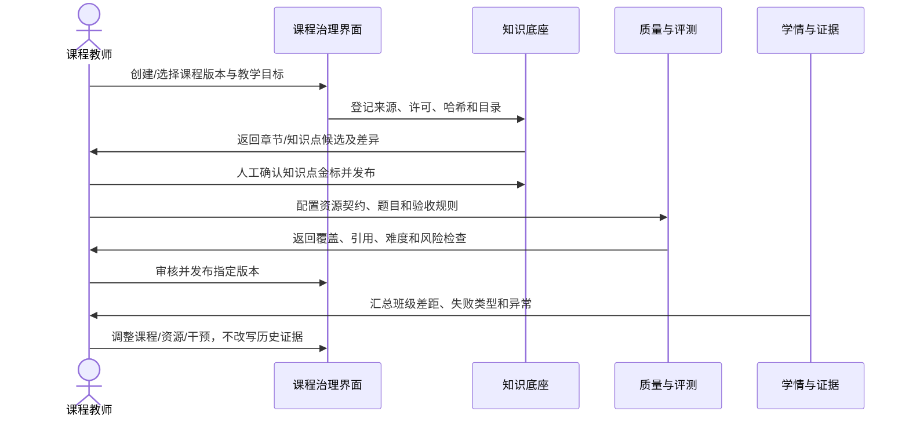
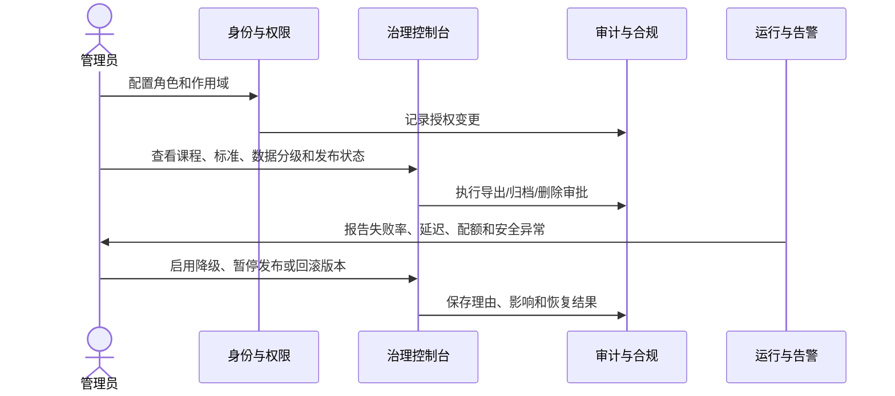

# 核心用户旅程与能力目录

版本：`M0-v0.1-draft`

## 1. 学生学习闭环

学生闭环的最低成功条件：能从画像输入走到诊断、三类正式资源、审核结果、可观察学习行为、动态决策和报告；失败时能解释处于哪一步、原因是什么、是否可重试，不能静默返回通用回答。

## 2. 教师教学闭环

教师闭环不允许“上传即发布”或“模型生成即金标”。教师必须能确认来源和知识点、查看质量检查、发布特定版本，并看到后续调整不会污染历史运行。

## 3. 管理员治理闭环

管理员负责治理而不是替代领域教师。任何密钥、敏感正文或跨租户数据都不能因为“管理员页面”而默认显示。

## 4. 20 个能力域

每项能力只有一个主责任边界。其他域可以消费其输出，但不能维护第二套同义对象。

| ID | 能力域 | 主责任边界 | 当前取舍 | M0 后首要落点 |
|---|---|---|---|---|
| CAP-01 | 身份、组织与权限 | 身份、角色、成员关系、对象范围裁决 | 调整 | 统一授权依赖与拒绝测试 |
| CAP-02 | 课程与领域包治理 | 课程、版本、领域包和发布边界 | 采用 | `course/domain_pack` 正式对象 |
| CAP-03 | 来源与许可证治理 | 来源、许可、哈希、署名、可用范围 | 采用 | 课程素材清单和白名单 |
| CAP-04 | 多格式解析与摄入 | 文件解析、结构保留、分块和失败记录 | 采用 | 统一摄入任务 |
| CAP-05 | 检索、引用与知识图谱 | 索引、混合检索、证据引用、图谱关系 | 调整 | 同一来源对象贯通 RAG/图谱 |
| CAP-06 | 画像与认知诊断 | 画像快照、差距、原因、置信度 | 采用 | 三画像金标与诊断契约 |
| CAP-07 | 目标、计划与学习路径 | 目标约束、计划确认、路径版本、重规划 | 调整 | 草稿与正式路径分离 |
| CAP-08 | Agent 编排与任务恢复 | 职责、运行、父子关系、重试和恢复 | 调整 | 四类最小职责及运行记录 |
| CAP-09 | 个性化资源生成 | 讲义、指南、题组等产物生成与版本 | 采用 | 三类最低资源契约 |
| CAP-10 | 质量门禁与审核发布 | 规则、事实、引用、人工审核和发布 | 采用 | 原子事实与局部返工 |
| CAP-11 | 测验、作答与错题诊疗 | 题目、作答、评分、错因和补救 | 采用 | 证据化评测而非点击完成 |
| CAP-12 | 实操与交互技能工件 | 参数操作、状态变化、故障分支、客观验收 | 采用 | RAG 调优代表任务 |
| CAP-13 | 学习事件、掌握度与反馈 | 事件信封、掌握更新、反馈触发 | 调整 | 统一事件总线与回放 |
| CAP-14 | 记忆与上下文治理 | 可管理记忆、来源、敏感级别、过期 | 延后 | M4 后正式对象化 |
| CAP-15 | 学情分析与报告 | 个人/班级诊断、证据报告、导出 | 采用 | 报告可反查证据 |
| CAP-16 | 教师工作台与课程运营 | 审核、发布、班级干预和运营 | 调整 | 不做重型教务系统 |
| CAP-17 | 企业岗位标准与培训 | 岗位、等级、标准、批次、转岗 | 延后但建模 | M0 样例，M7/M8 落地 |
| CAP-18 | 评测、声明与证据工程 | 案例、金标、运行、指标、声明追踪 | 采用 | 50+ 框架和三项公式 |
| CAP-19 | 安全、隐私与合规 | 数据分级、隔离、删除、审计、安全降级 | 采用 | 每阶段持续门禁 |
| CAP-20 | 可观测性、性能与交付 | 日志、trace、指标、环境、启动和恢复 | 采用 | 基线测试与干净环境复现 |

## 5. 竞品能力处理规则

完整的 412 条竞品来源保留在 `outputs/竞品深度分析/`。本目录不复制 412 行，而以 `CAP-01` 至 `CAP-20` 作为唯一归属字段；追踪矩阵必须为每个竞品条目增加且仅增加一个 `primary_capability`。

| 处理结果 | 判定标准 | 示例 |
|---|---|---|
| 采用 | 直接增强赛题闭环或证据可信度，且能纳入统一对象 | 引用、审核、任务恢复 |
| 调整 | 价值成立但原竞品形态不适合本架构，需要契约化重构 | Agent 数量展示改为职责与运行证据 |
| 延后 | 对产品化有价值，但不是比赛稳定闭环前提 | SSO、完整企业运营、长期记忆管理 |
| 不采用 | 与范围、风险或目标冲突 | Electron 重打包、以社交/游戏化替代技能证据 |

## 6. 后续功能准入

新增功能必须填写：主能力域、使用对象、产生事件、权限边界、最低验收案例、失败分支和证据类型。无法归入唯一能力域通常说明边界未澄清；需要新增第 21 个能力域时必须提交 ADR，而不是临时改表。
