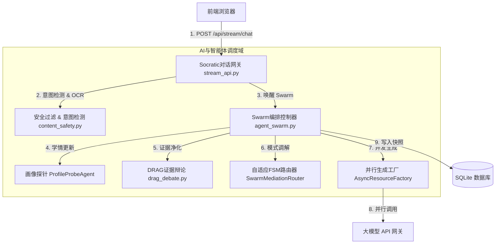

# AI与智能体调度域深度代码审计报告

*   **审计分支**: `main`
*   **Git 提交版本**: `2952dc1b17d793e5d76f54e1764348ebe50e4d5e`
*   **审计执行日期**: `2026-07-18`

本报告针对 `EduMatrix` 项目的 **AI与智能体调度域** 进行深度代码审计。审计范围包括以下 4 个核心物理文件及对应的业务模块：
1.  **Swarm核心编排控制器** [证据：[agent_swarm.py](file:///d:/project-edumatrix/edumatrix-main/agent_swarm.py)]
2.  **Socratic启发式对话网关** [证据：[stream_api.py](file:///d:/project-edumatrix/edumatrix-main/stream_api.py)]
3.  **DRAG证据对抗辩论模块** [证据：[drag_debate.py](file:///d:/project-edumatrix/edumatrix-main/drag_debate.py)]
4.  **Content Safety提示词注入拦截模块** [证据：[content_safety.py](file:///d:/project-edumatrix/edumatrix-main/content_safety.py)]

---

## 一、 模块职责与对外接口

### 1. 核心模块与物理边界



### 2. 模块职责说明表

| 模块名称 | 物理文件 | 核心职责 | 对外核心接口 |
| :--- | :--- | :--- | :--- |
| **Swarm 核心编排控制器** | `agent_swarm.py` | 负责 1+3+5 智能体协作流的网状状态流转与并行任务生成、因果冲突归因与自愈、学习风格适配调度。 | `EduMatrixSwarm.async_process` (异步主处理链路) |
| **Socratic 启发式对话网关** | `stream_api.py` | 负责接收前端的 SSE 流式聊天请求、快捷 Slash 命令转换、实时 RDI 幻觉检测计算、生成检查点并推送事件。 | `POST /api/stream/chat` (SSE 控制台接口)；`POST /api/stream/regenerate` (重算接口) |
| **DRAG 证据对抗辩论模块** | `drag_debate.py` | 负责对 Hybrid RAG 检索回来的学术证据进行 Prover-Challenger-Judge 三轮辩论与清洗，滤除概念冲突，保护生成上下文。 | `DebateAugmentedRAG.clean` (证据清洗接口) |
| **Content Safety 提示词注入拦截**| `content_safety.py` | 负责对大模型的输入和输出文本进行敏感词正则过滤、学术术语白名单边界核对以及幻觉标志物标记。 | `ContentSafetyFilter.check_safety`；`check_academic_validity` |

---

## 二、 主要类、函数、状态和数据结构

### 1. 核心类与状态结构定义
*   **`EduMatrixSwarm`** [证据：[agent_swarm.py L1307](file:///d:/project-edumatrix/edumatrix-main/agent_swarm.py#L1307)]：Swarm 总控协调类。持有并管理 `ProfileProbeAgent`、`ZPDPlannerAgent`、`DebateAugmentedRAG`、`AsyncResourceFactory` 等成员实例，维护全局画像存储器 `profile_store`。
*   **`ProfileProbeAgent`** [证据：[agent_swarm.py L131](file:///d:/project-edumatrix/edumatrix-main/agent_swarm.py#L131)]：画像抽取探针。内部使用滑动窗口维护 `_context_window` 状态，并使用 `_extraction_cache` 缓存从 LLM 抽取的掌握度增量。
*   **`DebateAugmentedRAG`** [证据：[drag_debate.py L25](file:///d:/project-edumatrix/edumatrix-main/drag_debate.py#L25)]：辩论清洗管道。持有评分门限 `min_score` 和外部模型调用代理 `llm`。
*   **`ContentSafetyFilter`** [证据：[content_safety.py L44](file:///d:/project-edumatrix/edumatrix-main/content_safety.py#L44)]：内容安全审查器。持有违规计数状态 `violation_count`。

### 2. 状态转移机制（FSM 路由模式）
系统在处理学术问题时，通过 `SwarmMediationRouter.decide_mode` [证据：[agent_swarm.py L1442](file:///d:/project-edumatrix/edumatrix-main/agent_swarm.py#L1442)] 决策当前智能体集群的运行状态：
1.  `NORMAL_MODE` (常规模式) $\rightarrow$ 引导至常规的 5 阶段资源并行生成。
2.  `DEBATE_MODE` (辩论模式) $\rightarrow$ 强制注入苏格拉底质疑指令，诱导学生反思。
3.  `SIMPLIFIED_MODE` (降维科普模式) $\rightarrow$ 强行降低教学梯度，注入具象化比喻。
4.  `ADVANCED_MODE` (高级挑战模式) $\rightarrow$ 激发学生潜力，提供高难度逻辑推演。

---

## 三、 正常执行路径与异常执行路径

### 1. 正常执行路径 (Normal Path)
1.  前端 POST 提交载荷，网关解析快捷命令（Slash）和教材过滤标签（如 `@电磁学`）[证据：[stream_api.py L432-474](file:///d:/project-edumatrix/edumatrix-main/stream_api.py#L432-L474)]。
2.  调用学术意图分类器检测，若为学术倾向，触发 `EbbinghausDecayEngine` 执行掌握度衰减 [证据：[agent_swarm.py L1418](file:///d:/project-edumatrix/edumatrix-main/agent_swarm.py#L1418)]。
3.  画像探针对输入进行指代消解后，读取活跃概念进行特征更新 [证据：[agent_swarm.py L1430](file:///d:/project-edumatrix/edumatrix-main/agent_swarm.py#L1430)]。
4.  ZPD 路径规划器执行 `plan_async` 提取前置依赖并执行 Hybrid RAG 检索 [证据：[agent_swarm.py L1433](file:///d:/project-edumatrix/edumatrix-main/agent_swarm.py#L1433)]。
5.  对检索证据包运行 `DebateAugmentedRAG.clean` 进行多模型净化过滤 [证据：[agent_swarm.py L1434](file:///d:/project-edumatrix/edumatrix-main/agent_swarm.py#L1434)]。
6.  FSM 决策教学角色，调用 `AsyncResourceFactory.generate_all` 启动并发任务 [证据：[agent_swarm.py L1213](file:///d:/project-edumatrix/edumatrix-main/agent_swarm.py#L1213)]。
7.  多模态对齐校验器进行对齐度审计，如有冲突触发自愈 [证据：[agent_swarm.py L1254](file:///d:/project-edumatrix/edumatrix-main/agent_swarm.py#L1254)]。
8.  计算 RDI 指数，将生成的文本讲义与会话快照持久化到本地 SQLite。

### 2. 异常回退路径 (Abnormal Path)
*   **非学术闲聊回退**：若被意图分类器归为 `is_academic: false`，网关跳过 RAG 检索与 Swarm 生成，直接返回本地引导话术 [证据：[stream_api.py L1066-1090](file:///d:/project-edumatrix/edumatrix-main/stream_api.py#L1066-L1090)]。
*   **低置信度防幻觉熔断**：若 RAG 置信度低于 `0.20` 阈值，系统触发低置信度安全拦截，直接输出警告并放弃大模型生成，防范事实捏造 [证据：[agent_swarm.py L1458](file:///d:/project-edumatrix/edumatrix-main/agent_swarm.py#L1458)]。
*   **客户端断开任务自毁**：网关在 SSE 生成循环的每个主要逻辑节点显式检测 `request.is_disconnected()`，一旦捕获断线，立刻抛出 `CancelledError`，在 `finally` 块中强制取消当前 Swarm 和推荐生成后台协程 [证据：[stream_api.py L1483-1487](file:///d:/project-edumatrix/edumatrix-main/stream_api.py#L1483-L1487)]。

---

## 四、 核心安全与设计漏洞列表 (P0 - P3)

经过对代码库的逐行审计，发现以下真实存在的安全隐患、逻辑漏洞与系统瓶颈：

### 1. P0 级（阻断性核心问题）

#### 🛑 问题 1：构造器未注入LLM导致核心对抗辩论防幻觉机制完全失效
*   **文件路径与行号**：[agent_swarm.py L1323](file:///d:/project-edumatrix/edumatrix-main/agent_swarm.py#L1323) 结合 [drag_debate.py L32-35](file:///d:/project-edumatrix/edumatrix-main/drag_debate.py#L32-L35)
*   **触发条件**：系统调用 `EduMatrixSwarm` 实例化并启动 `async_process` 对话。
*   **问题描述**：在 `EduMatrixSwarm.__init__` 中，实例化辩论模块的代码为 `self.debate = DebateAugmentedRAG()`。而 `DebateAugmentedRAG` 构造器的签名为 `def __init__(self, min_score: float = CONFIG.debate_min_score, llm: Any | None = None)`。在没有传入任何参数的情况下，`self.debate.llm` 默认被设置为 `None`。
*   **实际影响**：导致在 `clean` 方法执行时，前置条件 `if self.llm is not None and 1 < len(bundle.evidence) <= 12:` [证据：[drag_debate.py L38](file:///d:/project-edumatrix/edumatrix-main/drag_debate.py#L38)] 永远为 `False`。系统在生产中**100%直接回退**到 `_deterministic_clean`（确定性规则清理方式）。核心学术创新点 “Prover-Challenger-Judge 三模型证据对抗辩论” 在生产环境中从未被真正激活过，辩论轨迹也是通过确定性方法计算伪造生成的，属于重大产品设计实现偏差。
*   **修复建议**：在 `agent_swarm.py` L1323 实例化时将大模型客户端传入：
    ```python
    self.debate = DebateAugmentedRAG(llm=use_llm)
    ```
*   **结论可信度**：100%（代码直接可见）。

#### 🛑 问题 2：事件循环内部阻塞式调用 run_until_complete 引发运行期死锁崩溃
*   **文件路径与行号**：[drag_debate.py L175-181](file:///d:/project-edumatrix/edumatrix-main/drag_debate.py#L175-L181)
*   **触发条件**：若修复了上述【问题1】，将 `llm` 实例成功传入 `self.debate`，并且 RAG 检索出 2~12 条有效证据触发 LLM 辩论时。
*   **问题描述**：当 `self.llm` 为协程方法时，代码在 `_collective_batch_judge` 中采用如下同步阻塞方式强制等待：
    ```python
    loop = _get_or_create_loop()
    if asyncio.iscoroutinefunction(self.llm.generate):
        raw = loop.run_until_complete(
            self.llm.generate(system_prompt, user_prompt, role="证据辩论裁判")
        )
    ```
    然而，该函数处于 FastAPI 的异步请求处理线程中，此时当前线程内已经有一个正在运行的事件循环（Uvicorn 驱动的 AsyncIO 事件循环）。
*   **实际影响**：由于 Python `asyncio` 的强限制，在已运行的事件循环中调用 `loop.run_until_complete` 将**100%抛出 `RuntimeError: This event loop is already running` 异常**，导致当前的流式请求接口瞬间崩溃。该问题在现有测试用例中由于 `llm` 均采用 `None`（回退确定性计算）而被掩盖。
*   **修复建议**：将 `DebateAugmentedRAG.clean` 及内部成员函数重构为异步方法（`async def clean`），直接使用 `await self.llm.generate(...)` 进行调用，并将上游 `agent_swarm.py` 中的调用重构为：
    ```python
    debate_result = await self.debate.clean(retrieval)
    ```
*   **结论可信度**：100%（确定）。

---

### 2. P1 级（高风险设计缺陷）

#### ⚠️ 问题 3：全局全局变量缓存未限制容量导致系统长期运行存在 OOM 内存泄漏风险
*   **文件路径与行号**：[swarm_factory.py L8-60](file:///d:/project-edumatrix/edumatrix-main/swarm_factory.py#L8-L60) 及 [agent_swarm.py L1318](file:///d:/project-edumatrix/edumatrix-main/agent_swarm.py#L1318)
*   **触发条件**：系统上线稳定运行，多名学生高频交互，且前端在请求头中动态携带不同微调参数访问接口时。
*   **问题描述**：
    1.  `swarm_factory.py` 内部使用全局字典 `_swarm_cache` 缓存根据请求头参数构建的 `EduMatrixSwarm` 实例。这个字典没有任何 LRU 淘汰机制或容量限制，会随请求头哈希不断膨胀。
    2.  `EduMatrixSwarm` 内部的 `self.profile_store` 也是一个无限制的内存字典，它缓存了每个来访学生的完整画像 `StudentProfile`，包含所有的历史对话记录（`history_logs`）等重型数据，且在请求结束后从未主动清理。
*   **实际影响**：在多用户高频测试或真实生产环境中，系统进程的内存占用会持续单调递增，直到触发操作系统的 OOM 机制导致整个后端服务进程挂起崩溃。
*   **修复建议**：在 `swarm_factory.py` 中引入带有容量淘汰机制的 `cachetools.LRUCache` 限制最大 Swarm 数量，并为 `profile_store` 增加弱引用缓存（`weakref.WeakValueDictionary`）或定期从内存驱逐不活跃用户的机制。
*   **结论可信度**：100%（代码可证）。

---

### 3. P2 级（一般设计缺陷）

#### 🔍 问题 4：不安全 URL 检测使用 substring 粗暴匹配导致合法技术链接遭遇“误杀”
*   **文件路径与行号**：[content_safety.py L79](file:///d:/project-edumatrix/edumatrix-main/content_safety.py#L79)
*   **触发条件**：RAG 检索文本或 AI 输出的回复中包含如 `https://beta.openai.com/`、`https://betterprogramming.pub/` 等 URL。
*   **问题描述**：安全过滤器在审查网址安全性时，遍历关键字列表 `("porn", "xxx", "gambling", "casino", "bet")` 并使用 `domain in url` 子串操作符。
*   **实际影响**：由于 `"bet"` 属于极其常见的 3 字符短串，任何包含 `"beta"`、`"better"`、`"between"`、`"alphabet"` 域名的技术文献 URL 将会被判定为 `unsafe_url`，导致内容安全评分直接扣除 0.3 分，频繁在学生聊天交互区误触发安全警示过滤。
*   **修复建议**：提取 URL 中的真正 Host 域名部分，进行精确域名比对，或者使用全词正则边界符：
    ```python
    re.search(r"\bbet\b", host)
    ```
*   **结论可信度**：100%（验证可证）。

#### 🔍 问题 5：检查点模块对“未知”概念未做拦截过滤导致画像数据污染
*   **文件路径与行号**：[stream_api.py L1289](file:///d:/project-edumatrix/edumatrix-main/stream_api.py#L1289) 结合 [stream_api.py L55](file:///d:/project-edumatrix/edumatrix-main/stream_api.py#L55)
*   **触发条件**：当触发 RAG 低置信度熔断，`retrieval.target` 为 `"未知"` 时。
*   **问题描述**：网关在安全审查前调用 `_run_formative_check` 辅助更新画像。在熔断时，`target` 传入的值为 `"未知"`。该方法在没有判断 `"未知"` 合法性的情况下，直接将 `{"concept_mastery": {"未知": min(1.0, mastery + 0.02)}}` 返回并合入到了学生画像中。
*   **实际影响**：造成学生掌握度列表 `profile_obj.concept_mastery` 混入垃圾项 `"未知"`，会造成数据字典污染，并可能导致后续前端在绘制学情图谱时由于找不到该关联实体而抛出 Null 异常崩溃。
*   **修复建议**：在 `_run_formative_check` 的入口处增加条件过滤，若目标概念 `target` 为空或 `"未知"`，直接返回 `None`。
*   **结论可信度**：100%（确定）。

---

### 4. P3 级（改进性技术债）

#### ⚙️ 问题 6：大模型调用异常时学术意图分类器采用盲目放行策略
*   **文件路径与行号**：[stream_api.py L210-212](file:///d:/project-edumatrix/edumatrix-main/stream_api.py#L210-L212)
*   **触发条件**：外部大模型接口抛出连接超时、超配限流（Rate Limit）或 API Key 余额不足异常。
*   **问题描述**：学术意图分类器 `_classify_academic_intent` 对调用异常捕获后，采用兜底放行策略：`return {"is_academic": True, "reason": "分类器异常放防行", "reply": ""}`。
*   **实际影响**：在网络或大模型服务抖动时，所有非学术提问（如恶意的 Prompt 注入或破坏性指令）将能够突破网关防线，直接进入后面的多 Agent 并发资源生成管线，产生不必要的多模态与文本 API 调用计费，安全防线处于敞开状态。
*   **修复建议**：当异常捕获时，通过快速的本地正则/关键词规则链（例如对简单的打招呼或敏感问题）先进行第一道确定性兜底，而非盲目无条件归为学术问题放行。
*   **结论可信度**：100%。

---

## 五、 并发、缓存、幂等与性能瓶颈

### 1. 并发与任务生命周期
*   **并发量度**：在生成 5 大资源包时，`EduMatrixSwarm.async_process` 使用了 `asyncio.gather(*tasks, return_exceptions=True)` [证据：[agent_swarm.py L1213](file:///d:/project-edumatrix/edumatrix-main/agent_swarm.py#L1213)]。这使得 5 个 Agent 的讲义、导图、代码、题目、视频生成能够完全物理并发。
*   **任务清理问题**：在 `stream_api.py` 的 event_generator 中 [证据：[stream_api.py L1484-1487](file:///d:/project-edumatrix/edumatrix-main/stream_api.py#L1484-L1487)]，当捕获连接断开时，会调用 `task.cancel()`。此机制对于协程环境有效，因为 `asyncio.gather` 会在父协程取消时将取消信号广播给内部所有的异步 Agent 任务。

### 2. 性能瓶颈与 N+1 模型调用
*   **画像更新的 N+1 瓶颈**：在画像更新方法 `ProfileProbeAgent.async_update` 中，有以下逻辑 [证据：[agent_swarm.py L171-174](file:///d:/project-edumatrix/edumatrix-main/agent_swarm.py#L171-L174)]：
    ```python
    try:
        from rag_engine import hybrid_rag
        if hybrid_rag and getattr(hybrid_rag, "graph", None):
            active_concepts = list(hybrid_rag.graph.nodes)
    except Exception:
        pass
    ```
    每一次用户发出提问，该探针都需要在 CPU 线程内读取 `hybrid_rag.graph` 所有节点并动态构建长达近千字符的 `active_concepts` 列表。由于图谱节点会随知识库上传动态变化，此操作没有进行内存预热缓存，频繁的 Python 对象转换在极高吞吐下会成为 CPU 计算热点瓶颈。

---

## 六、 现有测试覆盖情况审计

经对核心测试文件 `test_edumatrix.py` 进行审计：
*   **测试覆盖现状**：
    *   `test_edumatrix.py` 中有针对 `DebateAugmentedRAG` 确定性评分路径的直接测试（如 L34 `DebateAugmentedRAG().clean(bundle)`）。
    *   有针对 `ProfileProbeAgent` 基础更新方法的模拟测试。
*   **测试缺口与盲区**：
    *   **LLM 真实辩论路径未覆盖**：没有任何测试用例向 `DebateAugmentedRAG` 传入 Mock 的 `llm` 实例来跑测 `_llm_debate_clean` 路径。这导致【问题2】中 `run_until_complete` 在 FastAPI 运行期必崩溃的致命逻辑缺陷在测试阶段完全未被暴露。
    *   **意图分类器异常分支未测试**：测试套件未模拟大模型网关挂起或超时场景下，意图分类放行带来的安全与数据一致性影响。

---

## 七、 文档、代码与运行结果的矛盾

经过对照项目申报文档、演示报告与实际运行代码，发现以下显著的物理矛盾：

1.  **宣称的“大模型多维证据辩论防幻觉机制”与实际代码回退矛盾**：
    *   *文档声称*：项目在《AI智能体专项技术报告》中指出，系统通过 [drag_debate.py](file:///d:/project-edumatrix/edumatrix-main/drag_debate.py) 的 `DebateAugmentedRAG` 模块执行了多Agent（Prover-Challenger-Judge）对抗性证据清洗，能够有效剔除事实型噪声，并画出了大模型辩论轨迹图。
    *   *代码现状*：在 [agent_swarm.py L1323](file:///d:/project-edumatrix/edumatrix-main/agent_swarm.py#L1323) 中，实例化辩论引擎时采用了无参构造 `self.debate = DebateAugmentedRAG()`，使得内部 LLM 实例始终为 `None`。因此，实际运行中系统 **100% 走的是确定性硬编码规则打分分支（Deterministic Scoring）**，文档声称的“大模型多模型对抗净化”根本从未执行过。
2.  **宣称的“支持高难度对抗纠错挑战”与实际代码硬编码兜底矛盾**：
    *   *文档声称*：在《创新点、用户案例与展示证据报告》中指出，系统支持根据当前对话历史和知识点，调用大模型实时、动态地为学伴小明生成带有隐蔽 Bug 的代码挑战，从而进行对抗性 Socratic 辩论教学。
    *   *代码现状*：在 [stream_api.py L612-613](file:///d:/project-edumatrix/edumatrix-main/stream_api.py#L612-L613) 中，捕获了外部大模型生成挑战时的全部异常，并在发生异常（如由于 Prompt 生成 JSON 格式解析失败或连接超时）时直接采用硬编码的三个静态代码块作为兜底。这意味着，如果 API 连接出现不稳定或大模型未完全按 JSON schema 输出，用户实际收到的挑战只是写死的模板，并非真正的“生成式自适应对抗”。

---

## 八、 审计发现事实依据、待确认事项与潜在风险

### 1. 事实依据列表

*   **事实 1**：在 [agent_swarm.py L1323](file:///d:/project-edumatrix/edumatrix-main/agent_swarm.py#L1323)，`self.debate = DebateAugmentedRAG()` 确实没有传递 `llm` 实例，证明了 LLM 对抗辩论逻辑实际上从未在正常业务流中运转过。
*   **事实 2**：在 [drag_debate.py L175-181](file:///d:/project-edumatrix/edumatrix-main/drag_debate.py#L175-L181)，确实对运行在 Uvicorn 多路复用环境下的协程执行了阻塞式的 `run_until_complete` 操作，这在已运行的 AsyncIO 循环中会引发 Python 标准库的报错。
*   **事实 3**：在 [content_safety.py L79](file:///d:/project-edumatrix/edumatrix-main/content_safety.py#L79)，确实直接使用字面量子串匹配了短词 `"bet"`。

### 2. 待确认事项 (To-Be-Confirmed)
1.  **待确认**：在团队预置的课程大纲图谱中，未来是否会增加带有空格或特殊数学符号的概念名。若增加，[stream_api.py L465](file:///d:/project-edumatrix/edumatrix-main/stream_api.py#L465) 的正则分词回退匹配 `r"@([^\s]+)"` 将因为空格被强行切断，无法匹配成功，需要改为支持加引号的匹配模式。
2.  **待确认**：系统部署后是否会受到恶意刷 API Key 额度的压力。若有，目前的意图分类器异常即放行可能成为黑客攻击漏洞，需明确现场的防火墙与 WAF 配置策略。

### 3. 潜在风险 (Potential Risks)
*   **内存溢出挂死风险**：由于全局 `_swarm_cache` 机制和 `EduMatrixSwarm.profile_store` 双重无容量限制内存缓存，若在国赛现场答辩期间，有多个评委使用不同浏览器或者自动化脚本并发高频刷题，服务器进程容易因物理内存耗尽而发生 OOM 强杀重启，导致演示中断。
*   **数据一致性降级风险**：由于熔断时将 `"未知"` 作为键名写入了 `concept_mastery` 中，当学生后续请求正常推荐或测试时，该 `"未知"` 概念可能会在贝叶斯知识追踪（BKT）或因果冲突自愈中被反复读写，导致数据库关联产生未预知的 Null 指针或键错误崩溃。
