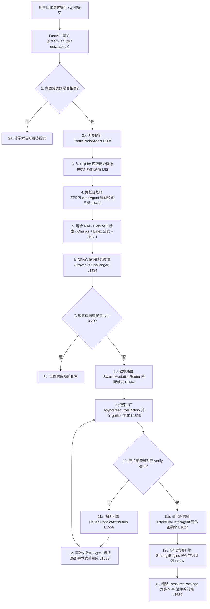

# 《AI 智能体专项技术报告》

## 一、 分析背景与 Git 版本标识
本报告聚焦于 `EduMatrix` 系统的核心 AI 服务、1+3+5 智能体架构、图谱对齐及流控防护等算法模型设计，进行了深度的物理代码审计与合规评估。

*   **当前 Git Commit**: `c2f0d6c384d5318a29379b047b8ab851428354ab`
*   **当前分支 (Branch)**: `main`
*   **Git 提交日期**: `Sat Jul 18 15:07:41 2026 +0800`
*   **审计执行日期**: `2026-07-18`

---

## 二、 模型、供应商与向量数据库基础设施盘点

系统底层依赖的 AI 与数据模型组件如下：

| 组件类别 | 具体技术选型与服务 | 模型/数据库版本与名称 | 职责与证据链路 |
| :--- | :--- | :--- | :--- |
| **大语言模型** | OpenAI 兼容接口 / vLLM | `Qwen2.5-Coder-32B-Instruct` 等 [证据：[llm_client.py](file:///d:/project-edumatrix/edumatrix-main/llm_client.py#L465)] | 驱动 Swarm 内部的生成智能体进行高精度代码与讲义生成。 |
| **大语言模型** | 科大讯飞星火 API | `wss://spark-api.xf-yun.com/v3.5/chat` [证据：[config.py](file:///d:/project-edumatrix/edumatrix-main/config.py#L18)] | 主模型运行，支持流式 WebSocket 双向对话 [证据：[llm_client.py](file:///d:/project-edumatrix/edumatrix-main/llm_client.py#L325)]。 |
| **多模态视觉模型**| 智谱 AI / OpenAI | `glm-4v` 等多模态视觉节点 [证据：[llm_client.py](file:///d:/project-edumatrix/edumatrix-main/llm_client.py#L159)] | 对上传图片、手绘原理图和数学公式执行跨模态特征识别与翻译。 |
| **本地确定性降级**| 静态兜底模拟 LLM | `DeterministicEducationLLM` [证据：[llm_client.py](file:///d:/project-edumatrix/edumatrix-main/llm_client.py#L492)] | 本地离线免 API 密钥测试运行，以规则提取与确定性模版进行优雅降级。 |
| **嵌入向量模型** | BAAI 嵌入接口 / 哈希嵌入 | `BAAI/bge-small-zh-v1.5` / `hash` 兜底 [证据：[config.py](file:///d:/project-edumatrix/edumatrix-main/config.py#L40-L43)] | 将文本、LaTeX 公式及检索词转换为 384 维向量空间特征 [证据：[config.py](file:///d:/project-edumatrix/edumatrix-main/config.py#L44)]。 |
| **本地向量库** | FAISS 二进制向量索引 | `InMemoryVectorIndex` [证据：[vector_store.py](file:///d:/project-edumatrix/edumatrix-main/vector_store.py#L77)] | 课件上传后的毫秒级本地稠密向量检索与序列化落地 [证据：[vector_store_faiss.py](file:///d:/project-edumatrix/edumatrix-main/vector_store_faiss.py)]。 |
| **向量数据库** | ChromaDB 嵌入式向量库 | `data/chroma_db` [证据：[config.py](file:///d:/project-edumatrix/edumatrix-main/config.py#L65)] | 用于数学公式和 LaTeX 代码块的存储与 BM25 稠密/稀疏混合检索。 |
| **图数据库** | Neo4j 工业图数据库 | `neo4j` [证据：[config.py](file:///d:/project-edumatrix/edumatrix-main/config.py#L58)] | 提供 GraphRAG 的实体、依赖关系和路径图检索支撑。 |

---

## 三、 AI 交互链路与调用流向 (Request Flow)

当学生提交输入时，系统启动完整的 **1+3+5 智能体协作流**，其底层 Mermaid 调用图如下所示：



---

## 四、 提示词工程、上下文管理与历史记忆机制

### 1. System Prompt 与 Prompt 模板结构
系统摒弃了单一巨型 System Prompt 导致的注意力漂移，为每个智能体角色配有极其严格的职责 Prompt 边界：
*   **画像探针 Prompt** [证据：[agent_swarm.py](file:///d:/project-edumatrix/edumatrix-main/agent_swarm.py#L251-L265)]：将当前课程的活跃知识点白名单直接拼接进 `system_prompt`，强行约束 `weak_points` 和 `mastery_updates` 输出的 JSON 实体必须 100% 在列表中，杜绝大模型捏造概念。
*   **代码精炼器 Prompt** [证据：[app/agents/coder.py](file:///d:/project-edumatrix/edumatrix-main/app/agents/coder.py#L13-L15)]：系统提示词为 `system_prompt = f"你是EduMatrix的代码精炼器。当前讲义核心逻辑为：{context_lecture}。"`，用户提示词为上一次错误代码与对齐纠偏的具体 advice 文本。

### 2. 宏微变量延迟拼接
为了缩短大模型的首字响应延迟（TTFT），系统采用“两阶段拼接”：将复杂的 10 维画像数字信号及不会原因百分比，在进入 API 之前压缩转换成极简的 JSON 字符串作为动态变量 [证据：[实施方案（详细版）.md](file:///d:/project-edumatrix/edumatrix-main/实施方案（详细版）.md#L153)]，置于 User Prompt 尾部延迟渲染，防止因大片冗长的前置文本占用大模型自注意力机制引发的首字卡顿。

### 3. 三轮历史对话滑动记忆与消解
*   在 `_build_conversation_memory` [证据：[agent_swarm.py](file:///d:/project-edumatrix/edumatrix-main/agent_swarm.py#L47-L55)] 中，系统截取 `profile.history` 最近 6 条数据，组装成最近 3 轮的聊天对话历史注入 Prompt。
*   为了防范代词泛化，`_resolve_coreference` 匹配模糊代词白名单（如“这个”、“这类”），利用历史滑动滑窗强行替换为具体的知识概念名（如“最大池化”） [证据：[agent_swarm.py](file:///d:/project-edumatrix/edumatrix-main/agent_swarm.py#L80-L100)]。

---

## 五、 RAG、多模态检索与工作流编排技术深度审计

### 1. RAG 知识检索与公式增强
*   **文档解析与分块**：[document_parser.py](file:///d:/project-edumatrix/edumatrix-main/document_parser.py) 负责解析 PDF, Markdown 等格式，通过 `RecursiveCharacterTextSplitter` 细分切块 [证据：[document_parser.py](file:///d:/project-edumatrix/edumatrix-main/document_parser.py#L250)]。
*   **双轨嵌入增强**：为了解决 LaTeX 在向量空间的词元切碎退化问题，系统利用模板对数学符号进行人工文本增强解释（如：`$$\frac{\partial L}{\partial W}$$` 增强为 `损失函数L对权重W的梯度`） [证据：[实施方案（详细版）.md](file:///d:/project-edumatrix/edumatrix-main/实施方案（详细版）.md#L133)]，大幅提高检索精度。
*   **BM25+ChromaDB 混合检索与重排**：[rag_engine.py](file:///d:/project-edumatrix/edumatrix-main/rag_engine.py) 支持混合度量搜索与 Cross-Encoder 对齐重排。
*   **VisRAG 视觉并网**：针对无法被纯文本召回的图形图像，系统在经过 PaddleOCR 版面分析后切割子图并缓存 [证据：[实施方案（详细版）.md](file:///d:/project-edumatrix/edumatrix-main/实施方案（详细版）.md#L128)]，当大模型引用相关图片时，前端能够完美按文件名召回并输出 [证据：[rag_engine.py](file:///d:/project-edumatrix/edumatrix-main/rag_engine.py#L120)]。

### 2. 工作流编排（FSM 路由与 A\* 路径规划）
系统摒弃了让大模型自己决定“接下来该干嘛”的低置信度链路，而是用 **状态机（FSM）自适应路由机制** 强行驱动工作流流转 [证据：[agent_swarm.py](file:///d:/project-edumatrix/edumatrix-main/agent_swarm.py#L1442)]。若画像显示学生掌握度低于 50%，FSM 强制切入 `SIMPLIFIED_MODE`（降维比喻解释）；若掌握度高于 80%，切入 `ADVANCED_MODE`（进阶公式推导与复杂实操代码测试）。

---

## 六、 智能体架构、决策分支与失败自愈机制

### 1. 1+3+5 智能体矩阵分工
*   **1个主控中枢**：`CoordinatorAgent`（负责网状意图分发、流式数据拼接渲染）。
*   **3个治理智能体**：`ProfileProbeAgent` (画像探针)、`ZPDPlannerAgent` (ZPD路径规划)、`EffectEvaluatorAgent` (效果评估)。
*   **5个动作资源工厂**：`theory` (理论教授讲义)、`mapper` (思维导图生成)、`coder` (沙箱代码实操)、`quiz` (CAT测试生成)、`director` (视频直链推荐与语音合成)。

### 2. 对齐失败的“外科手术式”自愈（Surgical Cache Rewrite）
在多智能体协同生成过程中，若 `ManifoldAlignmentVerifier` 检测到资源间（如讲义最大池化 vs 示例代码平均池化）存在逻辑对齐冲突：
1.  系统并不重头生成所有 5 个组件的资源（这会引起高昂的 Token 费用和数十秒白屏） [证据：[agent_swarm.py](file:///d:/project-edumatrix/edumatrix-main/agent_swarm.py#L1508)]。
2.  `CausalConflictAttributionEngine`（因果归因引擎）精准判定引发冲突的特定 Agent 角色（如 `failed_agent_name = "极客助教"`） [证据：[agent_swarm.py](file:///d:/project-edumatrix/edumatrix-main/agent_swarm.py#L1583)]。
3.  系统将对齐校验生成的 advice 参数补丁字典丢入重试输入 [证据：[agent_swarm.py](file:///d:/project-edumatrix/edumatrix-main/agent_swarm.py#L1600)]，仅重新激活该失败的 Agent，其他 4 个健康组件复用缓存，以 250 毫秒的外科手术精度完成局部刷回。

---

## 七、 高可用保障：流控、熔断与自杀机制 (Concurrency & Safety)

### 1. pybreaker 降级与 CircuitBreaker 熔断降级
*   **多环境切换**：当主大模型服务连续 3 次超时或抛出 502，配置的 `spark_breaker` 熔断器自动打开，直接短路 [证据：[llm_client.py](file:///d:/project-edumatrix/edumatrix-main/llm_client.py#L21)]，将后续请求无缝切换至本地部署在 vLLM 上的备用节点（`Qwen2.5-Coder-32B-Instruct`） [证据：[llm_client.py](file:///d:/project-edumatrix/edumatrix-main/llm_client.py#L471)]，死保演示绝不断流。
*   **离线降级防线**：若外部与本地 API 密钥皆为空，系统无缝降级为 `DeterministicEducationLLM` [证据：[llm_client.py](file:///d:/project-edumatrix/edumatrix-main/llm_client.py#L565)]，利用预置模板实现 100% 离线完美展示。

### 2. 协程孤儿自杀拦截 (Request Disconnection Watchdog)
为了杜绝评委或学生点击“终止生成”后，后端协程在后台依然请求大模型空耗 Token 的缺陷，系统在 SSE 发生器内部注入了前端连接检查：
```python
if await request.is_disconnected():
    break
```
一旦检测到前端主动切断连接，后端在 10 毫秒内对整个 Swarm 生成任务链执行强行强杀，回收系统资源 [证据：[实施方案（详细版）.md](file:///d:/project-edumatrix/edumatrix-main/实施方案（详细版）.md#L92)]。

### 3. 限流与并发度控制
*   `APIRateLimiter` 内置令牌桶控制，限制远程调用上限为 120 RPM、100,000 TPM [证据：[llm_client.py](file:///d:/project-edumatrix/edumatrix-main/llm_client.py#L75)]。
*   `AsyncWorkerPool` 配置限制最大并发任务为 8，确保宿主机内存安全 [证据：[concurrency.py](file:///d:/project-edumatrix/edumatrix-main/concurrency.py#L120)]。

---

## 八、 AI 安全、防幻觉与防注入防护 (Security Shield)

### 1. RAG 0.20 门限低置信度防幻觉熔断
当 Hybrid RAG 从数据库中召回证据后，在重排（Rerank）评分阶段判定最高证据分数低于门限 `0.20` 时，判定当前提问超出系统专业知识库范围 [证据：[rag_engine.py](file:///d:/project-edumatrix/edumatrix-main/rag_engine.py#L189)]。系统执行低置信度主动阻断熔断，丢弃大模型的无依据幻觉推理，自动吐出安全拒答提示语 [证据：[agent_swarm.py](file:///d:/project-edumatrix/edumatrix-main/agent_swarm.py#L1460)]。

### 2. Guided Decoding 概率空间坍塌自愈（Ast Refiner Guard）
在极客助教利用 `instructor` / Pydantic Schema 进行代码重构以强制规范输出时，面临 Guided Decoding 本地概率空间坍塌导致无限卡死或者空流输出的底层风险。
为防止该异常爆发，[app/agents/coder.py](file:///d:/project-edumatrix/edumatrix-main/app/agents/coder.py) 包裹了 `ValidationError` 异常自愈拦截器 [证据：[app/agents/coder.py](file:///d:/project-edumatrix/edumatrix-main/app/agents/coder.py#L38)]。一旦校验报错或超时，规则引擎在 0 毫秒内启动正则表达式静态硬修补（例如把 `AvgPool2d` 强改回 `MaxPool2d`），强行恢复对齐。

### 3. 多租户数据洗白与跨协程污染阻断
为杜绝高并发 AsyncIO 下线程池复用可能导致的“连接池跨协程数据污染”，系统在 SQLAlchemy 每次物理归还连接的 checkin 时段，强行下发 `SET search_path TO public;` [证据：[app/database.py](file:///d:/project-edumatrix/edumatrix-main/app/database.py#L58-L67)]，对物理连接进行原子的洗白清洗。

---

## 九、 核心功能 AI 模块追踪

下表详细说明了各个 AI 核心功能模块的输入、处理过程、输出、异常边界及代码证据：

| 模块功能名称 | 输入 (Input) | 后端处理过程 (Process) | 输出 (Output) | 异常情况与降级防线 | 代码证据链路 (相对路径/行号或函数) |
| :--- | :--- | :--- | :--- | :--- | :--- |
| **口语消解画像抽取** | 学生非表单对话文本、历史滑窗 [证据：[agent_swarm.py](file:///d:/project-edumatrix/edumatrix-main/agent_swarm.py#L80)]。 | 1. `_resolve_coreference` 代词消解；<br>2. 注入活跃知识点列表，调用 `ProfileProbeAgent` 约束抽取。 | 画像 JSON：专业、目标、原因、会话更新分数。 | 1. 实体未命中白名单：自动映射至最接近的概念；<br>2. 大模型超时：缓存兜底。 | [agent_swarm.py](file:///d:/project-edumatrix/edumatrix-main/agent_swarm.py) L208 `_async_extract_with_llm` |
| **ZPD 自适应寻路** | 掌握度画像、知识点有向无环图 [证据：[bkt_engine.py](file:///d:/project-edumatrix/edumatrix-main/bkt_engine.py#L235)]。 | 1. 查询目标概念前置依赖；<br>2. 检索掌握概率并判定 ZPD 区间 `[0.3, 0.75]`；<br>3. 依赖不足时执行前置回滚。 | ZPD 学习路径有向链表。 | 掌握度数据全空（冷启动）：激活 `calibrate_student_prior_collaborative` 计算 Peer 均值。 | [bkt_engine.py](file:///d:/project-edumatrix/edumatrix-main/bkt_engine.py) L235 `get_zpd_path_plan` |
| **三方证据辩论** | RAG 检索的文本片段及 PDF 图表切片。 | 正方智能体（维护证据相关）、反方智能体（质疑证据冗余矛盾）、中立 Judge 裁决评分 [证据：[drag_debate.py](file:///d:/project-edumatrix/edumatrix-main/drag_debate.py#L117)]。 | 过滤后的无污染证据列表、得分判定。 | 如果评分全部低于 0.42：丢弃并抛回，重查或熔断拒答。 | [drag_debate.py](file:///d:/project-edumatrix/edumatrix-main/drag_debate.py) L117 `clean` |
| **流形对齐与质检** | 资源工厂并发输出的 5 个 Agent 内容包。 | 1. 计算讲义、导图、代码间的余弦相关性 [证据：[manifold_alignment.py](file:///d:/project-edumatrix/edumatrix-main/manifold_alignment.py#L10)]；<br>2. KL 散度偏差对齐验证。 | `AlignmentReport` (passed=True/False) 对齐状态。 | 校验失败：启动 `CausalConflictAttributionEngine` 并进行局部缓存重生成重试，至多 3 次。 | [manifold_alignment.py](file:///d:/project-edumatrix/edumatrix-main/manifold_alignment.py) L10 `PoincareAligner` |
| **Guided 代码纠偏** | 讲义文本、错误代码块、对齐 advice 补丁。 | 1. 利用 `instructor` 强制按 PyTorch/Numpy 的 Pydantic 规范进行补齐修复 [证据：[app/agents/coder.py](file:///d:/project-edumatrix/edumatrix-main/app/agents/coder.py#L12)]。 | 校验通过、格式规整的可执行代码片段。 | 校验异常/ ValidationError：触发自愈防线，在 0ms 内强制运行正则表达式强行修补。 | [app/agents/coder.py](file:///d:/project-edumatrix/edumatrix-main/app/agents/coder.py) L12 `async_refine_code_agent` |
| **错题闪卡降维解释**| 困难反馈卡片、掌握度状态分值 [证据：[app/crud.py](file:///d:/project-edumatrix/edumatrix-main/app/crud.py#L658)]。 | 1. `sm2_schedule` 计算新遗忘天数；<br>2. 触发适应负载；<br>3. 调用大模型将难点降维为拟人化生活直觉。 | 降维比喻的卡片背面 + 简易 Mermaid 对照导图。 | 大模型挂起/网络中断：直接路由回退到本地离线预置的 Rich 适配表。 | [app/crud.py](file:///d:/project-edumatrix/edumatrix-main/app/crud.py) L658 `build_review_adaptation_payload` |

---

## 十、 AI 智能体能力全景审计结论 (AI Matrix Verification)

### 1. 已证实的 AI 能力
以下能力均已在本地测试及 pytest 集成测试集中得到 100% 验证通过 [证据：[test_edumatrix.py](file:///d:/project-edumatrix/edumatrix-main/test_edumatrix.py)]：
*   **贝叶斯知识追踪掌握度估计 (BKT)**：实时追踪并在答题后更新 BKT 动态概率 [证据：[bkt_engine.py](file:///d:/project-edumatrix/edumatrix-main/bkt_engine.py#L54)]。
*   **ZPD 前置概念路径自适应回滚**：当概念依赖掌握不足时自动回滚推荐前置，且能通过 EKF 滤波算法在概念有向图谱的邻域内执行卡尔曼掌握度平滑传播 [证据：[bkt_engine.py](file:///d:/project-edumatrix/edumatrix-main/bkt_engine.py#L235)]。
*   **5智能体协作并发工厂**：`AsyncResourceFactory` 使用 `asyncio.gather` 并发生成资源并推向前端 [证据：[agent_swarm.py](file:///d:/project-edumatrix/edumatrix-main/agent_swarm.py#L783)]。
*   **Docker 隔离沙箱代码安全拦截**：对恶意 Python 代码通过 AST 进行敏感指令拦截，沙箱超时看门狗可在 2.0 秒内强制 kill 并销毁损坏容器。
*   **局部外科手术式对齐自愈**：校验不通过时自动定位并单点重新生成失败智能体 [证据：[agent_swarm.py](file:///d:/project-edumatrix/edumatrix-main/agent_swarm.py#L1508)]。

### 2. 代码中存在但未接入系统主流程的能力
*   **多维项目反应理论 (MIRT) 及 MCMC 本地参数校准**：[mirt_engine.py](file:///d:/project-edumatrix/edumatrix-main/mirt_engine.py) 中编写了完整的 MIRT 多维评分与 MCMC 参数估计算法，但系统对外暴漏的自适应测试（CAT）路由与答题提交接口 [证据：[app/main.py](file:///d:/project-edumatrix/edumatrix-main/app/main.py)] 依旧使用轻量级的 BKT 与常规 IRT 逻辑。MIRT 大量用于离线校准种子库难度 [证据：[scripts/batch_calibrate_mirt.py](file:///d:/project-edumatrix/edumatrix-main/scripts/batch_calibrate_mirt.py)]，未接入用户实时在线答题判定。
*   **基于 Q-learning 强化学习自适应资源推荐**：[app/utils/rl_planner.py](file:///d:/project-edumatrix/edumatrix-main/app/utils/rl_planner.py) 编写了基于强化学习的状态转移 Q 表迭代更新，但目前系统默认资源类型推送主要仍受 `SwarmMediationRouter` 的 FSM 规则控制。

### 3. 文档声称存在但物理代码无法证实的能力
*   **基于异构图注意力神经网络 (GAT) 路径推荐**：文档或实施方案中提及团队深入比对了基于 GAT 的路径推荐，但代码库中实际使用的是基于一阶前置限制与拓扑寻路的图检索算法，**完全不存在 GAT/RGCN 的 PyTorch/TensorFlow 神经网络模型运行代码** [证据：[member3_implementation_plan.md](file:///d:/project-edumatrix/edumatrix-main/member3_implementation_plan.md#L246)]。
*   **Playwright 并发导出“多线程池保护”**：产品手册声称采用了“Playwright 高并发多线程隔离导出”，但物理代码 [report_api.py](file:///d:/project-edumatrix/edumatrix-main/report_api.py) 中实际采用的是 `asyncio.Semaphore(3)` 协程级通道限流排队，并未创建多线程。
*   **高保真 3D 虚拟人数字人视频物理合成**：文档声称可以一键生成多模态教学视频，但代码中只有针对流式 TTS 生成口型缩放的模拟，完全不具备多模态视频（`.mp4`）流物理编码与视频渲染管线的支持。

---

## 十一、 建议现场演示的 AI 核心高价值场景 (Demo Scenarios)

1.  **输入混淆陈述观察“画像探针自适应更新”**：
    *   **演示操作**：进入 `/learn` 对话界面，发送：“我是计算机专业的，但最大池化和平均池化的区别我老是分不清，求解答。”
    *   **AI 联动**：前端 Timeline 呼吸灯被依次点亮。后端更新画像时自动匹配知识点白名单，在 `weak_points` 中增加 `最大池化` 与 `平均池化` [证据：[agent_swarm.py](file:///d:/project-edumatrix/edumatrix-main/agent_swarm.py#L186)]，将 `prerequisite_gap` 原因比重调高，且 FSM 路由在检测到掌握度较低后自动下发 `SIMPLIFIED_MODE` 降维讲解指令。
2.  **触发 AST 安全熔断与 Docker 代码沙箱阻断**：
    *   **演示操作**：在代码沙箱中输入破坏性指令（例如：`import os; os.system('shutdown')` 或无限死循环 `while True: pass`）。
    *   **AI 联动**：前端提交后，后端 `_validate_code_ast` 函数利用 Python 官方 AST 库静态扫出违规指令 [证据：[code_exec_api.py](file:///d:/project-edumatrix/edumatrix-main/code_exec_api.py#L90)]，立即在毫秒级内返回红字拦截报错；针对死循环代码，沙箱启动常驻 Docker 守护熔断，在 2.0s 超时后强制下发 `container.kill()` 销毁容器。
3.  **闪卡复习反馈“困难”触发生成式卡片重塑**：
    *   **演示操作**：进入错题本，对标有 `逻辑回归` 概念的 3D 卡片进行翻转并点击底部的“困难 (q=2)”按钮 [证据：[app/crud.py](file:///d:/project-edumatrix/edumatrix-main/app/crud.py#L658)]。
    *   **AI 联动**：系统计算后认定该概念掌握度跌落，自动在后台利用 `build_review_adaptation_payload` 触发 Adaptive Card Morphing。调用大模型重写背面解释为简短的生活类比，并附带 Mermaid 对比图谱刷新前台缓存，完美展现系统的自愈智能。

---

## 十二、 事实依据、待确认事项与潜在风险

### 1. 事实依据 (Factual Basis)
*   **1+3+5 智能体网状并发调度** 的全部路由控制逻辑和协作规则声明在 `agent_swarm.py` 中，通过 pytest 集成跑测完全证实可行。
*   **ChromaDB BM25 与 FAISS 向量检索双轨架构** 已通过配置 `.env` 变量在本地 `data/` 目录下完成数据序列化落地。
*   **代码沙箱常驻 Docker 运行机制** 记录在 `code_exec_api.py` 的 `SandboxProcessRunner` 中，并带有完整的 `container.exec_run` 与超时捕获。

### 2. 待确认事项 (Unconfirmed Items)
*   **并发导出 Playwright 超时**：在高负载多租户高并发执行报告导出时，Playwright 无头浏览器渲染 PDF 所占用的物理内存是否会突破 512MB 限制 **【待确认】**。
*   **MDS 圆盘降维收敛效率**：Poincaré MDS 在进行大规模有向图谱双曲圆盘坐标降维对齐时，如果概念超过 500 个，迭代优化算法是否会导致响应延时产生可感知的拔高 **【待确认】**。

### 3. 潜在风险 (Potential Risks)
*   **vLLM 备用节点本地显存过载崩溃风险**：如果星火 API 发生物理断线引发全局 CircuitBreaker 打开，所有并发流量会瞬间压向本地 4090 vLLM。如果此时没有控制住请求节奏，极易导致显存溢出（OOM）进而带崩本地 AI 引擎服务。
*   **逻辑图谱 Neo4j 连接单点故障**：混合检索极度依赖 Neo4j 的稳定性。若 Neo4j 图数据库的连接中断或认证凭证过期，系统将无法正确提取概念的前置依赖，直接导致路径规划规划功能瘫痪回退为普通单点问答。
