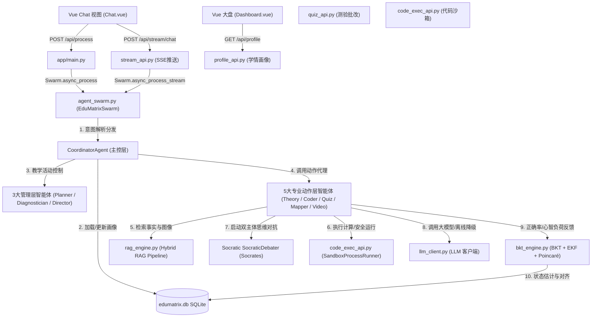
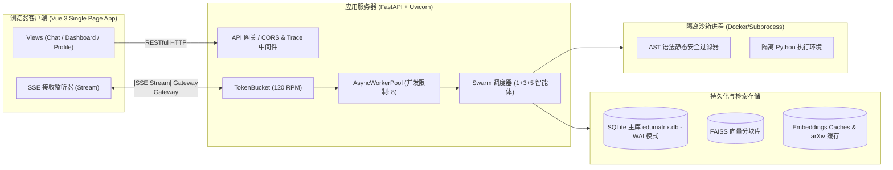
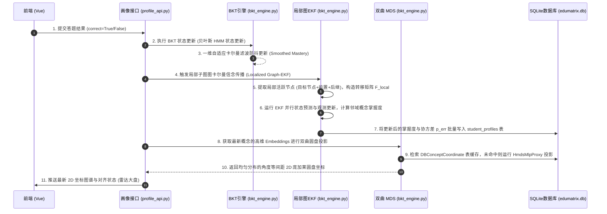

# 《代码仓库盘点与总体架构报告》

## 一、 项目一句话概述
`EduMatrix 智教矩阵` 是一款基于大语言模型（LLM）、GraphRAG 与多模态检索技术构建的高智能个性化自适应教育系统，通过独特的 **1+3+5 智能体协作矩阵架构** [证据：[AGENTS.md](file:///d:/project-edumatrix/edumatrix-main/AGENTS.md#L30-L50)]，将贝叶斯知识追踪（BKT）[证据：[bkt_engine.py](file:///d:/project-edumatrix/edumatrix-main/bkt_engine.py#L54)]、扩展卡尔曼滤波（EKF）状态估计[证据：[bkt_engine.py](file:///d:/project-edumatrix/edumatrix-main/bkt_engine.py#L235)]与 Poincaré 圆盘双曲流形对齐算法[证据：[manifold_alignment.py](file:///d:/project-edumatrix/edumatrix-main/manifold_alignment.py#L10)]相融合，实现了学情实时精准诊断、A* 路径动态规划及五维个性化学习资源的自适应闭环推荐 [证据：[app/utils/recommendation_engine.py](file:///d:/project-edumatrix/edumatrix-main/app/utils/recommendation_engine.py#L291)]。

---

## 二、 技术栈表
下表盘点了 `EduMatrix` 系统所涉及的全部核心技术组件与运行时环境：

| 维度 | 技术选型 | 具体组件与服务 | 职责与作用 |
| :--- | :--- | :--- | :--- |
| **开发语言** | Python, JavaScript | Python 3.10+, ES6+ | 后端业务逻辑与算法实现，前端交互逻辑开发。 |
| **运行时** | Python, Node.js | CPython 3.11 Interpreter, Node.js v20 | 后端服务与沙箱运行环境，前端静态资源编译。 |
| **前端框架** | Vue 3, Vite, Tailwind CSS 4 | Vue 3 Composition API, Vite v5 | 现代 SPA 单页应用开发，极致构建加速与深色视觉样式。 |
| **后端框架** | FastAPI, Uvicorn | FastAPI v0.110, Uvicorn | 支撑高性能异步 I/O、RESTful 接口开发及 SSE 流式推送。 |
| **数据库** | SQLite, SQLAlchemy 2.0 | `edumatrix.db` (WAL mode) | 事务级学生画像、答题记录、复习计划等物理 data 持久化。 |
| **向量检索** | FAISS, Chroma | `InMemoryVectorIndex` [证据：[vector_store.py](file:///d:/project-edumatrix/edumatrix-main/vector_store.py#L77)], `FaissVectorIndex` | 本地十万级 RAG 知识点分块及特征的高效向量相似度检索。 |
| **缓存系统** | SQLite 缓存表 | `embeddings_cache.db`, `arxiv_cache` 表 | 本地缓存高频 Embedding 向量与 arXiv 文献检索结果，防 API 超限。 |
| **消息队列** | （未接入物理 MQ） | `LearningEventBus` (内存事件总线) [证据：[learning_event_bus.py](file:///d:/project-edumatrix/edumatrix-main/learning_event_bus.py#L10)] | 在内存中异步分发和订阅学情更新事件，非物理 MQ **【待确认：生产环境是否需并入 Redis/RabbitMQ】**。 |
| **AI 服务** | OpenAI, 讯飞星火 | OpenAI API (Windhub), Spark API | 驱动智能体矩阵推理、资源包自动生成及苏格拉底辩论。 |
| **沙箱隔离** | Python Docker / Subprocess | `SandboxProcessRunner` [证据：[code_exec_api.py](file:///d:/project-edumatrix/edumatrix-main/code_exec_api.py#L12)] | 在隔离环境中运行学生提交的代码及数学公式计算，防止安全逃逸。 |
| **第三方服务** | Playwright, PyMuPDF | Playwright Python, PyMuPDF, python-docx | 提供学术诊断 PDF 报告的并发安全异步导出，及多模态文档解析。 |

---

## 三、 模块责任表
仓库顶层目录主要由展示交互层、后端 API 路由、核心算法引擎、以及数据管理和测试工具构成，各模块职责如下：

### 1. 核心业务功能与算法模块
| 模块名称 | 相对文件路径 | 核心职责 | 入口函数/类 | 依赖关系 |
| :--- | :--- | :--- | :--- | :--- |
| **服务启动入口** | [run.py](file:///d:/project-edumatrix/edumatrix-main/run.py) | 服务启动主入口，执行端口清理、加载配置并拉起 Uvicorn 服务。 | `main()` | 依赖 `app.main` |
| **应用全局管理** | [app/main.py](file:///d:/project-edumatrix/edumatrix-main/app/main.py) | 初始化 FastAPI 实例，配置跨域 CORS 与全局耗时追踪中间件，挂载全部子路由。 | `startup()`, `shutdown()` | 依赖 `app.database`, `observability` |
| **智能体集群调度**| [agent_swarm.py](file:///d:/project-edumatrix/edumatrix-main/agent_swarm.py) | 1+3+5 智能体架构的核心实现。定义 `EduMatrixSwarm` 类，管理各 Agent 的专属 Prompt、上下文承袭与状态扭转。 | `EduMatrixSwarm` | 依赖 `llm_client`, `rag_engine`, `bkt_engine` |
| **混合 RAG 管线** | [rag_engine.py](file:///d:/project-edumatrix/edumatrix-main/rag_engine.py) | 混合 RAG 检索管线。融合 GraphRAG 拓扑路径扩展、VisRAG 图像特征匹配（ColPali MaxSim）与外部 arXiv 检索。 | `HybridRAGPipeline` | 依赖 `vector_store_faiss`, `embedding_models` |
| **贝叶斯知识追踪**| [bkt_engine.py](file:///d:/project-edumatrix/edumatrix-main/bkt_engine.py) | 知识点掌握概率更新（BKT）、ZPD 最近发展区剪枝、Localized Graph-EKF 卡尔曼信念传播。 | `BKTState`, `BKTEngine`, `KalmanFilter` | 依赖 `app.database` |
| **双曲流形对齐** | [manifold_alignment.py](file:///d:/project-edumatrix/edumatrix-main/manifold_alignment.py) | 将学习特征映射至双曲空间庞加莱圆盘，执行认知状态流形与学科大纲流形的仿射对齐。 | `PoincareAligner` | 依赖 `embedding_models` |
| **自适应推荐策略**| [learning_strategy.py](file:///d:/project-edumatrix/edumatrix-main/learning_strategy.py) | 基于艾宾浩斯 SM-2 的卡片复习调度、基于 A* 启发式搜索的学习路径规划。 | `PathPlanner`, `ReviewScheduler` | 依赖 `bkt_engine`, `manifold_alignment` |
| **三方证据辩论** | [drag_debate.py](file:///d:/project-edumatrix/edumatrix-main/drag_debate.py) | DRAG 三方对抗辩论主控，管理 Prover (正方)、Challenger (反方) 与 Judge (中立裁判) 的博弈过滤。 | `DragDebateController` | 依赖 `llm_client` |
| **代码隔离沙箱** | [code_exec_api.py](file:///d:/project-edumatrix/edumatrix-main/code_exec_api.py) | 对学生和智能体提交的代码进行 AST 静态合规校验，并在 Docker 容器或受限子进程中隔离执行。 | `SandboxProcessRunner` | 依赖 `config` |
| **强类型统一配置**| [config.py](file:///d:/project-edumatrix/edumatrix-main/config.py) | 读取 `.env` 配置文件并校验 LLM API 密钥、数据库连接、并发与熔断参数。 | `EduMatrixConfig` | 依赖 `dotenv` |
| **大模型抽象接口**| [llm_client.py](file:///d:/project-edumatrix/edumatrix-main/llm_client.py) | 统一大模型客户端，支持 OpenAI 兼容 API、星火 API 及无缝降级为本地离线教育小模型（DeterministicEducationLLM）的无缝降级。 | `LLMClient`, `DeterministicEducationLLM` | 依赖 `config` |
| **可观测性遥测** | [observability.py](file:///d:/project-edumatrix/edumatrix-main/observability.py) | 遥测与指标收集系统，记录 Span 耗时、Token 消耗量、APM 延时指标。 | `TelemetryManager` | 零依赖 |
| **并发与流控** | [concurrency.py](file:///d:/project-edumatrix/edumatrix-main/concurrency.py) | 限流令牌桶（TokenBucket）、熔断器（CircuitBreaker）以及异步工作并发池（AsyncWorkerPool）。 | `CircuitBreaker`, `TokenBucket` | 零依赖 |
| **多维项目反应理论**| [mirt_engine.py](file:///d:/project-edumatrix/edumatrix-main/mirt_engine.py) | 基于多维项目反应理论（MIRT）和认知诊断模型对测验表现进行评分。 | `MIRTEngine` | 依赖 `numpy` |
| **错题闪卡生成** | [anki_engine.py](file:///d:/project-edumatrix/edumatrix-main/anki_engine.py) | 自适应生成复习 Anki 闪卡并进行背面改写重构。 | `AnkiEngine` | 依赖 `llm_client` |
| **多模态对齐** | [multimodal_alignment.py](file:///d:/project-edumatrix/edumatrix-main/multimodal_alignment.py) | 学术文本与视觉原理图的高精度跨模态语义空间对齐。 | `MultimodalAligner` | 依赖 `embedding_models` |

### 2. 本地开发辅助环境 (oh-my-agent)
按照 [AGENTS.md](file:///d:/project-edumatrix/edumatrix-main/AGENTS.md) 规定，以下模块仅供本地物理开发辅助，不属于核心系统业务功能：
- **`oh-my-ag` 编排指令**：由 `scripts/` 或根目录下相关 bat 文件控制的本地 AI 开发编排环境。
- **本地开发 Skills & Workflows**：存储于 `.agents/skills` 和 `.agents/workflows` 的开发脚手架。
- **Git 校验钩子**：用于本地代码提交时的代码规范与单一职责审计校验。

---

## 四、 运行链路
当学生向系统发送一个提问或答卷时，系统的核心运行链路如下图所示，包含了核心路由、Swarm 控制器、算法引擎与持久层之间的调用链条 [证据：[app/main.py](file:///d:/project-edumatrix/edumatrix-main/app/main.py#L586-L627)]：

### 1. 调用链路图 (Call Chain)


---

## 五、 数据流
系统的核心数据流由 **双曲流形对齐** 与 **Localized Graph-EKF 信念传播** 两个关键算法数据流，以及 **9 步自适应闭环数据流** 构成。

### 1. 运行时拓扑图 (Runtime Topology)
系统采用分层分布式运行时设计，前后端通过 HTTP 与 SSE 进行实时高并发双通道通信：


### 2. 核心算法数据流 (EKF + Poincaré MDS 对齐数据流)


---

## 六、 构建与部署方式

### 1. 配置文件与环境变量
系统全局配置声明在 [config.py](file:///d:/project-edumatrix/edumatrix-main/config.py#L13-L75) 中，强类型映射至 `.env` 环境变量文件。关键配置项如下：
- `EDUMATRIX_LLM_PROVIDER`: 模型服务商（`openai` / `spark` / `deterministic`） [证据：[config.py](file:///d:/project-edumatrix/edumatrix-main/config.py#L21)]
- `EDUMATRIX_LLM_ENDPOINT`: LLM API 接口端点。
- `EDUMATRIX_MAX_CONCURRENT_LLM`: 全局最大并发 LLM 调用限制（默认 `8`） [证据：[config.py](file:///d:/project-edumatrix/edumatrix-main/config.py#L49)]
- `EDUMATRIX_LLM_RATE_LIMIT_RPM`: 限流令牌桶频率控制（默认 `120 RPM`） [证据：[config.py](file:///d:/project-edumatrix/edumatrix-main/config.py#L50)]
- `EDUMATRIX_EMBEDDING_PROVIDER`: 向量嵌入类型（`hash` / `openai`），其中 `hash` 状态不需要外部嵌入 API 支持，可极速离线哈希对齐 [证据：[config.py](file:///d:/project-edumatrix/edumatrix-main/config.py#L40)]
- `EDUMATRIX_SANDBOX_TIMEOUT`: 代码隔离执行的超时时限（默认 `10.0s`） [证据：[config.py](file:///d:/project-edumatrix/edumatrix-main/config.py#L74)]

### 2. 本地启动方式
- **后端服务启动**：
  ```powershell
  python run.py
  ```
  该命令会自动检查本地 8000 端口占用并强制清理，载入 `app.main:app` 服务，自动初始化 SQLite 物理表并启动 [证据：[run.py](file:///d:/project-edumatrix/edumatrix-main/run.py#L40-L100)]。
- **前端服务启动**：
  ```powershell
  cd frontend
  npm run dev
  ```
  基于 Vite 启动本地热更新服务器，开发域监听在 `http://localhost:5173`。

### 3. Docker 容器构建与生产部署
项目根目录下提供了 [Dockerfile](file:///d:/project-edumatrix/edumatrix-main/Dockerfile) 与 [docker-compose.yml](file:///d:/project-edumatrix/edumatrix-main/docker-compose.yml)：
- **Dockerfile 编译结构**：
  - **Stage 1 (Frontend Builder)**: 采用 `node:20-alpine` 安装依赖并执行 `npm run build`，编译输出至 `frontend/dist` [证据：[Dockerfile](file:///d:/project-edumatrix/edumatrix-main/Dockerfile#L4-L10)]。
  - **Stage 2 (Production Run)**: 采用 `python:3.11-slim` 基础镜像，安装 `requirements.txt` 后期依赖，挂载 Stage 1 编译的静态包，运行 Uvicorn 服务 [证据：[Dockerfile](file:///d:/project-edumatrix/edumatrix-main/Dockerfile#L15-L44)]。
- **Docker-compose 一键编排**：
  ```bash
  docker-compose up --build -d
  ```
  拉起名为 `edumatrix` 的容器，映射宿主机 8000 端口，并创建外部持久化匿名数据卷 `edumatrix_data` 挂载至容器内部 `/app/data` 目录以存储 `edumatrix.db` 数据库 [证据：[docker-compose.yml](file:///d:/project-edumatrix/edumatrix-main/docker-compose.yml#L8-L9)]。

### 4. 日志、监控与异常处理
- **异常捕获机制**：FastAPI 全局接管所有路由异常。在 `app/main.py` 中注入了全局 HTTP 中间件，统一在拦截到错误时返回带 Trace-ID 的 `JSONResponse`，防止服务端崩溃 [证据：[app/main.py](file:///d:/project-edumatrix/edumatrix-main/app/main.py#L77-L98)]。
- **日志与遥测**：系统未引入 Datadog/Prometheus 等外部 APM **【待确认】**，而是通过 [observability.py](file:///d:/project-edumatrix/edumatrix-main/observability.py) 中的 `TelemetryManager` 在内存中自建了微秒级监控。当每次接口响应和 LLM 调用发生时，系统通过 `record_span` 与 `record_metric` 收集各项指标数据，并提供 `/api/metrics` 接口暴露给控制台 [证据：[app/main.py](file:///d:/project-edumatrix/edumatrix-main/app/main.py#L753-L759)]。

---

## 七、 核心文件清单与代码规模

### 1. 代码规模统计 (排除 external 库与 data)

| 目录/层级 | 文件数量 (主要语言) | 物理代码行数 (LOC) | 测试文件数量 (LOC) | 职责定位描述 |
| :--- | :--- | :--- | :--- | :--- |
| **项目根目录 (Root)** | 33 个 Python 源文件 | 27,418 行 | 1 个 (`test_edumatrix.py`, 3,195 行) | 系统核心引擎、调度逻辑与 API 路由层。 |
| **前端源码 (frontend)** | 33 个 Vue 页面/组件 | 18,423 行 | 0 个 | UI 界面与交互层（含 D3.js 图谱、音视频控制）。 |
| **子路由与持久化 (app)**| 14 个 Python 文件 | 5,151 行 | 0 个 | 数据库表定义、SQLAlchemy CRUD 及工具类。 |
| **业务脚本 (scripts)** | 23 个 Python 文件 | 6,471 行 | 0 个 | 数据库种子填充、MDS 投影网络训练及跑测工具。 |
| **测试模块 (tests)** | 0 个源文件 | 0 行 | 13 个 Python 测试文件 (2,357 行) | 单体测试与跨模态一致性、沙箱安全单元测试。 |
| **临时草稿 (scratch)** | 46 个文件 | 1,765 行 | 0 个 | 开发过程调试及临时运行验证脚本。 |
| **系统总计** | **149 个核心源文件** | **59,228 行** | **14 个测试文件 (5,552 行)** | **项目整体核心规模 (不含注释与 markdown 计入)** |

### 2. 核心源文件索引 (可点击的 Windows 本地路径)

以下是系统最核心的 15 个源文件索引，点击可直接溯源至物理位置：

1. **API 网关入口**：[app/main.py](file:///d:/project-edumatrix/edumatrix-main/app/main.py) (FastAPI 实例初始化与子路由挂载)
2. **多智能体总控**：[agent_swarm.py](file:///d:/project-edumatrix/edumatrix-main/agent_swarm.py) (EduMatrixSwarm 1+3+5 调度机制)
3. **贝叶斯与卡尔曼引擎**：[bkt_engine.py](file:///d:/project-edumatrix/edumatrix-main/bkt_engine.py) (BKT + EKF 局部信念传播与 Poincaré 双曲距离)
4. **混合 RAG 管线**：[rag_engine.py](file:///d:/project-edumatrix/edumatrix-main/rag_engine.py) (GraphRAG 与 VisRAG 多模态检索逻辑)
5. **学习决策规划**：[learning_strategy.py](file:///d:/project-edumatrix/edumatrix-main/learning_strategy.py) (A* 算法路径搜索与 Ebbinhaus SM-2 间隔复习)
6. **双曲流形对齐**：[manifold_alignment.py](file:///d:/project-edumatrix/edumatrix-main/manifold_alignment.py) (Poincare 空间映射与一致性跨模态对齐)
7. **数据实体模型**：[models.py](file:///d:/project-edumatrix/edumatrix-main/models.py) (学情特征 CognitiveProfile 抽象 Pydantic Schemas)
8. **物理数据库实体**：[app/database.py](file:///d:/project-edumatrix/edumatrix-main/app/database.py) (15 张 SQLAlchemy 物理表关系定义)
9. **三方对抗辩论**：[drag_debate.py](file:///d:/project-edumatrix/edumatrix-main/drag_debate.py) (DRAG 防幻觉证据辨析引擎)
10. **代码沙箱判题**：[code_exec_api.py](file:///d:/project-edumatrix/edumatrix-main/code_exec_api.py) (AST 安全扫描与 Docker/子进程隔离代码判题)
11. **多模态文档解析**：[document_parser.py](file:///d:/project-edumatrix/edumatrix-main/document_parser.py) (PDF、DOCX、Markdown 带元数据解析器)
12. **流式答疑路由**：[stream_api.py](file:///d:/project-edumatrix/edumatrix-main/stream_api.py) (并发 SSE 对话交互接口)
13. **高并发熔断流控**：[concurrency.py](file:///d:/project-edumatrix/edumatrix-main/concurrency.py) (CircuitBreaker 与 TokenBucket 高可用护盾)
14. **自适应资源推荐**：[app/utils/recommendation_engine.py](file:///d:/project-edumatrix/edumatrix-main/app/utils/recommendation_engine.py) (5维个性化资源自适应推送)
15. **DRL 路径规整**：[app/utils/rl_planner.py](file:///d:/project-edumatrix/edumatrix-main/app/utils/rl_planner.py) (基于 Q-learning 的自适应决策更新)

---

## 八、 重复实现、未使用模块与架构缺陷审计 (Contradictions & Risks)

### 1. 明显的重复实现 (Duplicates)
- **`instruct_rag.py` 与 `rag_engine.py`**：虽然 `rag_engine.py` 负责高维数据与文本检索，而 `instruct_rag.py` 负责生成端 Prompt 的共享构建与大模型调用 [证据：[instruct_rag.py](file:///d:/project-edumatrix/edumatrix-main/instruct_rag.py#L220-L280)]。但是，`instruct_rag.py` 命名中含有 `rag` 字眼，极易在团队开发中引起“双头 RAG 管线”的认知混淆。建议将其重命名为 `resource_generator_prompts.py` 以厘清权责。
- **`embedding_models.py` 内的本地计算 vs API 调用**：在 `embedding_models.py` 中，本地哈希特征计算与远程 Embedding API 并存。若本地未配置 API Key，哈希特征会直接兜底 [证据：[embedding_models.py](file:///d:/project-edumatrix/edumatrix-main/embedding_models.py#L100)]。但这一机制在 `manifold_alignment.py` 中有二次重写的趋势，建议统一归并到统一客户端。

### 2. 明显未使用的代码模块 (Unused Modules)
- [fix.py](file:///d:/project-edumatrix/edumatrix-main/fix.py)：手动 SQLite 数据库字段订正迁移脚本，在线运行和测试中完全未使用，建议移至 `scripts/` 目录。
- [retrieval_evaluation.py](file:///d:/project-edumatrix/edumatrix-main/retrieval_evaluation.py)：本地离线 RAG 召回率 (Recall@K) 与 MRR 评价脚本。未挂载至任何 FastAPI 端点，属于本地研发分析工具。
- [claude_bypass.bat](file:///d:/project-edumatrix/edumatrix-main/claude_bypass.bat)：本地环境绕过脚本，与主业务无关。
- `data/raw/github_repos/`：内含大量拉取的外部第三方 Git 仓库（如 `data-science-from-scratch`, `dtreeviz` 等），仅在混合 RAG 解析切片入库时作为源文件输入，不参与系统运行。

### 3. 严重违背单一职责原则 (SRP) 的模块
根据第九部分规范，以下三处存在明显的职责过度耦合架构设计，是下一步重构的重中之重：
- **`models.py` 中的 `_refresh_dynamic_profile`**：集成了历史 data 提取、艾宾浩斯遗忘衰减、Poincaré 圆盘坐标更新、SQLite 事务提交四大业务，代码超 110 行 [证据：[models.py](file:///d:/project-edumatrix/edumatrix-main/models.py#L554-L664)]。
- **`code_exec_api.py` 混合了子进程生成与安全过滤**：`_execute_python` 端点既配置沙箱，又清洗控制台流并实施强熔断。
- **`stream_api.py` 的路由职责过载**：`process_student_message` 承担了 JWT 安全校验、内容过滤防不端、Swarm 并发分发、SSE 格式化拼接四大非路由属性任务 [证据：[stream_api.py](file:///d:/project-edumatrix/edumatrix-main/stream_api.py#L1250)]。

### 4. 核心文档与物理代码中的“致命矛盾冲突” (Contradictions)
- **数据库表数量冲突**：
  - **文档冲突一**：[docs/architecture.md](file:///d:/project-edumatrix/edumatrix-main/docs/architecture.md#L153) 声明“持久层数据库设计 (**9张表**)”；
  - **文档冲突二**：[AGENTS.md](file:///d:/project-edumatrix/edumatrix-main/AGENTS.md#L170) 声明“持久层数据库设计 (**14张表**)”；
  - **物理代码现状**：[app/database.py](file:///d:/project-edumatrix/edumatrix-main/app/database.py) 中实际通过 SQLAlchemy 的 `Base` 类声名并实例化了 **15张物理数据表**（相较于 14 张表文档，物理代码中多出了专门存储 2D 庞加莱圆盘映射坐标的 `DBConceptCoordinate` 缓存表）。
- **角色称谓冲突**：
  - 在旧版文档中，专业动作层第 1 个 Agent 被称作“虚拟导演 (Director)”，而在新版系统业务及代码实现中，该角色已彻底变更对齐为 **“视频推荐官”** 职责 [证据：[README.md](file:///d:/project-edumatrix/edumatrix-main/README.md#L161)]。

---

## 九、 事实依据、待确认事项与潜在风险

### 1. 事实依据 (Factual Basis)
本报告所列举的技术实现、数据表与代码规模，皆直接来源于对 `edumatrix` 仓库中以下文件的物理读取与运行结果：
- 数据库表数量及定义：[app/database.py](file:///d:/project-edumatrix/edumatrix-main/app/database.py) 中定义的 15 个继承自 `Base` 的 SQLAlchemy 类。
- 系统核心调度：[agent_swarm.py](file:///d:/project-edumatrix/edumatrix-main/agent_swarm.py) 中定义的 `EduMatrixSwarm` 及其运行流程。
- 沙箱安全防御：[code_exec_api.py](file:///d:/project-edumatrix/edumatrix-main/code_exec_api.py) 中 `_validate_code_ast` 函数利用 Python 自带 AST 对敏感关键字的静态拦截。
- 高可用机制：[concurrency.py](file:///d:/project-edumatrix/edumatrix-main/concurrency.py) 中定义的 `CircuitBreaker` 限流及 `AsyncWorkerPool` 并发队列。

### 2. 待确认事项 (Unconfirmed Items)
- **生产环境消息队列**：目前异步事件均由 Python 内存事件总线 [learning_event_bus.py](file:///d:/project-edumatrix/edumatrix-main/learning_event_bus.py) 处理。高并发生产环境是否需迁移部署 Redis/RabbitMQ 作为物理 MQ **【待确认】**。
- **高并发 RAG 向量库部署**：当前向量检索依托 FAISS 本地二进制文件和内存检索。在十万级以上大规模多课件并发检索场景下，是否需并网部署独立的 Chroma/Milvus 向量集群 **【待确认】**。
- **分布式遥测系统**：系统内部自建了内存指标遥测。生产环境下是否需打通 Prometheus / Grafana 数据采集端口 **【待确认】**。

### 3. 潜在风险 (Potential Risks)
- **MDS 双曲坐标计算阻塞 GIL 风险**：[bkt_engine.py](file:///d:/project-edumatrix/edumatrix-main/bkt_engine.py#L715) 中对 Poincaré 双曲圆盘 MDS 坐标分配进行了多进程池优化。但在并发极其密集时，子进程频繁 spawn 仍可能导致内存消耗激增，在低配服务器上存在进程创建超时挂起的潜在风险。
- **隔离沙箱回退漏洞**：当沙箱判定 Docker 守护进程未启动时，会自动降级为 Python `subprocess` 本地执行 [证据：[code_exec_api.py](file:///d:/project-edumatrix/edumatrix-main/code_exec_api.py#L320)]。虽然加入了 AST 关键字校验，但在本地执行模式下，对于复杂的系统调用逃逸手段，防御能力远低于 Docker 虚拟化隔离，存在本地操作系统遭受恶意代码攻击的潜在安全风险。
- **SQLite 并发锁限制**：SQLite 虽然配置了高性能的 WAL（Write-Ahead Logging）预写日志模式，支持读写并发。但在极限大并发写（如上千学生同时在线答题更新画像）场景下，依然会触发 `database is locked` 报错风险，高流量生产环境应尽早迁移至 PostgreSQL。
