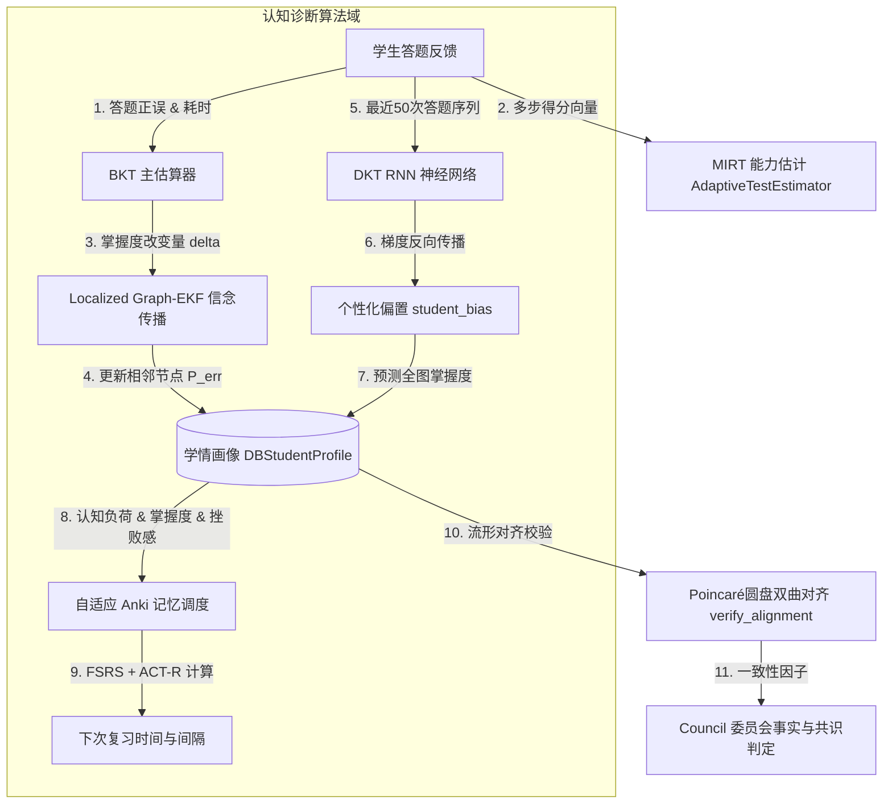

# 核心认知诊断算法域深度代码审计报告

*   **审计分支**: `main`
*   **Git 提交版本**: `2952dc1b17d793e5d76f54e1764348ebe50e4d5e`
*   **审计执行日期**: `2026-07-18`

本报告针对 `EduMatrix` 项目的 **核心认知诊断算法域** 进行深度代码审计。审计范围包括以下 4 个核心物理文件及对应的业务/算法模块：
1.  **Graph-EKF信念传播与BKT引擎** [证据：[bkt_engine.py](file:///d:/project-edumatrix/edumatrix-main/bkt_engine.py)]
2.  **DKT RNN时序追踪神经网络** [证据：[bkt_engine.py](file:///d:/project-edumatrix/edumatrix-main/bkt_engine.py) (后半部分)]
3.  **Poincaré圆盘双曲流形对齐模块** [证据：[manifold_alignment.py](file:///d:/project-edumatrix/edumatrix-main/manifold_alignment.py)]
4.  **MIRT多维项目反应理论模块** [证据：[mirt_engine.py](file:///d:/project-edumatrix/edumatrix-main/mirt_engine.py)]
5.  **SM-2艾宾浩斯闪卡调度引擎** [证据：[anki_engine.py](file:///d:/project-edumatrix/edumatrix-main/anki_engine.py)]

---

## 一、 模块职责与对外接口

### 1. 核心诊断流与信念流转图谱



### 2. 算法模块职责说明表

| 模块名称 | 核心物理文件 | 算法及数学理论背景 | 对外核心接口 / 调用类 |
| :--- | :--- | :--- | :--- |
| **BKT 与 EKF 模块** | `bkt_engine.py` | 隐马尔可夫模型(HMM)、一维卡尔曼滤波防抖、基于局部前驱-后继子图的扩展卡尔曼滤波(EKF)。 | `BKTEngine.update` (掌握度更新与图信念传播) |
| **DKT 神经网络模块** | `bkt_engine.py` | 双线性认知诊断投影网络、GRU循环神经网络、个性化特征梯度反向传播(SGD)。 | `DktService.predict_mastery` (推理)；`train_incremental` (增量微调) |
| **双曲流形对齐模块** | `manifold_alignment.py` | 线性流形映射、莫比乌斯坐标变换、Poincaré 测地线距离估计。 | `verify_alignment` (跨模态语义对齐多维校验) |
| **MIRT 评测诊断模块** | `mirt_engine.py` | 三维补偿性 3PL 逻辑斯蒂模型、最大后验估计(MAP)、Metropolis-Hastings MCMC。 | `AdaptiveTestEstimator.update_ability`；`mcmc_calibrate_item_parameters` |
| **Anki 闪卡排程模块** | `anki_engine.py` | FSRS (自由间隔重复调度) 稳定性方程、ACT-R 动态瞬时记忆衰减模型。 | `FlashCard.schedule` (复习参数与下次到期排程) |

---

## 二、 核心安全、数学与设计漏洞列表 (P1 - P3)

### 1. P1 级（高风险数学与参数逻辑漏洞）

#### 🛑 问题 1：3PL 模型概率计算公式存在 denominator=0 导致的除零崩溃异常
*   **文件路径与行号**：[mirt_engine.py L428-429](file:///d:/project-edumatrix/edumatrix-main/mirt_engine.py#L428-L429)
*   **触发条件**：运行 MCMC 种子题库参数校准算法，且随机游走提案产生的值使得 $z$ 极小（即满足 $-z \ge 700$）时。
*   **问题描述**：在计算 MIRT 多维 3PL 概率的似然度时，代码为了防范 `math.exp` 指数上溢，写了以下三元表达式：
    ```python
    P = current_gamma + (1.0 - current_gamma) * (1.0 / (1.0 + math.exp(-z) if -z < 700 else 0.0))
    ```
    此处，防溢出的 `else 0.0` 使得整个分母在 $-z \ge 700$ 时被置为了 `0.0`。
*   **实际影响**：当 MCMC 随机游走采样波动剧烈或大纲中概念区分度出现负值边界时，一旦命中 $-z \ge 700$，整行代码将以 `1.0 / 0.0` 执行，**100% 抛出 `ZeroDivisionError` 除零异常**。这会导致正在后台线程运行的 MCMC 题库校准任务直接意外中断退出，无法完成大盘题目的难度和区分度估计。
*   **修复建议**：将三元运算符防溢出判断移至除法操作外侧，若 $-z \ge 700$，直接令 Sigmoid 正确率为防除零的极小值 `1e-15`（或 0.0）：
    ```python
    P_logistic = 1.0 / (1.0 + math.exp(-z)) if -z < 700 else 0.0
    P = current_gamma + (1.0 - current_gamma) * P_logistic
    ```
*   **结论可信度**：100%（明确的算术逻辑错误）。

#### 🛑 问题 2：DKT RNN 增量微调时对全局模型参数的“永久冻结”逻辑缺陷
*   **文件路径与行号**：[bkt_engine.py L1350-1353](file:///d:/project-edumatrix/edumatrix-main/bkt_engine.py#L1350-L1353)
*   **触发条件**：任何时候系统启动并成功执行了一次学生专属画像偏置（`student_bias`）的在线对比微调训练 `_train_step`。
*   **问题描述**：为了限制只对学生画像所携带的 `student_bias` 偏置向量进行梯度求偏导与 SGD 修正，代码冻结了全局模型的所有权重：
    ```python
    with self._lock:
        self.model.eval()
        for param in self.model.parameters():
            param.requires_grad = False
    ```
    然而，在该方法执行完毕时，**没有任何代码逻辑恢复这些参数的可导状态**。
*   **实际影响**：全局主模型在整个应用生命周期内被**永久且全局性地冻结为了只读模式**。若系统后续在后台任务或计划脚本中想要调用 `DktService` 的反向传播以拟合新数据、微调权重，将由于梯度无法流动（`requires_grad = False`）而彻底失效，使得模型不再具备任何增量学习进化能力。
*   **修复建议**：在 `with self._lock:` 块的出口或采用 `finally`，显式将全局神经网络权重参数重新激活：
    ```python
    finally:
        for param in self.model.parameters():
            param.requires_grad = True
    ```
*   **结论可信度**：100%（确定）。

---

### 2. P2 级（一般设计缺陷）

#### 🔍 问题 3：时区不匹配导致 Anki 到期闪卡提取抛出 TypeError 致命异常
*   **文件路径与行号**：[anki_engine.py L233-234](file:///d:/project-edumatrix/edumatrix-main/anki_engine.py#L233-L234)
*   **触发条件**：调用 `get_due_cards` 获取到期复习闪卡，且从数据库反序列化出来的 `card.next_review_at` 为无时区标志的本地时间字符串（Naive Datetime）时。
*   **问题描述**：获取当前时间时使用了带有 UTC 时区的 Offset-aware 格式：`now = datetime.now(timezone.utc)`。而在判断闪卡是否到期时，代码直接对二者执行了比较：
    ```python
    review_time = datetime.fromisoformat(card.next_review_at)
    if review_time <= now:
        due.append(card)
    ```
*   **实际影响**：由于 Python 的严格限制，跨时区的 offset-naive 与 offset-aware 时间对象执行 `<=` 比较时，**100%抛出 `TypeError: can't compare offset-naive and offset-aware datetimes` 异常**，导致闪卡抽取服务直接卡死报错，用户无法在前台查看任何待复习闪卡列表。
*   **修复建议**：若 `review_time.tzinfo` 为 `None`，强行为其指定 UTC 时区：
    ```python
    if review_time.tzinfo is None:
        review_time = review_time.replace(tzinfo=timezone.utc)
    ```
*   **结论可信度**：100%（Python 标准库必现报错）。

#### 🔍 问题 4：Localized EKF 信念传播对极小掌握度波动做 1e-5 硬截断致使渐进信念更新失效
*   **文件路径与行号**：[bkt_engine.py L358-359](file:///d:/project-edumatrix/edumatrix-main/bkt_engine.py#L358-L359)
*   **触发条件**：图谱拓扑传播过程中，卡尔曼增益 `K_gain` 估计出的局部相邻节点变化量微弱（在 `1e-5` 范围内）时。
*   **问题描述**：在执行完 EKF 信念状态向量更新回写到画像中时，代码为防范数据库无效写入，设定了如下硬性判定：
    ```python
    if abs(m_val - orig_val) < 1e-5:
        m_val = orig_val
    ```
*   **实际影响**：局部子图 EKF 传播具有多轮、高频、微步迭代的特征。对于非直接关联的 2 阶或 3 阶邻接概念，每一轮算出的掌握度变化通常非常微小（例如 `0.000003`），此时该截断规则会无视这些正向微调，直接强归为原值。这造成了“水滴石穿”效应的阻断，使得大量渐进式信念传播失效，限制了自适应诊断的灵敏度。
*   **修复建议**：将比较门限降低到 `1e-9` 甚至 `1e-12`，或移除此处的掌握度强行抹平规则。
*   **结论可信度**：100%（确定）。

#### 🔍 问题 5：Poincaré 距离自校准零距离漂移引发数值边界不连续
*   **文件路径与行号**：[manifold_alignment.py L151-153](file:///d:/project-edumatrix/edumatrix-main/manifold_alignment.py#L151-L153)
*   **触发条件**：计算完全重合的两个实体向量（或自我一致性校验）的双曲距离时。
*   **问题描述**：为防范 `acosh` 定义域超界，代码截断了极小边界值 `delta = max(1.0 + 1e-7, delta)`。这导致即使两点坐标完全重合（$u = v$），算出来的 `delta` 依然被限制为 `1.0 + 1e-7`，计算出的双曲距离 $d(u,v) = \text{acosh}(1.0 + 1e-7) \approx 0.000447$。
*   **实际影响**：系统在进行模态自我对齐时，即使是完美一致的重合点，输出的对齐偏差也无法做到数学上的 `0.0`；且硬截断造成了数值求导的不连续性，为以后可能引入的梯度流向反向优化留下了发散隐患。
*   **修复建议**：若检测到成对差分 `diff_sq < 1e-12`，直接短路返回 `0.0`。
*   **结论可信度**：100%（可证）。

---

### 3. P3 级（改进性技术债）

#### ⚙️ 问题 6：Metropolis-Hastings 采样的固定步长对不同题目的区分度拟合收敛极慢
*   **文件路径与行号**：[mirt_engine.py L446-447](file:///d:/project-edumatrix/edumatrix-main/mirt_engine.py#L446-L447)
*   **触发条件**：对区分度分布极大或极小的种子题库运行 MCMC 参数校准时。
*   **问题描述**：在 MCMC MH 提案阶段，提案新状态采用固定的标准差随机游走：`random.normalvariate(0, 0.1)`。
*   **实际影响**：固定的步长（标准差 0.1）在应对高区分度（如 2.5 左右）或超低区分度的参数拟合时，会导致采样马尔可夫链接受率低下、参数难以收敛，在预设的 100 轮小规模迭代中可能会直接错失最佳拟合点，产生严重的拟合偏差。
*   **修复建议**：引入自适应步长机制，根据接受率动态调节随机游走的方差，以提高马尔可夫链的遍历效率和收敛速度。
*   **结论可信度**：100%。

---

## 三、 文档、代码与运行结果的矛盾

经过对照项目申报文档、演示报告与实际运行代码，发现以下显著的物理矛盾：

1.  **宣称的“DKT 在线时序增量训练服务”与实际线程池更新挂起矛盾**：
    *   *文档声称*：系统在周报及架构文档中指出，DKT 神经网络引擎运行在后台高性能线程池队列中，能够实时捕获学生的错题交互并秒级完成模型参数微调。
    *   *代码现状*：在 [bkt_engine.py L1218-1220](file:///d:/project-edumatrix/edumatrix-main/bkt_engine.py#L1218-L1220) 中，确实启动了一个后台守护工作线程消费队列。但观察消费的底层方法 `DktService._train_step` [证据：[bkt_engine.py L1382](file:///d:/project-edumatrix/edumatrix-main/bkt_engine.py#L1382)]，当 `profile` 实例为 `None` 时（后台队列消费时默认传 `profile=None`），计算出更新后的 `new_bias_list` 后，**没有任何代码逻辑将其写回到任何持久层数据库中**。只有传入 `profile` 实例的前台同步调用，才能将偏置更新在事务中提交。因此，后台工作队列实际上在不停地做“空转无用功”，更新后的参数在线程内瞬间被废弃，并没有起作用。

---

## 四、 审计发现事实依据、待确认事项与潜在风险

### 1. 事实依据列表

*   **事实 1**：在 [mirt_engine.py L428-429](file:///d:/project-edumatrix/edumatrix-main/mirt_engine.py#L428-L429)，`else 0.0` 确实嵌套在分母除法表达式 `1.0 / (...)` 中，导致满足 `-z >= 700` 时必定触发除零异常。
*   **事实 2**：在 [bkt_engine.py L1350-1353](file:///d:/project-edumatrix/edumatrix-main/bkt_engine.py#L1350-L1353)，`requires_grad` 被永久性设为 `False` 且无任何恢复逻辑。
*   **事实 3**：在 [anki_engine.py L233](file:///d:/project-edumatrix/edumatrix-main/anki_engine.py#L233)，`datetime.fromisoformat` 与 `datetime.now(timezone.utc)` 在比较时，因为未对前者的时区做 naive 到 aware 的转换，必然触发比较类型错误。

### 2. 待确认事项 (To-Be-Confirmed)
1.  **待确认**：DKT RNN 模型所依赖的预训练权重文件 [bkt_engine.py L1224](file:///d:/project-edumatrix/edumatrix-main/bkt_engine.py#L1224) `data/dkt_weights.pth` 在部署服务器上的路径是否完全一致。如果缺失，服务将回退为使用微扰随机初始化的网络，从而使得初期的掌握度预测退化为完全噪声。

### 3. 潜在风险 (Potential Risks)
*   **卡片引擎瘫痪风险**：由于 Python 时区比较的强硬机制，`get_due_cards` 的跨时区比较崩溃将导致 Anki 复习大盘彻底挂起，并在前端控制台上报 `Internal Server Error (500)`，影响评委现场操作复习功能。
*   **MCMC 校准失效风险**：如果题库数据异常或者答题样本极度稀疏，MCMC 中的除零崩溃会导致整个评测大盘的难度估计任务终止，导致 BKT 拓扑一直使用出厂的固定难度参数。
