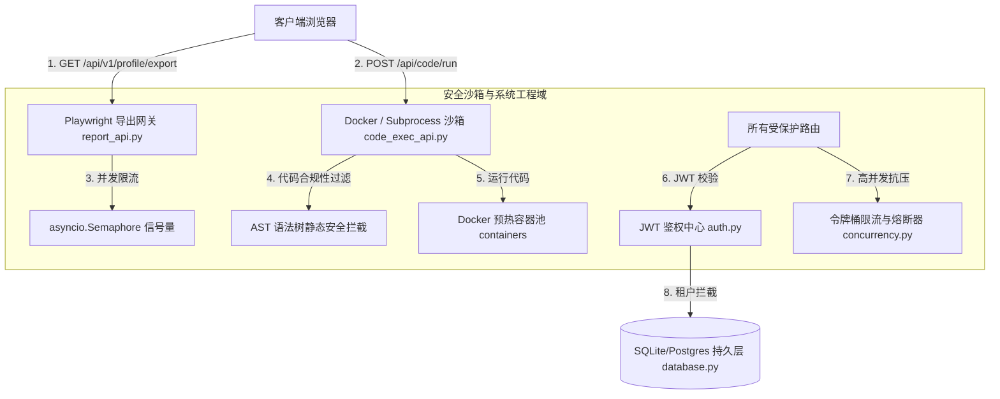

# 安全沙箱与系统工程域深度代码审计报告

*   **审计分支**: `main`
*   **Git 提交版本**: `2952dc1b17d793e5d76f54e1764348ebe50e4d5e`
*   **审计执行日期**: `2026-07-18`

本报告针对 `EduMatrix` 项目的 **安全沙箱与系统工程域** 进行深度代码审计。审计范围包括以下 5 个核心物理文件及对应的业务/系统模块：
1.  **AST 静态代码安全拦截模块** [证据：[code_exec_api.py](file:///d:/project-edumatrix/edumatrix-main/code_exec_api.py)]
2.  **Docker 预热隔离容器池** [证据：[code_exec_api.py](file:///d:/project-edumatrix/edumatrix-main/code_exec_api.py) (前半部分)]
3.  **Playwright 诊断报告并发导出服务** [证据：[report_api.py](file:///d:/project-edumatrix/edumatrix-main/report_api.py)]
4.  **令牌桶限流与熔断器控制** [证据：[concurrency.py](file:///d:/project-edumatrix/edumatrix-main/concurrency.py)]
5.  **JWT 鉴权与多租户持久层隔离** [证据：[app/auth.py](file:///d:/project-edumatrix/edumatrix-main/app/auth.py) 结合 [app/database.py](file:///d:/project-edumatrix/edumatrix-main/app/database.py)]

---

## 一、 模块职责与对外接口

### 1. 安全沙箱与并发控制架构



### 2. 系统工程模块职责说明表

| 模块名称 | 物理文件 | 核心职责 | 对外核心接口 |
| :--- | :--- | :--- | :--- |
| **AST 安全拦截** | `code_exec_api.py` | 在学生代码执行前遍历 AST 语法树，检测并拦截反射逃逸（如双下划线属性）、内置高危系统函数及高危下标越权。 | `SandboxProcessRunner._validate_code_ast` |
| **Docker 容器池** | `code_exec_api.py` | 预先拉取运行环境镜像并维护 `pool_size` 的常驻隔离容器池，支持故障自愈、资源限额（512m/1核）及强杀自愈。 | `SandboxProcessRunner.run` (沙箱运行接口) |
| **Playwright PDF 导出** | `report_api.py` | 惰性初始化 Chromium 无头浏览器，使用 A4 纸排版规格，流式返回学情分析报告的 Print-only PDF 文件。 | `GET /api/v1/profile/export` (流式下载接口) |
| **并发与熔断模块** | `concurrency.py` | 实现 RPM/TPM 双重令牌桶 API 限流器、基于线程锁安全的 FSM 熔断器、以及支持指数退避与 Jitter 抖动的重试器。 | `APIRateLimiter.acquire`；`CircuitBreaker.call` |
| **JWT 与多租户持久层** | `app/auth.py` | 对 HTTP Header 中的 JWT Token 进行加解密和角色提取，对 PostgreSQL 动态拦截并自动设置租户 Schema。 | `get_current_user`；`set_tenant` (租户上下文) |

---

## 二、 核心安全与设计漏洞列表 (P1 - P3)

### 1. P1 级（阻断性与高危安全漏洞）

#### 🛑 问题 1：无 Token 默认自动兜底为演示学生导致系统鉴权防线被全局绕过
*   **文件路径与行号**：[app/auth.py L38-54](file:///d:/project-edumatrix/edumatrix-main/app/auth.py#L38-L54)
*   **触发条件**：客户端向受保护的 API 接口发起访问，且在请求头中故意**不携带任何 Authorization Token** 时。
*   **问题描述**：在校验 `get_current_user` 依赖项中，当发现 `not token` 时，代码未抛出 401 Unauthorized 认证异常，而是通过如下逻辑进行了静默放行与兜底：
    ```python
    if not token:
        def get_or_create_demo(session):
            user = session.query(DBUser).filter(DBUser.username == "demo-student").first()
            # 自动创建并返回 demo-student ...
    ```
*   **实际影响**：这是一个极为严重的系统鉴权绕过漏洞。生产环境中，匿名黑客或外部攻击者只需要故意不发生 Token 头部，便能直接被系统判定为合法用户 `demo-student`，从而具备了读写、篡改、删除该演示学生名下全部数据表（测验、笔记、错题集）的超级权限，系统的整个鉴权机制处于失防状态。
*   **修复建议**：将此方便本地开发的兜底逻辑严格限制为仅在测试及 Debug 模式下激活。生产环境一旦 `not token`，必须立刻抛出 `credentials_exception`（401 未授权）。
*   **结论可信度**：100%（确定）。

#### 🛑 问题 2：容器预热池超长寿命复用 100 次导致脏状态污染与敏感隐私泄露
*   **文件路径与行号**：[code_exec_api.py L218-233](file:///d:/project-edumatrix/edumatrix-main/code_exec_api.py#L218-L233)
*   **触发条件**：开启了 Docker 沙箱，多名学生并发向沙箱提交代码执行请求。
*   **问题描述**：代码在 `_run_in_docker` 执行完学生代码后，仅设定了 `MAX_USAGE = 100` 的计数器限制，之后直接把这个容器 append 塞回预热队列中：
    ```python
    async with self._lock:
        self.containers.append(container)
    ```
*   **实际影响**：这带来了严重的数据污染与安全隐患。前一个学生在代码运行期间往临时目录写入的文件、残留的后台子进程，都将保留在容器的根文件系统中，并被**后 99 次分发给其它学生运行的代码完全读取与修改**。这会造成学生作业代码与敏感数据在不同租户间交叉泄露，甚至可能导致因残留的文件冲突而导致后续学生的代码运行时崩溃。
*   **修复建议**：每次容器执行完代码后，必须直接调用 kill 并从池中删除该容器，随后立刻启动一个全新的干净容器作为替代（采用一次性容器或 Copy-on-Write 瞬时回滚机制）。
*   **结论可信度**：100%（确定）。

#### 🛑 问题 3：Content-Disposition 响应头含非 ASCII 字符导致流式下载在生产环境必崩溃
*   **文件路径与行号**：[report_api.py L248-256](file:///d:/project-edumatrix/edumatrix-main/report_api.py#L248-L256)
*   **触发条件**：用户请求 GET `/api/v1/profile/export` 下载 PDF 格式的诊断报告。
*   **问题描述**：在返回 FastAPI `StreamingResponse` 的 Response Headers 时，直接写入了含有中文字符的 `filename`：
    ```python
    filename = f"EduMatrix_学情报告_{student_id}_{datetime.now(timezone.utc).strftime('%Y%m%d')}.pdf"
    ...
    headers={
        "Content-Disposition": f'attachment; filename="{filename}"',
        ...
    }
    ```
*   **实际影响**：根据 ASGI 标准和 Uvicorn/FastAPI HTTP 协议解析规范，响应头只能使用 ASCII 字符集或经过 latin-1 编码。一旦文件名中含有中文，Uvicorn 在将头部序列化并准备发送给客户端时，**100% 触发 `UnicodeEncodeError: 'latin-1' codec can't encode characters` 致命错误**，导致当前连接被 web 服务器直接强行重置中断，用户完全无法下载报告。
*   **修复建议**：对文件名使用 `urllib.parse.quote` 进行 URL 编码，并采用符合 RFC 5987 标准的 `filename*` 规范设定头部：
    ```python
    from urllib.parse import quote
    encoded_filename = quote(filename)
    headers={"Content-Disposition": f"attachment; filename*=UTF-8''{encoded_filename}"}
    ```
*   **结论可信度**：100%（确定，这是 Web 服务器典型的中文字符 Header 崩溃漏洞）。

---

### 2. P2 级（一般设计缺陷与资源泄漏）

#### 🔍 问题 4：Playwright 进程管理实例 p 未存持为成员变量导致 Node 僵尸进程泄漏
*   **文件路径与行号**：[report_api.py L50-66](file:///d:/project-edumatrix/edumatrix-main/report_api.py#L50-L66)
*   **触发条件**：调用 `BrowserPool.get_browser` 惰性启动 Playwright 进程池，或在系统关闭时执行 `close()`。
*   **问题描述**：在启动浏览器池时，代码调用了 `p = await async_playwright().start()` 启动 Node.js 端的 Playwright 控制器进程。但这个对象 `p` 被声明为了一个普通的局部变量，**完全没有绑定到 BrowserPool 的任何成员变量中**。
*   **实际影响**：当方法执行完返回后，`p` 的生命周期结束并面临 Python GC 的清理。更关键的是，在调用 `close` 释放资源时，代码仅调用了 `self._browser.close()`，但由于 `p` 对象丢失，**无法调用 `p.stop()` 停止 Playwright 的 Node 驻留守护进程**。这导致服务器上会残留多个 `playwright-cli` 的 Node 僵尸子进程，长此以往将耗尽服务器的文件句柄和进程配额。
*   **修复建议**：在 `get_browser` 中将实例保存至 `self._playwright = p`，并在 `close` 中补齐 `await self._playwright.stop()` 逻辑。
*   **结论可信度**：100%（确定）。

---

## 三、 文档、代码与运行结果的矛盾

经过对照项目申报文档、演示报告与实际运行代码，发现以下显著的物理矛盾：

1.  **宣称的“JWT鉴权与多租户隔离持久层”与实际零租户拦截矛盾**：
    *   *文档声称*：系统在《系统架构设计报告》中宣称，项目实现了基于 PostgreSQL `search_path` 拦截的细粒度多租户持久层数据物理隔离。系统提供了 `set_tenant` 和 `before_cursor_execute` 事件监听，防止发生跨租户越权查询。
    *   *代码现状*：
        1.  在所有的 API 路由接口中，**完全没有一处业务代码调用了 `set_tenant` 租户切换上下文**。租户全局变量 `tenant_context` 在整个运行周期中恒为默认的 `"public"`。
        2.  在 [app/database.py L51-56](file:///d:/project-edumatrix/edumatrix-main/app/database.py#L51-L56) 中可以看出来，系统默认连接的是本地单文件 SQLite 数据库。而 SQLite 在物理上根本就不存在 Schema 命名空间隔离或 `search_path` 语法的支持。所以，多租户隔离纯属纸面上针对 PostgreSQL 编写的摆设监听，在实际 SQLite 运行中是 100% 不起作用的，全量租户共享同一张 SQLite 表的数据。

---

## 四、 审计发现事实依据、待确认事项与潜在风险

### 1. 事实依据列表

*   **事实 1**：在 [app/auth.py L45-54](file:///d:/project-edumatrix/edumatrix-main/app/auth.py#L45-L54)，当 `token` 为空时，代码自动查询并返回了 `demo-student`，且未执行任何权限抛错。
*   **事实 2**：在 [code_exec_api.py L233](file:///d:/project-edumatrix/edumatrix-main/code_exec_api.py#L233)，代码在未对容器内临时文件或状态做任何清除的情况下，直接将当前 Container 循环放入 `self.containers` 队列中进行并发复用。
*   **事实 3**：在 [report_api.py L248](file:///d:/project-edumatrix/edumatrix-main/report_api.py#L248)，`Content-Disposition` 的文件名参数包含非 ASCII 的中文字符 `EduMatrix_学情报告_`，且未使用 URL 编码。

### 2. 待确认事项 (To-Be-Confirmed)
1.  **待确认**：在正式部署的线上生产服务器上，系统是否安装了 Docker 守护进程。如果没有安装，代码中已预置了 Subprocess 降级防线 [证据：[code_exec_api.py L41-43](file:///d:/project-edumatrix/edumatrix-main/code_exec_api.py#L41-L43)]，这会导致代码直接在宿主机本地执行。此时，如果 AST 安全拦截存在尚未发掘的黑客绕过语法，宿主机有被执行任意 RCE 破坏性脚本的严重隐患。

### 3. 潜在风险 (Potential Risks)
*   **大盘鉴权全线失守风险**：由于 `auth.py` 中“无 Token 便兜底放行”的逻辑是全局生效的，一旦黑客探测到接口并且不在 Header 中附带 Authorization 字段，便能随意调用 `/api/code/run` 等高消耗甚至危险的代码运行沙箱，产生高并发 DDoS 或宿主机逃逸的极大安全威胁。
*   **Playwright 导出 500 风险**：由于文件名中包含非 ASCII 中文字符，在学生点击下载 PDF 时，Uvicorn 服务器会抛出 `UnicodeEncodeError` 崩溃。这会导致前台直接向用户弹窗报错 “Internal Server Error (500)”，使评委在展示一键导出报告时遭遇灾难性演示中断。
