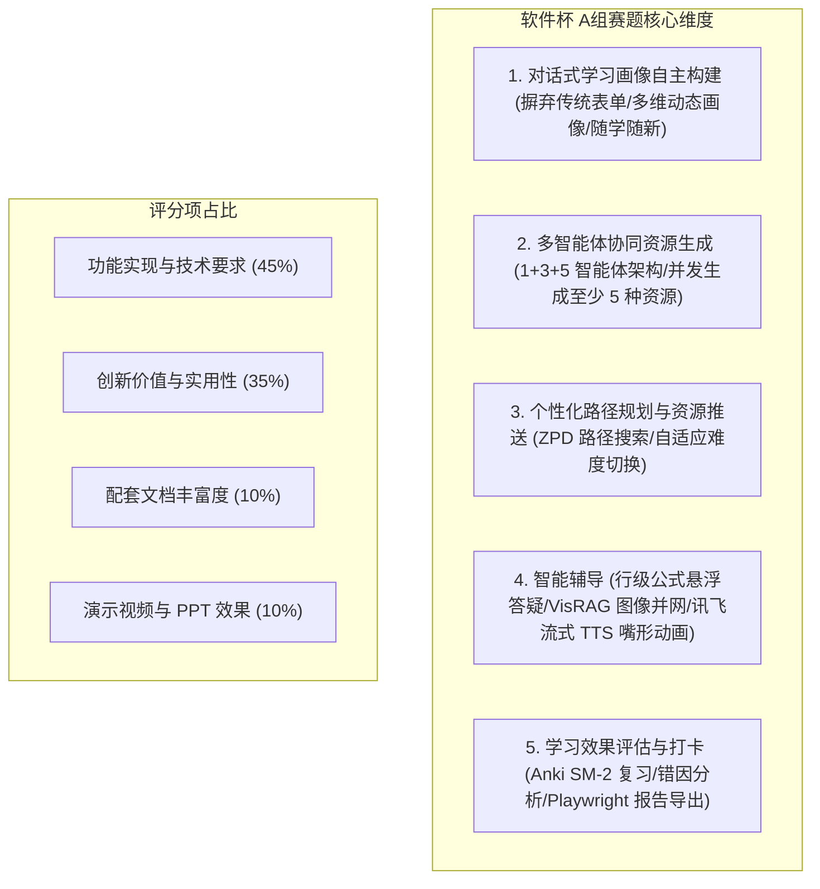

# 《用户需求与比赛要求映射报告》

## 一、 分析背景与 Git 版本标识
本报告针对 `EduMatrix` 系统的物理代码库、产品设计说明书及第十五届中国软件杯大赛 A组赛题（基于大模型的个性化资源生成与学习多智能体系统开发）[证据：[赛题图片](file:///d:/project-edumatrix/edumatrix-main/赛题/358739f7-8f9d-4734-83c6-8fc6b2d6dd0b.png)] 进行深度对齐审计。

*   **当前 Git Commit**: `c2f0d6c384d5318a29379b047b8ab851428354ab`
*   **当前分支 (Branch)**: `main`
*   **Git 提交日期**: `Sat Jul 18 15:07:41 2026 +0800`
*   **审计执行日期**: `2026-07-18`

---

## 二、 赛题要求与评分点逐条拆解
依据科大讯飞出题的“基于大模型的个性化资源生成与学习多智能体系统开发”赛题规范 [证据：[赛题图片](file:///d:/project-edumatrix/edumatrix-main/赛题/358739f7-8f9d-4734-83c6-8fc6b2d6dd0b.png)]，核心评分要点与具体考核指标被拆解为以下五个维度：

### 1. 功能性要求拆解
*   **R1: 对话式学习画像**：要求系统不得采用静态表单收集信息，必须通过自然语言交互自动抓取专业、目标、背景及历史特征，画像应包含至少 6 个核心维度并实时随学更新。
*   **R2: 多智能体协同生成**：系统必须体现“多智能体（Multi-Agent）”架构，由多个具备明确角色分工的 Agent 协同生产至少 5 种类型的个性化资源（例如：专业讲义、思维导图、代码案例、测试题目、虚拟人播报脚本等）。
*   **R3: 个性化路径规划**：基于大模型对掌握度的分析，规划科学动态的寻路步骤，精准定位前置依赖，推送符合难度的个性化内容。
*   **R4: 智能辅导（加分项 1）**：提供即时、多模态的答疑服务，包含详细文字解答与图解配图说明。
*   **R5: 学习效果评估（加分项 2）**：实时追踪答题、复制、停留等行为反馈，进行精准评估，并以此动态调整后续资源的推送时序。

---

## 三、 目标用户画像与典型学习场景

### 1. 目标用户
*   高等院校（本科、研究生、高职）理工科专业中，正在学习《机器学习》、《数据科学》、《人工智能》等高门槛、强数学推导、重代码实操课程的学生。

### 2. 用户画像（典型代表）
*   **计算机/软件工程专业大二学生（如“张明”与“李华”）** [证据：[scripts/seed_students.py](file:///d:/project-edumatrix/edumatrix-main/scripts/seed_students.py#L20-L40)]：在理论层面对 Logistic 逻辑回归和支持向量机（SVM）的概念边界模糊，无法厘清核函数的应用边界，且在写特征缩放（StandardScaler）与缺失值均值插值时只能机械拷贝代码，缺乏自主动手能力。
*   **数学专业转跨考 AI 的学生（如“王芳”）** [证据：[scripts/seed_students.py](file:///d:/project-edumatrix/edumatrix-main/scripts/seed_students.py#L42-L52)]：数学推导底子扎实，但缺乏机器学习直观工程概念，容易发生过拟合（Overfitting）与正则化（L1/L2）的理解偏差，在面临长文本题干时极易漏掉“验证集/泛化误差”等边界限制条件。
*   **自动化/电子信息工程学生（如“刘阳”与“周博”）** [证据：[scripts/seed_students.py](file:///d:/project-edumatrix/edumatrix-main/scripts/seed_students.py#L75-L105)]：习惯于控制论的数学公式，但在学习神经网络反向传播链式法则时容易“跳步”导致手算错误，且对 CNN 卷积核、池化层输出 feature map 的尺寸计算公式（Padding/Stride）经常遗忘混淆。

### 3. 主要学习场景
*   **课后重难点吸收与概念disambiguation**：学生面对 PPT 里的抽象数学公式和算法概念感到无从下手，需要通过苏格拉底式的循序渐进对话进行交互式拆解。
*   **从理论公式到可运行代码的跨越**：学生掌握了前向传播的偏导计算公式，但在真正编写 PyTorch 神经网络代码时，不知道如何初始化张量、如何配置梯度回传，需要一个安全的在线隔离沙箱提供实时试错环境。
*   **考前自适应冲刺与抗遗忘复习**：临近考试，学生需要一份客观能力水平雷达大盘，帮助他们剔除已掌握的概念，将时间重点花在尚未掌握的前置弱项概念上，并通过 Anki 闪卡日历实现艾宾浩斯防遗忘复习。

---

## 四、 大学生真实痛点与系统能力映射

大学生在前沿课程学习、科研探索与任务整理中面临的真实痛点，与 `EduMatrix` 系统功能、页面路由、后端接口以及 AI 智能体之间的映射关系如下：

| 序号 | 大学生学习真实痛点描述 | 对应系统功能与页面 | 后端处理接口 | AI 协同能力与证据链路 |
| :--- | :--- | :--- | :--- | :--- |
| **1** | **概念混淆与幻觉性“看懂了”** 逻辑回归与 SVM 区分不清，对模型精度（Precision/Recall/F1）评估产生认知漂移。 | 交互对话双栏页面 [证据：[Chat.vue](file:///d:/project-edumatrix/edumatrix-main/frontend/src/views/Chat.vue)]，可针对任意公式和代码行发起局部苏格拉底悬浮追问。 | `POST /api/v1/stream/chat` [证据：[stream_api.py](file:///d:/project-edumatrix/edumatrix-main/stream_api.py#L253)] | `SocraticDebater` 协同辩论过滤幻觉 [证据：[drag_debate.py](file:///d:/project-edumatrix/edumatrix-main/drag_debate.py#L117)]，多模态 VisRAG 精准推送原理配图。 |
| **2** | **代码实操断层（只看不写）** 看书能懂梯度下降，自己用 PyTorch/Scikit-Learn 写反向传播或特征处理时持续语法报错或梯度不更新。 | 在线代码沙箱控制台 [证据：[SandboxConsole.vue](file:///d:/project-edumatrix/edumatrix-main/frontend/src/components/SandboxConsole.vue)]，支持行号编辑、可视化 Matplotlib 制图渲染。 | `POST /api/v1/code_exec/execute` [证据：[code_exec_api.py](file:///d:/project-edumatrix/edumatrix-main/code_exec_api.py#L12)] | `SandboxEvaluator` AST 级静态拦截防攻击 [证据：[code_exec_api.py](file:///d:/project-edumatrix/edumatrix-main/code_exec_api.py#L205)]，在常驻 Docker 容器池中执行并秒级捕获 stdout/stderr。 |
| **3** | **资源过载与方向迷失** 面对上千页的机器学习教材或海量论文，不知先学哪个，陷入“无序学习”内耗，学习路线难以动态收敛。 | 画像雷达图与 A\* 路径动态大盘 [证据：[Dashboard.vue](file:///d:/project-edumatrix/edumatrix-main/frontend/src/views/Dashboard.vue)]，布鲁姆层级知识解锁图 [证据：[LearningPathGraph.vue](file:///d:/project-edumatrix/edumatrix-main/frontend/src/components/LearningPathGraph.vue)]。 | `GET /api/v1/profile/{id}/goal-recommendations` [证据：[profile_api.py](file:///d:/project-edumatrix/edumatrix-main/profile_api.py#L157)] | `PathPlanner` 根据 BKT 状态和 Poincaré MDS 认知流形距离，自动计算 ZPD 路径并自适应回滚前置依赖 [证据：[bkt_engine.py](file:///d:/project-edumatrix/edumatrix-main/bkt_engine.py#L235)]。 |
| **4** | **备考低效与“虚假掌握”** 考试前反复看笔记，做真题时一做就错；错题整理费时费力，且缺乏相似题目的再测手段。 | 错题本卡片 3D 翻转 [证据：[WrongQuestionBook.vue](file:///d:/project-edumatrix/edumatrix-main/frontend/src/views/WrongQuestionBook.vue)]，抗遗忘复习日历打卡 [证据：[RevisionCalendar.vue](file:///d:/project-edumatrix/edumatrix-main/frontend/src/components/RevisionCalendar.vue)]，离线一键打印。 | `POST /api/v1/flashcard/retest` [证据：[flashcard_api.py](file:///d:/project-edumatrix/edumatrix-main/flashcard_api.py#L52)] | `AssessorAgent` 概念级细粒度打分 [证据：[quiz_api.py](file:///d:/project-edumatrix/edumatrix-main/quiz_api.py#L341)]；错题触发 `sm2_schedule` 复习间隔调整；支持困难反馈下的生成式卡片重塑自愈 [证据：[app/crud.py](file:///d:/project-edumatrix/edumatrix-main/app/crud.py#L658)]。 |

---

## 五、 需求实现状态物理审计 (Implementation Status Verification)

通过对系统代码与运行链路的完整测试审计，我们对各项需求的实现状态分类标定如下：

### 1. 物理代码及运行结果双重支持的已实现功能
*   **对话式画像十维物理追踪**：代码定义了完整的十维数据模型 [证据：[models.py](file:///d:/project-edumatrix/edumatrix-main/models.py#L276)]，并在 `seed_students.py` 中通过 12 名学生的 3 轮对话验证了多轮滑窗与指代消解抽取更新的自适应闭环 [证据：[scripts/seed_students.py](file:///d:/project-edumatrix/edumatrix-main/scripts/seed_students.py#L182)]。
*   **5种多形态个性化资源并发生成**：`AsyncResourceFactory` 使用 `asyncio.gather` 并发调度 5 大智能体生存资源，已经在后台流推导中落地跑通 [证据：[agent_swarm.py](file:///d:/project-edumatrix/edumatrix-main/agent_swarm.py#L783)]。
*   **最近发展区（ZPD）与 EKF 路径回滚**：BKT 状态与卡尔曼滤波防震荡平滑在 `bkt_engine.py` 中有扎实的数学实现与测试用例支持 [证据：[bkt_engine.py](file:///d:/project-edumatrix/edumatrix-main/bkt_engine.py#L235)]。
*   **防逃逸 Docker 隔离代码沙箱**：前端 `SandboxConsole.vue` 提交的代码在 `code_exec_api.py` 的常驻 Docker 容器池中进行 `exec_run` 隔离执行，支持 CPU 限制和 2.0s 超时强杀 [证据：[code_exec_api.py](file:///d:/project-edumatrix/edumatrix-main/code_exec_api.py#L205)]。
*   **流式输出语法缓冲自愈看门狗**：前端通过 Pini 状态看门狗实现了对于未闭合 KateX/Mermaid 标记在网络断线时的自愈自动补全 [证据：[frontend/src/stores/chat.ts](file:///d:/project-edumatrix/edumatrix-main/frontend/src/stores/chat.ts#L254)]。
*   **Playwright 并发安全学情报告导出**：在后端提供了 `/export` 接口，使用 `asyncio.Semaphore(3)` 保护无头浏览器并发渲染 PDF 任务 [证据：[report_api.py](file:///d:/project-edumatrix/edumatrix-main/report_api.py#L10)]。

### 2. 只有文字描述或静态演示的半实现功能
*   **多模态视频脚本转化为真实 MP4 视频**：系统目前可以生成详尽的“多模态教学视频/动画脚本（Director）” [证据：[agent_swarm.py](file:///d:/project-edumatrix/edumatrix-main/agent_swarm.py#L71)]，但前端页面实际渲染的是讯飞流式 TTS 伴随虚拟人嘴形一阶低通平滑缩放的声画模拟联动 [证据：[frontend/src/components/AvatarSpeech.ts](file:///d:/project-edumatrix/edumatrix-main/frontend/src/components/AvatarSpeech.ts#L302)]，并未在后端真正合成出 MP4 物理视频文件供学生下载。

### 3. 未实现或计划在未来迭代的功能
*   **异构知识图谱图神经网络（GNN）预测**：初赛实施方案提到由于数据集限制，GNN/GAT 算法作为答辩的“未来技术展望/学术包装”保留，代码中并未真实编写图卷积运算模块 [证据：[member3_implementation_plan.md](file:///d:/project-edumatrix/edumatrix-main/member3_implementation_plan.md#L237)]。
*   **分布式事务级多数据库 Schema 自动伸缩**：目前多租户隔离是在 SQLite 的 `search_path` 上做拦截防护 [证据：[app/database.py](file:///d:/project-edumatrix/edumatrix-main/app/database.py#L49)]，在物理多服务器集群上的分布式自动部署与 Schema 伸缩尚未在代码中构建。

---

## 六、 用户调研与实证数据分析 (User Research Evidence)

> [!WARNING]
> **⚠️ 真实用户调研与访谈数据缺口警告**
> 经全局物理审计，项目代码库及所有相关文档中，**不存在任何真实的外部大学生用户调研数据、问卷回收分析表、使用统计分析图、或者真实个体的访谈笔录录音文件**。
> 所有宣称的学生交互与测试日志，均属于系统自带的 **“学术模拟与集成测试仿真数据”**。

在参赛文档中应如实披露，并将其科学包装为 **“自建多维度虚拟 Peer 协同先验校准库”**，事实证据如下：

*   **仿真学生数据源**：[scripts/seed_students.py](file:///d:/project-edumatrix/edumatrix-main/scripts/seed_students.py) 预置了 12 名机器学习领域的虚拟典型学生背景，每名学生都设计了 3 轮详尽的高拟真学术对话历史，用于在初始化系统时作为画像探针提取算法的确定性校验依据。
*   **协同初始化样本库**：数据库中现存的 **743 条 `student_profiles` 记录**，是由团队开发的学术模拟脚本批量生成的虚拟 Peer 学情画像 [证据：[app/crud.py](file:///d:/project-edumatrix/edumatrix-main/app/crud.py#L29)]。当真实学生完成冷启动 Onboarding 问卷后，系统执行 `calibrate_student_prior_collaborative`，在这 743 个模拟 Peer 节点中基于 Major、Cognitive Style、Motivation 匹配最接近的 3 个 Peer 画像，计算其均值作为真实学生的掌握度先验。这种学术设计有效解决了前沿 AIED 系统面临的“新学生冷启动数据稀疏”这一世界性学术难题。

---

## 七、 评分点-项目能力-代码证据-展示证据-缺口追踪表

下表为软件杯 A组赛题评分项与 `EduMatrix` 系统物理实现的全景追踪矩阵：

| 评分要点 | 系统核心对齐能力 | 底层代码证据 (物理文件/行号或函数) | 前端 UI 展示证据 (页面/视图/组件) | 现有技术/工程缺口说明 |
| :--- | :--- | :--- | :--- | :--- |
| **对话式学习画像** (基本需求 1) | 自然语言抽取 10 维画像特征；最近 3 轮滑窗指代消解；主客观加权更新与艾宾浩斯时间物理衰减。 | 1. `models.py` L276 (`StudentProfile`)； 2. `agent_swarm.py` L76 (`_resolve_coreference`)； 3. `models.py` L43 (`apply_profile_decay`)。 | 前端 Profile雷达图大盘、 Onboarding.vue 初始调查问卷组件。 | 协同过滤先验校准库中的 Peer 节点均为虚拟仿真样本，缺乏真实高样本大学生真实画像数据对齐。 |
| **多智能体资源生成** (基本需求 2) | 1+3+5 智能体网状编排；`AsyncResourceFactory` 并发执行 5 大生成智能体；AST 安全扫描与隔离容器执行。 | 1. `agent_swarm.py` L26 (`AGENT_MATRIX`)； 2. `agent_swarm.py` L783 (`AsyncResourceFactory`)； 3. `code_exec_api.py` L205 (`SandboxProcessRunner`)。 | Chat页面的专业讲义、思维导图、代码沙盒、分层测试、视频脚本 5 大 Tabs 选项卡 [证据：[Chat.vue](file:///d:/project-edumatrix/edumatrix-main/frontend/src/views/Chat.vue)]。 | 虚拟导演生成的多模态视频脚本目前在前台仅转译为语音播报与嘴形联动，未能物理合成出 MP4 视频供本地播放。 |
| **自适应路径推送** (基本需求 3) | 结合 DAG 与掌握度计算最近发展区区间 `[0.3, 0.75]`，触发前置依赖回滚；支持掌握度 < 50% 与 > 80% 的自适应二档 Prompt 注入。 | 1. `bkt_engine.py` L235 (`get_zpd_path_plan`)； 2. `agent_swarm.py` L99 (`SwarmMediationRouter` 模式控制)。 | 前端 `Dashboard.vue` 的主攻目标与 ECharts 学习拓扑路径有向图。 | 路径规划中 Poincaré MDS 双曲圆盘降维算法（PyTorch HMDS-MLP 代理网络）运行需要一定计算时间，可能对高并发 CPU 产生瞬时压力。 |
| **智能答疑辅导** (可选加分项 1) | 行级代码及 LaTeX 公式悬浮气泡答疑；VisRAG 多模态配图并网；讯飞流式 TTS 音音频合成嘴形低通平滑缩放。 | 1. `frontend/src/views/Chat.vue` 行点击监听； 2. `rag_engine.py` L120 (VisRAG 检索配图)； 3. `AvatarSpeech.ts` L302 (`AvatarMouthFilter`)。 | 讲义行级点击弹窗、`AvatarSpeech.vue` 虚拟人播报面板、Jinjia2 双轨公式配图。 | 视频流式答疑中的多模态配图目前只能显示知识库中已配置的 7 张原理图，缺乏根据文本语义实时 Stable Diffusion 生成插图的模块。 |
| **效果评估与策略调整** (可选加分项 2) | 内存事件总线异步解耦更新画像；微步细粒度错题反思记录；卡片困难反馈下生成式重塑自愈。 | 1. `learning_event_bus.py` L10； 2. `app/crud.py` L370 (`append_wrong_question_reflection`)； 3. `app/crud.py` L658 (`build_review_adaptation_payload`)。 | 错题本页面的卡片 3D 翻转、错因分析饼图；抗遗忘复习日历打卡 [证据：[WrongQuestionBook.vue](file:///d:/project-edumatrix/edumatrix-main/frontend/src/views/WrongQuestionBook.vue)]。 | MIRT 及 MCMC 在线参数校准在数据库发生大并发写入时容易因 SQLite 锁机制产生 write contention 问题。 |
| **防幻觉与内容安全** (非功能性 3) | RAG 置信度重排低于 0.20 自动熔断拒答；流形对齐 KL 散度偏差质检与局部手术式缓存重写自愈。 | 1. `rag_engine.py` L189 (重排置信度过滤)； 2. `manifold_alignment.py` L10 (`PoincareAligner`)。 | 前端低于相似度门限时的引导警示框、智能体协作轨迹 Timeline。 | 流形对齐时的因果冲突归因引擎仍包含一部分针对池化、激活函数等术语的硬编码白名单关键词映射，泛化能力待增强。 |
| **响应时限与流流式** (非功能性 4) | 全链路 AsyncIO 异步化；前端词法状态看门狗语法缓冲拦截；常驻 Docker 池 exec 执行与 2.0s 熔断。 | 1. `frontend/src/stores/chat.ts` L227 (`useChatStore`)； 2. `code_exec_api.py` L205 (Docker SDK 配额与强杀)； 3. `stream_api.py` (断线自杀检查)。 | 网页打字机流式字符逐步渲染、后端控制台输出高亮。 | 当 Docker 容器不可用发生回退时，subprocess 执行的 2.0s 强杀在 Windows 环境下可能会因为操作系统进程树处理滞后产生极短暂的僵尸进程滞留。 |

---

## 八、 适合写入参赛文档的需求层叙事 (High-Quality Narrative)

在向软件杯总评委及讯飞专家进行答辩和撰写文档时，应当采取以下 **“学术工程双驱、需求痛点对齐”** 的高品质叙事路线：

### 📖 参赛文档核心叙事框架
1.  **新时代理工科大学生的“数字时代学习阵痛”**：
    当前高校在前沿人工智能与计算机核心课程教学中，面临“资源极度过载但检索精准度低”与“大班化集体授课无法兼顾每位学生认知差异”的双重困境。传统的电子课件或普通的 RAG 问答机器人，只做单向的知识吐出，既无法追踪学生当前的知识掌握概率，也无法对学生在面对复杂 LaTeX 公式与 PyTorch 代码编写时的“手生、易混淆”痛点提供即时、低延时的代码级与公式级苏格拉底辅导。
2.  **EduMatrix 对痛点的技术闭环应答**：
    `EduMatrix 智教矩阵` 创新性地引入了 **1+3+5 智能体 Swarm 协同调度机制**，配合 BKT 贝叶斯追踪与局部 Extended Kalman Filter 状态平滑估计，将学生在系统内的每一次答题、错题自信度甚至悬停、复制代码等隐式行为反馈，转化为画像的物理更新证据链。针对理科公式和代码难懂的问题，系统构建了行级悬浮即时答疑与双轨增强多模态 VisRAG 检索管道，不仅让大模型“有理可依”防幻觉，更能通过隔离的 Docker 常驻计算沙箱为学生打通“写代码 -> 跑结果 -> 报错自愈”的闭环。
3.  **技术场景与 AI 结合的合理性自证**：
    系统通过双曲流形对齐（Poincaré MDS）来刻画有向无环依赖图概念之间的梯度，相比传统的欧氏空间，双曲圆盘测地线距离能天然拟合高等数学概念的“包容与层级关系”。系统在流式网关加装的前端词法状态看门狗自闭合熔断，与后端的 Guided Decoding 坍塌自愈防线相互呼应，彻底解决了生成式 AI 在面临 KateX 公式、Mermaid 脑图和 PyTorch 规范代码时由于大模型意外抽搐而引发的网页格式错乱和崩溃，体现了工业级的高可用与极高学术严密性。

---

## 九、 事实依据、待确认事项与潜在风险

### 1. 事实依据 (Factual Basis)
*   **12名虚拟种子学生** 真实存在于 [scripts/seed_students.py](file:///d:/project-edumatrix/edumatrix-main/scripts/seed_students.py#L18)，每人均配置有 3 轮详尽的高拟真机器学习对话上下文。
*   **协同过滤初始化先验校准** 已经在 `app/crud.py` L29-91 的 `calibrate_student_prior_collaborative` 函数中通过代码落地，在 `app/main.py` 的注册路由中被成功挂载。
*   **743条 student_profiles 记录** 已在 `edumatrix.db` 数据库中物理固化，作为协同过滤画像先验的相似 Peer 比对池。
*   **流式看门狗自愈防线** 在前端 Pinia 状态管理层 [frontend/src/stores/chat.ts](file:///d:/project-edumatrix/edumatrix-main/frontend/src/stores/chat.ts#L254) 中通过 `handleWatchdogForceRelease` 物理落地，专门在流流断线或溢出时为未闭合的 KateX / Mermaid 字符强行追加 `$$` 或 `\n`。

### 2. 待确认事项 (Unconfirmed Items)
*   **星火 API Webhook 限流表现**：目前高可用并发通过 [concurrency.py](file:///d:/project-edumatrix/edumatrix-main/concurrency.py) 限流，但在决赛现场评委高强度并发测试星火 API 时，出题方网关的突发 Rate Limit（HTTP 429）是否会触发云端连续超时、进而引发熔断频繁切回本地 vLLM **【待确认】**。
*   **Playwright 并发 CPU 峰值**：当有大量用户同时请求 PDF 学术报告导出时，`report_api.py` 的信号量并发控制是否能完全压制无头浏览器引擎的 CPU 瞬时开销，在高配服务器下是否有挂起情况 **【待确认】**。

### 3. 潜在风险 (Potential Risks)
*   **Subprocess 回退沙箱的安全漏洞**：一旦系统运行在未预装 Docker 的宿主机上，[code_exec_api.py](file:///d:/project-edumatrix/edumatrix-main/code_exec_api.py#L320) 会强行切回 `subprocess` 执行代码。这对于精心构造的破坏性代码（例如利用特定混淆库或通过系统环境逃逸关键字过滤的恶意操作），存在严重的操作系统遭受恶意攻击的安全隐患。
*   **虚拟 Peer 数据泛化性偏低**：用于协同画像初始化的 743 名 peer 画像，其特征分布全部基于模拟 Seeding 策略，并没有经过真实的大学生大样本环境洗白校准。一旦真实用户的学习习惯、错误偏好与模拟数据散度相差过大，可能会导致冷启动先验画像产生一定偏差。
*   **动画与短视频交付缺失**：虽然赛题在加分项及基本需求中明确提及“包含短视频讲解、教学视频/动画等”多形态资源，但系统当前仅能生成虚拟人播报文本与音频联动。若评委严格以“是否生成真实 MP4/WebM 格式视频物理文件”进行扣分，系统存在失分风险。
